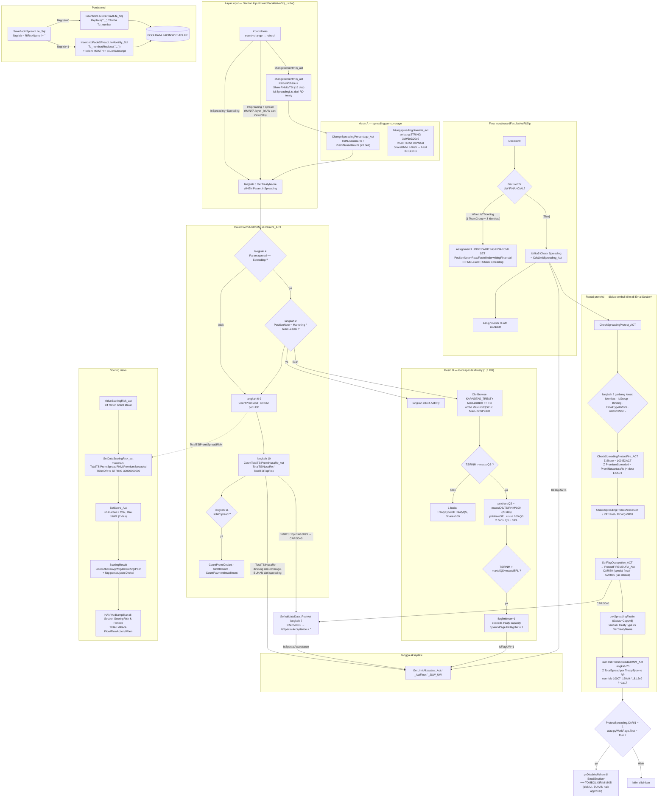

# 03-celah / 01 — Spreading, Capacity, dan Scoring Risiko — siklus New Business (NB)

**Ruang lingkup:** hanya `D:\migrasi\RNM\NB FacIn\`. Berkas `RNW Fac In\` dan `Endorsment Fac In\`
**tidak dibaca** pada pass ini. Setiap pernyataan di bawah berlaku untuk korpus NB saja.

**Hubungan dengan arsip.** `_ARSIP-lintas-siklus\04-aturan\02-formula-dan-status.md` §2.4 sudah
merekam rumus `SetTSIPremiSpreaded_FacIn` dan lima langkah awal `hitungspreadingotomatis_act`; §7
sudah merekam bukti representasi uang (B1–B8). Dokumen ini **tidak mengulang** rumus tersebut
kecuali untuk menyambungkannya; yang baru di sini adalah **alurnya**: siapa memicu, urutan
eksekusi, mesin kapasitas yang sebenarnya, jalur pemblokiran, dan hubungannya dengan tangga
akseptasi.

**Label:** `[terverifikasi]` = isi tag/ekspresi dikutip langsung dari berkas yang disebut ·
`[dugaan]` = disimpulkan dari pola, belum dikonfirmasi · `[pertanyaan terbuka]` = tidak terjawab
dari korpus.

---

## 0. Cara membaca ekspor Pega ini (prasyarat semua klaim di bawah)

Langkah Activity berada di `<pySteps REPEATINGTYPE="PageList">`, bersarang rekursif. Per langkah:

| Isi | Tag |
| --- | --- |
| Metode | `pyStepsActivityName` |
| Halaman langkah | `pyStepsObjectName` |
| Komentar pengembang | `pyStepsDescription` |
| Prakondisi | `pyStepsPreCondParams/rowdata/pyStepsPreCondParamsWhen` + `…WhenTrue` / `…WhenFalse` |
| Pasangan Property-Set | `pyParamArray/rowdata/PropertiesName` + `PropertiesValue` |
| Parameter metode | `pyStepsCallParams/<nama>` |

`[terverifikasi]` **Arti kode aksi prakondisi.** Dari korelasi `…WhenTrue` dengan
`…WhenTruePrms` (yang berisi label lompatan) di seluruh `NB FacIn\Activity`:

```powershell
# hanya kode 1 yang pernah membawa label lompatan
$b="D:\migrasi\RNM\NB FacIn\Activity"; $pair=@{}
Get-ChildItem $b -File -Filter *.xml | ForEach-Object {
  $c=[IO.File]::ReadAllText($_.FullName)
  foreach($m in [regex]::Matches($c,'(?s)<rowdata REPEATINGINDEX="\d+">\s*<pxObjClass>Embed-ActivityPreConditions</pxObjClass>(.{0,900}?)</rowdata>')){
    $blk=$m.Groups[1].Value
    $tv=[regex]::Match($blk,'<pyStepsPreCondParamsWhenTrue>([^<]*)</pyStepsPreCondParamsWhenTrue>').Groups[1].Value
    $tp=[regex]::Match($blk,'<pyStepsPreCondParamsWhenTruePrms>([^<]*)</pyStepsPreCondParamsWhenTruePrms>').Groups[1].Value
    if($tp -ne ''){ $k="kode=$tv"; if($pair.ContainsKey($k)){$pair[$k]++}else{$pair[$k]=1} } } }
$pair   # -> hanya "kode=1", 16 kemunculan
```

Sebaran kode di `NB FacIn\Activity`:

```powershell
$t=@{}; Get-ChildItem "D:\migrasi\RNM\NB FacIn\Activity" -File -Filter *.xml | ForEach-Object {
  foreach($m in [regex]::Matches([IO.File]::ReadAllText($_.FullName),'<pyStepsPreCondParamsWhenTrue>([^<]*)</pyStepsPreCondParamsWhenTrue>')){
    $k=$m.Groups[1].Value; if($t.ContainsKey($k)){$t[$k]++}else{$t[$k]=1} } }
$t.GetEnumerator()|Sort-Object Name
# -> 1=80x  2=9266x  3=705x  4=7x  5=270x  6=63x
```

| Kode | Arti | Dasar |
| --- | --- | --- |
| `1` | lompat ke langkah berlabel | `[terverifikasi]` — satu-satunya kode yang membawa `…Prms` (label `END`, `ANEKA`, `MBU`, `COPY`, `REM`, …) |
| `2` | lanjut ke langkah berikutnya | `[terverifikasi]` — 9.266× dari 10.391; pasangan `(true→2 false→3)` adalah bentuk "jalankan langkah ini bila kondisi benar" |
| `3` | lewati langkah ini | `[terverifikasi]` — contoh tegas: `CheckSpreadingProtect_ACT` langkah 5 `[Call CheckSpreadingProtectFire_ACT]` dengan `WHEN pyWorkPage.pyID=="NB-83801" (true→3)` — satu work-ID dikecualikan dari pemeriksaan Fire |
| `4`, `5`, `6` | **belum terverifikasi** | Tidak ada bukti di korpus. Kode `5` muncul **270×**, termasuk pada gerbang lewat-spreading `CheckSpreadingProtect_ACT` langkah 2. |

> **Ini MEMBLOKIR.** Tanpa arti `4/5/6`, 340 prakondisi di NB tidak dapat diport dengan benar.
> Lihat §11-Q1.

`[terverifikasi]` **Label bentuk (`pyMOName`) bukan bukti.** Di `NB FacIn\Flow\InputInwardFacultativeRISlip.xml`,
konektor `Decision27 → Assignment1` berlabel tiga nama orang, tetapi kondisinya adalah
`<pyConditionType>When</pyConditionType>` + `<pyExpression>IsTBonding</pyExpression>`. Label dan
kondisi adalah hal berbeda; lihat §4.1.

**Berkas yang dibaca penuh (bukan grep bertarget):**
`hitungspreadingotomatis_act.xml`, `CekLimitSpreading_Act.xml`, `changepercentrnm_act.xml`,
`ChangeSpreadingPercentage_Act.xml`, `CheckSpreadingProtect_ACT.xml`, `CheckSpreadingProtectFire_ACT.xml`,
`cekSpreadingFactIn.xml`, `CountSpreading_Act.xml`, `BreakDownSpreading_Act.xml`,
`SetLayerSpreading_act.xml`, `GenerateLayerList_ACT.xml`, `SumTreatyCapacity_Act.xml`,
`SumTSIPremiSpreadedRNM_Act.xml`, `SaveFacinSpreadLife_Sql.xml`, `CountTotalTSIPremiNusaRe_Act.xml`,
`ScoringResult.xml`, `SetDataScoringRisk_act.xml`, `ValueScoringRisk_act.xml`,
`InsertIntoFacinSPreadLife_Sql.xml`, dan seluruh RDBList yang dikutip di §8.
Berkas > 250 KB (`ProtectFIREMBUPA_Act`, `GetKapasitasTreaty`, `SetScore_Act`, `CopyToAllSpreading_ACT`,
`GenerateSpreadingLife_act`) dibaca lewat ekstraksi langkah + grep bertarget, bukan utuh.
Section > 1 MB (`ScoringRisk.xml` 8 MB dan turunannya) **tidak dibaca** — hanya diukur.

---

## 1. Inventaris

### 1.1 Ukuran korpus NB

```powershell
$base="D:\migrasi\RNM\NB FacIn"
(Get-ChildItem $base -Recurse -File -Filter *.xml).Count          # -> 2083
Get-ChildItem $base -Recurse -File -Filter *.xml |
  Group-Object { $_.Directory.Name } | Sort-Object Count -Descending |
  Format-Table Count,Name -AutoSize
```

`[terverifikasi]` **2.083 berkas `.xml`** di NB: Activity 609 · Section 432 · FlowAction 250 ·
RDBList 217 · When 210 · DataTransform 148 · ReportDefinition 123 · Harness 41 · DataPage 30 ·
DecisionTable 12 · Flow 6 · ConnectREST 3 · DecisionTree 1 · SystemSettings 1.

### 1.2 Irisan spreading / capacity / scoring — berdasarkan NAMA berkas

```powershell
$base="D:\migrasi\RNM\NB FacIn"
$pat='(?i)spread|capacit|kapasit|scoring|score|protect|layer'
Get-ChildItem $base -Recurse -File -Filter *.xml | Where-Object { $_.Name -match $pat } |
  Group-Object { $_.Directory.Name } | Sort-Object Count -Descending |
  ForEach-Object { "{0,-16} {1}" -f $_.Name,$_.Count }
(Get-ChildItem $base -Recurse -File -Filter *.xml | Where-Object { $_.Name -match $pat }).Count
```

`[terverifikasi]` **184 berkas**:

| Tipe rule | Jumlah |
| --- | --- |
| Activity | 74 |
| Section | 52 |
| FlowAction | 39 |
| When | 7 |
| RDBList | 6 |
| DataTransform | 6 |
| **Total** | **184** |

### 1.3 Irisan berdasarkan ISI — properti `SpreadingList`

Pencarian nama saja melewatkan rule yang memanipulasi `SpreadingList` tanpa menyebut kata
"spreading" di namanya (mis. `AddCurencyList_ACT`, `FillPremiMBU_FacIn`, `GetData_ACT`).

```powershell
$base="D:\migrasi\RNM\NB FacIn"
$h=Select-String -Path "$base\*\*.xml" -Pattern 'SpreadingList' -List | ForEach-Object { $_.Path }
$h.Count                                                            # -> 114
$h | Group-Object { Split-Path (Split-Path $_ -Parent) -Leaf } | Sort-Object Count -Descending |
  ForEach-Object { "{0,-16} {1}" -f $_.Name,$_.Count }
```

`[terverifikasi]` **114 berkas** menyentuh `SpreadingList`: Activity 78 · Section 28 ·
DataTransform 4 · Harness 3 · RDBList 1.

Pencarian yang lebih luas (`Spreading|TreatyCapacity|ScoringRisk|Kapasitas` sebagai isi) menghasilkan
**381 berkas** — artinya **237 berkas** menyentuh area ini tanpa petunjuk apa pun di namanya.

```powershell
(Select-String -Path "D:\migrasi\RNM\NB FacIn\*\*.xml" `
  -Pattern '(?i)Spreading|TreatyCapacity|ScoringRisk|Kapasitas' -List).Count   # -> 381
```

### 1.4 Berkas terbesar di irisan

```powershell
Get-ChildItem "D:\migrasi\RNM\NB FacIn" -Recurse -File -Filter *.xml |
  Where-Object { $_.Name -match '(?i)spread|capacit|kapasit|scoring|score|protect|layer' } |
  Sort-Object Length -Descending | Select-Object -First 5 |
  ForEach-Object { "{0,-12} {1,-42} {2:N0}" -f $_.Directory.Name,$_.Name,$_.Length }
```

`[terverifikasi]`

| Berkas | Byte |
| --- | --- |
| `Section\ScoringRisk.xml` | **8.048.648** |
| `Section\ScoringRiskForm2.xml` | 2.505.945 |
| `Section\ScoringRiskForm1.xml` | 1.645.808 |
| `Section\ScoringRiskForm4.xml` | 1.438.983 |
| `Activity\GetKapasitasTreaty.xml` | **1.323.132** |

`ScoringRisk.xml` (8 MB) adalah **berkas tunggal terbesar di seluruh korpus NB** — formulir scoring
24 faktor. `GetKapasitasTreaty.xml` (1,3 MB) adalah **Activity terbesar** di NB; §5 menunjukkan
inilah mesin spreading otomatis berbasis kapasitas yang sesungguhnya.

---

## 2. Anatomi: ada TIGA mesin spreading berbeda di NB

`[terverifikasi]` Nama-nama yang mirip menyembunyikan tiga agregat yang tidak berhubungan.

| # | Mesin | Agregat sasaran | Rule inti | Presisi |
| --- | --- | --- | --- | --- |
| **A** | Spreading Fac-In per-coverage | `OfferFacIn.…CoverageList(n).SpreadingList` | `cekSpreadingFactIn`, `SetTSIPremiSpreaded_FacIn`, `SumTSIPremiSpreadedRNM_*_Act` | 20 desimal (sebagian dibulatkan ulang ke 4) |
| **B** | Spreading otomatis berbasis kapasitas treaty | menulis `…CoverageList(n).SpreadingList` | `GetKapasitasTreaty` (1,3 MB) | 20 desimal |
| **C** | Spreading **Treaty In** (realisasi treaty) | `pyWorkPage.PolicyTreatyIn.SpreadingRiskList` | `CountSpreading_Act`, `BreakDownSpreading_Act` | 10 dan 8 desimal |

`[terverifikasi]` Mesin **C** sama sekali tidak menyentuh `OfferFacIn`:
`NB FacIn\Activity\CountSpreading_Act.xml` langkah 3 —

```
.SpreadingRiskList(Param.Index).PremiumSpreaded = .NetPremium * @divide(.SpreadingRiskList(Param.Index).SharePercentage,100,10)
.SpreadingRiskList(Param.Index).ClaimSpreaded   = (.ExcessLoss + .Claim - .SalvageValue)* @divide(.SpreadingRiskList(Param.Index).ClaimPercentage ,100,10)
```

dan `NB FacIn\Activity\BreakDownSpreading_Act.xml` langkah 2.1 —

```
.PremiumSpreaded = pyWorkPage.PolicyTreatyIn.TotalPremium * @divide(.SharePercentage,100,8)
.ClaimSpreaded   = @toDecimal(pyWorkPage.PolicyTreatyIn.TotalClaim) * @divide(.SharePercentage,100,8)
```

Mesin C dipicu dari flow `NB FacIn\Flow\InputRealizationTreatyIn.xml` dan Section
`DetailPolicyTreatyIn` / `GeneralPolicyTreatyIn` / `SpreadingRiskList`.
**Jangan menyatukan C dengan A/B saat porting.** Presisi 10/8 vs 20 bukan kebetulan yang boleh
diseragamkan (aturan CLAUDE.md §4.1).

Ada juga **default pembagian rata** yang hanya ada di mesin C `[terverifikasi]`
(`CountSpreading_Act` langkah 1 dan 4.1):

```
.SharePercentage = 100/@toDecimal(@LengthOfPageList(Primary.SpreadingRiskList))
.ClaimPercentage = @if(.ClaimPercentage == "",.SharePercentage,.ClaimPercentage)
```

Pembagian rata `100/n` **tidak ada** di mesin A maupun B.

---

## 3. Kapan spreading dipicu dalam alur NB

### 3.1 Titik pemicu — bukti per titik

| # | Pemicu | Jenis | Bukti |
| --- | --- | --- | --- |
| **T1** | Bentuk Utility `Utility5` "Check Spreading" pada flow RI Slip | **Flow utility shape** | `NB FacIn\Flow\InputInwardFacultativeRISlip.xml`, `rowdata REPEATINGINDEX="Utility5"`: `<pyShapeType>Data-MO-Activity-Utility</pyShapeType>` · `<pyMOName>Check Spreading</pyMOName>` · `<pyImplementation>CekLimitSpreading_Act</pyImplementation>` |
| **T2** | Aksi `refresh` on-`change` kontrol teks pada layar input | **UI post-activity** | `NB FacIn\Section\InputInwardFacultativeDtl.xml`: `<pyEvent>change</pyEvent>` · `<pyAction>refresh</pyAction>` · `<pyActivity>changepercentrnm_act</pyActivity>` (dan `changepercentrnmLife_act`) |
| **T3** | Aksi `refresh` memanggil `CountPremiAndTSINusantaraRe_ACT` dgn `InSpreading=Spreading` | **UI post-activity** | `NB FacIn\Section\InputInwardFacultativeDtl.xml`: `<pyActivityParams>…<pyValue>Spreading</pyValue><pyName>InSpreading</pyName>` |
| **T4** | Aksi tombol kirim memanggil `CheckSpreadingProtect_ACT` | **UI action** | `NB FacIn\Section\EmailSection_IsUW.xml` dan `Section\EmailSectionCeding.xml`: `<pyActivity>CheckSpreadingProtect_ACT</pyActivity>` |
| **T5** | `GetKapasitasTreaty` (mesin B) | **UI post-activity, hanya 2 layar** | lihat §3.3 |

`[terverifikasi]` **Tidak ada satu pun FlowAction NB** yang memanggil rule spreading sebagai
post-activity; seluruh pemicu adalah utility-shape flow (T1) atau aksi kontrol Section (T2–T5).

```powershell
# audit: CekLimitSpreading_Act hanya dirujuk oleh satu Flow
$b="D:\migrasi\RNM\NB FacIn"
Select-String -Path "$b\*\*.xml" -Pattern 'CekLimitSpreading_Act' -List |
  ForEach-Object { $_.Path.Replace("$b\","") }
# -> Activity\CekLimitSpreading_Act.xml
#    Flow\InputInwardFacultativeRISlip.xml
```

### 3.2 Posisi T1 dalam flow RI Slip

`[terverifikasi]` `NB FacIn\Flow\InputInwardFacultativeRISlip.xml`, konektor:

```
Decision9   --[Else]--> Decision27
Decision27  --[Else]--> Utility5 ("Check Spreading" = CekLimitSpreading_Act)
Decision27  --[When IsTBonding]--> Assignment1 ("UNDERWRITING FINANCIAL")
Utility5    --[Always]--> Assignment6 ("TEAM LEADER")
Assignment6 --[InwardFacultative]--> Decision24
```

`Decision27` bernama `UW FINANCIAL?` (`<pyMOName>UW FINANCIAL?</pyMOName>`,
`<pyShapeType>Data-MO-Gateway-Decision</pyShapeType>`).

### 3.3 Mesin B dipicu HANYA dari dua layar — dan tidak pernah dari Activity mana pun

`[terverifikasi]` `NB FacIn\Activity\CountPremiAndTSINusantaraRe_ACT.xml` mendeklarasikan **dua**
parameter yang ejaannya berbeda untuk maksud yang sama, `InSpreading` dan `spread`:

```
Langkah 3  [Call GetTreatyName]        WHEN Param.InSpreading=="Spreading"
Langkah 4  [Call GetKapasitasTreaty]   WHEN Param.spread=="Spreading"
           CALLPARAM spreading=Param.spread
```

Audit siapa mengirim yang mana:

```powershell
$base="D:\migrasi\RNM\NB FacIn"
foreach($p in @('spread','InSpreading')){
  $n=0
  Get-ChildItem $base -Recurse -File -Filter *.xml | ForEach-Object {
    if($_.Name -eq 'CountPremiAndTSINusantaraRe_ACT.xml'){return}
    $t=[IO.File]::ReadAllText($_.FullName)
    if($t -match "<pyName>$p</pyName>" -or $t -match "<$p>[^<]*</$p>"){ $n++; "$p <- $($_.Name)" } }
  "  total $p = $n" }
# -> spread      = 2   (Harness\ViewPolis.xml, Section\InputInwardFacultativeDtl_IsUW.xml)
# -> InSpreading = 12
```

`[terverifikasi]` Nilai yang dikirim keduanya `Spreading`
(`<pyValue>Spreading</pyValue><pyName>spread</pyName>` di kedua berkas).

**Konsekuensi `[terverifikasi]`:** mesin spreading otomatis berbasis kapasitas treaty
(`GetKapasitasTreaty`, 1,3 MB, Activity terbesar di NB) **hanya berjalan pada layar underwriter
(`InputInwardFacultativeDtl_IsUW`) dan layar lihat-polis (`ViewPolis`)**. Dari layar input
non-UW (`InputInwardFacultativeDtl.xml`) dan dari seluruh 6 Activity pemanggil
(`changepercentrnm_act`, `changepercentrnmLife_act`, `GenerateSpreadingLife_act`,
`GenerateSpreadingLifeOR_act`, `InputOfferFacInEngineer_preACT`, `IsThereAnyObjectLocation_Act`)
hanya `InSpreading` yang dikirim, sehingga langkah 4 tidak pernah dieksekusi.

Ini diperkuat oleh gerbang di dalam `GetKapasitasTreaty` sendiri `[terverifikasi]`
(`NB FacIn\Activity\GetKapasitasTreaty.xml`):

```
Langkah 1  WHEN Param.spreading=="Spreading"                                     (true→2 false→6)
Langkah 2  WHEN pyWorkPage.PositionNote=="ReasFacInMarketing"
                ||pyWorkPage.PositionNote=="ReasFacInTeamLeader"                 (true→6 false→2)
Langkah 3  [Exit-Activity]
```

Marketing dan Team Leader dikeluarkan secara eksplisit dari perhitungan kapasitas.

### 3.4 Urutan eksekusi lengkap `CountPremiAndTSINusantaraRe_ACT`

`[terverifikasi]` (`NB FacIn\Activity\CountPremiAndTSINusantaraRe_ACT.xml`):

```
1  Property-Set
2  Property-Set
3  Call GetTreatyName                        WHEN Param.InSpreading=="Spreading"
4  Call GetKapasitasTreaty                   WHEN Param.spread=="Spreading"   <- lihat §3.3
5  RDB-List GetDataSyariah_SQL               WHEN StatusSyariah==1   (Tabaru + Ujroh)
6  Call CountPremiAndTSIRNMFireMBU_ACT       WHEN !IsMultiCOB
7  Call CountPremiAndTSIRNMFireAnekaGolf_ACT
8  Call CountPremiAndTSIRNMPALifeCargo_ACT
9  Call CountPremiAndTSIRNMCargo_ACT
10 Call CountTotalTSIPremiNusaRe_Act          <- menghasilkan basis tangga akseptasi (§9)
11 WHEN IsUWSpread:
   11.1 Call CountPremiCedant_Act
   11.2 Call SetRIComm_Act
   11.3 Call CountPaymentInstallment_Act
```

`[terverifikasi]` `IsUWSpread` (`NB FacIn\When\IsUWSpread.xml`) adalah OR atas **enam** nilai
`pyWorkPage.PositionNote`: `ReasFacInUnderwriting`, `ReasFacInSeniorUnderwriting`,
`ReasFacInUnderwritingFinancial`, `ReasFacInJuniorUnderwriting`, `ReasFacInDepHeadUnderwriting`,
`ReasFacInJuniorUnderwritingA`. Jadi komisi cedant, RI-comm, dan cicilan pembayaran **hanya
dihitung ulang saat pengguna berada di salah satu dari enam posisi underwriting**.

### 3.5 Urutan di dalam `changepercentrnm_act` (T2)

`[terverifikasi]` (`NB FacIn\Activity\changepercentrnm_act.xml`):

```
2   pyWorkPage.OfferFacIn.PercentShare    = @divide(.ShareRNML,.PersonList(1).CoverageList(1).TSI,16)*100
    pyWorkPage.OfferFacIn.CedingRetention = @divide(.CedingRetentionNominal,.PersonList(1).CoverageList(1).TSI,16)*100
3-8 ReportDefinition BrowseTreatyYear_Life_RD (param.UPTO = .ShareRNML) -> TempSpreading
    ReportDefinition BrowseRetrocessionLife_RD                          -> TempRetro
9   loop PersonList/CoverageList: Page-Remove .SpreadingList ; APPEND baris pertama dari TempSpreading
10  loop TempSpreading.pxResults: APPEND sisanya ke .SpreadingList
11  loop TempRetro.pxResults: APPEND ke .SpreadingList(n).LayerList
       .LayerList(<LAST>).PctAdjustment = TempRetro.pxResults(i).PERCENTSHARE
12  call ChangeSpreadingPercentage_Act  (EditedText="NusaReShare")
13  call CountPremiAndTSINusantaraRe_ACT (InSpreading=Spreading)
14  call hitungspreadingotomatis_act
```

**Presisi 16 desimal di langkah 2** — nilai ke-empat dalam korpus untuk operasi `x/y*100` yang sama
(bandingkan 20 di `ChangeSpreadingPercentage_Act`, 4 di `SetPercentPremiSpreaded`, 8 di
`BreakDownSpreading_Act`). Ini menambah dua entri pada tabel §1.7 arsip.

---

## 4. Gerbang yang melewati proses spreading

### 4.1 `IsTBonding` — melewati bentuk "Check Spreading" di flow

`[terverifikasi]` `NB FacIn\When\IsTBonding.xml`, isi `pyConditionValue1String` (OR, 4 baris):

- 1 baris atas `.OfferFacIn.QuotationData.TeamGroup` (perbandingan terhadap satu kode numerik)
- 3 baris atas `.OfferFacIn.QuotationData.MarketingName` (tiga identitas orang)

**Nilai tidak disalin** (CLAUDE.md §3.5). Mekanisme: gerbang identitas 4-cabang.

`[terverifikasi]` Bila benar, konektor `Decision27 → Assignment1` diambil, yang berarti
`Utility5` ("Check Spreading" = `CekLimitSpreading_Act`) **dilewati seluruhnya**, dan
`pyPropertyAssigns` konektor menetapkan:

```
pyWorkPage.PositionNote = "ReasFacInUnderwritingFinancial"
pyWorkPage.NBStatus     = <ditetapkan>
```

Jadi gerbang identitas ini **mengubah PositionNote** — lihat §9.

### 4.2 `IsGroup` — melewati seluruh DataTransform spreading

`[terverifikasi]` `NB FacIn\When\IsGroup.xml`, `pyConditionValue1String` (OR, 5 baris):

- 1 baris atas `.OfferFacIn.QuotationData.IsGroup`
- **3 baris atas `OperatorID.pyUserIdentifier`** (tiga identitas operator)
- **1 baris atas `pyWorkPage.OfferFacIn.QuotationData.MarketingCode`** (satu kode kontak marketing,
  berbentuk kunci instance Pega `ASM-SFAGIS-WORK-CONTACT …`)

Mekanisme: 1 flag bisnis + 3 identitas operator + 1 kode kontak marketing = 5 cabang OR.
Nilai tidak disalin.

`[terverifikasi]` `SetTSIPremiSpreaded_FacIn` langkah 1 melakukan `EXIT_MODEL` bila `IsGroup`
benar (arsip §2.4) — seluruh perhitungan `TSISpreaded` / `PremiumSpreaded` / `SharePercentage`
dilewati.

### 4.3 Gerbang berulang di dalam rule proteksi

`[terverifikasi]` Pola `OperatorID.pyUserIdentifier=="<satu identitas>"||pyWorkPage.OfferFacIn.QuotationData.IsGroup=="Group"`
muncul **inline** (bukan lewat rule `When`) di `CheckSpreadingProtect_ACT` (langkah 2 dan 27) dan
`CheckSpreadingProtectFire_ACT` (langkah 2.2.2.3.5, 2.2.2.3.8, 2.2.2.3.10, 2.2.2.3.12,
2.2.2.4.1.4, 2.2.2.4.1.6, 2.2.2.4.1.7). Satu identitas operator yang sama diulang **9×** sebagai
literal; ia menekan pesan galat spreading dan sekaligus **mengaktifkan jalur pemeriksaan
alternatif** (langkah `…3.12` / `…4.1.7`) yang membandingkan total premi & TSI spreaded.

`[terverifikasi]` Gerbang lewat tambahan di `CheckSpreadingProtect_ACT` langkah 2:

```
WHEN OperatorID.pyUserIdentifier=="<identitas>" || IsGroup=="Group"   (true→5)
WHEN pyWorkPage.IsCedingConfirm=="Binding"                            (true→5)
WHEN .EmailTypeUW=="9"                                                (true→6)
WHEN PositionNote=="ReasFacInAdmin"||"ReasFacInMarketing"||"ReasFacInTeamLeader"  (true→6)
```

Komentar langkahnya: `kalau admin/mkt g perlu cek spreding soalnya yang isi spreading sekarang UW`.
Karena langkah 2 tidak punya metode, kode 5 dan 6 **tidak mungkin** berarti "lewati langkah"
(itu tak berefek); keduanya pasti bersifat keluar/lompat `[dugaan]`. Arti pastinya
`belum terverifikasi` — lihat §11-Q1.

### 4.4 Gerbang nomor polis literal

`[terverifikasi]` `NB FacIn\When\IsErrorSpreading.xml` adalah OR atas **2 nomor polis literal**
pada `pyWorkPage.Quotation.OldPolicyNo`. Nilai tidak disalin (data pelanggan).

`[terverifikasi]` Pola serupa di dalam Activity, sebagai daftar pengecualian inline:

| Rule | Langkah | Isi daftar |
| --- | --- | --- |
| `SumTSIPremiSpreadedRNM_Act` | 18.1.3 | 25 `pyWorkPage.pyID` literal |
| `SumTSIPremiSpreadedRNM_Act` | 20.6 dan 20.7 | 10 `pyID` + 14 `OldPolicyNo` literal |
| `SumTSIPremiSpreadedRNM_Act` | 20.4 dan 24.4 | 3 `pyID` literal |
| `ProtectFIREMBUPA_Act` | 9.2.27.2, 9.2.28.2 | 4 + 2 `OldPolicyNo` literal |
| `CheckSpreadingProtect_ACT` | 5 | 1 `pyID` literal (melewati pemeriksaan Fire) |
| `CheckSpreadingProtectFire_ACT` (via `ProtectFIREMBUPA_Act` 9.2.7) | — | 1 `pyID` literal |

**Total ≥ 60 kunci kasus produksi tertanam sebagai literal di jalur spreading NB.** Nilai tidak
disalin. Mekanisme: daftar pengecualian per-kasus yang dipelihara dengan menyunting rule.

---

## 5. Algoritma spreading, langkah demi langkah

### 5.1 Mesin A — validasi & derivasi per-coverage (`cekSpreadingFactIn`)

`[terverifikasi]` `NB FacIn\Activity\cekSpreadingFactIn.xml`
(kelas `ASM-FW-GISFW-Data-Coverage`, 216.262 byte):

```
Langkah 3  Local.LTotal        = 0
           Local.PercentShare  = pyWorkPage.OfferFacIn.PercentShare
           Local.TsiRNM        = .TSINusantaraRe
           Local.PremiRNM      = .PremiNusantaraRe
           Param.IdxSpreading  = @if(Param.IdxSpreading=="","1",Param.IdxSpreading)
           Local.PctSpread     = .SpreadingList(Param.IdxSpreading).SharePercentage
           Local.TypeNew       = .SpreadingList(Param.IdxSpreading).TreatyType
           Local.FlagTypeTreaty= 1
           Local.TsiGross      = @Math.divide(.TSI*Local.PercentShare,100,20)

Langkah 4  page=.SpreadingList
           LOOP forEach=.SpreadingList start=0 limit=SizeOfPropertyList(SpreadingList)
           WHEN Local.LTotal<=100   (false→6)
           Local.LTotal = .SharePercentage + Local.LTotal

Langkah 4.1  WHEN Param.IsPct=="Percent"
             .IsInputPct       = 1
             .TSISpreaded      = @divide(Local.TsiRNM   * .SharePercentage,100,20)
             .TSIGrossSpreaded = @divide(Local.TsiGross * .SharePercentage,100,20)
             .PremiumSpreaded  = @divide(Local.PremiRNM * .SharePercentage,100,20)

Langkah 4.3  WHEN Local.LTotal>100 : Local.ERRMSG = "Share Percentage can't be more than 100"
Langkah 4.5  Property-Set-Messages pada .SharePercentage
             ditekan WHEN PositionNote=="ReasFacInMarketing"
```

Tiga temuan struktural `[terverifikasi]`:

1. **`start=0` pada loop.** `<pyStepsRepeatDefStart>0</pyStepsRepeatDefStart>` padahal PageList Pega
   berbasis 1. Efeknya pada iterasi pertama `belum terverifikasi`.
2. **Gerbang kumulatif `Local.LTotal<=100` di prakondisi loop** berarti begitu akumulasi melewati
   100, sisa baris `SpreadingList` **tidak dihitung sama sekali** — `TSISpreaded` /
   `PremiumSpreaded` baris-baris itu tetap pada nilai lama.
3. **Mode `amount` tidak diproses di sini.** Langkah 4.1 hanya berjalan bila
   `Param.IsPct=="Percent"`. Konversi jumlah → persen ditangani rule lain (§5.4).

Validasi jenis treaty `[terverifikasi]` (langkah 8):

```
8.2.1  WHEN Local.TreatyType=="10007"||Local.TreatyType=="10015"  (true→5)
       WHEN Local.TreatyType==.CARI1 : Local.FlagTypeTreaty = 0
8.3    WHEN Local.TreatyType=="10007"||"10015" : Local.FlagTypeTreaty = 0
8.4    WHEN Local.FlagTypeTreaty=="1" : RDB-List GetDataByID_SQL -> OutTypeTreaty
8.6    WHEN !IsEDM && FlagTypeTreaty=="1" && PositionNote!="ReasFacInMarketing"
       ProtectSpreading.CARI1 = 1 ; Local.ErrorTypetreaty = 1
9      Page-Set-Messages "Invalid Treaty Type Spreading!"
```

Kode treaty `10007` dan `10015` di-hardcode sebagai dikenal-tanpa-lookup. Artinya
`belum terverifikasi` (§11-Q4).

### 5.2 Mesin A — rumus inti (`SetTSIPremiSpreaded_FacIn`)

Sudah direkam di arsip §2.4; **tidak diulang**. Yang belum terekam: apa yang dilakukan
`pyWorkPage.Test` yang dihasilkannya — lihat §6.3.

### 5.3 Mesin A — agregasi & konversi kurs (`SumTSIPremiSpreadedRNM_Act`)

`[terverifikasi]` `NB FacIn\Activity\SumTSIPremiSpreadedRNM_Act.xml` (516.395 byte) adalah
orkestrator agregasi. Struktur:

```
1-4   Page-New TotalSpreadingCurrency / TotalSpreading / TotalSpreadAll / TotalSpreadingCurrencyLocation
6     Call GetCurrencyMaster
9-16  Call SumTSIPremiSpreadedRNM_<LOB>_Act  per lini (FIRE, ANEKA, MBU, MARINECARGO, GOLF, PA, TRAVEL, MULTI COB)
18    tentukan Local.Check:  1=TopRisk (.ClaimSpreaded>0) · 3=First Loss (.ClaimAmountIDR>0) · 2=LoL (.ClaimEstimation>0)
19    per mata uang: RDB-List GetKursLimitSpreading_SQL -> Local.Kurs
19.4     WHEN .Currency.ID=="10026" : Local.Kurs = 1        <- IDR di-hardcode sbg id "10026"
19.5.1   .TotalSpread = .TSISpreaded * Local.Kurs
19.5.2-4 .TotalSpread di-override sesuai Local.Check (ClaimSpreaded / ClaimAmountIDR / ClaimEstimation)
20    pemeriksaan kapasitas per jenis treaty  (§6.1)
22    agregasi lintas mata uang ke TotalSpreadAll
```

`[terverifikasi]` **Basis `TotalSpread` berubah dari TSI menjadi nilai klaim** tergantung
`Local.Check`. Untuk kasus TopRisk/First-Loss/LoL, "spreading" yang dibandingkan terhadap kapasitas
treaty bukan TSI melainkan estimasi/jumlah klaim. Ini semantik penting yang harus dibawa ke Go.

### 5.4 Konversi jumlah → persen (`SetPercentPremiSpreaded`)

`[terverifikasi]` `NB FacIn\DataTransform\SetPercentPremiSpreaded.xml`, dua aksi terakhir:

```
SET .SharePercentage = @Math.divide(.TSISpreaded*100,Param.TSI,4)
SET .PremiumSpreaded = @Math.divide(.SharePercentage*Param.Premi,100,4)
```

**Presisi 4** — sedangkan `SetTSIPremiSpreaded_FacIn` cabang `Type=="amount"` melakukan konversi
yang sama pada **presisi 20** (arsip §2.4). Dua rule, aritmetika identik, presisi berbeda 16 digit.

### 5.5 Mesin "hitung spreading otomatis" berbasis ambang layer

`[terverifikasi]` `NB FacIn\Activity\hitungspreadingotomatis_act.xml` (66.067 byte). Arsip §2.4
sudah merekam langkah 2–5. **Yang belum direkam dan material:**

```
Langkah 1  Page-Remove  page=SpreadingList
Langkah 2  local.bataslayer1 = "3000000000"     (string)
           local.bataslayer2 = "6000000000"
           local.bataslayer3 = "20000000000"
           local.bataslayer4 = "25000000000"
           local.tampungTSI  = 0
Langkah 3  WHEN ShareRNML<=bataslayer1
           SpreadingList.pxResults(1).TreatyType = 1001410 ; SharePercentage = 100
Langkah 4  WHEN ShareRNML<=bataslayer2 && ShareRNML>bataslayer1
           pxResults(1).TreatyType=1001411 ; SharePercentage = @divide(ShareRNML-bataslayer1,ShareRNML,20)*100
           pxResults(2).TreatyType=1001410 ; SharePercentage = @divide(bataslayer1,ShareRNML,20)*100
Langkah 5  WHEN ShareRNML<=bataslayer3 && ShareRNML>bataslayer2
           pxResults(1).TreatyType=1001412 ; SharePercentage = @divide(ShareRNML-bataslayer2,ShareRNML,20)*100
           pxResults(2).TreatyType=1001411 ; SharePercentage = @divide(bataslayer1,ShareRNML,20)*100
           pxResults(3).TreatyType=1001410 ; SharePercentage = @divide(bataslayer1,ShareRNML,20)*100
<TIDAK ADA LANGKAH 6>
```

Empat temuan baru `[terverifikasi]`:

1. **`bataslayer4 = "25000000000"` tidak pernah dipakai.** Tidak ada langkah yang merujuknya. Kode
   mati.
2. **Tidak ada cabang untuk `ShareRNML > bataslayer3` (20 miliar).** Langkah 1 menghapus halaman
   `SpreadingList`; bila share melebihi 20 miliar, **tidak satu pun langkah 3/4/5 terpicu** dan
   `SpreadingList` tetap kosong. Rule berakhir tanpa galat dan tanpa hasil.
3. **Irisan layer-2 dihitung dengan konstanta yang salah secara struktural.** Di langkah 5, irisan
   antara `bataslayer1` dan `bataslayer2` seharusnya `(bataslayer2 - bataslayer1)/ShareRNML`, tetapi
   yang ditulis adalah `bataslayer1/ShareRNML`. Total ketiganya tetap 100% **hanya karena kebetulan
   numerik** `6.000.000.000 − 3.000.000.000 = 3.000.000.000`. Bila bisnis mengubah `bataslayer2`,
   jumlah persentase langsung ≠ 100 dan seluruh validasi §6.2 gagal.
4. **Halaman keluaran adalah halaman lepas.** Rule menulis ke halaman top-level `SpreadingList`
   (kelas `Code-Pega-List`), bukan ke `…CoverageList(n).SpreadingList`. Ia dipanggil sebagai
   **langkah terakhir** `changepercentrnm_act` (langkah 14) dan `changepercentrnmLife_act`;
   tidak ada langkah setelahnya yang menyalin hasilnya ke work object dalam kedua rule itu.
   Ke mana hasilnya dikonsumsi `[pertanyaan terbuka]` — §11-Q3.

**Ambang tetap literal string** (arsip B3), dibandingkan terhadap `ShareRNML` numerik.

### 5.6 Layer

`[terverifikasi]` Dua konsep "layer" berbeda dan tidak berhubungan:

**Layer-A — `CoverageBasis == 5` (layering coverage).**
`NB FacIn\Activity\GenerateLayerList_ACT.xml`:

```
1  Property-Remove .LayerList
3  LOOP REPEAT start=0 limit=param.Layer - 1
3.2  .LayerList(<APPEND>).LayerNo      = Local.LayerNo
     .LayerList(<LAST>).CoverageBasis  = 5
     .LayerList(<LAST>).Rate           = .Rate
     .LayerList(<LAST>).TSI            = @Math.divide((.TSI),1,4)
     .LayerList(<LAST>).LostLimit      = 100
     .LayerList(<LAST>).TSILiability   = @Math.divide((.TSI),1,4)
     .LayerList(<LAST>).IndemnityPercentage = 100
     .LayerList(<LAST>).Premium        = @Math.divide((.TSI * .Rate * pyWorkPage.OfferFacIn.ProRatePercent),100000,4)
     .Premium = .Premium + .LayerList(<LAST>).Premium
4.1.3  .TotalGrossPremi = 12345
```

Temuan `[terverifikasi]`:
- **Setiap layer menerima TSI penuh yang sama** (`.TSI`), bukan irisan. Tidak ada batas bawah/atas
  per layer di sini; layer adalah replikasi, bukan pembagian.
- **`.TotalGrossPremi = 12345`** — konstanta uji yang tertinggal di kode produksi, menimpa
  akumulasi `Local.TotalGrossPremi` yang baru saja dihitung pada langkah 4.1.2.1.
- **Pembagi `100000`** untuk premi layer — pembagi ke-sekian yang berbeda lagi untuk rumus premi
  (bandingkan `1e9` dan `1e4` di arsip §1.2/§1.5).
- `LOOP start=0 limit=param.Layer - 1` menghasilkan `param.Layer` iterasi bila basis-0.

`ResetNumberofLayer_DT` `[terverifikasi]`: `SET .Layer = 0` lalu `REMOVE .LayerList`.

**Layer-B — `SpreadingList(n).LayerList` = daftar retrosesi (Life).**
`NB FacIn\Activity\SetLayerSpreading_act.xml` mengisi `.RetroList` per baris spreading dari
ReportDefinition `BrowseRetrocessionLife_RD`, dengan rantai pembulatan 4 desimal:

```
.RetroList(<LAST>).PREMIUM_SPREADED_GROSS = @divide(PERCENTSHARE*local.grosspremiumretro,100,4)
local.localdiscount                        = @If(local.year==1,@divide(PREMIUM_SPREADED_GROSS*COMMISION,100,4),0)
.RetroList(<LAST>).COMMISION_AMOUNT        = local.localdiscount
.RetroList(<LAST>).PREMIUM_SPREADED_NET    = PREMIUM_SPREADED_GROSS - local.localdiscount
local.localovrcomm                         = @divide(PREMIUM_SPREADED_NET*OVR_COMM,100,4)
.RetroList(<LAST>).OVR_COMM_AMOUNT         = local.localovrcomm
.RetroList(<LAST>).PREMIUM_SPREADED_NET    = PREMIUM_SPREADED_NET - local.localovrcomm
```

`[terverifikasi]` `PREMIUM_SPREADED_NET` **ditulis dua kali dalam satu langkah**; nilai kedua
membaca nilai pertama. Urutan operasi ini mengikat: `net = round(gross*pct,4)` lalu dikurangi dua
komisi yang masing-masing dibulatkan 4 desimal terhadap basis yang berbeda.

`[terverifikasi]` Pemisahan premi RNM vs retro dilakukan dengan **perbandingan nama badan hukum
sebagai string literal** (`.REINSURERNAME != "<nama entitas>"`), bukan kode. Tiga kemunculan dalam
satu langkah.

**Layer-C — layer spreading Life berbasis akumulasi.**
`NB FacIn\Activity\GenerateSpreadingLife_act.xml` `[terverifikasi]`:

```
3    local.tsiqs1 = @If(@PropertyHasValue(.AccumulationData.TSIQS1),.AccumulationData.TSIQS1,0)
     … TSIQS2, TSISP1, TSISP2 …
     local.totaltsi = tsiqs1+tsiqs2+tsisp1+tsisp2
3.1.1  param.UPTO = .TSILiability + local.totaltsi
3.1.5  WHEN local.tsiqs1==0  (jika tidak ada akumulasi)
3.1.5.2  WHEN local.countspreading==1 : .SpreadingList(<LAST>).SharePercentage = 100
3.1.5.3  WHEN local.countspreading==2 :
         @If(counter==1, @divide(TempSpreading.pxResults(i).IDR,.TSILiability,20)*100, <tetap>)
         @If(counter==2, @divide(.TSILiability-TempSpreading.pxResults(i).B_IDR,.TSILiability,20)*100, <tetap>)
```

Di sinilah **batas layer sebenarnya ditentukan**: kolom `IDR` dan `B_IDR` dari ReportDefinition
`BrowseTreatyYear_Life_RD` (kelas `ASM-FW-GISFW-Int-TREATYYEAR_LIFE`), bukan konstanta. Irisan
terakhir = `TSILiability − B_IDR` (sisa), yang **adalah** penanganan remainder untuk jalur Life.

### 5.7 Penanganan sisa (remainder) — ringkasan

`[terverifikasi]` Korpus NB memakai **tiga strategi remainder yang berbeda**, tidak ada yang berupa
toleransi epsilon:

| Jalur | Cara | Bukti |
| --- | --- | --- |
| Life / layer dari master treaty | irisan terakhir = `TSILiability − B_IDR` (sisa eksplisit) | `GenerateSpreadingLife_act` 3.1.5.3 |
| Kapasitas QS/SPL | `pctshareSPL = @if(TSIRNM>maxtsi, maxtsiSPL/TSIRNM*100, @divide(100-pctshareQS,1,20))` — sisa 100 − QS | `GetKapasitasTreaty` 7.2.5.3.16 / .19 |
| Layer ambang tetap | tidak ada; irisan dihitung dari konstanta dan kebetulan berjumlah 100 | `hitungspreadingotomatis_act` §5.5 butir 3 |

**Tidak ada jalur yang mendistribusikan galat pembulatan.** Ketidaksesuaian dihadapi dengan
pemblokiran (§6.2), bukan koreksi.

---

## 6. Capacity dan proteksi

### 6.1 Sumber kapasitas dan pemeriksaannya

`[terverifikasi]` Tiga sumber kapasitas berbeda:

**K1 — limit per jenis treaty, dari `PROPORTIONALARRG`.**
`NB FacIn\RDBList\GetTreatyName_SQL.xml` (kelas `ASM-FW-GISFW-Int-PROPORTIONALARRG`, access `ASM`):

```sql
select (select c.nourut from pooldata.reinsurancetype c where c.id = a.reinstypeid) as CARI5,
       a.REINSTYPEID as CARI1, a.REINSTYPENAME as CARI2, a.RP as CARI3, a.treatyyearid as CARI4
from PROPORTIONALARRG a
where a.TREATYDESCNAME = 'TREATY LIMIT'
  and a.treatygroupid in (select treatygroupid from treatybusiness
                          where bizcode = {pyWorkPage.OfferFacIn.QuotationData.BusinessCode} and ISACTIVE='1')
  and a.reinstypeid   in (select reinstypeID  from treatybusiness
                          where bizcode = {pyWorkPage.OfferFacIn.QuotationData.BusinessCode} and ISACTIVE='1')
  and a.TREATYYEARID  in (SELECT IDTREATYYEAR FROM treatycontract
                          WHERE To_date({Track.CARI33},'DD/MM/RRRR') BETWEEN TREATYSTARTDATE AND TREATYENDDATE)
  and a.reinstypeid   in (SELECT REINSTYPEID  FROM treatycontract
                          WHERE To_date({Track.CARI33},'DD/MM/RRRR') BETWEEN TREATYSTARTDATE AND TREATYENDDATE)
ORDER BY CARI5 ASC
```

`CARI3` = kolom `RP` = **limit treaty dalam IDR**. Inilah ambang kapasitas utama.

Pemeriksaannya `[terverifikasi]` `NB FacIn\Activity\SumTSIPremiSpreadedRNM_Act.xml` langkah 20:

```
20.1  Local.TreatyType = .CARI1 ; Local.TsiObj = 0 ; Local.TsiTopRisk = .CARI3
20.2  WHEN .CARI1=="10007" : Local.TsiTopRisk = 150000000000.00
20.3  WHEN .CARI1=="10007" && PolicyData.StartDateTime>="20260630T170000.000 GMT"
                          : Local.TsiTopRisk = 181500000000.00
20.4  WHEN .CARI1=="10007" && (3 pyID literal | BusinessName="TERRORISM AND SABOTAGE" && IsGroup="Group")
                          : Local.TsiTopRisk = 99999999999999999.99
20.5.1.1  WHEN Local.TreatyType==.TreatyType :
          Local.TsiObj = Local.TsiObj + .TotalSpread
          Local.TsiObj = @divide(Local.TsiObj,1,4)          <- pembulatan DI DALAM loop
20.6  WHEN <24 pyID/OldPolicyNo literal>        (true→3, dikecualikan)
      WHEN QuotationData.Type==11                (true→3, dikecualikan)
      WHEN Local.TsiObj>Local.TsiTopRisk && Local.TsiTopRisk>0
      WHEN IsGroup=="Group"                      (true→5)
      WHEN PositionNote=="ReasFacInMarketing"    (true→3, dikecualikan)
      Local.ErrorMsg = "Total TSI Spreaded for "+.CARI2+" can't be more than "+.CARI3
      ProtectSpreading.CARI1 = 1
20.7  Page-Set-Messages (kondisi sama + WHEN pyWorkPage.FlagViewPolicy=="1" true→3)
```

Empat temuan `[terverifikasi]`:

- **Override hardcode untuk jenis treaty `10007`** menimpa nilai dari basis data: 150 miliar,
  181,5 miliar (untuk tanggal mulai ≥ 30 Jun 2026 17:00 GMT), atau 9,99999999999999999e16
  (praktis tak terbatas) untuk satu nama bisnis + flag group. Arti `10007` `belum terverifikasi`.
- **`@divide(Local.TsiObj,1,4)` berada di dalam loop akumulasi**, sehingga pembulatan 4 desimal
  diterapkan **pada setiap penambahan**, bukan sekali di akhir. Galat menumpuk sebanding jumlah
  baris spreading.
- **Ambang `.CARI3` dipakai langsung sebagai teks dalam pesan galat** dan sebagai operand
  perbandingan numerik dalam ekspresi yang sama.
- **Pengecualian tanggal berjalan.** Langkah 20.8 memblokir spreading yang `@contains(.CARI2,"SF-HRE")`
  untuk `StartDateTime` antara `20260601T050000.000 GMT` dan `20270531T050000.000 GMT` — jendela
  waktu tertanam di kode, bukan di tabel.

**K2 — kapasitas QS/SPL dari `ASM-FW-GISFW-Int-KAPASITAS_TREATY`.**
`[terverifikasi]` `NB FacIn\Activity\GetKapasitasTreaty.xml` langkah 7.2.5.3.5 `[Obj-Browse]`:

```
ObjClass  = ASM-FW-GISFW-Int-KAPASITAS_TREATY
Filter    : Field=.MaxLimitIDR  Condition=IsGreaterThanOrEqual  Value=Local.TSI  Label=B
Select    : .MaxLimitQSIDR , .MaxLimitSPLIDR
Sort      : A (ascending)
```

```powershell
Select-String -Path "D:\migrasi\RNM\NB FacIn\*\*.xml" -Pattern 'KAPASITAS_TREATY' -List |
  ForEach-Object { $_.Path }
# -> hanya Activity\GetKapasitasTreaty.xml
```

`[terverifikasi]` Kelas ini **tidak punya rule RDBList, DataPage, atau ReportDefinition di NB**.
Nama tabel Oracle, skemanya, dan tipe kolom `MaxLimitIDR` / `MaxLimitQSIDR` / `MaxLimitSPLIDR`
`belum terverifikasi` — §11-Q2 (MEMBLOKIR).

Algoritma pembagian QS/SPL `[terverifikasi]` (langkah 7.2.5.3.7 – 7.2.5.3.21):

```
7.2.5.3.7   WHEN Local.Curr=="IDR" :
              Local.maxtsiQS  = KapasitasTreaty.pxResults(1).MaxLimitQSIDR
              Local.maxtsiSPL = KapasitasTreaty.pxResults(1).MaxLimitSPLIDR
7.2.5.3.9   WHEN Local.Curr!="IDR" :
              Local.maxtsiQS  = @divide(MaxLimitQSIDR ,@toDecimal(SearchCurrencyValueOut.pxResults(1).CARI12),20)
              Local.maxtsiSPL = @divide(MaxLimitSPLIDR,@toDecimal(…CARI12),20)
              Local.maxtsi    = Local.maxtsiQS + Local.maxtsiSPL

kasus TOP RISK  (Local.istoprisk=="true", TSIRNMTopRisk > maxtsiQS):
7.2.5.3.16    Local.pctshareQS  = @divide(Local.maxtsiQS ,Local.TSIRNMTopRisk,20)*100
              Local.pctshareSPL = @if(Local.TSIRNMTopRisk>Local.maxtsi,
                                      @divide(Local.maxtsiSPL,Local.TSIRNMTopRisk,20)*100,
                                      @divide(100-Local.pctshareQS,1,20))
              SpreadingList(<LAST>).SharePercentage = pctshareQS   (baris QS)
              SpreadingList(<LAST>).SharePercentage = pctshareSPL  (baris SPL)

kasus NON TOP RISK  (Local.istoprisk=="false", TSIRNM100 > maxtsiQS):
7.2.5.3.19    rumus identik, pembaginya Local.TSIRNM100

bila kapasitas cukup (tidak ada langkah override yang terpicu):
              SpreadingList(<LAST>).TreatyType     = KapasitasTreaty.pxResults(1).IDTreatyQS
              SpreadingList(<LAST>).SharePercentage = 100
```

Efek: **satu baris QS 100%** bila TSI RNM muat dalam kapasitas QS; **dua baris (QS + SPL)** bila
tidak, dengan QS terisi sampai batas dan SPL menerima sisanya.

Pelanggaran total `[terverifikasi]` (langkah 7.2.5.3.12 dan 7.2.5.3.20.5):

```
WHEN Local.TSIRNMTopRisk>Local.maxtsi : Local.flaglimitmax = 1
                                        Local.errmsg = "Total TSI RNM Top Risk exceeds treaty capacity"
WHEN Local.TSIRNM>Local.maxtsi        : Local.flaglimitmax = 1
                                        Local.errmsg = "TSI in Location "+Local.idxloc+" exceeds treaty capacity"
WHEN Local.flaglimitmax==1            : (kode aksi 1 = lompat ke label)
```

dan `pyWorkPage.IsFlagUW = 1` — kasus dinaikkan ke antrean underwriting.

**K3 — kapasitas treaty agregat dari `TREATYBUSINESS`.**
`[terverifikasi]` `NB FacIn\RDBList\SumAmountMaxTreatyCapacity.xml`
(kelas `ASM-FW-GISFW-Int-OFFERJSON`, access `ASM`):

```sql
SELECT DISTINCT p.REINSTYPENAME, p.RP
FROM PROPORTIONALARRG p
JOIN TREATYBUSINESS t
  ON p.TREATYGROUPNAME = t.TREATYGROUPNAME
 AND p.TREATYYEAR      = t.TREATYYEAR
WHERE p.TREATYYEAR = {OutputParam.FINDDATA1}
  AND t.BIZCODE    = {OutputParam.FINDDATA2}
  AND p.TREATYDESCNAME = 'TREATY LIMIT'
  AND (p.REINSTYPENAME LIKE 'OR%' OR p.REINSTYPENAME LIKE '%SPL%')
```

Dipakai `NB FacIn\Activity\SumTreatyCapacity_Act.xml` `[terverifikasi]`:

```
1   OutputParam.FINDDATA1 = @DateTime.year(pyWorkPage.OfferFacIn.PolicyData.StartDateTime)
    OutputParam.FINDDATA2 = pyWorkPage.OfferFacIn.QuotationData.BusinessCode
4.1 Local.lRp = Local.lRp + .RP                      <- SUM tanpa pembulatan
8   RDB-List GetKurs                                  WHEN IsPEGAPROD
9   Local.KURS = Kurs.pxResults(1).KURS               WHEN IsPEGAPROD
    pyWorkPage.OfferFacIn.TreatyCapacity = @divide(Local.lRp,Local.KURS,20)
10.4 .CurrentYear    = pyWorkPage.OfferFacIn.CurrentYear
     .TreatyCapacity = Local.lRp / Local.KURS         <- pembagian TANPA presisi
11  call CountTreatyCapacity_Act
```

`[terverifikasi]` **Dua pembagian yang sama dengan penanganan presisi berbeda dalam satu rule**:
langkah 9 memakai `@divide(…,20)`, langkah 10.4 memakai operator `/` telanjang. Dan
`pyWorkPage.OfferFacIn.TreatyCapacity` **hanya diisi bila `IsPEGAPROD` benar** — di lingkungan
non-produksi nilainya tidak pernah diisi.

### 6.2 Akibat ketika ambang terlampaui — apa yang sebenarnya terjadi

`[terverifikasi]` Bukan kenaikan approver, bukan sekadar tanda: **pemblokiran tombol kirim di UI**.

`NB FacIn\Section\EmailSection_IsUW.xml`:

```xml
<pyDisabledWhen>pyWorkPage.Test = true || TempEmail.CARI28 != .PositionNote
  || ProtectSpreading.CARI28 == 1 || ProtectSpreading.CARI44=='1' || ProtectSpreading.CARI1 == 1</pyDisabledWhen>
```

`NB FacIn\Section\EmailSection.xml`:

```xml
<pyDisabledWhen>pyWorkPage.Test = true || TempEmail.CARI28 != .PositionNote
  || ProtectDeductible.CARI1=='1' || ProtectSpreading.CARI28 == 1 || ProtectSpreading.CARI1 == 1
  || ProtectDeductible.CARI2=='1' || ProtectDeductible.CARI4=='1' || ProtectPayment.CARI1==1
  || ProtectMarine.CARI2==1 || ProtectNeRate.CARI1==1 || ProtectSpreading.CARI44=='1'
  || ProtectZipCode.CARI1==1</pyDisabledWhen>
```

Jadi dua sinyal memblokir pengiriman:

| Sinyal | Makna | Ditulis oleh |
| --- | --- | --- |
| `ProtectSpreading.CARI1 == 1` | ada galat spreading / kapasitas / kelengkapan data | 14 Activity (lihat audit) |
| `pyWorkPage.Test = true` | total premi/TSI spreaded ≠ premi/TSI RNM | `SetTSIPremiSpreaded_FacIn`, `CheckSpreadingProtect*_ACT`, `Protection_Act` |
| `ProtectSpreading.CARI44 == '1'` | spreading hanya berisi ORS | `CheckSpreadingProtect_ACT` 11.1 |
| `ProtectSpreading.CARI28 == 1` | proteksi premi polis | `ProtectPremiPolicy_Act` |

```powershell
$b="D:\migrasi\RNM\NB FacIn"
Select-String -Path "$b\*\*.xml" -Pattern 'ProtectSpreading\.CARI1(?![0-9])' -List |
  ForEach-Object { $_.Path.Replace("$b\","") }
# -> 14 Activity + 4 Section (EmailSection, EmailSectionCeding, EmailSection_IsUW, EmailSection_Life)
```

`[terverifikasi]` **`ProtectSpreading.CARI1` tidak dirujuk satu pun oleh Flow, FlowAction, atau
rule When** — audit yang sama pada folder `Flow`, `FlowAction`, `When` menghasilkan nol hasil.
Artinya pemblokiran spreading **murni lapisan presentasi**; tidak ada gerbang di tingkat proses.

### 6.3 Aturan kesetaraan premi & TSI (inti validasi spreading)

`[terverifikasi]` `NB FacIn\Activity\CheckSpreadingProtectFire_ACT.xml`, cabang non-layering
(`CoverageBasis != 5`, langkah 2.2.2.3):

```
2.2.2.3.1   Local.Total = 0 ; Local.SumPremiSpreaded = 0 ; Local.PremiRNMCov = .PremiNusantaraRe
2.2.2.3.2.1 loop .SpreadingList:
              Local.Total            = Local.Total + .SharePercentage
              Local.SumPremiSpreaded = Local.SumPremiSpreaded + .PremiumSpreaded
2.2.2.3.2.2 WHEN .SharePercentage==""||.TreatyType=="" :
              ProtectSpreading.CARI1 = 1
              "% spreading on location … object item … coverage … can't be empty!"
2.2.2.3.3   Local.SumPremiSpreaded = @divide(Local.SumPremiSpreaded,1,4)
            Local.PremiRNMCov      = @divide(Local.PremiRNMCov,1,4)
2.2.2.3.4   ProtectSpreading.HASILD21 = Local.SumPremiSpreaded
            ProtectSpreading.HASILD3  = Local.PremiRNMCov
2.2.2.3.5   WHEN Local.Total<100||Local.Total>100||@notEqual(Local.PremiRNMCov,Local.SumPremiSpreaded)
            WHEN <identitas operator>||IsGroup=="Group"   (true→3, gerbang lewat)
              ProtectSpreading.CARI1  = 1
              ProtectSpreading.CARI10 = Local.Total
              "% Total spreading on location … must be 100%!"
              "Total premium spreaded on location … is not equals premium RNM!"
2.2.2.3.6   WHEN <kondisi sama>  (true→3)  -> berjalan hanya bila spreading BENAR:
              pyWorkPage.Test = false
2.2.2.3.7   ProtectSpreading.CARI11 = Local.Total
```

**Aturan yang mengikat `[terverifikasi]`:**
1. `Σ SharePercentage` harus **persis** 100 — diuji dengan `<100 || >100`, tanpa toleransi.
2. `Σ PremiumSpreaded` (dibulatkan 4) harus **persis** sama dengan `PremiNusantaraRe`
   (dibulatkan 4) — diuji dengan `@notEqual`.
3. Jalur alternatif untuk identitas/group (langkah 2.2.2.3.12) menguji **premi dan TSI**, keduanya
   dibulatkan 4 desimal dulu:
   ```
   Local.TotalPremi=@divide(.PremiNusantaraRe,1,4) ; Local.Total     =@divide(Σ.PremiumSpreaded,1,4)
   Local.TotalTSI  =@divide(.TSINusantaraRe,1,4)   ; Local.TSISpreaded=@divide(Σ.TSISpreaded,1,4)
   WHEN Local.Total<Local.TotalPremi || Local.Total>Local.TotalPremi   -> CARI1=1 ; pyWorkPage.Test="true"
   WHEN Local.TotalTSI<Local.TSISpreaded || Local.TotalTSI>Local.TSISpreaded -> CARI1=1 ; pyWorkPage.Test="true"
   ```

**Asimetri layering vs non-layering `[terverifikasi]`:**
di cabang layering (`CoverageBasis==5`, langkah 2.2.2.4.1.4) `pyWorkPage.Test = false` ditetapkan
**di dalam cabang galat** (`true→2`), sedangkan di cabang non-layering (2.2.2.3.6) ditetapkan
**di cabang benar** (`true→3`). Untuk coverage berlayer, spreading yang salah menetapkan
`ProtectSpreading.CARI1 = 1` **dan sekaligus** `pyWorkPage.Test = false`.

**Tipe `pyWorkPage.Test` tidak konsisten `[terverifikasi]`:** ditulis sebagai string `"false"`
(langkah 1), boolean `false` (2.2.2.3.6), dan string `"true"` (2.2.2.3.12.4), lalu dibaca sebagai
`pyWorkPage.Test = true` di `pyDisabledWhen` dan `pyWorkPage.Test=="true"` di langkah 2.2.2.3.12.6.

### 6.4 Pembersihan flag yang membalik arah

`[terverifikasi]` `NB FacIn\Activity\SumTSIPremiSpreadedRNM_Act.xml` langkah 24.5.2.3:

```
WHEN SearchCurrencyValueIn.CARID1<=SearchCurrencyValueIn.CARID2 && Local.TreatyType==.TreatyType
     ProtectSpreading.CARI1 = 0
```

dengan `CARID1 = Local.TsiTopRisk` (limit treaty) dan `CARID2 = .TSISpreaded` (langkah 24.5.2.2.1).
Kondisinya berarti **limit ≤ TSI spreaded**, yaitu kapasitas terlampaui — dan aksinya
**menghapus** flag pemblokiran. Seluruh blok dipagari `WHEN IsMBD` (langkah 24). Apakah ini
disengaja `[pertanyaan terbuka]` — §11-Q6.

### 6.5 Proteksi non-kapasitas yang berbagi flag yang sama

`[terverifikasi]` `ProtectSpreading.CARI1` juga di-set oleh proteksi yang tidak ada hubungannya
dengan spreading, di `NB FacIn\Activity\ProtectFIREMBUPA_Act.xml` (875.119 byte):

| Langkah | Kondisi | Pesan |
| --- | --- | --- |
| 9.2.3 | `.Property.Province==""` | `Province on Location … can't be null!` |
| 9.2.5 | `.Property.RiskLocation.ASMCity==""` | `City on Location … can't be null!` |
| 9.2.7 | `.Property.RiskLocation.ASMZipCode==""` | `ZipCode on Location … can't be null!` |
| 9.2.27.3 / 9.2.28.3 | `.OccupationId==""` | `Occupation ID on location … can't be null!` |

Dan di `CheckSpreadingProtect_ACT`:

| Langkah | Kondisi | Akibat |
| --- | --- | --- |
| 23.4 | `@DateTimeDifference(TempDataPolis…CARIDATETIME, pyWorkPage.pxCreateDateTime,"D") >= 0` | `CARI1=1`, `CARI30=1`, "Invalid data endorsement, please contact IT!" |
| 24.1 | `@DateTimeDifference(@CurrentDateTime(), PolicyData.ProdDateTime,"D") > -1` | `CARI1=1`, "Production Date cant be lower than today date!" |
| 25 | `IsSpecialAcceptance=="true" && RNMShareTopLoc > @toDecimal("50000000000")` | `CARI1=1`, "RNM Share on special flow case should be less than IDR.50 Billion!" |

**Ambang 50 miliar** (`@toDecimal("50000000000")`) adalah ambang keempat di jalur ini, di samping
3e9/6e9/20e9 (§5.5) dan 30e9 (§7, §9). Berbeda dari `hitungspreadingotomatis_act`, ambang ini
dikonversi eksplisit dengan `@toDecimal` — perbandingan numerik, bukan string.

---

## 7. Scoring risiko

### 7.1 Bobot — tabel skor lengkap

`[terverifikasi]` `NB FacIn\Activity\ValueScoringRisk_act.xml` langkah 3–26 menetapkan seluruh
bobot sebagai literal. **24 faktor:**

| Faktor | Skor per pilihan |
| --- | --- |
| Occupation | 15 · 10 · 5 · −5 · −15 |
| RiskLocation.Riot | 1 · 1 · 0 · −1 |
| RiskLocation.Flood | 5 · 5 · 0 · −1 |
| RiskLocation.Earthquake | 2,5 · 2,5 · 2,25 · 2 · 1,5 · 1 · −1 |
| RiskLocation.Tsunami | 1,5 · 1,5 · 0 · −1 |
| ObjectConditions.ClassConstruction | 2,5 · 2 · 0 · 0 · 0 · −1 |
| ObjectConditions.Building | 2,5 · 0 · −1 · −1 · −1 |
| ObjectConditions.Machinery | 2,5 · 0 · −1 · −1 · −1 |
| ObjectConditions.Stockinthepolicycover | 2,5 · 2,5 · 0 · −1 |
| ObjectConditions.TypeofStock | 2,5 · 2,5 · 0 · −1 |
| FEA.PortableFireExtinguisher | 2 · 3 · 2 · 0 |
| FEA.HydrantSystem | 2 · 1,5 · 0 |
| FEA.SprinklerSystem | 1 · 1 · 0 |
| FEA.FireAlarmSystem | 1,5 · 0 |
| FEA.SecurityGuard | 1,5 · 1 · 0 |
| FEA.Firebrigade | 1,5 · 1 · 0,75 · 0,5 · 0 |
| LossRatio.LossRatio | 22,5 · 17,5 · 15 · 12,50 · 10 · 5 · −5 · −10 · −20 · −2,5 |
| RiskImprovement | 10 · 10 · 0 |
| SurveyReport | 10 · 7,5 · 5,0 · 2,5 · 1 · 0 |
| Others.Rate | 2 · 0 · −1 |
| Others.Deductible | 2,5 · 0 · −1 |
| Others.TotalSumInsured | −1 · 1 |
| Others.OtherInformation | 2,5 · 0 · −1 |
| Others.Clauses | 0 · 2 · −1 |

Catatan `[terverifikasi]`:
- Bobot pecahan desimal (2,5 · 12,50 · 0,75) — bukan bilangan bulat. Presisi penyimpanan
  `belum terverifikasi`.
- `FEA.PortableFireExtinguisher` **tidak monoton**: `2 · 3 · 2 · 0` — pilihan kedua bernilai lebih
  tinggi dari pilihan pertama. Semua faktor lain menurun.
- `Others.TotalSumInsured.Score1 = -1` dan `Score2 = 1` — TSI di bawah 30 miliar diberi
  skor **negatif** dan TSI di atas 30 miliar diberi skor positif. Berlawanan intuisi risiko; ini
  temuan, bukan koreksi.
- `RiskImprovement.Score1 = Score2 = 10` — dua pilihan pertama identik.

Langkah 27: `[Call SetDataScoringRisk_act]`.

### 7.2 Masukan

`[terverifikasi]` `NB FacIn\Activity\SetDataScoringRisk_act.xml` (304.035 byte). Mengisi **dua
baris** `pyWorkPage.OfferFacIn.ScoringRisk.DataScoringRiskList`:

- **baris (1)** = lokasi `IsTopRisk==true` (langkah 4.1), atau satu-satunya lokasi bila
  `@SizeOfPropertyList(LocationList) = 1`
- **baris (2)** = lokasi yang `Property.ObjectNo == param.indexloc` (langkah 3.1), yaitu "Dominant
  Risk" menurut komentar langkah 3

Sumber masukan per baris:

```
.OccupationNote     = .Property.OccupationList(1).OccupationName
.OccupationCode     = .Property.OccupationList(1).OccupationId
.TopRiskLocation    = .Property.RiskLocation.ASMAddress
loop .Property.TotalTSIList          : Local.TotalTSI      += .TSI
loop .Property.TotalTSIPremiSpreadRNM: Local.TotalRNMShare += .PremiumSpreaded    <- KELUARAN SPREADING
RDB-List CurrencyStandard (kelas ASM-FW-GISFW-Int-CURRENCYSTANDARD) -> Local.Kurs
Local.Kurs          = SearchNilaiKursOutput.pxResults(1).NILAIKURS
local.TSIinIDR      = Local.TotalTSI      * Local.Kurs
Local.RNMShareinIDR = Local.TotalRNMShare * Local.Kurs
TotalRNMShare.CARI1 = Local.RNMShareinIDR
WHEN local.TSIinIDR<="30000000000" : Others.TotalSumInsured.ChechBox1 = true ; Remarks = local.TSIinIDR
WHEN local.TSIinIDR>"30000000000"  : Others.TotalSumInsured.ChechBox2 = true ; Remarks = local.TSIinIDR
RDB-List GetRiskExposureOccupationFire (kelas ASM-FW-GISFW-Int-OCCUPATION, access RNM) -> Occupation
Occupation.ChechBox1..5 = @if(Occupation.pxResults(1).KDRiskExposure = "01".."05", true, false)
```

Empat temuan `[terverifikasi]`:

1. **Scoring bergantung pada keluaran spreading.** `Local.TotalRNMShare` dijumlahkan dari
   `.Property.TotalTSIPremiSpreadRNM(n).PremiumSpreaded`, agregat yang dihasilkan
   `SumTSIPremiSpreadedRNM_*_Act`. Jadi **spreading harus selesai sebelum scoring dijalankan**
   agar `TotalRNMShare.CARI1` bernilai benar. Tidak ada rule yang menegakkan urutan ini.
2. **Ketidakcocokan satuan.** `TotalRNMShare.CARI1` berisi **premi** yang dikonversi ke IDR, tetapi
   di `ScoringResult` (§7.4) dibandingkan terhadap ambang **30 miliar**, yang di tempat lain adalah
   ambang TSI. Premi fakultatif jarang mencapai 30 miliar; praktis kondisi itu selalu salah.
3. **Perbandingan string.** `local.TSIinIDR<="30000000000"` dan `>"30000000000"` — sesuai temuan
   B2 arsip. `"4000000000" > "30000000000"` bernilai BENAR secara leksikografis.
4. **Tidak ada pembulatan.** `local.TSIinIDR = Local.TotalTSI * Local.Kurs` — perkalian telanjang
   tanpa `@Math.divide(...,n)`.

Salah ketik yang mengubah semantik `[terverifikasi]` (langkah 5.1.1.1):

```
…DataScoringRiskList(1).RiskLocation.Earthquake.ChechBox2 = @If(.Zone=="Daerah Zona 1","true","fasle")
…ChechBox3 = @If(.Zone=="Daerah Zona 2","true","fasle")
…ChechBox4 = @If(.Zone=="Daerah Zona 3","true","fasle")
…ChechBox5 = @If(.Zone=="Daerah Zona 4","true","fasle")
…ChechBox6 = @If(.Zone=="Daerah Zona 5","true","fasle")
```

`"fasle"` (5×) bukan `"false"`. Lima checkbox Earthquake **selalu berisi string non-kosong**.
Efeknya pada `SetScore_Act` bergantung pada bagaimana `@if(x=true,…)` mengevaluasi string
`"fasle"` — `belum terverifikasi`. Perhatikan juga nama properti `ChechBox` (bukan `CheckBox`)
di seluruh model — konsisten salah eja, harus dipertahankan saat porting agar peta properti cocok.

### 7.3 Agregasi skor

`[terverifikasi]` `NB FacIn\Activity\SetScore_Act.xml` (411.642 byte):

```
2      local.TotalScore = 0
4.1-4.24  hitung 24 × .<faktor>.ScorePerFactor = Σ Score1..ScoreN faktor itu
4.25   set flag "sudah dicentang atau belum"
5.1    loop .DataScoringRiskList:
         .Score = <penjumlahan 24 ScorePerFactor>
         local.TotalScore = local.TotalScore + .Score
6      .FinalScore = @if(.DataScoringRiskList(2).OccupationNote="", local.TotalScore,
                         @divide(local.TotalScore,2,2))
7      [Call ScoringResult]
```

`[terverifikasi]` `FinalScore` = total skor bila hanya ada satu baris scoring; **rata-rata dua
baris (dibagi 2, dibulatkan 2 desimal)** bila baris kedua terisi.

Kesalahan indeks `[terverifikasi]` (langkah 4.4):

```
.DataScoringRiskList(param.indexoccupation).RiskLocation.Earthquake.ScorePerFactor =
    .DataScoringRiskList(param.indexoccupation).RiskLocation.Earthquake.Score1
  + .DataScoringRiskList(1).RiskLocation.Earthquake.Score2
  + .DataScoringRiskList(1).RiskLocation.Earthquake.Score3
  + .DataScoringRiskList(1).RiskLocation.Earthquake.Score4
  + .DataScoringRiskList(1).RiskLocation.Earthquake.Score5
  + .DataScoringRiskList(1).RiskLocation.Earthquake.Score6
  + .DataScoringRiskList(1).RiskLocation.Earthquake.Score7
```

Hanya `Score1` memakai `param.indexoccupation`; `Score2`–`Score7` **di-hardcode ke indeks 1**.
Saat menghitung baris 2, enam dari tujuh skor Earthquake diambil dari baris 1. Dari 24 baris
`ScorePerFactor` di berkas ini, hanya faktor Earthquake yang menunjukkan pola ini.

### 7.4 Keluaran

`[terverifikasi]` `NB FacIn\Activity\ScoringResult.xml` (143.652 byte) langkah 1:

```
.ScoringResult.Good         = @if(.FinalScore>=86 && .FinalScore<=100,true,false)
.ScoringResult.AboveAverage = @if(.FinalScore>=76 && .FinalScore<86 ,true,false)
.ScoringResult.Average      = @if(.FinalScore>=60 && .FinalScore<76 ,true,false)
.ScoringResult.BelowAverage = @if(.FinalScore>=30 && .FinalScore<60 ,true,false)
.ScoringResult.Poor         = @if(.FinalScore>=0  && .FinalScore<30 ,true,false)
.NoteFinalScore = @if(Good=true,"Good",@if(AboveAverage=true,"Above Average",
                  @if(Average=true,"Average",@if(BelowAverage=true,"Below Average","Poor"))))
```

**Skor > 100 tidak masuk kelas mana pun** — semua flag false, `NoteFinalScore` jatuh ke `"Poor"`.
Skor maksimum teoretis dari §7.1 melebihi 100 (15+1+5+2,5+1,5+2,5+2,5+2,5+2,5+2,5+3+2+1+1,5+1,5+1,5+22,5+10+10+2+2,5+1+2,5+2 ≈ 101,5).

Langkah 2.2.2 — "Approval From" `[terverifikasi]`:

```
OperationalDivHead   = @if(=false, @if(.Occupation.ChechBox4=true || ObjectConditions=true
                          || LossRatio=true || Others=true || OperationalDirector=true
                          || TechnicalDirector=true || PresidentDirector=true, true,false), <tetap>)
OperationalDirector  = @if(=false, @if((.Occupation.ChechBox4=true && TotalRNMShare.CARI1>"30000000000")
                          || (ObjectConditions=true || LossRatio=true || Others=true
                          || TechnicalDirector=true || PresidentDirector=true), true,false), <tetap>)
TechnicalDirector    = @if(Primary.ScoringResult.OperationalDirector=false, @if(…), Primary.ScoringResult.OperationalDirector)
PresidentDirector    = @if(=false, @if(.Occupation.ChechBox5=true,true,false), <tetap>)
```

`[terverifikasi]` **Baris `TechnicalDirector` membaca dan mengembalikan `OperationalDirector`,
bukan dirinya sendiri** — baik pada penjaga `=false` maupun pada nilai default. Pola salin-tempel;
semua baris lain memakai properti mereka sendiri. Nilai `TechnicalDirector` karenanya mengikuti
`OperationalDirector`.

Langkah 3 `[terverifikasi]`:

```
.ScoringResult.AcceptableNotApproval  = @if(FinalScore>=30 && FinalScore<=100 && OperationalDirector=false
                                        && TechnicalDirector=false && PresidentDirector=false
                                        && OperationalDivHead=false, true,false)
.ScoringResult.AcceptableWithApproval = @if((FinalScore>=30 && FinalScore<=100)
                                        && (OperationalDirector=true || TechnicalDirector=true
                                        || PresidentDirector=true || OperationalDivHead=true), true,false)
.ScoringResult.NotAcceptable          = @if(FinalScore>=0 && FinalScore<30, true,false)
```

### 7.5 Ke mana keluaran scoring dipakai

```powershell
$b="D:\migrasi\RNM\NB FacIn"
foreach($t in @('FinalScore','NoteFinalScore','AcceptableWithApproval','ScoringResult\.')){
  "=== $t"
  Select-String -Path "$b\*\*.xml" -Pattern $t -List | ForEach-Object { $_.Path.Replace("$b\","") } }
```

`[terverifikasi]` Hasil:

| Simbol | Dirujuk di |
| --- | --- |
| `ScoringResult.*` (Good/…/PresidentDirector/AcceptableWithApproval) | **hanya** `Activity\ScoringResult.xml` (produsen) dan `Section\ScoringRisk.xml` (tampilan) |
| `NoteFinalScore` | `Activity\ScoringResult.xml`, `Section\ScoringRisk.xml`, `Section\Periode.xml`, `Section\Periode_IsUW.xml` |
| `FinalScore` | ditambah `Activity\SetScore_Act.xml` dan `Activity\Protection_Act.xml` |

**Kesimpulan `[terverifikasi]`: keluaran scoring tidak menggerakkan alur.** Tidak ada Flow,
FlowAction, atau rule `When` di NB yang membaca `FinalScore`, `NoteFinalScore`, atau flag
`ScoringResult.*`. Flag persetujuan `OperationalDivHead` / `OperationalDirector` /
`TechnicalDirector` / `PresidentDirector` — yang namanya menyiratkan routing approver — **hanya
ditampilkan di layar**.

Satu-satunya pemakaian non-tampilan `[terverifikasi]`, di `Activity\Protection_Act.xml`:

```
WHEN IsEDM                                              (true→3)
WHEN pyWorkPage.IsB2B=="ASM"                            (true→3)
WHEN pyWorkPage.OfferFacIn.ScoringRisk.FinalScore==""   (true→2)
WHEN IsFire                                             (true→2)
   [Page-Set-Messages]
```

Yaitu: **kelengkapan** (skor belum diisi) diperiksa untuk Fire non-EDM non-B2B, bukan **nilainya**.

---

## 8. Tabel Oracle pada jalur ini

### 8.1 Dibaca

| Tabel / view | Kolom yang dikutip | Rule |
| --- | --- | --- |
| `PROPORTIONALARRG` | `REINSTYPEID`, `REINSTYPENAME`, `RP`, `TREATYYEARID`, `TREATYDESCNAME`, `TREATYGROUPID`, `TREATYGROUPNAME`, `TREATYYEAR`, `PARENTREINSTYPEID`, `PCT`, `TreatyDescID` | `GetTreatyName_SQL`, `GetTreatyName_SQL2`, `SumAmountMaxTreatyCapacity`, `GetBreakDownSpread_SQL`, `GetDataByID_SQL` |
| `pooldata.proportionalarrg` | `Reinstypeid AS "TreatyType"`, `PCT AS "SharePercentage"` | `GetBreakDownSpread_SQL` |
| `treatybusiness` | `treatygroupid`, `reinstypeID`, `bizcode`, `ISACTIVE`, `TREATYGROUPNAME`, `TREATYYEAR`, `BIZCODE` | `GetTreatyName_SQL`, `SumAmountMaxTreatyCapacity` |
| `treatycontract` | `IDTREATYYEAR`, `REINSTYPEID`, `TREATYSTARTDATE`, `TREATYENDDATE` | `GetTreatyName_SQL` |
| `pooldata.reinsurancetype` | `id`, `nourut` | `GetTreatyName_SQL` (subquery `ORDER BY CARI5`) |
| `reinsuranceType` | `ID as CARI1`, `NOTE as CARI2` | `SelectSpreadingTreatyInProduction` |
| `m_reinsurancetype` | `jsondata.Note as CARI1`, `jsondata.ID` | `GetDataByID_SQL` (kolom JSON Oracle) |
| `treatyexchangeyearly` | `IDCURRENCY`, `startdate`, `enddate`, `toidr` | `GetKursLimitSpreading_SQL` |
| `spreadsyariah` | `*` (termasuk `PERCENTTABARUFUND`) | `GetDataSyariah_SQL` |
| `TREATYYEAR` | `TREATYYEAR`, `ID` | `GetDataSyariah_SQL` |
| `pooldata.facinproduction` + `pooldata.facinoffer` | `ACCUMULATIONCODE`, `ENDDATE`, `IDPEGA` | `GetCountAccumulation` |
| *(kelas `ASM-FW-GISFW-Int-KAPASITAS_TREATY`)* | `MaxLimitIDR`, `MaxLimitQSIDR`, `MaxLimitSPLIDR` | `GetKapasitasTreaty` — **tabel `belum terverifikasi`** |
| *(kelas `ASM-FW-GISFW-Int-CURRENCYSTANDARD`)* | `NILAIKURS` | `SetDataScoringRisk_act` (RequestType `CurrencyStandard`) |
| *(kelas `ASM-FW-GISFW-Int-OCCUPATION`)* | `KDRiskExposure` | `SetDataScoringRisk_act` (RequestType `GetRiskExposureOccupationFire`, access `RNM`) |

`[terverifikasi]` Perhatikan `GetTreatyName_SQL` dan `SumAmountMaxTreatyCapacity` merujuk
`PROPORTIONALARRG` **tanpa skema**, sedangkan `GetBreakDownSpread_SQL` memakai
`pooldata.proportionalarrg`. Dua rule memakai `Access=ASM`, satu memakai `Access=RNM`. Pemetaan
`Access` → koneksi/schema Oracle **tidak ada di korpus** (sesuai CLAUDE.md §4.4, daftar endpoint ada
di `M_LINK_SERVICE`).

### 8.2 Ditulis

`[terverifikasi]` Satu tabel: **`POOLDATA.FACINSPREADLIFE`**, lewat dua rule bersaudara.

`NB FacIn\RDBList\InsertIntoFacinSPreadLife_Sql.xml` (`pyBrowseSQL`, 17 kolom):

```sql
BEGIN
    INSERT INTO POOLDATA.FACINSPREADLIFE
        ( IDPEGA, COVERAGE_ID, YEAR, TSI_LIABILITY, RATE_RETRO, TREATY_TYPE,
          TREATY_SHARE, TSI_SPREADED, RETRO_ID, RETRO_NAME, PCT_SHARE,
          PREMIUM_SPREADED, PCT_DISCOUNT, DISCOUNT, PCT_OVR_COMM, OVR_COMM, NET_PREMI )
    VALUES ( {DataPolis.CARI1}, {DataPolis.CARI2}, {DataPolis.CARI3},
             Replace({DataPolis.CARI4},'.',','),
             {DataPolis.CARI5}, {DataPolis.CARI6},
             Replace({DataPolis.CARI7},'.',','),  Replace({DataPolis.CARI8},'.',','),
             {DataPolis.CARI9}, {DataPolis.CARI10},
             Replace({DataPolis.CARI11},'.',','), Replace({DataPolis.CARI12},'.',','),
             Replace({DataPolis.CARI13},'.',','), Replace({DataPolis.CARI14},'.',','),
             Replace({DataPolis.CARI15},'.',','), Replace({DataPolis.CARI16},'.',','),
             Replace({DataPolis.CARI17},'.',',') );
    COMMIT;
END;
```

`NB FacIn\RDBList\InsertIntoFacinSPreadLifeMonthly_Sql.xml` (18 kolom, tambah `MONTH`):

```sql
VALUES ( {DataPolis.CARI1}, {DataPolis.CARI2}, {DataPolis.CARI3},
         To_number(Replace({DataPolis.CARI4},',','.')),
         {DataPolis.CARI5}, {DataPolis.CARI6},
         To_number(Replace({DataPolis.CARI7},',','.')), … ,
         To_number(Replace({DataPolis.CARI17},',','.')),
         To_number(Replace({DataPolis.CARI18},',','.')) );
```

Melanjutkan temuan B4 arsip, ada **dua perbedaan**, bukan satu:

1. **Arah konversi berlawanan** — `'.'→','` vs `','→'.'` (sudah tercatat di arsip).
2. **`To_number()` hanya ada di varian Monthly** — varian non-Monthly menyisipkan **string
   berkoma langsung** ke kolom yang di varian lain dikonversi ke `NUMBER`. `[terverifikasi]`

Pemilih di antara keduanya `[terverifikasi]`, `NB FacIn\Activity\SaveFacinSpreadLife_Sql.xml`:

```
2      loop PersonList: local.flagrisk = @If(.RIRiskName!="",1,0)
2.1.2.2.2  RDB-List InsertIntoFacinSPreadLife_Sql         WHEN local.flagrisk==0
2.1.2.2.3  RDB-List InsertIntoFacinSPreadLifeMonthly_Sql  WHEN local.flagrisk==1
```

Jadi arah konversi desimal ditentukan oleh apakah `PersonList(n).RIRiskName` terisi.
`local.flagrisk` diset di loop `PersonList` tetapi dibaca di loop `RetroList` tiga tingkat lebih
dalam — nilainya adalah nilai dari **iterasi PersonList terakhir**, bukan per-orang.

Pemetaan kolom `[terverifikasi]` (dari `SaveFacinSpreadLife_Sql`):

| Kolom | Sumber |
| --- | --- |
| `IDPEGA` | `pyWorkPage.pzInsKey` |
| `COVERAGE_ID` | `.Coverage` |
| `YEAR` | `.IndexCoverage` |
| `TSI_LIABILITY` | `.TSILiability` |
| `RATE_RETRO` | `.RateLifeRetro` |
| `TREATY_TYPE` | `.SpreadingList(n).TreatyType` |
| `TREATY_SHARE` | `.SpreadingList(n).SharePercentage` |
| `TSI_SPREADED` | `.SpreadingList(n).TSISpreaded` |
| `RETRO_ID` / `RETRO_NAME` | `.RetroList(m).ID` / `.REINSURERNAME` |
| `PCT_SHARE` | `.RetroList(m).PERCENTSHARE` |
| `PREMIUM_SPREADED` | `.RetroList(m).PREMIUM_SPREADED_GROSS` |
| `PCT_DISCOUNT` / `DISCOUNT` | `.RetroList(m).COMMISION` / `.COMMISION_AMOUNT` |
| `PCT_OVR_COMM` / `OVR_COMM` | `.RetroList(m).OVR_COMM` / `.OVR_COMM_AMOUNT` |
| `NET_PREMI` | `.RetroList(m).PREMIUM_SPREADED_NET` |
| `MONTH` | **`.SpreadingList(n).pxListSubscript`** |

`[terverifikasi]` **Kolom `MONTH` menerima nomor urut baris spreading, bukan bulan.** Nama kolom
dan isinya tidak cocok.

`[terverifikasi]` `YEAR` menerima `.IndexCoverage` — yang di `SetLayerSpreading_act` langkah 2.1
dipakai sebagai `local.year` dan dibandingkan `@If(local.year==1, …)` untuk memutuskan apakah
komisi berlaku. Jadi `IndexCoverage` berfungsi ganda sebagai indeks coverage **dan** tahun polis.

### 8.3 Tidak ditulis

`[terverifikasi]` Hasil spreading Fac-In **non-Life** (`OfferFacIn.LocationList…CoverageList(n).SpreadingList`)
tidak punya rule INSERT sendiri di NB. Satu-satunya jalur persistensi adalah
`Utility1 = SaveJsonPolicyFacIn_Act` pada flow RI Slip (bentuk `SAVE JSON_POLICY`), yang menulis
agregat sebagai JSON. Isi JSON-nya `belum terverifikasi` pada pass ini.

---

## 9. Interaksi dengan tangga akseptasi

**Pertanyaan: apakah spreading mengubah `LetterNo` / `PositionNote` atau nilai dasar akseptasi?**

### 9.1 `LetterNo` / `PositionNote` — TIDAK ditulis oleh jalur spreading

```powershell
$b="D:\migrasi\RNM\NB FacIn\Activity"
Get-ChildItem $b -File -Filter *.xml |
  Where-Object { $_.Name -match '(?i)spread|scoring|score|capacit|protect|layer' } |
  ForEach-Object {
    $c=[IO.File]::ReadAllText($_.FullName)
    foreach($h in [regex]::Matches($c,'<PropertiesName>[^<]*(LetterNo|PositionNote)[^<]*</PropertiesName>')){
      "$($_.Name) :: $($h.Value)" } }
# -> nol hasil
```

`[terverifikasi]` **Tidak satu pun dari 74 Activity ber-nama spreading/scoring/capacity/protection/layer
melakukan Property-Set terhadap `LetterNo` atau `PositionNote`.** Keduanya hanya **dibaca**
sebagai gerbang:

| Rule | Pembacaan |
| --- | --- |
| `GetKapasitasTreaty` langkah 2 | keluar untuk `ReasFacInMarketing` / `ReasFacInTeamLeader` |
| `CheckSpreadingProtect_ACT` langkah 2 | lewat untuk `ReasFacInAdmin` / `ReasFacInMarketing` / `ReasFacInTeamLeader` |
| `cekSpreadingFactIn` langkah 4.5, 5, 8.6, 9 | tekan pesan galat untuk `ReasFacInMarketing` |
| `SumTSIPremiSpreadedRNM_Act` langkah 20.6–20.9 | tekan galat kapasitas untuk `ReasFacInMarketing` |
| `CheckSpreadingProtect_ACT` langkah 3 | `WHEN OldID.CARI29=="" : OldID.CARI29 = pyWorkPage.LetterNo` — snapshot saja |

**Satu-satunya penulisan `PositionNote` di lingkungan ini ada di konektor flow, bukan di rule
spreading** `[terverifikasi]`: konektor `Decision27 → Assignment1` (bergerbang `IsTBonding`, §4.1)
menetapkan `pyWorkPage.PositionNote = "ReasFacInUnderwritingFinancial"` — dan konektor itulah yang
**melewati** bentuk "Check Spreading".

### 9.2 Nilai dasar akseptasi — dihitung dari coverage, BUKAN dari spreading

`[terverifikasi]` `NB FacIn\Activity\CountTotalTSIPremiNusaRe_Act.xml` langkah 14:

```
pyWorkPage.OfferFacIn.TotalTSINusaRe  = @Math.divide((@toDecimal(Local.pct)*Local.totaltsi*Local.TabaruFund),10000,20)
pyWorkPage.OfferFacIn.TotalTSITopRisk = @Math.divide((@toDecimal(Local.pct)*Local.RNMShare),100,20)
```

dengan (langkah 13.1–13.2):

```
.CARI25         = Local.tsi * Local.currval           (TSI coverage × kurs)
Local.totaltsi += .CARI25
Local.premi     = @toDecimal(.CARI20)*@toDecimal(.CARI23)
Local.RNMShare += (Local.currval * .CARID1)           (.CARID1 hanya diisi bila IsTopRisk)
```

`Local.pct` = `pyWorkPage.OfferFacIn.PercentShare`; `Local.TabaruFund` = 100 kecuali syariah.
Masukannya adalah `TSILiability` / `TSI` per coverage dan kurs — **tidak ada `TSISpreaded`,
`PremiumSpreaded`, atau `SharePercentage`**.

`[terverifikasi]` `TotalTSINusaRe` adalah nilai yang dibaca oleh seluruh rule tangga akseptasi:

```powershell
Select-String -Path "D:\migrasi\RNM\NB FacIn\Activity\*.xml" -Pattern 'TotalTSINusaRe' -List |
  ForEach-Object { Split-Path $_.Path -Leaf }
# -> termasuk GetLimitAkseptasi_Act, GetLimitAkseptasi_ActFlow,
#             GetLimitAkseptasi_JUW_UW, GetLimitAkseptasiLife_Act
```

**Jawaban langsung: spreading TIDAK mengubah nilai dasar tangga akseptasi.** Urutan
spreading-vs-akseptasi tidak memengaruhi hasil tangga secara langsung.

### 9.3 …tetapi ada SATU jalur tidak langsung, dan urutannya menentukan

`[terverifikasi]` Rantai `ProtectSpreading.CARI50`:

```
Protection_Act              langkah 4        : ProtectSpreading.CARI50 = 0   (inisialisasi)
ProtectFIREMBUPA_Act        langkah 9.2.33   : WHEN RNMShareTopLoc>@toDecimal("30000000000")   (true→3)
                                               WHEN @LengthOfPageList(LocationList)>5          (true→3)
                                               ProtectSpreading.CARI50 = 1
   komentar langkah: "--ProtectSpreading.CARI50 Untuk Flag bisa special flow--> (tsi top lok < 30M && exception okupasi && Lokasi < 5)"
CountTotalTSIPremiNusaRe_Act langkah 15      : WHEN TotalTSITopRisk>@toDecimal("30000000000")
                                               ProtectSpreading.CARI50 = 0
SetValidateDate_PostAct      langkah 7       : WHEN ProtectSpreading.CARI50=="0"
                                               pyWorkPage.OfferFacIn.IsSpecialAcceptance = ""
```

dan `IsSpecialAcceptance` **dibaca oleh tangga akseptasi** `[terverifikasi]`:

```powershell
Select-String -Path "D:\migrasi\RNM\NB FacIn\*\*.xml" -Pattern 'IsSpecialAcceptance' -List |
  ForEach-Object { $_.Path.Replace("D:\migrasi\RNM\NB FacIn\","") }
# -> Activity\GetLimitAkseptasi_Act.xml, GetLimitAkseptasi_ActFlow.xml,
#    GetLimitAkseptasi_JUW_UW.xml, CheckSpreadingProtect_ACT.xml, Protection_Act.xml,
#    SaveDataToJsonFollowing_Act.xml, SetValidateDate_PostAct.xml,
#    Section\Periode.xml, PeriodeEndorsement.xml, Periode_IsUW.xml, When\IsT2T4.xml
```

**Maka: rantai proteksi-spreading dapat menghapus `IsSpecialAcceptance`, dan `IsSpecialAcceptance`
menggerakkan tangga akseptasi lewat `GetLimitAkseptasi_*` dan rule `When\IsT2T4`.**
`CARI50` ditulis oleh **tiga** rule berbeda dengan nilai berlawanan; hasil akhirnya bergantung
pada **urutan eksekusi**:

- `ProtectFIREMBUPA_Act` (di rantai `CheckSpreadingProtect_ACT` → `SetFlagOccupation_ACT`) menaikkan
  ke 1,
- `CountTotalTSIPremiNusaRe_Act` (di rantai `CountPremiAndTSINusantaraRe_ACT`) menurunkan ke 0,
- `Protection_Act` menginisialisasi 0.

Keduanya dipicu oleh aksi UI yang berbeda pada layar yang sama. **Urutan aktual pada satu sesi
pengguna `belum terverifikasi`** — §11-Q5 (MEMBLOKIR).

Perhatikan juga kedua pembanding memakai ambang 30 miliar tetapi **properti berbeda**:
`RNMShareTopLoc` di satu rule, `TotalTSITopRisk` di rule lain. Hubungan keduanya
`belum terverifikasi`.

### 9.4 Flag lain dari jalur spreading yang tidak dikonsumsi

`[terverifikasi]` `ProtectFIREMBUPA_Act` langkah 9.2.1:

```
ProtectSpreading.CARI55 = @if(pyWorkPage.OfferFacIn.TotalTSINusaRe<@toDecimal("30000000000"),"1","0")
```

dengan komentar langkah: `-- ProtectSpreading.CARI55 -> untuk flag nlai TSIRNM<30M (Y=1;N=0) untuk keperluan alur akseptasi KADIVMARKETING`.

```powershell
Select-String -Path "D:\migrasi\RNM\NB FacIn\*\*.xml" -Pattern 'ProtectSpreading\.CARI55' -List |
  ForEach-Object { Split-Path $_.Path -Leaf }
# -> ProtectFIREMBUPA_Act.xml   (hanya satu — produsen)
```

**Flag ini ditulis tetapi tidak pernah dibaca di seluruh korpus NB**, meski komentarnya menyatakan
ia untuk alur akseptasi KADIVMARKETING. Entah jalur konsumennya ada di siklus lain (tidak dibaca
pada pass ini) atau ia kode mati.

### 9.5 `IsFlagUW` — jalur spreading menaikkan kasus ke antrean UW

`[terverifikasi]` Berbeda dari `PositionNote`, properti `pyWorkPage.IsFlagUW` **memang** ditulis
oleh jalur spreading:

| Rule | Langkah | Kondisi |
| --- | --- | --- |
| `CekLimitSpreading_Act` | 4.1.1.4 | `Local.CountAccum>0` (ada akumulasi berjalan di `facinproduction`/`facinoffer`) |
| `CekLimitSpreading_Act` | 4.1.1.5.1 | `@contains(.TreatyType,"10007")` pada baris `SpreadingList` |
| `CekLimitSpreading_Act` | 5 | bukan polis deklarasi dan `IsFlagUW==""` |
| `CekLimitSpreading_Act` | 9.1.1.1.1.2 | `.PremiumSpreaded>local.LimitSpreading \|\| Local.TotalTSITopRisk>local.LimitSpreading` |
| `CekLimitSpreading_Act` | 9.2.3.4 | TSI kapal melebihi `TSILiability` master polis |
| `CekLimitSpreading_Act` | 9.3.1.2 | `Local.TotalTSITopRisk >` `TSILiability` master polis |
| `CopyToAllSpreading_ACT` | 3.1 | `@contains(.TreatyType,"10015")\|\|@contains(.TreatyName,"SPL")\|\|@contains(.TreatyType,"10007")` |
| `GetKapasitasTreaty` | (pada `flaglimitmax==1`) | TSI RNM melebihi kapasitas treaty |

`local.LimitSpreading = .CARI3` = kolom `RP` dari `GetTreatyName` — **ambang kapasitas treaty yang
sama** dipakai di sini untuk membandingkan **premi** (`.PremiumSpreaded`) alih-alih TSI
`[terverifikasi]` (`CekLimitSpreading_Act` langkah 9.1 dan 9.1.1.1.1.2). Ketidakcocokan satuan.

Ini adalah **kenaikan approver yang nyata**, dan satu-satunya konsekuensi spreading yang mengubah
routing (bukan sekadar memblokir UI).

### 9.6 Kode mati di jalur pemblokiran akumulasi

`[terverifikasi]` `NB FacIn\Activity\CopyToAllSpreading_ACT.xml` langkah 4.1.1.1, urutan
`rowdata` di dalam `pyParamArray` (nomor `REPEATINGINDEX` di ekspor):

```
rowdata 1: TempAcuum.CARI1 = .AccumulationCode
rowdata 2: TempAcuum.CARI1 = "INA-14470-001427"         <- menimpa, dibuat 2023-01-25
rowdata 3: TempAcuum.CARI2 = @FormatDateTime(pyWorkPage.OfferFacIn.PolicyData.StartDateTime,"dd/MM/yyyy","Asia/Jakarta","in_ID")
rowdata 4: TempAcuum.CARI2 = "01/12/2019"               <- menimpa
```

Kedua nilai hasil perhitungan **ditimpa oleh literal** sebelum dipakai sebagai parameter
`GetCountAccumulation` (langkah 4.1.1.2). Akibatnya pemeriksaan akumulasi di rule ini selalu
menanyakan satu kode akumulasi dan satu tanggal yang sama, apa pun isi penawaran.
Di `CekLimitSpreading_Act`, dua string yang sama muncul sebagai **komentar langkah**
(`pyStepsDescription`) pada langkah 4.1.1 dan 4.1.1.1 — jejak sisa uji yang sama, tetapi di sana
tidak menimpa nilai.

---

## 10. Diagram alur



---

## 11. Risiko porting ke Go

### R1 — Presisi tidak boleh diseragamkan

`[terverifikasi]` Presisi yang ditemukan **pada jalur spreading NB saja**:

| Presisi | Lokasi |
| --- | --- |
| 0 | `CekLimitSpreading_Act` 4.1.1.3.1 `@divide(@toDecimal(.CARID1),1,0)` |
| 2 | `SetScore_Act` 6 `@divide(local.TotalScore,2,2)` |
| 4 | `SetPercentPremiSpreaded`; `SetLayerSpreading_act` 2.1.1.5 (4×); `GenerateLayerList_ACT` 3.2; `CheckSpreadingProtectFire_ACT` 2.2.2.3.3 / 2.2.2.3.12.3; `SumTSIPremiSpreadedRNM_Act` 20.5.1.1 / 22.1 |
| 8 | `BreakDownSpreading_Act` 2.1 |
| 10 | `CountSpreading_Act` 3 / 4.1 |
| 16 | `changepercentrnm_act` 2 (2×) |
| 20 | `cekSpreadingFactIn` 3 / 4.1; `ChangeSpreadingPercentage_Act` 3.1.1; `GetKapasitasTreaty` 7.2.5.3.9/.16/.19/.20.4; `SumTreatyCapacity_Act` 9; `SetTSIPremiSpreaded_FacIn` |
| *(tanpa presisi)* | `SumTreatyCapacity_Act` 10.4 `Local.lRp / Local.KURS`; `SetDataScoringRisk_act` 3.1.6 `Local.TotalTSI * Local.Kurs` |

**Aturan:** setiap port membawa presisi asal sebagai parameter per-rule, dengan komentar
`// Asal: NB FacIn\<tipe>\<rule>.xml langkah <n>, presisi <p>`. Menyeragamkan 4/8/10/16/20
menghasilkan selisih yang tidak dapat dijelaskan saat rekonsiliasi.

### R2 — Urutan operasi: pembulatan di dalam loop

`[terverifikasi]` `SumTSIPremiSpreadedRNM_Act` 20.5.1.1:

```
Local.TsiObj = Local.TsiObj + .TotalSpread
Local.TsiObj = @divide(Local.TsiObj,1,4)
```

Pembulatan **per-iterasi**, bukan sekali di akhir. `round(Σxᵢ, 4) ≠ Σ round(…, 4)` yang
diterapkan kumulatif. Implementasi Go harus mereplikasi `for … { acc = acc.Add(x); acc = acc.Round(4) }`,
bukan `acc.Add(x)` lalu `.Round(4)`.

Hal serupa:
- `SetLayerSpreading_act` 2.1.1.5 — `PREMIUM_SPREADED_NET` ditulis dua kali dalam satu langkah,
  nilai kedua membaca nilai pertama.
- `CheckSpreadingProtectFire_ACT` 2.2.2.3.3 — pembulatan 4 desimal **setelah** akumulasi 20 desimal,
  di kedua sisi perbandingan.

### R3 — Perbandingan ambang uang sebagai string

`[terverifikasi]` Pada jalur spreading NB, ambang yang sama dibandingkan dengan **tiga cara
berbeda**:

| Ekspresi | Rule | Sifat |
| --- | --- | --- |
| `ShareRNML<=local.bataslayer1` dengan `bataslayer1="3000000000"` | `hitungspreadingotomatis_act` 3–5 | string |
| `local.TSIinIDR<="30000000000"` / `>"30000000000"` | `SetDataScoringRisk_act` 3.1.7/3.1.8, 4.1.7/4.1.8 | string |
| `TotalRNMShare.CARI1>"30000000000"` | `ScoringResult` 2.2.2 (2×) | string |
| `TotalTSINusaRe<@toDecimal("30000000000")` | `ProtectFIREMBUPA_Act` 9.2.1 | desimal |
| `RNMShareTopLoc>@toDecimal("30000000000")` | `ProtectFIREMBUPA_Act` 9.2.33 | desimal |
| `RNMShareTopLoc>@toDecimal("50000000000")` | `CheckSpreadingProtect_ACT` 25 | desimal |
| `TotalTSITopRisk>@toDecimal("30000000000")` | `CountTotalTSIPremiNusaRe_Act` 15 | desimal |
| `Local.TsiTopRisk = 150000000000.00` | `SumTSIPremiSpreadedRNM_Act` 20.2, 24.2 | literal numerik |
| `Local.TsiTopRisk = 99999999999999999.99` | `SumTSIPremiSpreadedRNM_Act` 20.4, 24.4 | literal numerik 19 digit |

**Aturan:** implementasi awal Go **mereproduksi perbandingan string apa adanya** untuk enam ekspresi
pertama, di belakang fungsi bernama eksplisit (mis. `compareAsPegaString`) dengan komentar asal.
Mengubahnya menjadi perbandingan numerik adalah keputusan bisnis, bukan keputusan porting
(CLAUDE.md §1). Nilai `99999999999999999.99` melebihi 17 digit signifikan `float64` — `decimal.Decimal`
wajib.

### R4 — Pembagian tanpa presisi

`[terverifikasi]` `SumTreatyCapacity_Act` mengandung **kedua bentuk dalam satu rule**:

```
langkah 9    pyWorkPage.OfferFacIn.TreatyCapacity = @divide(Local.lRp,Local.KURS,20)
langkah 10.4 .TreatyCapacity                      = Local.lRp / Local.KURS
```

Perilaku operator `/` telanjang di Pega (presisi default, mode pembulatan) `belum terverifikasi`.
Port tidak boleh memilih salah satu; keduanya harus dipertahankan berbeda sampai perilakunya
dikonfirmasi.

### R5 — Nilai boolean yang bukan boolean

`[terverifikasi]` Tiga bentuk yang harus ditangani sebagai **string**, bukan `bool` Go:

- `pyWorkPage.Test` — ditulis sebagai `"false"`, `false`, `"true"`; dibaca sebagai
  `pyWorkPage.Test = true` (`pyDisabledWhen`) dan `pyWorkPage.Test=="true"` (langkah).
- `"fasle"` di 5 penugasan Earthquake (`SetDataScoringRisk_act` 5.1.1.1).
- `ProtectSpreading.CARI*` — dibandingkan sebagai `== 1` dan `=='1'` dalam ekspresi yang sama
  (`EmailSection.xml`).

Memetakannya ke `bool` Go akan diam-diam mengubah perilaku. Pakai tipe tri-state atau `string`
dengan predikat eksplisit.

### R6 — Ambang, pengecualian, dan jendela waktu yang tertanam

`[terverifikasi]` Yang harus dipindahkan ke konfigurasi **dengan keputusan bisnis**, bukan
di-hardcode ulang:

| Nilai | Lokasi |
| --- | --- |
| `"3000000000"` / `"6000000000"` / `"20000000000"` / `"25000000000"` | `hitungspreadingotomatis_act` 2 |
| `150000000000.00` / `181500000000.00` / `99999999999999999.99` untuk treaty `10007` | `SumTSIPremiSpreadedRNM_Act` 20.2–20.4, 24.2–24.4 |
| `"20260630T170000.000 GMT"` (aktivasi limit baru) | `SumTSIPremiSpreadedRNM_Act` 20.3, 24.3 |
| `"20240630T170000.000 GMT"` (aktivasi aturan ORS) | `CheckSpreadingProtect_ACT` 11.1 |
| `"20260601T050000.000 GMT"` – `"20270531T050000.000 GMT"` (blokir `SF-HRE`) | `SumTSIPremiSpreadedRNM_Act` 20.8, 20.9 |
| `"10026"` = IDR; `"10007"`, `"10015"`, `"10007"`+`"SPL"` | `SumTSIPremiSpreadedRNM_Act` 19.4; `cekSpreadingFactIn` 8.2.1/8.3; `CopyToAllSpreading_ACT` 3.1 |
| `1001410` / `1001411` / `1001412` (TreatyType layer) | `hitungspreadingotomatis_act` 3–5 |
| ≥ 60 `pyID` / `OldPolicyNo` produksi sebagai daftar pengecualian | §4.4 |
| `"INA-14470-001427"` / `"01/12/2019"` (menimpa nilai berjalan) | `CopyToAllSpreading_ACT` 4.1.1.1 |
| `.TotalGrossPremi = 12345` | `GenerateLayerList_ACT` 4.1.3 |
| `.PersonList(1).CoverageList(1)` sebagai basis PercentShare | `changepercentrnm_act` 2 |

Menyalin nilai literal pelanggan (nomor polis, kode akumulasi) ke kode Go **dilarang**
(CLAUDE.md §4.4); mereka harus menjadi baris data referensi dengan pemilik yang jelas.

### R7 — Cacat yang harus diport apa adanya, bukan diperbaiki

Sesuai CLAUDE.md §1 (perbaikan dipisahkan dari migrasi), semua berikut diport **beserta
perilakunya**, dengan komentar `// CACAT-ASAL:` dan tiket terpisah:

| # | Cacat | Lokasi |
| --- | --- | --- |
| 1 | `bataslayer4` tak terpakai; tak ada cabang untuk share > 20 miliar → `SpreadingList` kosong | `hitungspreadingotomatis_act` |
| 2 | irisan layer-2 memakai `bataslayer1` bukan `bataslayer2−bataslayer1` | `hitungspreadingotomatis_act` 5 |
| 3 | `TechnicalDirector` membaca/mengembalikan `OperationalDirector` | `ScoringResult` 2.2.2 |
| 4 | Earthquake `Score2..Score7` di-hardcode ke indeks 1 | `SetScore_Act` 4.4 |
| 5 | `"fasle"` (5×) | `SetDataScoringRisk_act` 5.1.1.1 |
| 6 | `ProtectSpreading.CARI1 = 0` saat kapasitas terlampaui (IsMBD) | `SumTSIPremiSpreadedRNM_Act` 24.5.2.3 |
| 7 | `pyWorkPage.Test=false` di cabang galat (layering) vs cabang benar (non-layering) | `CheckSpreadingProtectFire_ACT` 2.2.2.4.1.4 vs 2.2.2.3.6 |
| 8 | `TotalGrossPremi = 12345` menimpa akumulasi | `GenerateLayerList_ACT` 4.1.3 |
| 9 | `TempAcuum.CARI1/CARI2` ditimpa literal sebelum dipakai | `CopyToAllSpreading_ACT` 4.1.1.1 |
| 10 | `Param.spread` tidak pernah dikirim dari Activity mana pun; mesin B hanya hidup di 2 layar | `CountPremiAndTSINusantaraRe_ACT` 4 |
| 11 | `MONTH` menerima `pxListSubscript` | `SaveFacinSpreadLife_Sql` 2.1.2.1 |
| 12 | `InsertIntoFacinSPreadLife_Sql` menyisipkan string berkoma tanpa `To_number` | RDBList |
| 13 | `CARI55` ditulis, tak pernah dibaca | `ProtectFIREMBUPA_Act` 9.2.1 |
| 14 | `local.flagrisk` diset di loop luar, dibaca 3 tingkat lebih dalam | `SaveFacinSpreadLife_Sql` |
| 15 | `LOOP start=0` pada PageList berbasis 1 | `cekSpreadingFactIn` 4, `GenerateLayerList_ACT` 3 |
| 16 | `TotalRNMShare.CARI1` berisi premi, dibandingkan terhadap ambang skala TSI | `SetDataScoringRisk_act` → `ScoringResult` |
| 17 | `local.LimitSpreading` (limit TSI treaty) dibandingkan terhadap `.PremiumSpreaded` | `CekLimitSpreading_Act` 9.1.1.1.1.2 |
| 18 | `TreatyCapacity` hanya diisi bila `IsPEGAPROD` | `SumTreatyCapacity_Act` 9 |

### R8 — Arsitektur target

Berdasarkan §2, §9, dan CLAUDE.md §5:

- **Tiga paket terpisah**, bukan satu: `services/spreading/facin` (mesin A),
  `services/spreading/capacity` (mesin B), `services/spreading/treatyin` (mesin C). Presisi dan
  agregat mereka berbeda dan tidak boleh saling meminjam tipe.
- `services/scoring` **tidak mengembalikan keputusan routing** — hanya `FinalScore`, kelas, dan
  flag tampilan (§7.5). Bila kelak dijadikan penggerak alur, itu perubahan perilaku.
- Flag proteksi (`ProtectSpreading.CARI*`) adalah **kontrak presentasi**, bukan domain. Di Go
  mereka menjadi kumpulan `ValidationFinding{Code, Field, Message, Blocking}`, dan lapisan handler
  menerjemahkannya ke kondisi disable tombol — mereplikasi `pyDisabledWhen` secara eksplisit.
- Urutan `spreading → agregasi → scoring` harus **ditegakkan di kode** (§7.2 butir 1), karena di
  Pega tidak ditegakkan sama sekali.
- Kelima rule `When` berkondisi kosong (CLAUDE.md §4.5) tidak muncul di jalur ini; namun kode aksi
  prakondisi `4/5/6` (§0) harus di-`panic` bila ditemui sampai artinya dikonfirmasi.

---

## 12. Pertanyaan terbuka

### 12.1 MEMBLOKIR implementasi

**Q1 — Arti kode aksi prakondisi `4`, `5`, dan `6`.** `[pertanyaan terbuka]`
Kode `1` (lompat ke label), `2` (lanjut), `3` (lewati langkah) terverifikasi. Kode `5` muncul
**270×** dan `6` **63×** di `NB FacIn\Activity`, termasuk pada gerbang lewat-spreading
`CheckSpreadingProtect_ACT` langkah 2 dan pada `cekSpreadingFactIn` langkah 4.6 / 7.
Tanpa artinya, 340 percabangan tidak dapat diport. **Dibutuhkan: dokumentasi Pega 8.8 untuk
`pyStepsPreCondParamsWhenTrue`, atau satu jejak eksekusi.**

**Q2 — Tabel dan skema `ASM-FW-GISFW-Int-KAPASITAS_TREATY`.** `[pertanyaan terbuka]`
Mesin kapasitas QS/SPL (`GetKapasitasTreaty`, Activity terbesar di NB) membacanya via `Obj-Browse`,
sehingga nama tabel Oracle tidak muncul di korpus. Tiga kolom yang dipakai: `MaxLimitIDR`,
`MaxLimitQSIDR`, `MaxLimitSPLIDR`. Tipe kolom (`NUMBER` skala berapa?), sumber pengisian, dan
frekuensi pembaruan semuanya `belum terverifikasi`. **Tanpa ini, mesin B tidak dapat diport.**

**Q3 — Ke mana hasil `hitungspreadingotomatis_act` dikonsumsi.** `[pertanyaan terbuka]`
Rule menulis ke halaman top-level `SpreadingList.pxResults` (kelas `Code-Pega-List`) dan dipanggil
sebagai **langkah terakhir** `changepercentrnm_act` (14) dan `changepercentrnmLife_act`. Tidak ada
langkah sesudahnya. 15 Activity lain membaca `SpreadingList.pxResults`, tetapi urutan relatifnya
dalam satu sesi tidak terbaca dari korpus. Apakah hasil layer 3e9/6e9/20e9 benar-benar sampai ke
work object, atau selalu dibuang? **Ini menentukan apakah §5.5 perlu diport sama sekali.**

**Q4 — Arti kode `TreatyType`.** `[pertanyaan terbuka]`
`1001410`, `1001411`, `1001412` (`hitungspreadingotomatis_act`); `10007`, `10015`, `10026`, `"10007"`
sebagai substring `@contains` (`CopyToAllSpreading_ACT` 3.1, `CekLimitSpreading_Act` 4.1.1.5.1),
prefix `"10007"` untuk deteksi ORS. Dua ruang penomoran (7 digit vs 5 digit) muncul berdampingan.

Tambahan risiko `[terverifikasi]`: deteksi ORS/SPL memakai `@contains` pada **string**, bukan
kesetaraan — `@contains(.TreatyType,"10007")` di `CekLimitSpreading_Act` 4.1.1.5.1 dan
`CopyToAllSpreading_ACT` 3.1, serta `@contains(.TreatyType,"10015")` di `CopyToAllSpreading_ACT`
3.1/5.1. Setiap kode treaty yang **memuat** `10007` atau `10015` sebagai substring akan ikut
cocok. Sementara `cekSpreadingFactIn` 8.2.1/8.3 dan `CheckSpreadingProtect_ACT` 11.1/21.1 memakai
kesetaraan `=="10007"` / `=="10015"` untuk maksud yang sama. Dua semantik berbeda untuk satu
konsep.

Pemetaan kode → nama/jenis treaty `belum terverifikasi`; tabel `reinsurancetype` ada di Oracle
tetapi isinya tidak di korpus.

**Q5 — Urutan eksekusi rantai `ProtectSpreading.CARI50`.** `[pertanyaan terbuka]`
Tiga rule menulisnya dengan nilai berlawanan (§9.3): `Protection_Act` (init 0),
`ProtectFIREMBUPA_Act` 9.2.33 (→1), `CountTotalTSIPremiNusaRe_Act` 15 (→0). Hasilnya dibaca
`SetValidateDate_PostAct` 7 untuk **menghapus `IsSpecialAcceptance`**, yang menggerakkan tangga
akseptasi. Urutan aktual dalam satu sesi pengguna menentukan apakah kasus masuk jalur special
acceptance. **Ini satu-satunya jalur di mana spreading memengaruhi tangga akseptasi; urutannya
harus dikonfirmasi sebelum tangga diport.**

**Q6 — `ProtectSpreading.CARI1 = 0` saat kapasitas terlampaui.** `[pertanyaan terbuka]`
`SumTSIPremiSpreadedRNM_Act` 24.5.2.3: `WHEN CARID1<=CARID2` (limit ≤ TSI spreaded, yaitu
**terlampaui**) → hapus flag pemblokiran, di dalam blok `WHEN IsMBD`. Apakah ini pengecualian
bisnis yang disengaja untuk lini MBD, atau perbandingan terbalik? Menebak salah satu akan
menghasilkan selisih di paralel run.

**Q7 — Arah konversi desimal yang benar untuk `FACINSPREADLIFE`.** `[pertanyaan terbuka]`
(Melanjutkan B4 arsip.) Dua rule sibling menulis tabel yang sama dengan arah berlawanan, dan
hanya satu yang membungkus dengan `To_number`. Pemilihnya adalah `RIRiskName != ""`. Nilai mana
yang benar-benar ada di kolom produksi? **Perlu satu kueri baca-saja dari DBA terhadap
`POOLDATA.FACINSPREADLIFE` untuk melihat format aktual.**

### 12.2 Tidak memblokir, tetapi harus diputuskan bisnis

**Q8 — Apakah scoring memang tidak boleh menggerakkan alur?** `[terverifikasi]` bahwa saat ini
tidak (§7.5). Nama flag (`OperationalDivHead`, `OperationalDirector`, `TechnicalDirector`,
`PresidentDirector`, `AcceptableWithApproval`) menyiratkan maksud routing. Apakah itu rancangan
yang belum selesai atau memang sengaja informatif?

**Q9 — Skor maksimum melebihi 100.** `[terverifikasi]` `ScoringResult` mengklasifikasi hanya
sampai 100; skor > 100 jatuh ke `"Poor"` (§7.4). Apakah bobot atau ambang yang salah?

**Q10 — `Others.TotalSumInsured` memberi skor negatif untuk TSI kecil.** `[terverifikasi]`
`Score1 = -1` (TSI < 30 miliar), `Score2 = 1` (TSI ≥ 30 miliar). Disengaja?

**Q11 — `FEA.PortableFireExtinguisher` tidak monoton** (`2 · 3 · 2 · 0`) sementara 23 faktor lain
monoton menurun. `[terverifikasi]`

**Q12 — Dua baris scoring dan pembagi 2.** `[terverifikasi]` `FinalScore = TotalScore/2` bila baris
kedua terisi. Bila hanya baris kedua yang terisi dan baris pertama kosong, `TotalScore` tetap
dibagi 2. Apakah itu diinginkan?

**Q13 — Kapan `FACINSPREADLIFE` dihapus/diperbarui?** `[terverifikasi]` `SaveFacinSpreadLife_Sql`
hanya melakukan `INSERT` + `COMMIT`; tidak ada `DELETE` sebelumnya di rule tersebut. Penyimpanan
ulang setelah endorsement akan menambah baris. Konsisten dengan CLAUDE.md §4.3 (riwayat = baris
bertambah), tetapi konfirmasi pemilik data diperlukan agar rekonsiliasi tidak menghitung ganda.

**Q14 — Pengecualian per-kasus (≥ 60 kunci literal, §4.4).** Perlu keputusan: dimigrasikan sebagai
tabel referensi "pengecualian kasus" dengan tanggal berlaku dan pemilik, atau dibuang karena
kasusnya sudah selesai? Membawanya sebagai literal ke Go melanggar CLAUDE.md §4.4.

**Q15 — Gerbang identitas.** `IsGroup` (1 flag + 3 identitas operator + 1 kode kontak marketing),
`IsTBonding` (1 kode tim + 3 identitas marketing), dan 9 kemunculan inline satu identitas operator
di rule proteksi. Semuanya harus diganti dengan **peran/izin**, bukan identitas — tetapi pemetaan
identitas → peran adalah keputusan bisnis, dan mengubahnya mengubah hasil paralel run.

**Q16 — Mesin C (`PolicyTreatyIn`) apakah masuk lingkup migrasi?** ✅ **TERJAWAB — K-004: ya.**
Treaty Inward termasuk lingkup proyek, sehingga ketiga rule (`CountSpreading_Act`,
`BreakDownSpreading_Act`, `GetBreakDownSpread_SQL`) **tetap diport**. `[terverifikasi]` Mesin C
memang agregat terpisah dengan flow sendiri (`InputRealizationTreatyIn`) — itu deskripsi yang tetap
sahih, bukan alasan mengeluarkannya.

⚠️ Cakupan terbatas (K-005): yang terbaca hanya jejaknya di dalam `NB FacIn\`; korpus
`Treaty In Adjustment\` yang memuat realisasi treaty **tidak dibaca**.

**Q17 — `pyWorkPage.IsFlagUW` vs tangga akseptasi.** `[terverifikasi]` jalur spreading menaikkan
`IsFlagUW = 1` di 8 titik (§9.5). Bagaimana `IsFlagUW` diterjemahkan menjadi posisi kerja konkret
belum ditelusuri pada pass ini (ada di dokumen mesin akseptasi). Perlu disambungkan.

---

## Lampiran — skrip audit yang dipakai

```powershell
# L1. ekstraktor langkah Activity (rekursif) — dipakai untuk semua kutipan langkah di dokumen ini
param([string]$Path)
[xml]$x = [IO.File]::ReadAllText($Path)
function T($node,$name){ $n=$node.SelectSingleNode($name); if($n){$n.InnerText}else{""} }
function Walk($stepsNode,$prefix){
  if($null -eq $stepsNode){return}
  foreach($r in $stepsNode.SelectNodes('rowdata')){
    $i=$r.GetAttribute('REPEATINGINDEX'); $num=if($prefix){"$prefix.$i"}else{"$i"}
    $line="STEP $num  [" + (T $r 'pyStepsActivityName') + "]"
    $o=T $r 'pyStepsObjectName'; if($o){$line+=" page=$o"}
    $d=T $r 'pyStepsDescription'; if($d){$line+="  // $d"}
    Write-Output $line
    foreach($pc in $r.SelectNodes('pyStepsPreCondParams/rowdata')){
      $w=T $pc 'pyStepsPreCondParamsWhen'
      if($w){ Write-Output ("    WHEN: $w  (true->"+(T $pc 'pyStepsPreCondParamsWhenTrue')+" false->"+(T $pc 'pyStepsPreCondParamsWhenFalse')+")") } }
    $rd=$r.SelectSingleNode('pyStepsRepeatDef')
    if($rd){ $hr=T $rd 'pyStepsRepeatDefHasRepeat'
      if($hr){ Write-Output ("    LOOP: hasRepeat=$hr forEach="+(T $rd 'pyForEachProperty')+" start="+(T $rd 'pyStepsRepeatDefStart')+" limit="+(T $rd 'pyStepsRepeatDefLimit')) } }
    foreach($p in $r.SelectNodes('pyParamArray/rowdata')){
      $pn=T $p 'PropertiesName'; $pv=T $p 'PropertiesValue'
      if($pn -ne '' -or $pv -ne ''){ Write-Output "    SET  $pn = $pv" } }
    foreach($cp in $r.SelectNodes('pyStepsCallParams/*')){
      if($cp.Name -eq 'pyTempPlaceHolder'){continue}
      if($cp.InnerText -ne ''){ Write-Output ("    CALLPARAM "+$cp.Name+"="+$cp.InnerText) } }
    $js=T $r 'pyStepsJavaSource'; if($js){ Write-Output ("    JAVA: "+($js -replace "`r?`n",' | ')) }
    Walk $r.SelectSingleNode('pySteps') $num } }
Walk $x.pagedata.SelectSingleNode('pySteps') ''
```

```powershell
# L2. ekstraktor SQL RDBList
param([string[]]$Names)
$b="D:\migrasi\RNM\NB FacIn\RDBList"
foreach($n in $Names){
  $p=Join-Path $b ($n+".xml"); if(-not(Test-Path $p)){ "### $n : TIDAK ADA"; continue }
  [xml]$x=[IO.File]::ReadAllText($p)
  "########## $n  class=$($x.pagedata.pyClassName)  access=$($x.pagedata.pyRWAccess)"
  foreach($t in @('pyBrowseSQL','pyOpenSQL','pySaveSQL','pyDeleteSQL')){
    $e=$x.pagedata.SelectSingleNode($t)
    if($e -and $e.InnerText.Trim() -ne ''){ "--- $t"; $e.InnerText } } }
```

```powershell
# L3. ekstraktor rule When (cek KEDUA tag kondisi)
param([string]$Path)
[xml]$x=[IO.File]::ReadAllText($Path)
"### " + (Split-Path $Path -Leaf)
foreach($n in @('pyConditionString','pyConditionValue1String')){
  foreach($e in $x.SelectNodes("//$n")){ if($e.InnerText -ne ''){ "  $n : $($e.InnerText)" } } }
```

```powershell
# L4. peta rujukan — siapa menyebut rule X
$base="D:\migrasi\RNM\NB FacIn"
foreach($t in @('<daftar nama rule>')){
  $hits = Select-String -Path "$base\*\*.xml" -Pattern ([regex]::Escape($t)) -List |
          ForEach-Object { $_.Path.Replace("$base\","") }
  "### $t  perujuk=" + ($hits | Where-Object { $_ -notmatch "\\$([regex]::Escape($t))\.xml$" }).Count
  $hits | Where-Object { $_ -notmatch "\\$([regex]::Escape($t))\.xml$" } | ForEach-Object { "    $_" } }
```

```powershell
# L5. peta konektor Flow
[xml]$x=[IO.File]::ReadAllText("D:\migrasi\RNM\NB FacIn\Flow\InputInwardFacultativeRISlip.xml")
foreach($c in $x.SelectNodes("//rowdata[pyFrom]")){
  $nm=$c.SelectSingleNode('pyMOName'); $ex=$c.SelectSingleNode('pyExpression'); $ct=$c.SelectSingleNode('pyConditionType')
  "{0} -> {1}  label='{2}'  kondisi[{3}]={4}" -f $c.SelectSingleNode('pyFrom').InnerText,
    $c.SelectSingleNode('pyTo').InnerText, $(if($nm){$nm.InnerText}),
    $(if($ct){$ct.InnerText}), $(if($ex){$ex.InnerText}) }
# identitas bentuk:
foreach($id in @('Decision27','Utility5','Assignment1','Assignment6')){
  foreach($r in $x.SelectNodes("//rowdata[@REPEATINGINDEX='$id']")){
    $mo=$r.SelectSingleNode('pyMOName')
    if($mo -and $mo.InnerText){ "$id : $($mo.InnerText) | $($r.SelectSingleNode('pyShapeType').InnerText) | $($r.SelectSingleNode('pyImplementation').InnerText)" } } }
```
