# Alur Siklus New Business (NB) — Facultative Inward

> Sumber: `D:\migrasi\RNM\NB FacIn\` (2.083 berkas `.xml`).
> Label bukti: **[terverifikasi]** / **[dugaan]** / **[pertanyaan terbuka]**.
> Nama orang tidak disalin. Mesin tangga persetujuan dibahas terpisah di
> [`04-mesin-akseptasi.md`](04-mesin-akseptasi.md).

---

## 0. Inventaris korpus NB

```powershell
Get-ChildItem "D:\migrasi\RNM\NB FacIn" -Recurse -File -Filter *.xml |
  Group-Object { $_.Directory.Name } | Sort-Object Name | Format-Table Name,Count -AutoSize
(Get-ChildItem "D:\migrasi\RNM\NB FacIn" -Recurse -File -Filter *.xml).Count   # => 2083
```

| Folder | Jumlah | Folder | Jumlah |
| --- | ---: | --- | ---: |
| `Activity` | 609 | `RDBList` | 217 |
| `Section` | 432 | `ReportDefinition` | 123 |
| `FlowAction` | 250 | `Harness` | 41 |
| `When` | 210 | `DataPage` | 30 |
| `DataTransform` | 148 | `DecisionTable` | 12 |
| `Flow` | **6** | `DecisionTree` | 1 |
| `ConnectREST` | 3 | `SystemSettings` | 1 |

**[terverifikasi]**

### 0.1 Enam flow di korpus NB

| Berkas | `pyFlowType` | Kelas | Peran |
| --- | --- | --- | --- |
| `InputQuotation.xml` | `InputQuotation` | `ASM-FW-GISFW-Work-NB` | titik masuk case |
| `InputInwardFacultativeOffer.xml` | `InputInwardFacultativeOffer` | `ASM-FW-GISFW-Work` | **siklus penawaran** (84 shape, 176 konektor) |
| `InputInwardFacultativeRISlip.xml` | `InputInwardFacultativeRISlip` | `ASM-FW-GISFW-Work` | **siklus polis / R-I slip** |
| `OfferFacRetro.xml` | `OfferFacRetro` | `ASM-FW-GISFW-Work` | retrosesi / fac out |
| `OfferFacOut.xml` | `OfferFacOut` | `ASM-FW-GISFW-Work` | screen-flow cetak R/I slip |
| `InputRealizationTreatyIn.xml` | `InputRealizationTreatyIn` | `ASM-FW-GISFW-Work` | realisasi treaty in (di luar Fac In) |

**[terverifikasi]** dari tag `<pyFlowType>` dan `<pyClassName>` masing-masing berkas.

---

## 1. Titik masuk — `InputQuotation`

`NB FacIn/Flow/InputQuotation.xml` **[terverifikasi]**:

```
Start1 --> Decision16  [Always]
     SET .ProposalPosition = "0"
     SET .Stage = "QUOTATION"
Decision16 ("Transfer Marketing ?") --> Utility2  [Else]          → SetBusinessType_Act
Utility2 --> Decision27 ("Is FacIn or TreatyIn ?")  [Always]
Decision27 --> SubProcess9  [When] expr='IsOfferFacIn'            → InputInwardFacultativeOffer
Decision27 --> Decision28   [When] expr='IsTreatyIn'
Decision28 ("Is Treaty In Offer ?") --> SubProcess10 [Else]       → InputRealizationTreatyIn
SubProcess9  --> Decision5 ("Is Accepted ?")  [Always]
SubProcess10 --> Utility5  [Always]                               → pzChangeStageWrapper
Decision5 --> Utility5  [Else]                                    → "Go To Publish"
```

Jadi seluruh siklus Fac In NB berjalan sebagai **sub-proses** `InputInwardFacultativeOffer`
di dalam case `InputQuotation`.

---

## 2. Siklus penawaran — `InputInwardFacultativeOffer`

84 shape, 176 konektor.

```powershell
[xml]$x = Get-Content "D:\migrasi\RNM\NB FacIn\Flow\InputInwardFacultativeOffer.xml" -Raw
$x.SelectNodes("/pagedata/pyModelProcess/pyShapes/rowdata").Count       # => 84
$x.SelectNodes("/pagedata/pyModelProcess/pyConnectors/rowdata").Count   # => 176
```

### 2.1 Gerbang masuk

```
Start1 --> Assignment12  [Always]
     SET .PositionNote      = "ReasFacInMarketing"
     SET .IsCedingConfirm   = "Offer"
     SET .FlagOnGoingPolicy = "0"
     SET .NBStatus          = "NEW NB"
     SET .NBStatusNew       = "NEW NB"
```

`Assignment12` = label **"MARKETING"**, router `ToWorkBasket`, workbasket **`ReasFacInMarketing`**.
**[terverifikasi]**

Dari Marketing, aksi `InwardFacultative` (FlowAction) mengantar ke `Decision3` — gerbang
`Accept?` yang mengevaluasi DecisionTable `IsUWAccepted`.

### 2.2 Gerbang akseptasi — satu rule, 24 gerbang

Dua puluh empat shape `Gateway-Decision` di flow ini memikul
`pyImplementation = IsUWAccepted`, `pyDecisionClass = Rule-Declare-DecisionTable`:

```powershell
[xml]$x = Get-Content "D:\migrasi\RNM\NB FacIn\Flow\InputInwardFacultativeOffer.xml" -Raw
($x.SelectNodes("/pagedata/pyModelProcess/pyShapes/rowdata") |
   Where-Object { $_.SelectSingleNode('pyImplementation').InnerText -eq 'IsUWAccepted' }).Count   # => 24
```

Status keluaran yang dipakai konektor: `confirm`, `reject`, `ask`, `revise`, `banding`, `decline`.
Pemetaannya dari `.ProposalAcceptStatus` ada di
[`04-mesin-akseptasi.md` §6.1](04-mesin-akseptasi.md). **[terverifikasi]**

Pola konektor yang berulang di hampir semua gerbang `Accept?`:

| Status | Tujuan | `SET` yang menyertai |
| --- | --- | --- |
| `confirm` | langkah berikutnya (tangga / fac out / simpan JSON) | bervariasi |
| `ask` | `Utility8` (`SendEmailPolicy`, label *"SendEmailReject/Ask"*) | `PositionNote="ReasFacInMarketing"`, `IsCedingConfirm="Offer"`, `FlagOnGoingPolicy="0"` |
| `reject` | `Utility8` | idem + `NBStatus`/`NBStatusNew` diisi teks memuat nama marketing |
| `revise` | `Utility1` (`SetTicket`, label *"Set Ticket to admin offer"*) | idem |
| `decline` | shape `End*` (tiket `EndOffer`) | — |
| `banding` | `Utility3` / `Decision33` | — |

`Utility8 --> Assignment12 [Always]` mengembalikan case ke Marketing dengan
`PositionNote="ReasFacInMarketing"`, `IsCedingConfirm="Offer"`, `FlagOnGoingPolicy=0`.
**[terverifikasi]**

### 2.3 Rangkaian utama setelah `confirm` pertama

```
Assignment12 (MARKETING) --[FlowAction InwardFacultative]--> Decision3 (Accept?)
Decision3 --confirm--> Decision36 ("IS LIFE?")
Decision3 --banding--> Utility3 (SetBanding_ACT)         [shape akhir]
Decision3 --decline--> End5

Decision36 --When IsLife--> Assignment18 (MEDICAL LIFE, wb ReasFacInMedicalLife)
Decision36 --Else-------> Utility9  (SaveJsonOfferFacIn_Act, tiket SaveJsonOffer)
Utility9   --Always-----> Decision35 ("Declaration Policy IsSpecialCase")
Decision35 --When IsSpecialCase--> Utility4 (SetToJsonOffer_ACT)  [shape akhir]
             SET PositionNote="ReasFacInMarketing", IsCedingConfirm="Binding",
                 FlagOnGoingPolicy=2, OfferFacIn.PolicyData.ProdDateTime=@CurrentDateTime()
Decision35 --Else-------> Decision1 ("Is it group?")

Decision1 --When IsGroup--> Decision30 ("pxCreateOperator <1 identitas>?")
Decision1 --Else---------> Decision27 ("ISPKSASM")

Decision30 --When IsGroupCreate--> Assignment15 (MARKETING, wb ReasFacInAdmin)
Decision30 --Else---------------> Decision20 ("FAC OUT?")

Decision27 --When IsPKSASM--> Assignment3  (UNDERWRITING, wb ReasFacInUnderwriting)
Decision27 --Else----------> Decision25 ("UW FINANCIAL?")
Decision25 --When IsTBonding--> Assignment10 (UNDERWRITING FINANCIAL, wb ReasFacInUnderwritingFinancial)
Decision25 --Else-----------> Decision29 ("Declaration Policy")
Decision29 --When IsDeclarationPolicy--> Utility16 (SaveJsonOfferFacIn_Act)
             SET PositionNote="ReasFacInMarketing", IsCedingConfirm="Binding", FlagOnGoingPolicy=2
Decision29 --Else---------------------> Assignment14 (TEAM LEADER, wb ReasFacInTeamLeader)
```

**[terverifikasi]** seluruhnya dari `pyFrom`/`pyTo`/`pyExpression`/`pyPropertyAssigns`.

> **Peringatan label:** shape `Decision30` berlabel nama seorang operator; yang benar-benar
> dievaluasi adalah rule `When IsGroupCreate` (`pyExpression`), bukan label. `IsGroupCreate`
> mencocokkan `pyWorkPage.pxCreateOperator` dengan **2 identitas operator** literal.
> **[terverifikasi]**

### 2.4 Rule `When` yang menggerbangi jalur NB

| Rule | Kondisi (dari `pyConditionValue1String`) | Logika |
| --- | --- | --- |
| `IsOfferFacIn` / `IsTreatyIn` | belum diperiksa isinya | — |
| `IsGroup` | `.OfferFacIn.QuotationData.IsGroup = "Group"` **OR** `OperatorID.pyUserIdentifier` ∈ {3 identitas} **OR** `…MarketingCode` = 1 kode kontak | `A OR B OR C OR D OR E` |
| `IsGroupCreate` | `pyWorkPage.pxCreateOperator` ∈ {2 identitas} | `A OR B` |
| `IsPKSASM` | `pyWorkPage.OfferFacIn.IsB2B = "ASM"` | tunggal |
| `IsTBonding` | `.OfferFacIn.QuotationData.TeamGroup = 5` **OR** `…MarketingName` ∈ {3 nama} | `A OR B OR C OR D` |
| `IsDeclarationPolicy` | `pyWorkPage.Quotation.PolicyType = 2` | tunggal |
| `IsSpecialCase` | `pyWorkPage.IsSpecialCase = true` | tunggal |
| `IsLife` | `pyWorkPage.Quotation.BusinessOldId` ∈ {`L1`…`L16`} | `A OR … OR P` |
| `IsFire` | `IsKPR` **OR** `IsOilGas` **OR** `IsFireStyle1` **OR** `IsFireStyle2` **OR** `…BusinessType = "Fire"` | `A OR B OR C OR D OR E` |
| `IsEngineering` | `…BusinessType` ∈ {`Car`,`Ear`,`MBD`} **OR** `…BusinessCode` ∈ {`10166`,`10032`} | `A OR … OR E` |
| `IsPropertyandEngineering` | `IsFire` **OR** `IsEngineering` | `A OR B` |
| `IsNonPropertyandNonEngineering` | `!IsFire` **AND** `!IsEngineering` | `!A AND !B` |
| `IsFacRetro` | `.IsFacRetro = 1` (class `ASM-FW-GISFW-Data-OfferFacIn`) | tunggal |
| `IsInputFacRetro` | `pyWorkPage.OfferFacIn.IsInputFacRetro = 1` | tunggal |
| `IsSuccessHitService` | (`StsKonversiFacIn = 1` **AND** `StsKonversiFacOut = ""`) **OR** (`StsKonversiFacIn = 1` **AND** `StsKonversiFacOut = 1`) | `(A AND B) OR (A AND C)` |
| `IsNotPrintRISlip` | `pyWorkPage.OfferFacIn.IsRISlip != 1` | tunggal |
| `IsFlagUW` | `pyWorkPage.IsFlagUW = 1` | tunggal |

**[terverifikasi]** semua dari `<pyConditionValue1String>` + `<pyLogic>` berkas `When\*.xml`.

Audit jumlah rule `When` dan berapa yang kosong:

```powershell
# semua rule When memiliki pyConditionValue1String berisi
(Get-ChildItem "D:\migrasi\RNM\NB FacIn\When" -File).Count                                  # => 210
(Get-ChildItem "D:\migrasi\RNM\NB FacIn\When" -File |
   Where-Object { (Get-Content $_.FullName -Raw) -notmatch '<pyConditionValue1String>\s*\S' }).Count  # => 0
```

> **Koreksi [terverifikasi]:** tidak ada rule `When` berkondisi kosong di korpus ini.
> `IsPKSASM`, `ToUW`, `ToJUW_A`, `LetterNoNull` semuanya berisi — kondisinya disimpan di
> `<pyConditionValue1String>`, bukan `<pyConditionString>`.

### 2.5 Tangga persetujuan di siklus penawaran

Dua gerbang tangga:

| Shape | Diberi makan oleh | Cabang `When` | Cabang `Else` |
| --- | --- | --- | --- |
| `Decision42` ("Limit Akseptasi") | `Utility7` = `GetLimitAkseptasi_JUW_UW` | `ToSeniorUW`, `ToDepHeadUW`, `ToJUW_A`, `ToUW` | `Decision24` ("FAC OUT?") |
| `Decision23` ("Limit Akseptasi") | `Utility2` = `GetLimitAkseptasi_ActFlow` | `ToKadivTeknik`, `ToKadivFin`, `ToDepHeadUW`, `ToDirTeknik`, `ToManagerTeknik`, `ToDirMarketing`, `ToKadivFacultative` | `Utility16` (`SaveJsonOfferFacIn_Act`) |

Gerbang ketiga tanpa aktivitas limit: `Decision41` ("Which team?") — memakai `When` yang sama
(`ToSeniorUW`, `ToDepHeadUW`, `ToJUW_A`, `ToUW`, `IsTBonding`) berdasarkan `LetterNo` yang sudah
terisi sebelumnya.

Gerbang khusus Life: `Decision38` ("LIMIT AKSEPTASI LIFE") diberi makan `Utility5` =
`GetLimitAkseptasiLife_Act`, cabang `ToDeptHeadUWLife` dan `ToDirTeknik`, `Else` → `Utility16`.

**[terverifikasi]** Detail mesin: [`04-mesin-akseptasi.md`](04-mesin-akseptasi.md).

### 2.6 Fac out / retro dalam siklus penawaran

```
Decision20 ("FAC OUT?") --When IsFacRetro--> SubProcess2 (OfferFacRetro)
Decision20 --Else-----------------------> Decision37 ("IS LIFE?")
SubProcess2 --Always--> Decision21 (Accept?, pyWorkStatus=Pending-Policy)

Decision24 ("FAC OUT?") --When IsFacRetro--> Decision22 ("INPUT FAC OUT?")
Decision24 --Else------------------------> Utility2 (GetLimitAkseptasi_ActFlow)
Decision22 --When IsInputFacRetro--> Utility2
Decision22 --Else-----------------> SubProcess3 (OfferFacRetro)
             SET pyWorkPage.IDUserName = "ADMINRETRO"
SubProcess3 --Always--> Decision18 (Accept?, pyWorkStatus=Pending-Policy)
             SET .IsCedingConfirm = "Offer"
```

Jadi: bila case menandai `IsFacRetro = 1`, sub-proses **`OfferFacRetro`** dijalankan **sebelum**
tangga akseptasi utama (`Utility2`/`Decision23`). Bila `IsInputFacRetro = 1` (retro sudah
diinput), sub-proses dilewati. **[terverifikasi]**

Sub-flow `OfferFacRetro` (NB) — 11 shape:

```
Start1 --Always--> Decision1 ("IsRISlip")
     SET .PositionNote = "ReasFacOutAdmin"
     SET .pyStatusWork = "Pending-FacOut"
     SET .NBStatus/.NBStatusNew = "<prefix> ADMIN RETROCESSION'S INBOX"
Decision1 --When IsRISlip--> Utility2 (SendEmailPolicy, "Send Email Print RI Slip")
Decision1 --Else----------> Assignment1 (wb ReasFacOutAdmin)   SET .IsCedingConfirm = "Retrocession"
Assignment1 --[FlowAction OfferFacOut]--> Decision2 (Accept?)
Decision2 --confirm--> Decision3 ("Is it group?")
Decision2 --reject---> END52
Decision3 --When IsGroup--> END52
Decision3 --Else---------> Assignment3 (wb ReasFacOutHead)   SET .PositionNote="ReasFacOutHead"
Assignment3 --[FlowAction OfferFacOut]--> Decision4 (Accept?)
Decision4 --confirm--> END52
Decision4 --reject---> Assignment1
Utility2 --Always--> Assignment2 ("PRINT R/I SLIP", wb ReasFacOutAdmin)
Assignment2 --[FlowAction PrintRISlip_FlowAction]--> Utility1 (InsertFacoutProd)
Utility1 --Always--> END52
```

**[terverifikasi]** Tangga retro NB hanya dua tingkat: `ReasFacOutAdmin` → `ReasFacOutHead`.
(Bandingkan korpus EDM yang punya empat tingkat — lihat `03-alur-endorsement.md`.)

Sub-flow `OfferFacOut` adalah screen-flow (`Event-Start-StartScreenFlow`) dengan 2 assignment
`WorkList`: `Offer Fac Retro` (`pyWorkStatus = Pending-FacOut`) dan `Print R/I Slip`
(`pyWorkStatus = PrintRISlip`). **[terverifikasi]**

### 2.7 Binding

```
Utility16 (SAVE JSON_OFFER) --Always--> Decision16 ("It is Group?")
Decision16 --When IsGroup--> SubProcess1 (POLICY = InputInwardFacultativeRISlip)
             SET pyWorkPage.PositionNote = "ReasFacInAdmin"
             SET .FlagOnGoingPolicy = 1
Decision16 --Else---------> Utility6 (SendEmailPolicy, "SendEmailBind")
             SET PositionNote="ReasFacInMarketing", IsCedingConfirm="Binding", FlagOnGoingPolicy=2
Utility6 --Always--> Assignment9 ("MARKETING (BINDING)", wb ReasFacInMarketing, tiket AdminBinding)
Assignment9 --[FlowAction InwardFacultative]--> Decision13 (Accept?)
Decision13 --confirm--> SubProcess1 (POLICY)
Decision13 --revise---> Assignment12 (MARKETING)
Decision13 --banding--> Decision33 ("Letter No Null")
Decision13 --reject---> Utility8 (SendEmailReject/Ask)  + SET EmailTypeBinding=""
Decision13 --decline--> End3
Decision33 --When LetterNoNull--> Assignment9
Decision33 --Else--------------> Utility10 (SetBanding_ACT)   [shape akhir]
SubProcess1 --Always--> Decision14 (Accept?)
Decision14 --confirm--> End3
Decision14 --reject---> Assignment9
             SET PositionNote="ReasFacInMarketing", IsCedingConfirm="Binding", FlagOnGoingPolicy=2
Decision14 --decline--> End3
```

**[terverifikasi]**

Jadi **binding** = tahap saat `FlagOnGoingPolicy = 2` dan `IsCedingConfirm = "Binding"`,
case duduk di workbasket `ReasFacInMarketing` melalui tiket `AdminBinding`, menunggu konfirmasi
ceding sebelum masuk siklus polis.

### 2.8 Shape akhir (`pyEndingActivities`)

```powershell
[xml]$x = Get-Content "D:\migrasi\RNM\NB FacIn\Flow\InputInwardFacultativeOffer.xml" -Raw
$x.SelectNodes("/pagedata/pyEndingActivities/rowdata") | % { $_.InnerText }
# Utility3, Utility1, Utility4, Utility10, Utility11, End2, End4, End3, End6, End5
```

Lima **Utility** terdaftar sebagai shape akhir dan **tidak punya konektor keluar**:

| Shape | `pyImplementation` | Fungsi |
| --- | --- | --- |
| `Utility1` | `SetTicket` | melompatkan flow ke tiket yang sudah di-set (jalur `revise`) |
| `Utility3` | `SetBanding_ACT` | jalur `banding` dari Marketing |
| `Utility4` | `SetToJsonOffer_ACT` | jalur Special Case |
| `Utility10` | `SetBanding_ACT` | jalur `banding` dari Marketing (Binding) |
| `Utility11` | `SaveToProduction_ACT` | **konversi ke produksi** |

**[terverifikasi]** Mekanismenya: aktivitas-aktivitas itu memasang tiket Pega, lalu `SetTicket`
memindahkan case ke shape pemikul tiket. Lihat
[`04-mesin-akseptasi.md` §5.3](04-mesin-akseptasi.md) untuk peta tiket lengkap.

### 2.9 Konversi ke produksi dari siklus penawaran

```
Decision6 (Accept? setelah UNDERWRITING) --confirm--> Decision28 ("ISPKSASM")
Decision28 --When IsPKSASM--> Utility11 (SaveToProduction_ACT)   [shape akhir]
Decision28 --Else----------> Utility7  (GetLimitAkseptasi_JUW_UW)
```

**[terverifikasi]** Untuk kanal B2B (`IsB2B = "ASM"`), case tidak melewati tangga sama sekali dan
langsung dikonversi ke produksi.

`NB FacIn/Activity/SaveToProduction_ACT.xml` **[terverifikasi]**:

| Langkah | Pre-condition | Isi |
| --- | --- | --- |
| 1 | `IF[pyWorkPage.OfferFacIn.IsB2B=="ASM"]` **dan** `IF[IsEDM] then=3` (lewati) | blok "UNTUK NB DAN RNW" |
| 1.1 | | `Call SaveJsonPolicyFacIn_Act` |
| 1.2 | | `Call serviceInsertArasapas_act` |
| 1.3 | | `RDB-List` → `RequestType = CekSTSKonversiJson` |
| 1.4 | `IF[IsPEGAPROD]` **dan** `IF[stsKonversi.pxResults(1).HASIL = 1] then=3` | `Call SetToInbox_ACT` (bila konversi **gagal**) |
| 1.5 | `IF[IsPEGAPROD]` **dan** `IF[stsKonversi.pxResults(1).HASIL = 1] then=2` | `Call ASMForceCaseClose` (bila konversi **berhasil**) |
| 2 | `IF[…IsB2B=="ASM"]` **dan** `IF[IsEDM]` | blok "UNTUK EDM" |
| 2.1–2.5 | | `SaveEDMToJsonPolicy_Act` · `serviceInsertArasapasEDM_act` · `CekSTSKonversiJson` · `SetToInbox_ACT` / `ASMForceCaseClose` |

`NB FacIn/RDBList/CekSTSKonversiJson.xml` **[terverifikasi]**:

```sql
select STS_KONVERSI AS HASIL from pooldata.json_polis where idpega ={pyWorkPage.pzInsKey}
```

---

## 3. Siklus polis / R-I slip — `InputInwardFacultativeRISlip`

Dipanggil sebagai `SubProcess1` dari siklus penawaran.

### 3.1 Gerbang masuk

```
Start1 --Always--> Decision8 ("Is Life?")
     SET .FlagOnGoingPolicy  = 1
     SET .IsCedingConfirm    = "Policy"
     SET pyWorkPage.Position = 1
     SET pyWorkPage.PositionNote = "ReasFacInAdmin"
```

**[terverifikasi]**

### 3.2 Rangkaian utama

```
Decision8 --When IsLife--> Utility1 (SaveJsonPolicyFacIn_Act)
Decision8 --Else--------> Decision9 ("Is it group?")
Decision9 --When IsGroup--> Assignment3 (MARKETING, wb ReasFacInMarketing)
Decision9 --Else---------> Decision27 ("UW FINANCIAL?")
Decision27 --When IsTBonding--> Assignment1 (UNDERWRITING FINANCIAL)
Decision27 --Else-----------> Utility5 (CekLimitSpreading_Act, "Check Spreading")
Utility5 --Always--> Assignment6 (TEAM LEADER, wb ReasFacInTeamLeader)
Assignment6 --[FlowAction InwardFacultative]--> Decision24 (Accept?)
Decision24 --confirm--> Decision21 ("Is it UW?")
Decision21 --When IsFlagUW--> Utility8 (GetLimitAkseptasi_JUW_UW)
Decision21 --Else----------> Utility1 (SaveJsonPolicyFacIn_Act)
Utility8 --Always--> Decision33 ("Limit Akseptasi")
Decision33 --When ToUW / ToSeniorUW / ToDepHeadUW / ToJUW_A--> Assignment terkait
Decision33 --Else--> Decision4 ("FAC OUT?")
```

Tangga tingkat atas:

```
Utility3 (GetLimitAkseptasi_Act) --Always--> Decision18 ("Limit Akseptasi")
Decision18 --When ToKadivFacultative--> Assignment16   SET Position="7", PositionNote="ReasFacInFacultativeDivHead"
Decision18 --When ToDirTeknik--------> Assignment13    SET Position="3", PositionNote="ReasFacInTechnicalDirector"
Decision18 --When ToDirMarketing-----> Assignment9     SET Position="8", PositionNote="ReasFacInMarketingDirector"
Decision18 --When ToManagerTeknik----> Assignment4     SET PositionNote="ReasFacInManagerTeknik"
Decision18 --When ToKadivFin---------> Assignment5     SET PositionNote="ReasFacInFinDivHead"
Decision18 --When ToKadivTeknik------> Assignment11    SET PositionNote="ReasFacInGroupLeader"
Decision18 --Else--------------------> Utility1 (SAVE JSON_POLICY)
```

**[terverifikasi]** Perhatikan flow ini juga menulis `pyWorkPage.Position` numerik
(`"2"`,`"3"`,`"7"`,`"8"`) bersamaan dengan `PositionNote` — siklus penawaran tidak melakukannya.

### 3.3 Konversi ke produksi (jalur utama NB)

```
Utility1 (SaveJsonPolicyFacIn_Act) --Always--> Utility7 (SendEmailPolicy, "Send Email Policy")
Utility7 --Always--> Utility2 (serviceInsertArasapas_act, "HIT SERVICE ARASAPAS")
     SET pyWorkPage.JN_SERVICE = "FACIN"
Utility2 --Always--> Decision30 ("Err Konversi?")
Decision30 --When IsSuccessHitService--> Decision5 ("FAC OUT?")
Decision30 --Else---------------------> Utility6 (SetToInbox_ACT)
Decision5 --When IsFacRetro--> Decision6 ("PRINT ?")
Decision5 --Else-----------> END52
Decision6 --When IsNotPrintRISlip--> Utility4 (UpdateStsKonversiFacOut_Act, "UPDATE STS KONVERSI")
Decision6 --Else-----------------> END52
Utility4 --Always--> SubProcess1 ("[Print R/I Slip]" = OfferFacRetro)
     SET pyWorkPage.PositionNote = "ReasFacInAdmin"
     SET pyWorkPage.OfferFacIn.IsRISlip = 1
SubProcess1 --Always--> Utility2      SET pyWorkPage.JN_SERVICE = "FACOUT"
```

**[terverifikasi]**

> **Peringatan label — contoh nyata:** shape `Decision30` berlabel **"Err Konversi?"** tetapi rule
> yang dievaluasi adalah `IsSuccessHitService` (`pyExpression`), bukan sesuatu bernama "Err".
> Yang benar: cabang `When` = *sukses*, cabang `Else` = gagal → `SetToInbox_ACT`
> (mengembalikan case ke inbox pemegang terakhir). **[terverifikasi]**
>
> Di korpus Endorsement, dua shape berlabel "Err Konversi?" memiliki rule yang **berbeda** — salah
> satunya benar-benar menggerbangi `IsFacRetro`. Lihat `03-alur-endorsement.md` §2.6.

`UpdateStsKonversiFacOut_Act` **[terverifikasi]**:

| Langkah | Isi |
| --- | --- |
| 1 | `RDB-List` → `GetStsKonversiPolicy_SQL`, page `Stskonversi` |
| 2 | `IF[Stskonversi.pxResults(1).HASIL1=="" \|\| Stskonversi.pxResults(1).HASIL1!="1"]` → `RDB-List` → `UpdateSTSKonversi_SQL` |

```sql
-- GetStsKonversiPolicy_SQL
select STS_KONVERSI_RETRO as HASIL1 from json_polis
 where nopolis = {pyWorkPage.OfferFacIn.PolicyData.PolicyNo} order by tgl_input desc
-- UpdateSTSKonversi_SQL
update json_polis set STS_KONVERSI_RETRO = '8' where idpega = {pyWorkPage.pzInsKey}
```

**[pertanyaan terbuka]** Arti kode `STS_KONVERSI_RETRO = '8'` tidak dijelaskan korpus.

### 3.4 Fac out dalam siklus polis

```
Decision4 ("FAC OUT?") --When IsFacRetro--> Decision3 ("INPUT FAC OUT?")
Decision4 --Else------------------------> Utility1 (SAVE JSON_POLICY)
Decision3 --When IsInputFacRetro--> Utility1
Decision3 --Else-----------------> SubProcess3 (OfferFacRetro)   SET pyWorkPage.IDUserName = "ADMINRETRO"
SubProcess3 --Always--> Decision7 (Accept?)
Decision7 --confirm--> Decision14 ("Which team?")
     SET pyWorkPage.OfferFacIn.IsInputFacRetro = 1
     SET pyWorkPage.IsCedingConfirm = "Policy"
Decision7 --decline--> End1

Decision10 ("FAC OUT?") --When IsFacRetro--> SubProcess2 (OfferFacRetro)  SET IDUserName = <1 identitas>
Decision10 --Else------------------------> Utility1
Decision12 ("Is it group?") --When IsGroup--> Assignment2 ("ADMIN (FAC OUT)", pyWorkStatus=Pending-FacOut, wb ReasFacInMarketing)
Decision12 --Else-------------------------> SubProcess1   SET pyWorkPage.OfferFacIn.IsRISlip = 1
Assignment2 --[FlowAction StartScreenFlowAuto]--> SubProcess4 ("[Print R/I Slip]" = OfferFacout)
     SET pyWorkPage.OfferFacIn.IsRISlip = 1
SubProcess4 --Always--> Utility2 (HIT SERVICE ARASAPAS)
```

**[terverifikasi]**

---

## 4. Ringkasan fase dan field state NB

| Fase | `FlagOnGoingPolicy` | `IsCedingConfirm` | `PositionNote` awal | Flow |
| --- | --- | --- | --- | --- |
| Penawaran (offer) | `0` | `"Offer"` | `ReasFacInMarketing` | `InputInwardFacultativeOffer` |
| Binding | `2` | `"Binding"` | `ReasFacInMarketing` | idem, tiket `AdminBinding` |
| Polis / R-I slip | `1` | `"Policy"` | `ReasFacInAdmin` | `InputInwardFacultativeRISlip` |
| Retrosesi | — | `"Retrocession"` | `ReasFacOutAdmin` | `OfferFacRetro` |

**[terverifikasi]** dari `pyPropertyAssigns` pada konektor `Start1`/`Start2` masing-masing flow dan
dari konektor `Decision16 → Utility6` (binding).

`pyStatusWork` yang muncul sebagai `pyWorkStatus` pada shape: `Pending-Policy` (Decision18,
Decision21 di siklus penawaran), `Pending-FacOut` (Assignment2 di RI Slip; Start1 OfferFacRetro),
`PrintRISlip` (AssignmentSF2 di OfferFacOut). **[terverifikasi]**

---

## 5. Diagram alur New Business

```mermaid
flowchart TD
    subgraph QUOT["InputQuotation (ASM-FW-GISFW-Work-NB)"]
        Q1["Start<br/>ProposalPosition=0 · Stage=QUOTATION"] --> Q2{"Transfer Marketing?"}
        Q2 -- Else --> Q3["SetBusinessType_Act"]
        Q3 --> Q4{"Is FacIn or TreatyIn?"}
        Q4 -- "When IsOfferFacIn" --> OFFER
        Q4 -- "When IsTreatyIn" --> Q5{"Is Treaty In Offer?"}
        Q5 -- Else --> Q6["InputRealizationTreatyIn"]
    end

    subgraph OFFER["InputInwardFacultativeOffer — siklus penawaran"]
        S1["Start<br/>PositionNote=ReasFacInMarketing<br/>IsCedingConfirm=Offer · FlagOnGoingPolicy=0<br/>NBStatus=NEW NB"] --> A12["MARKETING<br/>wb ReasFacInMarketing · tiket AdminOffer"]
        A12 -->|FlowAction InwardFacultative| D3{"Accept?<br/>IsUWAccepted"}
        D3 -- banding --> U3["SetBanding_ACT (shape akhir)"]
        D3 -- decline --> E5["End"]
        D3 -- confirm --> D36{"IS LIFE?"}
        D36 -- "When IsLife" --> A18["MEDICAL LIFE<br/>wb ReasFacInMedicalLife"]
        D36 -- Else --> U9["SaveJsonOfferFacIn_Act"]
        U9 --> D35{"Declaration Policy<br/>IsSpecialCase"}
        D35 -- "When IsSpecialCase" --> U4["SetToJsonOffer_ACT<br/>FlagOnGoingPolicy=2 · IsCedingConfirm=Binding"]
        D35 -- Else --> D1{"Is it group?"}
        D1 -- "When IsGroup" --> D30{"IsGroupCreate?"}
        D30 -- "When IsGroupCreate" --> A15["MARKETING<br/>wb ReasFacInAdmin"]
        D30 -- Else --> D20{"FAC OUT?"}
        D1 -- Else --> D27{"ISPKSASM"}
        D27 -- "When IsPKSASM" --> A3["UNDERWRITING<br/>wb ReasFacInUnderwriting"]
        D27 -- Else --> D25{"UW FINANCIAL?"}
        D25 -- "When IsTBonding" --> A10["UNDERWRITING FINANCIAL<br/>wb ReasFacInUnderwritingFinancial"]
        D25 -- Else --> D29{"Declaration Policy"}
        D29 -- "When IsDeclarationPolicy" --> U16
        D29 -- Else --> A14["TEAM LEADER<br/>wb ReasFacInTeamLeader"]

        A3 -->|FlowAction InwardFacultative_IsUW| D6{"Accept?"}
        D6 -- confirm --> D28{"ISPKSASM"}
        D28 -- "When IsPKSASM" --> U11["SaveToProduction_ACT<br/>KONVERSI PRODUKSI (shape akhir)"]
        D28 -- Else --> U7["GetLimitAkseptasi_JUW_UW"]
        U7 --> D42{"Limit Akseptasi"}
        D42 -- "ToUW / ToSeniorUW / ToDepHeadUW / ToJUW_A" --> A12
        D42 -- Else --> D24{"FAC OUT?"}

        D24 -- "When IsFacRetro" --> D22{"INPUT FAC OUT?"}
        D22 -- "When IsInputFacRetro" --> U2["GetLimitAkseptasi_ActFlow"]
        D22 -- Else --> SP3["OfferFacRetro (sub-proses)"]
        D24 -- Else --> U2
        D20 -- "When IsFacRetro" --> SP2["OfferFacRetro (sub-proses)"]
        D20 -- Else --> D37{"IS LIFE?"}
        D37 -- "When IsLife" --> U5["GetLimitAkseptasiLife_Act"]
        D37 -- Else --> A4["DIREKTUR TEKNIK"]
        U5 --> D38{"LIMIT AKSEPTASI LIFE"}
        D38 -- "ToDeptHeadUWLife / ToDirTeknik" --> A19["DEPTHEAD UW LIFE / DIREKTUR TEKNIK"]
        D38 -- Else --> U16

        U2 --> D23{"Limit Akseptasi"}
        D23 -- "ToKadivTeknik / ToKadivFin / ToDepHeadUW /<br/>ToDirTeknik / ToManagerTeknik /<br/>ToDirMarketing / ToKadivFacultative" --> AX["Assignment sesuai workbasket"]
        AX -->|FlowAction InwardFacultative_IsUW| D23
        D23 -- "Else (LetterNo kosong)" --> U16["SAVE JSON_OFFER<br/>SaveJsonOfferFacIn_Act"]

        U16 --> D16{"It is Group?"}
        D16 -- "When IsGroup" --> SP1["POLICY<br/>InputInwardFacultativeRISlip"]
        D16 -- Else --> U6["SendEmailBind<br/>FlagOnGoingPolicy=2 · IsCedingConfirm=Binding"]
        U6 --> A9["MARKETING (BINDING)<br/>wb ReasFacInMarketing · tiket AdminBinding"]
        A9 -->|FlowAction InwardFacultative| D13{"Accept?"}
        D13 -- confirm --> SP1
        D13 -- banding --> D33{"Letter No Null"}
        D33 -- "When LetterNoNull" --> A9
        D33 -- Else --> U10["SetBanding_ACT (shape akhir)"]
        D13 -- revise --> A12
        D13 -- reject --> U8["SendEmailReject/Ask"]
        U8 --> A12
        SP1 --> D14{"Accept?"}
        D14 -- reject --> A9
        D14 -- "confirm / decline" --> E3["End"]
    end

    subgraph RISLIP["InputInwardFacultativeRISlip — siklus polis"]
        R1["Start<br/>FlagOnGoingPolicy=1 · IsCedingConfirm=Policy<br/>Position=1 · PositionNote=ReasFacInAdmin"] --> R8{"Is Life?"}
        R8 -- "When IsLife" --> RU1
        R8 -- Else --> R9{"Is it group?"}
        R9 -- "When IsGroup" --> RA3["MARKETING"]
        R9 -- Else --> R27{"UW FINANCIAL?"}
        R27 -- "When IsTBonding" --> RA1["UNDERWRITING FINANCIAL"]
        R27 -- Else --> RU5["CekLimitSpreading_Act"]
        RU5 --> RA6["TEAM LEADER"]
        RA6 --> R24{"Accept?"}
        R24 -- confirm --> R21{"Is it UW?"}
        R21 -- "When IsFlagUW" --> RU8["GetLimitAkseptasi_JUW_UW"]
        R21 -- Else --> RU1
        RU8 --> R33{"Limit Akseptasi"}
        R33 -- "To*" --> RAX["Assignment"]
        R33 -- Else --> R4{"FAC OUT?"}
        RAX --> RU3["GetLimitAkseptasi_Act"]
        RU3 --> R18{"Limit Akseptasi"}
        R18 -- "To* (+ SET Position numerik)" --> RAX
        R18 -- Else --> RU1["SAVE JSON_POLICY<br/>SaveJsonPolicyFacIn_Act"]
        RU1 --> RU7["Send Email Policy"]
        RU7 --> RU2["HIT SERVICE ARASAPAS<br/>JN_SERVICE=FACIN"]
        RU2 --> R30{"shape berlabel 'Err Konversi?'<br/>rule sesungguhnya: IsSuccessHitService"}
        R30 -- "When IsSuccessHitService" --> R5{"FAC OUT?"}
        R30 -- Else --> RU6["SetToInbox_ACT"]
        R5 -- "When IsFacRetro" --> R6{"PRINT ?"}
        R5 -- Else --> RE["End"]
        R6 -- "When IsNotPrintRISlip" --> RU4["UPDATE STS KONVERSI<br/>STS_KONVERSI_RETRO='8'"]
        RU4 --> RSP1["OfferFacRetro — Print R/I Slip"]
        RSP1 --> RU2
        R6 -- Else --> RE
    end
```



---

## 6. Pertanyaan terbuka

1. **`IsOfferFacIn` / `IsTreatyIn`** belum dibaca isinya di dokumen ini — perlu dicek agar aturan
   pemisahan Fac In vs Treaty In pasti.
2. **`IsPEGAPROD`** (dipakai `SaveToProduction_ACT` 1.4/1.5) — apakah rule lingkungan? Bila ya,
   perilaku produksi vs non-produksi berbeda dan harus jadi konfigurasi di sistem baru.
3. **`serviceInsertArasapas_act` kelas `ASM-FW-GISFW-Work` tidak ada di korpus.** Berkas yang ada
   (`ASM-FW-GISFW-Data-PolicyTreatyIn`) hanya memanggil versi Work. Isi panggilan servis — endpoint,
   payload, penanganan galat — **tidak dapat direkam**. Daftar endpoint sesungguhnya ada di tabel
   Oracle `M_LINK_SERVICE`, yang juga tidak ada di korpus.
4. **Arti `JN_SERVICE`** (`"FACIN"` / `"FACOUT"`) dan `STS_KONVERSI` / `STS_KONVERSI_RETRO`
   (nilai `1`, `8`) tidak dijelaskan.
5. **`pyWorkPage.Position` numerik** ditulis hanya di flow R-I Slip (`"2"`,`"3"`,`"7"`,`"8"`) dan
   di flow EDM; tidak ditemukan pembacanya. Masih dipakai?
6. **`IsSpecialCase`, `IsFlagUW`, `IsB2B`** — hanya terlihat dibaca; siapa yang menulisnya?
7. **`ASMForceCaseClose`** — aktivitas penutup case; belum diperiksa isinya.
8. **`Utility4` (`SetToJsonOffer_ACT`) adalah shape akhir** pada jalur Special Case. Ke mana case
   melompat setelahnya? (Bergantung tiket yang dipasang aktivitas itu — belum diperiksa.)
9. **Teks status memuat nama orang literal.** Audit:
   ```powershell
   $c = Get-Content "D:\migrasi\RNM\NB FacIn\Flow\InputInwardFacultativeOffer.xml" -Raw
   ([regex]::Matches($c,"IS IN ([A-Z][A-Z ]{2,20})&apos;S INBOX")).Count   # 92 kemunculan, 14 nama unik
   ```
   Di sistem baru ini harus diganti referensi ke workbasket/jabatan, bukan nama. Butuh keputusan
   bisnis apakah teks status yang tampil ke pengguna boleh berubah.
10. **Empat nomor polis produksi tertanam literal** di `GetLimitAkseptasi_Act` langkah 17/18 —
    boleh dihapus?
11. **`CekLimitSpreading_Act`, `CheckSpreadingProtect_ACT`** (protect spreading) belum ditelusuri —
    keduanya menyentuh `LetterNo` dan ambang 30/50 miliar.
12. **`Decision16` (Is it group?) → `SubProcess1`** menetapkan `FlagOnGoingPolicy = 1` tetapi tidak
    menetapkan `IsCedingConfirm`; jalur `Else` menetapkan `2`/`"Binding"`. Apakah case "group"
    memang melewati tahap binding?
