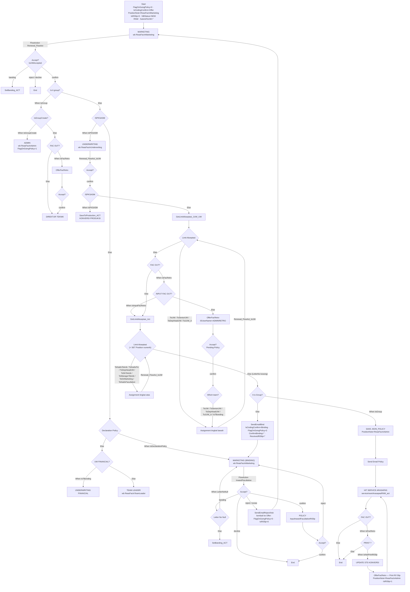
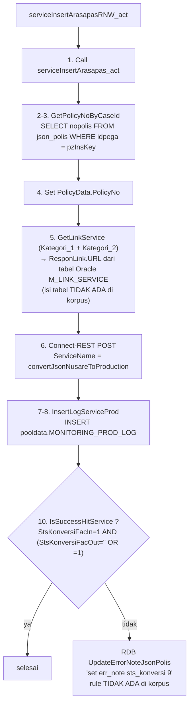

# Alur Siklus Renewal (RNW) — Facultative Inward

> Sumber: `D:\migrasi\RNM\RNW Fac In\` (1.927 berkas `.xml`).
> Label bukti: **[terverifikasi]** / **[dugaan]** / **[pertanyaan terbuka]**.
> Nama orang tidak disalin. Mesin tangga persetujuan dibahas di
> [`04-mesin-akseptasi.md`](04-mesin-akseptasi.md); pembanding NB ada di
> [`01-alur-new-business.md`](01-alur-new-business.md).

---

## 0. Inventaris korpus RNW

```powershell
Get-ChildItem "D:\migrasi\RNM\RNW Fac In" -Recurse -File -Filter *.xml |
  Group-Object { $_.Directory.Name } | Sort-Object Name | Format-Table Name,Count -AutoSize
(Get-ChildItem "D:\migrasi\RNM\RNW Fac In" -Recurse -File -Filter *.xml).Count   # => 1927
```

| Folder | Jumlah | Folder | Jumlah |
| --- | ---: | --- | ---: |
| `Activity` | 556 | `RDBList` | 200 |
| `Section` | 397 | `ReportDefinition` | 118 |
| `FlowAction` | 239 | `Harness` | 41 |
| `When` | 189 | `DataPage` | 30 |
| `DataTransform` | 138 | `DecisionTable` | 10 |
| `Flow` | **4** | `DecisionTree` | 1 |
| `ConnectREST` | 3 | `SystemSettings` | 1 |

### 0.1 Empat flow di korpus RNW

| Berkas | `pyFlowType` | Kelas | Shape |
| --- | --- | --- | ---: |
| `InputRenewalFacultativeIn.xml` | `InputRenewalFacultativeIn` | `ASM-FW-GISFW-Work` | **siklus renewal** |
| `InputInwardFacultativeRISlip.xml` | `InputInwardFacultativeRISlip` | `ASM-FW-GISFW-Work` | siklus polis / R-I slip |
| `OfferFacRetro.xml` | `OfferFacRetro` | `ASM-FW-GISFW-Work` | retrosesi |
| `OfferFacOut.xml` | `OfferFacOut` | `ASM-FW-GISFW-Work` | screen-flow cetak R/I slip |

**[terverifikasi]** Tidak ada `InputQuotation` di korpus RNW — titik masuk case renewal
**[pertanyaan terbuka]** (lihat §7).

### 0.2 Apa yang benar-benar berbeda dari NB

Perbandingan nama berkas antar korpus:

```powershell
$nb  = (Get-ChildItem "D:\migrasi\RNM\NB FacIn\Activity" -File).Name
Get-ChildItem "D:\migrasi\RNM\RNW Fac In\Activity" -File | ? { $nb -notcontains $_.Name } | % Name
# GetBusinessGroup_Act.xml, serviceInsertArasapasRNW_act.xml, SetDataInsuredEDM_Act.xml

$nbw = (Get-ChildItem "D:\migrasi\RNM\NB FacIn\When" -File).Name
Get-ChildItem "D:\migrasi\RNM\RNW Fac In\When" -File | ? { $nbw -notcontains $_.Name } | % Name
# (kosong)
```

**[terverifikasi]** Hanya **3 aktivitas** yang eksklusif RNW, dan **tidak ada** rule `When`
eksklusif RNW. `GetLimitAkseptasi_Act` dan `IsUWAccepted` identik dengan NB (lihat
`04-mesin-akseptasi.md` §2.1 dan §6.1).

> **Konsekuensi migrasi:** siklus Renewal **bukan** mesin terpisah. Ia adalah flow yang berbeda di
> atas *domain, rule `When`, dan mesin akseptasi yang sama*. Pembeda perilaku ada pada
> `QuotationData.StatusBusiness = 2` dan pada topologi flow-nya.

---

## 1. Penanda siklus: `StatusBusiness = 2`

`RNW Fac In/Activity/GetDateValidity_ACT.xml` langkah 3, `pyStepsDescription` =
**"DEFAULT RENEWAL"**, pre-condition `pyWorkPage.OfferFacIn.QuotationData.StatusBusiness==2`
**[terverifikasi]**:

```
SET Local.CurentDate = @CurrentDateTime()
SET Local.days = @if(Local.Begindate<Local.CurentDate,0,@DateTimeDifference(Local.CurentDate,Local.Begindate,"D"))
SET Local.days = @replaceAll(Local.days,"-","")
SET Local.days = @if(Local.days>0,Local.days+1,0)
SET Local.days = @divide((Local.days),1,0)
SET .OfferFacIn.DaysValidity  = Local.days
SET .OfferFacIn.DateValidity  = @DateTime.addCalendar(@FormatDateTime(Local.CurentDate,"yyyyMMdd","Asia/Jakarta","in_ID"),0,0,0,Local.days,0,0,0)
SET .OfferFacIn.WaitingBindDate = @if(Local.DateToUW<=Local.Begindate, …)
```

Perbedaan dengan cabang NB (langkah 2, `StatusBusiness==1`): NB memakai
`@DateTimeDifference(Local.Begindate, Local.CurentDate, "D")` (argumen terbalik) dan **membatasi
`days` maksimum 30**; cabang Renewal tidak punya batas 30 hari. **[terverifikasi]**

`SetToInbox_ACT` memisahkan jalur dengan `StatusBusiness=="1"` (blok "set tiket UNTUK NB",
langkah 3) versus selainnya (blok "set tiket UNTUK RNW DAN EDM", langkah 4) — sehingga RNW berbagi
namespace tiket `*Policy` dengan EDM. **[terverifikasi]**

Untuk mesin akseptasi, `StatusBusiness==2` **tidak** memicu perhitungan selisih: klausa selisih di
`GetLimitAkseptasi_Act` langkah 5 hanya aktif pada `StatusBusiness=="3"`. Jadi **nilai dasar
akseptasi Renewal sama dengan New Business**: `TotalTSINusaRe`, atau `TotalTSITopRisk` bila ada top
risk. **[terverifikasi]** — lihat `04-mesin-akseptasi.md` §4.

---

## 2. Siklus renewal — `InputRenewalFacultativeIn`

### 2.1 Gerbang masuk

```
Start2 --> Assignment10  [Always]
     SET .FlagOnGoingPolicy      = 0
     SET .IsCedingConfirm        = "Offer"
     SET .PositionNote           = "ReasFacInMarketing"
     SET .OfferFacIn.IsRISlip    = 0
     SET .NBStatus               = "NEW RNW"
     SET .NBStatusNew            = "NEW RNW"
     SET .OfferFacIn.SubmitToUW  = ""
```

`Assignment10` = **"MARKETING"**, router `ToWorkbasket`, workbasket `ReasFacInMarketing`.
**[terverifikasi]**

Bandingkan NB: RNW menambahkan `.OfferFacIn.IsRISlip = 0` dan `.OfferFacIn.SubmitToUW = ""`
di gerbang masuk; NB tidak. **[terverifikasi]**

### 2.2 FlowAction penggerak

| FlowAction (`pyExpression` konektor `[Action]`) | Dipakai dari |
| --- | --- |
| `Renewal_FlowAct` | Assignment Marketing (`Assignment10`), Team Leader (`Assignment18`) |
| `Renewal_FlowAct_IsUW` | semua Assignment approver (UW, SUW, DepHead, MTek, Kadiv*, Direktur*, JUW) |
| `InwardFacultative` | **hanya** `Assignment14` (MARKETING (BINDING)) |
| `StartScreenFlowAuto` | `Assignment9` (ADMIN (FAC OUT)) → `SubProcess2` (`OfferFacout`) |

**[terverifikasi]** Perhatikan `Assignment14` memakai FlowAction NB (`InwardFacultative`), bukan
`Renewal_FlowAct`. Tahap binding RNW berbagi layar dengan NB. **[dugaan]** implikasinya pada
validasi; belum ditelusuri sampai Section.

### 2.3 Rangkaian utama

```
Assignment10 (MARKETING) --[Renewal_FlowAct]--> Decision10 (Accept? IsUWAccepted)
Decision10 --confirm--> Decision11 ("Is it group?")
Decision10 --banding--> Utility5 (SetBanding_ACT)
Decision10 --"reject"/"decline"--> End1

Decision11 --When IsGroup--> Decision29 ("pxCreateOperator <1 identitas>?")
Decision11 --Else---------> Decision24 ("ISPKSASM")

Decision29 --When IsGroupCreate--> Assignment15 (ADMIN, wb ReasFacInAdmin)
             SET PositionNote="ReasFacInAdmin", FlagOnGoingPolicy=1, IDUserName=<1 identitas>
Decision29 --Else---------------> Decision5 ("FAC OUT?")

Decision24 --When IsPKSASM--> Assignment8 (UNDERWRITING, wb ReasFacInUnderwriting)
Decision24 --Else----------> Decision28 ("Declaration Policy")
Decision28 --When IsDeclarationPolicy--> Assignment14 (MARKETING (BINDING))
             SET PositionNote="ReasFacInMarketing", IsCedingConfirm="Binding", FlagOnGoingPolicy=2
Decision28 --Else---------------------> Decision23 ("UW FINANCIAL?")
Decision23 --When IsTBonding--> Assignment1 (UNDERWRITING FINANCIAL)
Decision23 --Else-----------> Assignment18 (TEAM LEADER, wb ReasFacInTeamLeader)
```

**[terverifikasi]**

> Bedanya dengan NB: di NB, `Decision1 ("Is it group?")` datang **setelah** `SaveJsonOfferFacIn_Act`
> dan gerbang `IsSpecialCase`; di RNW, `Decision11 ("Is it group?")` langsung setelah gerbang
> akseptasi pertama, dan tidak ada gerbang `IsSpecialCase` maupun `IS LIFE?` di flow renewal.
> **[terverifikasi]** — korpus RNW tidak memuat shape `IsLife` di flow renewal
> (`GetLimitAkseptasiLife_Act` juga tidak ada di korpus RNW).

### 2.4 Tangga persetujuan

Tiga gerbang tangga di flow renewal:

| Shape | Diberi makan oleh | Cabang `When` | Cabang `Else` |
| --- | --- | --- | --- |
| `Decision34` ("Limit Akseptasi") | `Utility6` = `GetLimitAkseptasi_JUW_UW` | `ToSeniorUW`, `ToDepHeadUW`, `ToJUW_A`, `ToUW` | `Decision1` ("FAC OUT?") |
| `Decision14` ("Limit Akseptasi") | `Utility2` = `GetLimitAkseptasi_Act` | `ToKadivTeknik`, `ToKadivFin`, `ToDepHeadUW`, `ToDirTeknik`, `ToManagerTeknik`, `ToDirMarketing`, `ToKadivFacultative` | `Decision25` ("It is Group?") |
| `Decision8` ("Which team?") | — (memakai `LetterNo` yang sudah ada) | `ToSeniorUW`, `ToDepHeadUW`, `ToJUW_A`, `ToUW`, `IsTBonding` | tidak ada `Else` |

**[terverifikasi]**

Perbedaan penting dari NB: di NB, `Decision23` (`Else`) menuju `Utility16`
(`SaveJsonOfferFacIn_Act`); di RNW, `Decision14` (`Else`) menuju `Decision25` ("It is Group?")
yang langsung memutuskan binding vs simpan polis.

`Decision14` juga menulis `pyWorkPage.Position` numerik bersamaan dengan `PositionNote`:

| Cabang | `Position` | `PositionNote` |
| --- | --- | --- |
| `ToKadivTeknik` | `"2"` | `ReasFacInGroupLeader` |
| `ToDirTeknik` | `"3"` | `ReasFacInTechnicalDirector` |
| `ToDirMarketing` | `"8"` | `ReasFacInMarketingDirector` |
| `ToManagerTeknik` | — | `ReasFacInManagerTeknik` |
| `ToKadivFin` | — | `ReasFacInFinDivHead` |
| `ToDepHeadUW` | — | `ReasFacInDepHeadUnderwriting` |
| `ToKadivFacultative` | — | (tidak ada `SET` sama sekali) |

`Decision8` menulis `Position = "7"` untuk `ToSeniorUW` dan `Position = ""` untuk `ToDepHeadUW`.
**[terverifikasi]** — penetapan `Position` tidak konsisten. **[pertanyaan terbuka]** apakah properti
ini masih dibaca.

### 2.5 Binding

```
Decision14 --Else--> Decision25 ("It is Group?")
Decision25 --When IsGroup--> Utility3 (SaveJsonPolicyFacIn_Act)   SET PositionNote="ReasFacInAdmin"
Decision25 --Else---------> Utility9 (SendEmailPolicy, "SendEmailBind")
     SET PositionNote="ReasFacInMarketing", IsCedingConfirm="Binding", FlagOnGoingPolicy=2
     SET OfferFacIn.ConfirmBinding = ""   SET OfferFacIn.ReceivedRiSlip = ""
Utility9 --Always--> Assignment14 ("MARKETING (BINDING)", wb ReasFacInMarketing)
Assignment14 --[FlowAction InwardFacultative]--> Decision26 (Accept?)
Decision26 --confirm--> SubProcess1 (POLICY = InputInwardFacultativeRISlip)
Decision26 --banding--> Decision36 ("Letter No Null")
Decision26 --reject----> Utility7 (SendEmailReject/Ask)
     SET IsCedingConfirm="Offer", PositionNote="ReasFacInMarketing", IsRISlip=0, FlagOnGoingPolicy=0
Decision26 --revise----> Utility7    SET FlagOnGoingPolicy=0, IsCedingConfirm="Offer", IsRISlip=0
Decision26 --decline---> End5
Decision36 --When LetterNoNull--> Assignment14
Decision36 --Else--------------> Utility10 (SetBanding_ACT)
SubProcess1 --Always--> Decision27 (Accept?)
Decision27 --reject--> Assignment14
Decision27 --confirm--> End5
```

**[terverifikasi]**

Berbeda dengan NB, jalur `reject`/`revise` di RNW mengembalikan `OfferFacIn.IsRISlip = 0` — NB
tidak. **[terverifikasi]**

### 2.6 Fac out / retro

```
Decision1 ("FAC OUT?") --When IsFacRetro--> Decision19 ("INPUT FAC OUT?")
Decision1 --Else------------------------> Utility2 (GetLimitAkseptasi_Act)
Decision19 --When IsInputFacRetro--> Utility2
Decision19 --Else-----------------> SubProcess8 (OfferFacRetro)   SET IDUserName = "ADMINRETRO"
SubProcess8 --Always--> Decision4 (Accept?, pyWorkStatus=Pending-Policy)
Decision4 --confirm--> Decision8 ("Which team?")

Decision5 ("FAC OUT?") --When IsFacRetro--> SubProcess4 (OfferFacRetro)  SET IDUserName = <1 identitas>
Decision5 --Else------------------------> Assignment6 (DIREKTUR TEKNIK)  SET PositionNote="ReasFacInTechnicalDirector"
SubProcess4 --Always--> Decision15 (Accept?)
Decision15 --confirm--> Assignment6

Decision13 ("FAC OUT?") --When IsFacRetro--> Decision2 ("PRINT ?")
Decision13 --Else------------------------> End2
Decision2 --When IsNotPrintRISlip--> Utility4 (UpdateStsKonversiFacOut_Act)
Decision2 --Else-----------------> End2
Utility4 --Always--> SubProcess3 ("[Print R/I Slip]" = OfferFacRetro)
     SET PositionNote="ReasFacInAdmin", OfferFacIn.IsRISlip=1

Decision16 ("Is it group?") --When IsGroup--> Assignment9 ("ADMIN (FAC OUT)", pyWorkStatus=Pending-FacOut, wb ReasFacInAdmin)
Decision16 --Else------------------------> SubProcess3
Assignment9 --[StartScreenFlowAuto]--> SubProcess2 ("[Print R/I Slip]" = OfferFacout)
```

**[terverifikasi]**

Sub-flow `OfferFacRetro` di korpus RNW identik dengan NB (11 shape, tangga
`ReasFacOutAdmin` → `ReasFacOutHead`):

```powershell
Compare-Object (Get-Content FL_NB_FacRetro.txt) (Get-Content FL_RNW_FacRetro.txt)
# perbedaan hanya pada teks NBStatus (nama orang) — struktur shape/konektor identik
```

### 2.7 Konversi ke produksi

Tiga titik masuk konversi di flow renewal:

```
Decision33 ("ISPKSASM") --When IsPKSASM--> Utility11 (SaveToProduction_ACT)
Decision33 --Else---------------------> Utility6 (GetLimitAkseptasi_JUW_UW)

Utility3 (SAVE JSON_POLICY) --Always--> Utility8 (SendEmailPolicy, "Send Email Policy")
Utility8 --Always--> Utility1 ("HIT SERVICE ARASAPAS" = serviceInsertArasapasRNW_act)
SubProcess2 --Always--> Utility1
SubProcess3 --Always--> Utility1
Utility1 --Always--> Decision13 ("FAC OUT?")
```

**[terverifikasi]**

> Bedanya dengan NB: NB memakai `serviceInsertArasapas_act` dan menempatkan gerbang
> `IsSuccessHitService` **setelah** panggilan servis; RNW memakai `serviceInsertArasapasRNW_act`
> dan **tidak** memiliki gerbang `IsSuccessHitService` di flow renewal — penanganan galat pindah
> **ke dalam** aktivitas (langkah 10, lihat §3).

---

## 3. `serviceInsertArasapasRNW_act` — konversi ke produksi

`RNW Fac In/Activity/serviceInsertArasapasRNW_act.xml`, kelas `ASM-FW-GISFW-Work`
**[terverifikasi]**:

| Langkah | Metode | Isi |
| --- | --- | --- |
| 1 | `Call serviceInsertArasapas_act` | delegasi ke aktivitas dasar |
| 2 | `Property-Set` | `TempSearch.CARI1 = pyWorkPage.pzInsKey` (desc: *"Get value CaseId. Ex: ASM-FW-GISFW-WORK NB-215"*) |
| 3 | `RDB-List` | `RequestType = GetPolicyNoByCaseId`, page `OutputSearch` |
| 4 | `Property-Set` | `pyWorkPage.OfferFacIn.PolicyData.PolicyNo = OutputSearch.pxResults(1).PolicyNo` · `TempSearch.CARI2 = …PolicyNo` · `TempSearch.CARI3 = @CurrentDateTime()` |
| 5 | `Call ASM-FW-GISFW-Int-M_LINK_SERVICE.GetLinkService` | *"GET LINK SERVICE"* |
| 6 | `Connect-REST` | `ServiceName = convertJsonNusareToProduction`, method `POST` |
| 7 | `Property-Set` | `Param.IDPega`, `Param.Nopolis`, `Param.ParamInsert`, `Param.JenisService = pyWorkPage.JN_SERVICE`, `Param.StsMessage = pyWorkPage.pyStatusMessage`, `Param.ResponMessage = @ASM.GetPageJSONString()` |
| 8 | `Call InsertLogServiceProd` | *"Insert Log Service"* |
| 9 | `Page-Remove` | bersihkan `TempSearch`, `OutputSearch` |
| 10 | `RDB-List` | `RequestType = UpdateErrorNoteJsonPolis` — **dijalankan bila `IsSuccessHitService` SALAH** (`IF[IsSuccessHitService] then=3`), desc: *"Set err_note sts_konversi 9 (UPDATE JSON_POLIS)"* |

### 3.1 Endpoint adalah konfigurasi, bukan literal

`NB FacIn/Activity/GetLinkService.xml`, kelas `ASM-FW-GISFW-Int-M_LINK_SERVICE`
**[terverifikasi]**:

```
PARAMS: Kategori_1 : STRING (IN) · Kategori_2 : STRING (IN)
STEP 1 Page-New
STEP 2 Obj-Browse            → page linkService
STEP 3 Property-Set          → SET ResponLink.URL = linkService.pxResults(1).URL
STEP 4 Page-Remove
```

Isi tabel `M_LINK_SERVICE` **tidak ada di korpus** → URL tidak dapat direkam. Rule `ConnectREST`
`convertJsonNusareToProduction` memuat `pyBaseURLSetting`, `pyEmbeddedURL`, dan `pyAuthProfile`
(`Data-Admin-Security-AuthenticationProfile`) — **nilainya tidak disalin ke dokumen ini** sesuai
aturan. `pyResourceNameResolution = JNDIName`, `pyProxyAuthTypeSelection = NO_AUTH`,
`pyUseAuthentication = false`. **[terverifikasi]**

### 3.2 SQL logging & status

`RNW Fac In/RDBList/GetPolicyNoByCaseId.xml` **[terverifikasi]**:

```sql
SELECT nopolis as "PolicyNo" FROM json_polis WHERE idpega = {TempSearch.CARI1}
```

`NB FacIn/RDBList/InsertLogServiceProd.xml` **[terverifikasi]**:

```sql
BEGIN
    INSERT INTO pooldata.MONITORING_PROD_LOG(IDPEGA,NOPOLIS,PARAMETER,JN_SERVICE,STS_MESSAGE,RESPON_MESSAGE)
     VALUES ({ParamLog.CARI1},{ParamLog.CARI2},{ParamLog.CARI3},{ParamLog.CARI4},{ParamLog.CARI5},{ParamLog.CARI6});
    COMMIT;
END;
```

`NB FacIn/RDBList/UpdateErrorNoteJsonPolisMonitoring.xml` **[terverifikasi]**:

```sql
UPDATE POOLDATA.JSON_POLIS_MONITORING SET ERR_NOTE = {pyWorkPage.StatusService.ResponseMessage}
 WHERE NOPOLIS = {pyWorkPage.OfferFacIn.PolicyData.PolicyNo}
```

> `UpdateErrorNoteJsonPolis` (dirujuk langkah 10) **tidak ada** sebagai berkas di `RDBList\` mana
> pun. Yang ada hanya `UpdateErrorNoteJsonPolisMonitoring`. **[pertanyaan terbuka]**
> ```powershell
> Get-ChildItem "D:\migrasi\RNM" -Recurse -File -Filter "UpdateErrorNoteJsonPolis*"
> # hanya UpdateErrorNoteJsonPolisMonitoring.xml di ketiga korpus
> ```

`When IsSuccessHitService` **[terverifikasi]**:

```
LOGIC: (A AND B) OR (A AND C)
A: pyWorkPage.StatusService.StsKonversiFacIn = 1
B: pyWorkPage.StatusService.StsKonversiFacOut = ""
C: pyWorkPage.StatusService.StsKonversiFacOut = 1
```

---

## 4. Siklus polis RNW — `InputInwardFacultativeRISlip`

Berkas `RNW Fac In/Flow/InputInwardFacultativeRISlip.xml` **identik strukturnya** dengan versi NB
(64 shape, jumlah konektor sama; perbedaan hanya pada teks `NBStatus`). Karena itu §3 di
[`01-alur-new-business.md`](01-alur-new-business.md) berlaku penuh untuk RNW.

```powershell
# bandingkan dump shape+konektor kedua berkas
Compare-Object (Get-Content FL_NB_RISlip.txt) (Get-Content FL_RNW_RISlip.txt)
```

**[terverifikasi]** Perbedaan: hanya di baris `SET pyWorkPage.NBStatus…` yang memuat nama orang.

Catatan: flow R-I Slip memakai `serviceInsertArasapas_act` (bukan varian RNW) di `Utility2`,
sehingga untuk kasus renewal yang masuk siklus polis, gerbang `IsSuccessHitService` **ada** di
flow (shape `Decision30` berlabel "Err Konversi?"). Jalur gagal → `Utility6` (`SetToInbox_ACT`).
**[terverifikasi]**

---

## 5. Gerbang akseptasi RNW

24 gerbang `Accept?` di flow renewal memakai DecisionTable `IsUWAccepted` yang **identik** dengan NB
dan EDM:

```powershell
foreach ($r in @("NB FacIn","RNW Fac In","Endorsment Fac In")) {
  $c = Get-Content "D:\migrasi\RNM\$r\DecisionTable\IsUWAccepted.xml" -Raw
  "$r default=" + ([regex]::Match($c,'<pyDefaultResult>(.*?)</pyDefaultResult>')).Groups[1].Value
}
# ketiganya: default=decline
```

| `.ProposalAcceptStatus` | Status konektor |
| --- | --- |
| `1` | `confirm` |
| `2` | `reject` |
| `3` | `ask` |
| `4` | `banding` |
| `9` | `revise` |
| lainnya (termasuk `7`) | `decline` |

**[terverifikasi]**

Konektor `revise` pada flow renewal lebih jarang daripada NB: hanya `Decision26` (dari
MARKETING (BINDING)) yang punya cabang `revise`. **[terverifikasi]**

---

## 6. Diagram alur Renewal



### 6.1 Konversi ke produksi (detail aktivitas)



---

## 7. Pertanyaan terbuka

1. **Titik masuk case Renewal tidak ada di korpus.** NB punya `InputQuotation` (kelas
   `ASM-FW-GISFW-Work-NB`); RNW tidak punya flow pembuka setara. Bagaimana case RNW dibuat — dari
   portal (`Section/SFAPortal_Renewal.xml`), dari `ReportDefinition/RenewalList_RD.xml`, atau dari
   job terjadwal? Belum terverifikasi.
2. **`GetBusinessGroup_Act`** — satu dari tiga aktivitas eksklusif RNW; isinya belum ditelusuri.
3. **`SetDataInsuredEDM_Act` ada di korpus RNW tetapi bernama "EDM"** — apakah renewal memakai jalur
   data endorsement? Perlu dicek.
4. **`UpdateErrorNoteJsonPolis`** dirujuk `serviceInsertArasapasRNW_act` langkah 10 tetapi rule-nya
   tidak ada di korpus. Apa `UPDATE`-nya, dan apa arti `sts_konversi = 9`?
5. **`serviceInsertArasapas_act` kelas `ASM-FW-GISFW-Work`** (dipanggil langkah 1) juga tidak ada di
   korpus — hanya versi `ASM-FW-GISFW-Data-PolicyTreatyIn` yang mendelegasikan ke sana.
6. **Isi `M_LINK_SERVICE`** (kunci `KATEGORI_1` + `KATEGORI_2`) tidak ada di korpus. Nilai
   `Kategori_1`/`Kategori_2` yang dipasok `serviceInsertArasapasRNW_act` langkah 5 belum diperiksa.
7. **`pyWorkPage.Position` numerik** ditulis tidak konsisten di flow renewal (`"2"`,`"3"`,`"7"`,
   `"8"`, dan `""`); tidak ditemukan pembacanya.
8. **`Decision14 --> Assignment12 [When ToKadivFacultative]`** tidak menetapkan `PositionNote`
   sama sekali, sedangkan enam cabang lain menetapkannya. Bug atau `PositionNote` diisi di tempat
   lain untuk kasus itu?
9. **`Decision8` ("Which team?") tidak punya cabang `Else`.** Apa yang terjadi bila `LetterNo`
   kosong di titik itu — case macet?
10. **`OfferFacIn.SubmitToUW`** direset di gerbang masuk renewal tetapi pembacanya belum
    ditelusuri.
11. **`ConfirmBinding` / `ReceivedRiSlip`** direset ke `""` saat masuk binding renewal, sedangkan
    `SetRejectProposal` menetapkan `ConfirmBinding = 0` dan `ReceivedRiSlip = false`. Tipe datanya
    tidak konsisten (`""` vs `0` vs `false`) — **belum terverifikasi** tipe kolomnya.
12. **Renewal tidak memakai selisih terhadap polis sebelumnya** dalam mesin akseptasi (hanya
    `StatusBusiness=="3"` yang memicu selisih). Apakah itu memang aturan bisnis — renewal dinilai
    atas TSI penuh, bukan delta?
13. **`OfferFacIn.OldData` di korpus RNW**: `GetEDMOldData_SQL` tidak ada di `RNW Fac In/RDBList\`.
    Dari mana data polis lama untuk renewal diambil?
