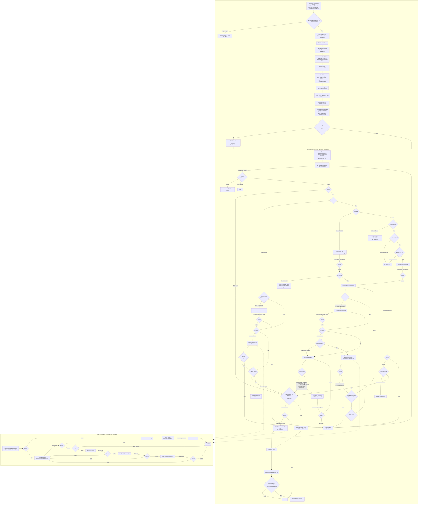

# Alur Siklus Endorsement / Addendum (EDM) — Facultative Inward

> Sumber: `D:\migrasi\RNM\Endorsment Fac In\` (2.061 berkas `.xml`).
> Label bukti: **[terverifikasi]** = tag/SQL dikutip langsung · **[dugaan]** = dari pola/nama ·
> **[pertanyaan terbuka]** = tidak terjawab dari korpus.
> Nama orang **tidak disalin**; guard identitas dicatat sebagai jumlah + mekanisme saja.
> Mesin tangga persetujuan dibahas di [`04-mesin-akseptasi.md`](04-mesin-akseptasi.md) — di sini
> hanya **percabangan EDM**-nya. Pembanding: [`01-alur-new-business.md`](01-alur-new-business.md),
> [`02-alur-renewal.md`](02-alur-renewal.md). Enumerasi status & rumus premi umum:
> [`04-aturan/02-formula-dan-status.md`](../04-aturan/02-formula-dan-status.md).

---

## 0. Inventaris korpus EDM

```powershell
(Get-ChildItem "D:\migrasi\RNM\Endorsment Fac In" -Recurse -File -Filter *.xml).Count   # => 2061
Get-ChildItem "D:\migrasi\RNM\Endorsment Fac In" -Recurse -File -Filter *.xml |
  Group-Object { $_.Directory.Name } | Sort-Object Name | Format-Table Name,Count -AutoSize
```

| Folder | Jumlah | Folder | Jumlah |
| --- | ---: | --- | ---: |
| `Activity` | 582 | `RDBList` | 188 |
| `Section` | 434 | `ReportDefinition` | 138 |
| `FlowAction` | 265 | `Harness` | 37 |
| `When` | 202 | `DataPage` | 41 |
| `DataTransform` | 157 | `DecisionTable` | 10 |
| `Flow` | **2** | `DecisionTree` | 1 |
| `ConnectREST` | 3 | `SystemSettings` | 1 |

**[terverifikasi]**

### 0.1 Dua flow saja

| Berkas | `pyFlowType` | Kelas | Shape / Konektor |
| --- | --- | --- | --- |
| `Flow/InputAddendumFacultativeIn.xml` | `InputAddendumFacultativeIn` | `ASM-FW-GISFW-Work` | **69 / 138** |
| `Flow/OfferFacRetro.xml` | `OfferFacRetro` | `ASM-FW-GISFW-Work` | **15 / 20** |

```powershell
[xml]$x = Get-Content "D:\migrasi\RNM\Endorsment Fac In\Flow\InputAddendumFacultativeIn.xml" -Raw
$x.pagedata.pyFlowType                                                   # InputAddendumFacultativeIn
$x.SelectNodes("/pagedata/pyModelProcess/pyShapes/rowdata").Count        # => 69
$x.SelectNodes("/pagedata/pyModelProcess/pyConnectors/rowdata").Count    # => 138
```

**[terverifikasi]**

> **Konsekuensi struktural.** EDM **tidak punya flow siklus polis terpisah**. NB dan RNW masing-masing
> memanggil sub-proses `InputInwardFacultativeRISlip`; korpus EDM tidak memuat berkas itu. Seluruh
> siklus endorsement berjalan di **satu flow** ditambah sub-flow retro. **[terverifikasi]**
>
> ```powershell
> Get-ChildItem "D:\migrasi\RNM\Endorsment Fac In\Flow" -File | % Name
> # InputAddendumFacultativeIn.xml, OfferFacRetro.xml   (tidak ada InputInwardFacultativeRISlip.xml)
> ```

---

## 1. Titik masuk: bagaimana case EDM dibuat dan dibedakan

### 1.1 Dua kelas case, dua tahap

Endorsement bermula di kelas **`ASM-SFAGIS-Work-Endorsement`** (case permintaan endorsement di
portal SFA), yang **melahirkan** case kerja **`ASM-FW-GISFW-Work-Endorsement`** berprefiks `EDM-`.

`Endorsment Fac In/Activity/SetValueToEDMWork.xml` (kelas `ASM-SFAGIS-Work-Endorsement`)
langkah **7** — kutipan `pyParamArray` **[terverifikasi]**:

```
SET param.classname          = "ASM-FW-GISFW-Work-Endorsement"
SET param.IDPrefix           = "EDM-"
SET param.modelname          = "pyDefault"
SET param.workPage           = "curWorkPage"
SET param.FlowType           = "pyStartCase"
SET curWorkPage.PolicyNumber = .PolicyNo
SET TempCase.PolicyNumber    = .PolicyNo
```

Langkah **8** `Call svcAddWorkObject` membuat case-nya; langkah **10** `Obj-Open-By-Handle`
membuka kembali sebagai page `newWorkPage`. **[terverifikasi]**

Formulir pembuatannya adalah `Endorsment Fac In/Section/WorkPrimaryDetails.xml`
(kelas `ASM-SFAGIS-Work-Endorsement`), yang merujuk properti `.PolicyNo`, `.EndorsementDate`,
`.Note`, `.EdmType`, `.EdmTypeNew`, `.EndorsementInternalRetro`, dan memanggil aktivitas
`CheckEDMPolisDate`, `SetErrorBatalEndorsement_Act`, `SetEdmType`, `SetEDMHandle2_Act`.
Tombol pembuatnya ada di `Endorsment Fac In/Section/crmNewHarnessButtons.xml`
(satu-satunya bagian UI yang merujuk `SetValueToEDMWork`). **[terverifikasi]**

```powershell
Select-String -Path "D:\migrasi\RNM\Endorsment Fac In\*\*.xml" -Pattern "SetValueToEDMWork" -List |
  % { (Split-Path (Split-Path $_.Path) -Leaf) + "/" + (Split-Path $_.Path -Leaf) }
# Activity/SetOLDValueToEDMWork_FIRE.xml, Activity/SetValueToEDMWork.xml, Section/crmNewHarnessButtons.xml
```

### 1.2 Penanda siklus: `StatusBusiness = 3`

`Endorsment Fac In/When/IsEDM.xml` **[terverifikasi]**:

```
LOGIC: A
A: pyWorkPage.OfferFacIn.QuotationData.StatusBusiness = 3
```

dan `When/IsNotEDM.xml`: `pyWorkPage.Quotation.StatusBusiness != 3`. Nilai `3` untuk endorsement
sudah ditetapkan di [`04-mesin-akseptasi.md` §4.3](04-mesin-akseptasi.md). **[terverifikasi]**

`DataTransform/DataToEDM.xml` (dipanggil `SetValueToEDMWork` langkah 11) menautkan kedua case
**[terverifikasi]**:

```
SET newWorkPage.pyLabel        = newWorkPage.pxInsName
SET newWorkPage.EndorsementID  = .pzInsKey          ← handle case SFA
UPDATE_PAGE newWorkPage
SET .EDMHandle                 = newWorkPage.pzInsKey ← handle case EDM
```

Langkah **22–25** `SetValueToEDMWork` menelusuri `Assign-Worklist` dan `Assign-WorkBasket` dengan
`.pxRefObjectKey == Primary.EDMHandle` lalu menyimpan `Primary.EDMHandle2 = .pzInsKey`
(handle assignment). **[terverifikasi]**

### 1.3 Enam gerbang penolakan sebelum case EDM boleh lahir

`Endorsment Fac In/Activity/SetErrorBatalEndorsement_Act.xml`, blok langkah **5**
**[terverifikasi]**. Semua memakai `Property-Set-Messages` pada field `.PolicyNo`:

| Sub-langkah | Sumber data | Kondisi memblokir | Pesan |
| --- | --- | --- | --- |
| 5.2 / 5.5 | `RDBList/GetEDMStatus_SQL` → `OutputData1.CARI20` | `CARI20==1 \|\| CARI20==2` | *"Sudah Di endorsement Batal"* |
| 5.6–5.9 | ReportDefinition `GetListEdm` | ada EDM lain atas nopolis yang belum `resolve/complete` | *"There's EDM with this policy no that haven't finish yet!"* |
| 5.11 / 5.14 | `RDBList/GetDataClaim_SQL` | `LengthOfPageList(ListClaim)>0 && ListClaim(1).CARI1!="2"` | *"There's already a claim with this policy no"* |
| 5.15 / 5.18 | `RDBList/SearcStatusBayarArasaps_SQL` | ada pembayaran **dan** `Quotation.EdmType==1\|\|==2` | *"There's already payment with this policy no"* |
| 5.19 / 5.22 | `RDBList/GetListRNWbyNopolis_SQL` | sudah ada RNW atas nopolis itu | *"There's RNW with this policy no!"* |
| 5.23 | `RDBList/GetFacoutList_SQL` | `.EndorsementInternalRetro==1` **dan** tidak ada baris fac out | *"This policy is not spreading FACOUT"* |

Setiap gerbang punya **klep pembatal**: ReportDefinition `BrowseOpenProteksiEdm_RD`
(kelas `ASM-FW-GISFW-Int-OPENPROTEKSI_EDM`) dipanggil dengan `Param.Type` = `1` (batal), `2` (klaim),
`3` (pembayaran), `4` (renewal); bila tabel itu memuat baris untuk nopolis tersebut, pesan galat
**tidak** dipasang. **[terverifikasi]** Isi tabel `OPENPROTEKSI_EDM` tidak ada di korpus →
**[pertanyaan terbuka]**.

Langkah 4, 5.1, 5.10 melewati seluruh blok bila `EdmType=="4" && EdmTypeNew=="4"`
(deskripsi eksplisit: *"lewatin utk edm ri slip"*). **[terverifikasi]**

Langkah **5.24** merangkum: bila ada pesan atau salah satu kondisi di atas benar → `InputData.CARI3 = "SALAH"`.

`Endorsment Fac In/Activity/CheckEDMPolisDate.xml` menambahkan satu validasi lagi: tanggal
endorsement harus berada di dalam periode polis (`RDBList/GetStartDate` → `facinproduction`),
pesan *"EDM date cannot be outside the period"*. Dua pola nopolis literal membypass validasi ini
(langkah 2). **[terverifikasi]**

### 1.4 Guard “polis sudah dibatalkan” di `SetValueToEDMWork`

`SetValueToEDMWork` langkah 1–6 **[terverifikasi]**:

```
[1] SET InputData.CARI17 = .PolicyNo ; Local.Error = "Sudah Di endorsement Batal"
[2] RDB-List → GetEDMStatus_SQL → page OutputData1      (desc: "Get EdmStatus=2 / Batal Internal")
[3] SET curWorkPage.Quotation.EdmStatus = OutputData1.pxResults(1).CARI20   (pre-condition DINONAKTIFKAN)
[4] Property-Set-Messages  IF[OutputData1.pxResults(1).CARI20==1] → pesan Local.Error pada .PolicyNo
[5] IF[CARI20=="1" && InputData.CARI17 != <2 nomor polis literal>] → SET InputCari.CARI25 = "SALAH"
[6] IF[InputCari.CARI25=="SALAH"] then=6 (exit activity)
```

`Endorsment Fac In/RDBList/GetEDMStatus_SQL.xml` **[terverifikasi]**:

```sql
select b.DATA_JSON.QuotationData.EdmType AS CARI20
  FROM JSON_POLIS b
 WHERE NOPOLIS = {InputData.CARI17}
   and PRODKE  = (SELECT COUNT(NOPOLIS)-1 FROM JSON_POLIS b WHERE NOPOLIS={InputData.CARI17})
```

> Query membaca **atribut JSON di dalam kolom `DATA_JSON`** (`JSON_POLIS.DATA_JSON.QuotationData.EdmType`)
> — sintaks dot-notation JSON Oracle. Di sistem baru ini harus diterjemahkan ke `JSON_VALUE(...)`
> atau ke kolom tersendiri. **[terverifikasi]**

**Nomor polis produksi tertanam literal** di aktivitas-aktivitas EDM:

```powershell
$m = Select-String -Path "D:\migrasi\RNM\Endorsment Fac In\Activity\*.xml" `
      -Pattern 'RNM-[A-Z]?[0-9]{1,3}\.[0-9]{2}\.[0-9]{4}\.[0-9]{4,5}' -AllMatches
($m | % { $_.Matches } | % { $_.Value }).Count                       # => 629 kemunculan
($m | % { $_.Matches } | % { $_.Value } | Sort-Object -Unique).Count # => 176 nomor unik
($m | Group-Object Path).Count                                        # => 8 berkas
```

**[terverifikasi]** Nilainya tidak disalin ke dokumen ini. Delapan berkas itu: `SumTSIPremiSpreadedRNM_Act`
(74), `SetErrorBatalEndorsement_Act` (11), `ProtectFIREMBUPA_Act` (4), `SetValueToEDMWork` (3),
`GetLimitAkseptasi_Act` (2), `CheckEDMPolisDate` (2), `InputAddendumFacIn_PreAct` (1),
`GetPaymentList_Act` (1).

### 1.5 Gerbang masuk flow — EDM langsung berfase “Policy”

`Flow/InputAddendumFacultativeIn.xml`, konektor `Start2 → Assignment7` **[terverifikasi]**:

```
SET .FlagOnGoingPolicy = 1
SET .IsCedingConfirm   = "Policy"
SET .Position          = 1
SET .PositionNote      = "ReasFacInMarketing"
SET .NBStatus          = "NEW EDM"
SET .NBStatusNew       = "NEW EDM"
```

`Assignment7` = label **"MARKETING"**, router `ToWorkbasket`, workbasket **`ReasFacInMarketing`**,
tiket **`AdminPolicy`**. **[terverifikasi]**

> **Perbedaan pokok dari NB/RNW.** NB dan RNW mulai di fase penawaran (`FlagOnGoingPolicy=0`,
> `IsCedingConfirm="Offer"`), lalu melewati **binding** (`=2`, `"Binding"`), baru masuk siklus polis
> (`=1`, `"Policy"`). **EDM tidak punya fase penawaran maupun binding sama sekali** — ia lahir di
> fase polis dan tidak pernah keluar darinya:
>
> ```powershell
> [xml]$e = Get-Content "D:\migrasi\RNM\Endorsment Fac In\Flow\InputAddendumFacultativeIn.xml" -Raw
> $e.SelectNodes("/pagedata/pyModelProcess/pyConnectors/rowdata/pyPropertyAssigns/rowdata") |
>   % { $n=$_.SelectSingleNode('pyPropertiesName'); $v=$_.SelectSingleNode('pyPropertiesValue')
>       if($n -and $n.InnerText -match 'IsCedingConfirm|FlagOnGoingPolicy'){ $n.InnerText+" = "+$v.InnerText } } |
>   Group-Object | Format-Table Count,Name -AutoSize
> # 14  .FlagOnGoingPolicy = 1
> # 15  .IsCedingConfirm = Policy
> #  1  .IsCedingConfirm = "Policy"
> ```
>
> Tidak ada satu pun konektor yang menetapkan `"Offer"`, `"Binding"`, `0`, atau `2`.
> **[terverifikasi]**

---

## 2. Mekanisme before-image

Korpus memuat **tiga lapis berbeda** yang sering tertukar. Ketiganya harus dipisahkan di sistem baru.

| Lapis | Tempat menyimpan | Diisi oleh | Kapan | Isi |
| --- | --- | --- | --- | --- |
| **A. Dokumen polis sebelumnya** | `pyWorkPage.OfferFacIn.OldData` (page, kelas sama dengan `OfferFacIn`) | `SetValueToEDMWork` 14.1–14.2 (dan `GetdataOldEDMError` sebagai jalur perbaikan) | sekali, saat case EDM dibuat | **seluruh** dokumen JSON polis versi terakhir |
| **B. Nilai per-baris “sebelum”** | properti bersaudara `*Old` **di dalam list `OfferFacIn` yang sekarang** (`TSIOld`, `PremiumOld`, `RateOld`, `PremiNusantaraReOld`, `TSIObjectItemOld`, `TotalGrossPremiOld`, `TotalPremiumNusantaraReOld`, `PremiumGrossDiscountFleetOld`, `PremiRpOld`) | `SetOldData` | setiap kali layar endorsement dibuka (`InputAddendumFacIn_PreAct` langkah 28) | angka lama per objek/coverage/cedant |
| **C. Penanda baris warisan** | `.IsOldData = "old"` di setiap simpul list | `SetOLDValueToEDMWork_<LOB>` (7 varian) | sekali, saat case dibuat | menandai baris yang berasal dari polis lama |

**Riwayat versi polis bukan salah satu dari ketiganya.** Riwayat ada di tabel Oracle `JSON_POLIS`
sebagai **baris bertambah** dengan kolom `PRODKE` sebagai nomor versi (0-based). Lapis A *membaca*
riwayat itu; lapis B dan C adalah state di dalam case yang sedang berjalan. **[terverifikasi]**

### 2.1 Lapis A — `OfferFacIn.OldData`

`SetValueToEDMWork` langkah **14** (deskripsi: *"Copy policy data to old data"*, `LOOP=REPEAT`,
pre-condition **dinonaktifkan** sehingga selalu jalan) **[terverifikasi]**:

| Sub-langkah | Isi |
| --- | --- |
| 14.1 | `RDB-List` → `RequestType = GetEDMOldData_SQL`, `ClassName = ASM-FW-GISFW-Int-OFFERJSON`, `BrowsePage = OldData` |
| 14.2 | `Java`: `Primary.getProperty("newWorkPage.OfferFacIn.OldData").getPageValue()` lalu `tempPage2.adoptJSONObject(IsiDataJson)` dengan `IsiDataJson = DataJSONPage.getString("HASIL1")` |
| 14.3 | **54 `Property-Set`** menyalin `OldData.*` → field kerja sekarang (lihat 2.1.1) |
| 14.4–14.5 | `RDB-List GetDataMarketingByName_SQL` → `TeamGroup` diambil ulang dari master marketing |
| 14.6 | `Obj-Save newWorkPage` |
| 14.7–14.13 | `Call SetOLDValueToEDMWork_<LOB>` untuk 7 lini (lihat 2.3) |

`Endorsment Fac In/RDBList/GetEDMOldData_SQL.xml` **[terverifikasi]**:

```sql
SELECT a.DATA_JSON AS HASIL1 FROM JSON_POLIS a
 WHERE NOPOLIS = {newWorkPage.OfferFacIn.QuotationData.OldPolicyNo}
   and PRODKE  = (SELECT COUNT(NOPOLIS)-1 FROM JSON_POLIS a
                   WHERE NOPOLIS={newWorkPage.OfferFacIn.QuotationData.OldPolicyNo})
```

> **Before-image = versi terakhir dokumen polis**, dipilih dengan `PRODKE = COUNT(baris) - 1`.
> Rumus itu benar **hanya bila `PRODKE` rapat dari 0 tanpa lubang**. Bila satu baris pernah dihapus,
> query mengambil versi yang salah — **[pertanyaan terbuka]** apakah ada constraint yang menjamin
> kerapatan `PRODKE`.

`newWorkPage.OfferFacIn.QuotationData.OldPolicyNo` diisi `SetValueToEDMWork` langkah **12**
dari `.PolicyNo` formulir; langkah **13** mengisi `newWorkPage.OfferFacIn.EndorsmentReason = .Note`.
**[terverifikasi]**

#### 2.1.1 Field yang disalin OldData → data kerja (langkah 14.3)

54 `Property-Set`, semuanya berbentuk `newWorkPage.OfferFacIn.X = newWorkPage.OfferFacIn.OldData.X`.
Kelompoknya **[terverifikasi]**:

- **Identitas bisnis:** `QuotationData.{BusinessOldId, BusinessCode, BusinessFac, BusinessName,
  BusinessType, CedingCo, CedingCoName, SourceOfBusiness, SobName, MarketingCode, MarketingName,
  MOID, TeamGroup, InsuredName, InsuredID, NoOfferSlip, IsGroup, QQName, PolicyType, EDMDay}`
- **Periode & tanggal:** `PolicyData.{StartDateTime, EndDateTime, OfferingDate, ProdDateTime}`
- **Struktur share & kapasitas:** `{Currency, CurrencyList, Parameters, InwardScale, PercentShare,
  AdditionalCapital, MaxPctTreatyCapacity, MaxTreatyCapacity, CurrentYear, ProRatePercent,
  ProRateType, CedingCedantList, ShareCedantType, IsSpecialAcceptance, BinderRNM, PPnCheck,
  PolicyMasterNumber, IsB2B}`
- **Pembayaran:** `PolicyData.Payment.{Installment, RICommision, PctBrokerageFee}` (dan cermin ke
  `newWorkPage.Policy.Payment.*`)

> **Akibat yang mengikat implementasi:** setelah langkah 14.3, `OfferFacIn` yang “baru” **identik**
> dengan polis lama. Pengguna lalu hanya mengubah yang perlu. Karena itu delta dihitung terhadap
> `OldData`, bukan terhadap “kosong”. **[terverifikasi]**

`Endorsment Fac In/Activity/GetdataOldEDMError.xml` mengulang 14.1–14.3 secara ringkas dan dipanggil
`InputAddendumFacIn_PreAct` langkah **5** hanya bila `QuotationData.BusinessCode==""` — jalur
perbaikan bila `OldData` gagal termuat. **[terverifikasi]**

### 2.2 Lapis B — properti `*Old` per baris (`SetOldData`)

`Endorsment Fac In/Activity/SetOldData.xml` (kelas `ASM-FW-GISFW-Work`), dipanggil
`InputAddendumFacIn_PreAct` langkah **28**. **[terverifikasi]**

Tiga gerbang keluar di depan:

```
[1] IF[IsLife]                                        then=6   → exit activity
[2] IF[IsEDM]                                         then=2 else=6   → exit bila bukan EDM
[3] IF[@Utilities.SizeOfPropertyList(.OfferFacIn.LocationList)>100] then=6 → exit
```

Lalu blok **4** beriterasi di `pyWorkPage.OfferFacIn.OldData` dan menulis ke *list yang sekarang*:

| Sub-blok | Lini (`When`) | Properti `*Old` yang diisi |
| --- | --- | --- |
| 4.1–4.2 | `IsFire` | `PropertyItemList.{TSIObjectItemOld, TotalGrossPremiOld, TotalPremiumNusantaraReOld}`, `TotalTSIPremiGrossList.{TSIOld, PremiumOld, RateOld}`, `TotalTSIList.TSIOld`, `CedingCedantList.CurrencyList.{TSIOld, PremiumOld}` |
| 4.3–4.4 | `IsGolfInsurance` | `AnekaList.TSIOld`, `AnekaList.CoverageList.{TSIOld, PremiumOld}`, idem TotalTSIPremiGross + Cedant |
| 4.5–4.6 | `IsAneka` | `OccupationList.AnekaList.TSIOld`, idem |
| 4.7–4.8 | `IsPA` | `PersonList.ASMCoverage.{PremiumOld, TSIOld}`, idem |
| 4.9–4.10 | `IsMarineCargo` | `CargoList.CoverageList.{PremiumOld, PremiNusantaraReOld, TSIOld}`, idem |
| 4.11–4.12 | `IsMBU` | `VehicleList.CoverageList.{TSIOld, PremiumGrossDiscountFleetOld, PremiRpOld, PremiNusantaraReOld, PremiumOld}`, idem |
| 4.13–4.14 | `IsTravel` | `PersonList.ASMCoverage.{TSIOld, PremiumOld}`, idem |

Pola nilainya seragam: `@If(.X != "", .X, 0)` — kosong dipetakan ke **0**, bukan NULL.
**[terverifikasi]**

> **Life dikecualikan.** `SetOldData` keluar di langkah 1 bila `IsLife`. Life memakai jalur sendiri
> (`ReCountPremiLifeEDM`, `SetOLDValueToEDMWork_LIFE`). **[terverifikasi]**
>
> **Batas 100 lokasi.** Polis dengan >100 lokasi tidak mendapat lapis B sama sekali — layar dan
> perhitungan delta per baris akan menampilkan `*Old` kosong. **[terverifikasi]**,
> alasannya **[pertanyaan terbuka]** (dugaan: kinerja).

`SetOldData` **identik** antara korpus NB dan EDM:

```powershell
# dump pohon langkah kedua berkas lalu bandingkan
Compare-Object (Dump-Act "…\NB FacIn\Activity\SetOldData.xml") `
               (Dump-Act "…\Endorsment Fac In\Activity\SetOldData.xml")   # => kosong (0 baris beda)
```

### 2.3 Lapis C — penanda `.IsOldData = "old"`

`Endorsment Fac In/Activity/SetOLDValueToEDMWork_FIRE.xml` (dan enam saudaranya `_MC`, `_Aneka`,
`_MBU`, `_LIFE`, `_PA`, `_GOLF`) **[terverifikasi]**:

```
[1.1] SET newWorkPage.OfferFacIn.LocationList = newWorkPage.OfferFacIn.OldData.LocationList
      SET newWorkPage.OfferFacIn.IsProRate    = "Prorate"
[1.2] For-Each LocationList            → SET .IsOldData = "old"
[1.2.2]   For-Each PropertyItemList    → SET .IsOldData = "old"
[1.2.2.2] For-Each CoverageList        → SET .IsOldData = "old" ; SET .EDM = ""
[1.2.2.2.2] IF[QuotationData.Type=="4"] → agregasi SpreadingList per TreatyType ke page TempSpread
```

Ketujuh varian dipanggil `SetValueToEDMWork` langkah 14.7–14.13, masing-masing digerbangi rule
`When` lini bisnis (`IsFire`, `IsMarineCargo`, `IsAneka`, `IsMBU`, `IsLife`, `IsPA`,
`IsGolfInsurance`). **[terverifikasi]**

> Tujuh berkas `SetOLDValueToEDMWork_*` **eksklusif EDM** — lihat §9.

### 2.4 Prorata EDM

`SetValueToEDMWork` langkah **15** (pre-condition `@SizeOfPropertyList(newWorkPage.OfferFacIn.OldData.CurrencyList)>=1`)
**[terverifikasi]**:

```
SET Local.EdmToStart   = (QuotationData.EdmDate            - OldData.PolicyData.StartDateTime)
SET Local.EdmToEnd     = (OldData.PolicyData.EndDateTime   - QuotationData.EdmDate)
SET Local.TotalPeriod  = (OldData.PolicyData.EndDateTime   - OldData.PolicyData.StartDateTime)
SET Local.TotalPeriod  = @if(Local.TotalPeriod = 0, 1, Local.TotalPeriod)
SET .OfferFacIn.ProrateStartEDM = @Math.divide(Local.EdmToStart, Local.TotalPeriod, 20)
SET .OfferFacIn.ProrateEDMEnd   = @Math.divide(Local.EdmToEnd,   Local.TotalPeriod, 20)
```

`ProrateStartEDM` = porsi periode **sebelum** tanggal endorsement; `ProrateEDMEnd` = porsi
**sesudah**. Pembulatan 20 angka desimal. Keduanya dipakai di seluruh perhitungan selisih (§3).
**[terverifikasi]**

---

## 3. Perhitungan SELISIH (delta)

Delta dihitung di **dua tempat berbeda** dengan tujuan berbeda:

1. **Tingkat mata uang / pembayaran** — `CountEndorsementData` + `CountDataEDMElse` (saat case lahir)
   dan `CountPaymentEdm_Act` + `CountPremiEDM_DT` (saat layar disimpan). Hasilnya mengisi
   `CurrencyList(...).Policy.Payment.EDM*` dan `CurrencyList(...).SumTotalPayment`.
2. **Tingkat baris produksi (spreading)** — `SaveFacinProdEDM<LOB>_Act`. Hasilnya mengisi pasangan
   kolom `*_MENJADI` / `*_SELISIH` di tabel `facinproduction`.

### 3.1 Delta pembayaran — pola inti

`Endorsment Fac In/Activity/CountEndorsementData.xml` dan `…/CountDataEDMElse.xml`
(kelas `ASM-SFAGIS-Work-Endorsement`; keduanya **eksklusif EDM**). `CountEndorsementData` langkah 4
memanggil `CountDataEDMElse`. **[terverifikasi]**

Pola yang berulang di setiap lini (kutipan `CountEndorsementData` 1.2.1, loop atas
`newWorkPage.OfferFacIn.CurrencyList`, pre-condition `EdmType==2`) **[terverifikasi]**:

```
SET .Policy.Payment.Premium         = 0
SET .Policy.Payment.Commision       = 0
SET .Policy.Payment.NetPremium      = 0
SET .Policy.Payment.EDMNewPremi     = 0
SET .Policy.Payment.EDMOldPayment   = OldData.CurrencyList(<CURRENT>).SumTotalPayment
SET .Policy.Payment.EDMOldPremi     = OldData.CurrencyList(<CURRENT>).SumTotalPayment
SET .Policy.Payment.EDMPremiMenjadi = .Policy.Payment.EDMOldPremi + .Policy.Payment.EDMNewPremi
SET .SumTotalPayment                = .Policy.Payment.EDMPremiMenjadi - .Policy.Payment.EDMOldPayment
```

**Rumus kanonik:**

```
SELISIH (SumTotalPayment) = MENJADI (EDMPremiMenjadi) − SEBELUM (EDMOldPayment)
```

Varian “batal” (`1.3.1`, pre-condition `EdmType==2`) memakai prorata:

```
SET .Policy.Payment.EDMOldPremi     = OldData.CurrencyList(<CURRENT>).SumTotalPayment
                                       * newWorkPage.OfferFacIn.ProrateStartEDM
SET .Policy.Payment.EDMPremiMenjadi = .Policy.Payment.EDMOldPayment + .Policy.Payment.EDMNewPremi
```

> **Dua kejanggalan [terverifikasi] yang harus direplikasi apa adanya sampai bisnis memutuskan:**
>
> 1. Blok 1.2 berdeskripsi *"batal sejak semula"* dan blok 1.3 berdeskripsi *"batal"*, tetapi
>    **pre-condition keduanya `EdmType==2`**. Untuk `EdmType==1` tidak ada satu pun dari kedua blok
>    yang jalan (padahal blok 1.1 menihilkan TSI/premi untuk `EdmType==1||==2`). Berlaku sama di
>    `CountEndorsementData` 1.x/2.x/3.x dan `CountDataEDMElse` 1.x/2.x/3.x.
>    ```powershell
>    $edm = "D:\migrasi\RNM\Endorsment Fac In"
>    (Select-String -Path "$edm\Activity\CountEndorsementData.xml","$edm\Activity\CountDataEDMElse.xml" `
>       -Pattern "edm type is 'batal'" | Measure-Object).Count            # => 13 baris berdeskripsi "batal"
>    ```
> 2. Rumus `EDMPremiMenjadi` **tidak konsisten antar-lini**: cabang FIRE (`CountEndorsementData` 1.3.1)
>    memakai `EDMOldPayment + EDMNewPremi`, sedangkan ANEKA (2.3.1) dan GOLF (3.3.1) memakai
>    `EDMOldPremi + EDMNewPremi`. Karena 1.3.1 baru saja menetapkan `EDMOldPremi = SumTotalPayment *
>    ProrateStartEDM` (≠ `EDMOldPayment`), hasil FIRE dan ANEKA berbeda untuk input yang sama.
>
> Tambahan: `CountDataEDMElse` langkah **2** berdeskripsi *"Calculate payment if MBU business"*
> tetapi pre-condition-nya **`IsMarineCargo`** — salin-tempel yang tidak diperbaiki. Akibatnya blok
> MBU tidak pernah jalan untuk MBU, dan blok Marine Cargo jalan dua kali. **[terverifikasi]**

### 3.2 Delta pembayaran per jenis endorsement — `CountPaymentEdm_Act`

`Endorsment Fac In/Activity/CountPaymentEdm_Act.xml` (kelas `ASM-FW-GISFW-Work`; isi **identik**
dengan salinan di korpus NB). Langkah 1: `IF[IsEDM] then=2 else=6` — keluar bila bukan EDM.
**[terverifikasi]**

| Blok | Digerbangi | Inti perhitungan |
| --- | --- | --- |
| 13 | `IsEdmExtendPeriod` (Type=1) | `datedif=1, day=1, ProrateEDMEnd=1` (tanpa prorata) → `EDMPremiMenjadi = premi-baru-netto × (datedif/day)` |
| 14 | `IsEdmAdjRate` (Type=3) **atau** `IsEdmAdjShareCedant` (Type=11) | `datedif = EdmDate→EndDate`, `datedifbefore = StartDate→EdmDate`, `day = StartDate→EndDate` (fallback 365); `EDMPremiMenjadi = netto-baru × datedif/day + oldpayment × datedifbefore/day` |
| 15 | `IsEdmAdjPeriod` (Type=6) | `ProrateEDMEnd = edmdate/startdate` (selisih hari periode baru ÷ periode lama); `EDMPremiMenjadi = netto-baru × ProrateEDMEnd` |
| 12 | `EdmTypeNew==4` (EDM RI Slip) | `EDMPremiMenjadi = EDMOldPayment = OldData.CurrencyList(idx).SumTotalPayment` → **selisih nol** |

Definisi netto yang dipakai konsisten **[terverifikasi]**:

```
EDMNewPremi  = Premium − Commision − BrokerageFee − Deduction2 + PPh + PPN
oldpayment   = oldpremi − oldcomm − OldBrokeragefee − OldDeduction2 + Oldpph + Oldppn
SumTotalPayment = EDMPremiMenjadi − EDMOldPayment
```

Pencocokan lama↔baru dilakukan **per nama mata uang** (`IF[Local.Currency == .Name]` saat beriterasi
`OfferFacIn.OldData.CurrencyList`). Bila mata uang tidak ditemukan di data lama (`Local.check==0`),
langkah 14.4.4 memaksa `EDMOldPremi = EDMOldPayment = EDMOldCommision = 0` — mata uang baru dihitung
penuh sebagai tambahan. **[terverifikasi]**

Langkah 14.4.7 menyalakan flag perubahan share: `IF[Local.NewShare > Local.OldShare || Local.NewShare <
Local.OldShare]` → `QuotationData.IsEDMShare = 1`. **[terverifikasi]**

Langkah 9: `IF[IsMarineCargo] then=5` **atau** `IF[IsEdmAdjShareCedant]` → `ProtectSpreading.CARI2 = "FIX RATE"`,
yang di 14.3/15.3 menihilkan prorata (`datedif=day=1`). **[terverifikasi]**

### 3.3 Delta tingkat baris produksi dan pasangan kolom `_MENJADI` / `_SELISIH`

Rantai pemanggilan **[terverifikasi]**:

```
SaveEDMToJsonPolicy_Act  langkah 27
  └─ Call SaveTreatyProduction_Act (NoPolis, NoEndors)
       ├─ langkah 3–4: RDB CekFacin_Sql → IF[CekFacin.pxResults(1).CARI1==""] then=2 else=6 (exit)
       └─ langkah 6:  IF[@contains(pyWorkIDPrefix,"EDM-")] → Call SaveFacinProdAllEDM_Act
            ├─ 2 IsFire            → SaveFacinProdEDMFire_Act
            ├─ 3 IsAneka           → SaveTreatyProductionEDMAneka_Act
            ├─ 4 IsBonding         → SaveFacinProdEDMBonding_Act
            ├─ 5 isGolfInsurance   → SaveFacinProdEDMGolf_Act
            ├─ 6 IsMarineCargo     → SaveFacinProdEDMMarineCargo_Act
            ├─ 7 IsMBU             → SaveFacinProdEDMMBU_Act
            └─ 8 IsPA              → SaveFacinProdEDMPA_Act
```

Langkah 4 `SaveTreatyProduction_Act` adalah **guard idempotensi**: bila `idpega` sudah ada di
`facinproduction`, aktivitas keluar tanpa menulis apa pun. **[terverifikasi]**

#### 3.3.1 Pemetaan parameter → kolom

`Endorsment Fac In/RDBList/InsertTreatyProduction_Sql.xml` menyisipkan ke tabel **`facinproduction`**
**[terverifikasi]**. Pasangan kolom nilai-sesudah/delta, beserta parameter yang mengisinya:

| Kolom `*_MENJADI` (sesudah) | Parameter | Kolom `*_SELISIH` (delta) | Parameter |
| --- | --- | --- | --- |
| `tsi_menjadi` | `Datain.CARI24` | `tsi_selisih` | `Datain.CARI26` |
| `premi_menjadi` | `Datain.CARI25` | `premi_selisih` | `Datain.CARI27` |
| `LOL_MENJADI` | `Datain.CARI50` | `LOL_SELISIH` | `Datain.CARI51` |
| `ricomm` | `Datain1.CARI10` | `ricomm_selisih` | `Datain1.CARI11` |
| `BROKERAGE_FEE_MENJADI` | `Datain1.CARI14` | `BROKERAGE_FEE_SELISIH` | `Datain1.CARI15` |
| `percent_ri_comm` | `Datain.CARI42` | `pct_ri_comm_selisih` | `Datain1.CARI9` |
| `PCT_BROKERGARE_FEE` *(ejaan asli)* | `Datain.CARI52` | `PCT_BROKERAGE_FEE_SELISIH` | `Datain.CARI53` |
| `TSI100_MENJADI` | `Datain1.CARI48` | `TSI100_SELISIH` | `Datain1.CARI49` |
| `prorate` | `Datain1.CARI8` | — | — |

Bukti langsung untuk empat baris terakhir, `SaveFacinProdEDMFire_Act` langkah **5** dan **14**
**[terverifikasi]**:

```
[5]  IF[IsEDM] → SET Datain1.CARI8  = pyWorkPage.OfferFacIn.ProrateEDMEnd
                 SET Local.ProrateStart = pyWorkPage.OfferFacIn.ProrateStartEDM
[14]             SET Datain.CARI42  = OfferFacIn.PolicyData.Payment.RICommision
                 SET Datain1.CARI9  = @toDecimal(Datain.CARI42) − OfferFacIn.OldData.PolicyData.Payment.RICommision
                 SET Datain.CARI52  = OfferFacIn.PolicyData.Payment.PctBrokerageFee
                 SET Datain.CARI53  = @toDecimal(Datain.CARI52) − OfferFacIn.OldData.PolicyData.Payment.PctBrokerageFee
                 SET Datain1.CARI52 = OfferFacIn.PolicyData.Payment.PctDeduction2
                 SET Datain1.CARI53 = @toDecimal(Datain1.CARI52) − OfferFacIn.OldData.PolicyData.Payment.PctDeduction2
                 SET Datain1.CARI44 = OfferFacIn.QuotationData.EdmType
```

#### 3.3.2 Inti perhitungan delta per baris spreading

`SaveFacinProdEDMFire_Act`, blok **16.1.4.3.3.1.4** (loop `SpreadingList` di dalam
`LocationList → PropertyItemList → CoverageList → LayerList`). Urutan langkahnya
**[terverifikasi]**:

| Langkah | Isi |
| --- | --- |
| `…4.1` | `Datain.CARI30 = .SharePercentage`, `CARI22 = .TreatyType`, **`CARI24 = .TSISpreaded`**, **`CARI25 = .PremiumSpreaded`**, `CARI50 = @if(.ClaimEstimation=="",0.0,.ClaimEstimation)` ← **nilai MENJADI = nilai baru apa adanya** |
| `…4.2` | nol-kan `Local.{TsiSpreadNB, PremiSpreadNB, TsiSpreadEDM, PremiSpreadEDM, OldRIComm, NewRIComm, NewBrokerageFree, OldBrokerageFree, NewDeduction2, OldDeduction2}` |
| `…4.3` | loop **`OfferFacIn.OldData.LocationList(...).SpreadingList`** dengan indeks yang sama; `…4.3.2` mencocokkan `TreatyType` baru vs lama lalu mengisi `Local.TsiSpreadNB = .TSISpreaded`, `Local.PremiSpreadNB = .PremiumSpreaded`, `Local.OldRIComm = .PremiumSpreaded × OldData…RICommision/100`, `Local.PremiStart = @if(Type=="3", ProrateStart × .PremiumSpreaded, .PremiumSpreaded)`, dst. |
| `…4.4`–`…4.6` | agregasi `TempSpread` per `TreatyType` (untuk Type=4, adjustment spreading) |
| `…4.7` | `IF[Type!="4" && Local.ChechTreatyType!=1]` → **`TsiSpreadEDM = .TSISpreaded − TsiSpreadNB`**, **`PremiSpreadEDM = .PremiumSpreaded − PremiSpreadNB`**, `Datain1.CARI11 = NewRIComm − OldRIComm`, `Datain1.CARI15 = NewBrokerageFree − OldBrokerageFree` |
| `…4.8` | `IF[Type=="3"]` (Adj Rate) → `PremiSpreadEDM = (PremiumSpreaded × Datain1.CARI8 + PremiStart) − PremiSpreadNB` |
| `…4.9` | `IF[Type=="6" \|\| EdmType=="2"]` → semua dikali `ProrateEDMEnd` sebelum dikurangi |
| `…4.10` | `IF[PremiSpreadEDM==0 && EdmType==4]` → `ricomm_selisih = .PremiumSpreaded × CARI42/100` (perubahan komisi murni) |
| `…4.11` | `IF[PremiSpreadEDM!=0 && EdmType==4]` → `ricomm_selisih = CARI9 × PremiSpreadEDM/100` |
| `…4.12` | `IF[EdmType==1\|\|==2\|\|==3]` → ketiga selisih persentase **dikali −1** |
| `…4.13`/`…4.14`/`…4.15` | `IF[EdmType==<1/2/3> && Datain1.CARI9==0]` → pakai persentase EDM sekarang, bukan selisih |
| `…4.16` | `IF[Type=="4"]` → **`CARI26 = CARI24`**, **`CARI27 = CARI25`**, `CARI51 = CARI50` ← selisih **= nilai penuh** |
| `…4.17` | `IF[Type=="7" && mata-uang-baru ≠ mata-uang-lama]` → idem (diperlakukan seperti NB) |
| `…4.18` | `IF[Type=="7" && mata uang sama]` → `CARI26 = TsiSpreadEDM`, `CARI27 = PremiSpreadEDM` |
| `…4.19`/`…4.20` | `IF[PremiSpreadNB==0 && @PropertyExists(OldData…Coverage)]` → `PremiSpreadEDM = .PremiumSpreaded × −1` (coverage dihapus ⇒ delta negatif); idem TSI |
| `…4.21` | `IF[Type!="4" && Type!="7"]` → **`CARI26 = TsiSpreadEDM`**, **`CARI27 = PremiSpreadEDM`** |
| `…4.22` | `RDB-List` → `InsertTreatyProduction_Sql` (ke `facinproduction`) |
| `…4.23` | deteksi galat: `@contains(OutputData.pxRDBSQLVendorMessage1,"unique constraint")` dll → `Local.ErrorInsert="1"` |
| `…4.24` | `RDB-List` → `InsertFacinProductionBackup_Sql` (ke `pooldata.treatyproduction_backup`) |
| `…4.25` | bila galat → `MachingDataFacin_Sql` (`POOLDATA.FacinForBackup(...)`) |
| `…4.26` | bila galat & pertama → `INSERTERRORFACIN_Sql` → `POOLDATA.ERRORFACINPROD` |

> **Ringkasan aturan delta baris produksi [terverifikasi]:**
> - default: `*_SELISIH = nilai_baru − nilai_lama_dengan_TreatyType_sama`;
> - `Type=4` (Adjustment Spreading) dan `Type=7` dengan mata uang berubah: `*_SELISIH = *_MENJADI`
>   (seluruh nilai dianggap baru);
> - coverage yang hilang dari data baru: delta = `nilai_lama × −1`;
> - `EdmType ∈ {1,2,3}`: selisih persentase komisi/brokerage/deduction dibalik tandanya (`× −1`).

#### 3.3.3 Varian "adjustment" yang mencampur page lama dan baru

`Endorsment Fac In/RDBList/ForInputCurrencyAdj_Sql.xml` menyisipkan ke `facinproduction` dengan
**tiga page sumber** — `Datain` (data baru), `DatainOld` (data lama), `DatainOld1` — dalam satu
baris, dan menutup dengan kolom `STATUS_BUSINESS = {pyWorkPage.Quotation.StatusBusiness}`.
Dipanggil `SaveFacinProdCurrFire_Act` dari `SaveFacinProdEDMFire_Act` langkah **1**
(`IF[QuotationData.Type=="7"]`, deskripsi: *"for adjusemnt curenncy masukin yg old datanya"*).
**[terverifikasi]** — artinya untuk Adjustment Currency, baris polis **lama** ikut ditulis ulang ke
produksi.

---

## 4. Gerbang akseptasi EDM — apa yang berbeda

Mesin tangganya **sama** (`GetLimitAkseptasi_Act`, `GetLimitAkseptasi_JUW_UW`, DecisionTable
`IsUWAccepted`) — lihat [`04-mesin-akseptasi.md`](04-mesin-akseptasi.md). Yang berbeda hanya
**percabangan di sekelilingnya**.

### 4.1 Perbedaan 1 — tidak ada status `revise`

```powershell
$flows = @{ "NB/Offer"  = "NB FacIn\Flow\InputInwardFacultativeOffer.xml"
            "NB/RISlip" = "NB FacIn\Flow\InputInwardFacultativeRISlip.xml"
            "RNW"       = "RNW Fac In\Flow\InputRenewalFacultativeIn.xml"
            "EDM"       = "Endorsment Fac In\Flow\InputAddendumFacultativeIn.xml" }
foreach($k in $flows.Keys | Sort-Object){
  [xml]$x = Get-Content "D:\migrasi\RNM\$($flows[$k])" -Raw
  ($x.SelectNodes("/pagedata/pyModelProcess/pyConnectors/rowdata") |
     ? { $_.SelectSingleNode('pyConditionType').InnerText -eq 'Status' } |
     % { $_.SelectSingleNode('pyExpression').InnerText }) |
     Group-Object | Sort-Object Name | % { "$k $($_.Name)=$($_.Count)" }
}
```

| Flow | confirm | reject | ask | decline | banding | revise |
| --- | ---: | ---: | ---: | ---: | ---: | ---: |
| NB `InputInwardFacultativeOffer` | 24 | 23 | 14 | 20 | 2 | **12** |
| NB `InputInwardFacultativeRISlip` | 17 | 15 | 11 | 14 | 0 | 0 |
| RNW `InputRenewalFacultativeIn` | 19 | 19 | 13 | 16 | 2 | **1** |
| **EDM `InputAddendumFacultativeIn`** | **16** | **17** | **12** | **14** | **1** | **0** |

**[terverifikasi]** EDM tidak punya satu pun konektor `revise`. `ProposalAcceptStatus = 9` tetap
dipetakan `IsUWAccepted` ke `revise`, tetapi di flow EDM tidak ada konektor yang menerimanya →
case akan macet di gerbang. **[pertanyaan terbuka]** apakah UI EDM memang menyembunyikan tombol
"revise" (Section `InputEndorsement` / `InputEndorsement_IsUW` belum ditelusuri).

Jumlah gerbang `Accept?`:

```powershell
[xml]$x = Get-Content "D:\migrasi\RNM\Endorsment Fac In\Flow\InputAddendumFacultativeIn.xml" -Raw
($x.SelectNodes("/pagedata/pyModelProcess/pyShapes/rowdata") |
   ? { $_.SelectSingleNode('pyImplementation') -and
       $_.SelectSingleNode('pyImplementation').InnerText -eq 'IsUWAccepted' }).Count   # => 17
```

**[terverifikasi]** 17 gerbang (NB Offer: 24).

### 4.2 Perbedaan 2 — hanya satu titik banding

Satu-satunya konektor `banding` di EDM: `Decision16 --banding--> Utility5` (`SetBanding_ACT`),
yaitu dari **Marketing**. Semua gerbang approver lain hanya punya `confirm` / `ask` / `reject` /
`decline`. **[terverifikasi]**

`SetBanding_ACT` salinan EDM berbeda dari salinan NB/RNW pada **langkah 1**:

```
EDM : IF[pyWorkPage.ProposalAcceptStatus=="4" || pyWorkPage.OfferFacIn.ViewSuggest(<LAST>).Approval==3] then=2 else=6
NB  : IF[pyWorkPage.ProposalAcceptStatus=="4"]                                                          then=2 else=6
```

```powershell
# bandingkan pohon langkah (bukan hash mentah — urutan tag ekspor tidak deterministik)
Compare-Object (Dump-Act "…\NB FacIn\Activity\SetBanding_ACT.xml") `
               (Dump-Act "…\Endorsment Fac In\Activity\SetBanding_ACT.xml")   # => 2 baris beda
```

**[terverifikasi]** — lihat §9.3 soal versi ruleset yang berbeda.

Blok banding jalur EDM (`SetBanding_ACT` langkah 4, `IF[StatusBusiness=="3"]`) memetakan
`LetterNo` → tiket `*Policy`. **Dua tiket yatim [terverifikasi]:**

| Sub-langkah | `LetterNo` / kondisi | Tiket dipasang | Ada shape pemikul di flow EDM? |
| --- | --- | --- | --- |
| 4.6 | `PositionNote=="ReasFacInUnderwritingFinancial"` | `SUWPolicyFinancial` | **tidak** |
| 4.7 | `MANAGERTEKNIK` | `DivHeadUWOffer` | **tidak** (flow punya `DivHeadUWPolicy`) |

```powershell
[xml]$x = Get-Content "D:\migrasi\RNM\Endorsment Fac In\Flow\InputAddendumFacultativeIn.xml" -Raw
$x.SelectNodes("/pagedata/pyModelProcess/pyShapes/rowdata") | % {
  $id=$_.SelectSingleNode('pyMOId'); $tk=($_.SelectNodes('pyTicketShapes/rowdata/pyMOName')|%{$_.InnerText})
  if($tk){ "$($id.InnerText) -> $($tk -join ',')" } }
# 19 shape bertiket; TIDAK ada SUWPolicyFinancial maupun DivHeadUWOffer
```

Peta tiket flow EDM **[terverifikasi]**:
`AdminPolicy`→Assignment7 · `TLPolicy`→Assignment4 · `JUW_APolicy`→Assignment16 ·
`JUW_BPolicy`→Assignment11 · `UWPolicy`→Assignment9 · `SUWPolicy`→Assignment13 ·
`DepHeadUWPolicy`→Assignment8 · `DivHeadUWPolicy`→Assignment2 · `DivHeadFacPolicy`→Assignment12 ·
`DivHeadPolicy`→Assignment15 · `DivHeadFinPolicy`→Assignment3 · `DirectorOPPolicy`→Assignment10 ·
`DirectorPolicy`→Assignment14 · `SaveJsonPolicy`→Utility3 · `RetroGroup`→SubProcess1 ·
`RetroNonGroup`→SubProcess2 · `EndPolicy`→End1/End2/End3/End4.
Assignment1 (UNDERWRITING FINANCIAL), Assignment5 (ADMIN) dan SubProcess3 **tidak bertiket**.

### 4.3 Perbedaan 3 — nilai dasar akseptasi adalah SELISIH TSI

Sudah dijabarkan di [`04-mesin-akseptasi.md` §4.2](04-mesin-akseptasi.md): `GetLimitAkseptasi_Act`
langkah 5 dan `GetLimitAkseptasi_JUW_UW` langkah 10 aktif hanya pada `StatusBusiness=="3"` dan
menimpa nilai dasar dengan `|ΔTotalTSITopRisk|` bila > 0, selain itu `|ΔTotalTSINusaRe|`.

Dua konsekuensi khusus EDM **[terverifikasi]**, dikutip ulang di sini karena memengaruhi alur:

- `GetLimitAkseptasi_JUW_UW` langkah **17**: `IF[StatusBusiness=="3" && PositionNote=="ReasFacInJuniorUnderwriting"
  || StatusBusiness=="3" && PositionNote=="ReasFacOutAdmin"]` **dan** `IF[Local.TotalTSI==0]` →
  `LetterNo` dipaksa `JUW_A` (tim 1/4) atau `UNDERWRITER` (tim 2/3), **melewati tabel limit**.
  Artinya endorsement berselisih TSI nol tetap butuh satu tingkat persetujuan.
- `GetLimitAkseptasi_Act` langkah **19.1**: `IF[StatusBusiness=="3" && QuotationData.Type=="12"]` →
  `Property-Remove` baris `.CARI1=="DIREKTURTEKNIK"`. Endorsement PPN/PPH (`Type=12`) membuang
  Direktur Teknik dari tangga. (Catatan ejaan: nilai pembanding tanpa spasi — lihat
  `04-mesin-akseptasi.md` §2.4.)

### 4.4 Perbedaan 4 — tiga gerbang khas EDM di depan tangga

```
Decision23 ("Is it EDM RISLIP?")  --When IsEDMRiSlip--> Assignment4 (TEAMLEADER)
Decision23                        --Else-------------> Decision30 ("Is EDM PPN PPH?")
Decision30                        --When IsEdmPPNPPH--> Assignment4 (TEAMLEADER)
Decision30                        --Else-------------> Assignment11 (JUNIOR UNDERWITER B)

Decision31 ("Is EDM PPN PPH?")    --When IsEdmPPNPPH--> Assignment12 (KADIV FACULTATIVE)
Decision31                        --Else-------------> Decision39
Decision29 ("Is it EDM RISLIP?")  --When IsEDMRiSlip--> Decision39
Decision29                        --Else-------------> Assignment14 (DIREKTUR TEKNIK), SET Position="3"
```

**[terverifikasi]** Artinya: EDM RI Slip dan EDM PPN/PPH memotong jalur — RI Slip melompat langsung
ke tahap simpan/cetak (`Decision39`), PPN/PPH naik dari Team Leader langsung ke Kadiv Facultative.
Jalur normal masuk lewat **Junior Underwriter B** (`Assignment11`), bukan Team Leader.

> **Peringatan label lagi.** Shape `Decision25` di flow EDM berlabel nama seorang operator
> (`pxCreateOperator <nama>?`); yang benar-benar dievaluasi adalah rule `When IsGroupCreate`
> (`pyExpression`), yang mencocokkan `pyWorkPage.pxCreateOperator` dengan **2 identitas operator**
> literal. Sama persis dengan `Decision30` di flow NB (`01-alur-new-business.md` §2.3).
> **[terverifikasi]** Nilai identitasnya tidak disalin.

### 4.5 Perbedaan 5 — Life melompati seluruh tangga

```
Decision16 (Accept? dari MARKETING) --confirm--> Decision19 ("IS LIFE?")
Decision19 --When IsLife--> Decision39     ← langsung ke simpan JSON / cetak R/I slip
Decision19 --Else--------> Decision5 ("Is it group?")
```

**[terverifikasi]** Korpus EDM juga **tidak memuat** `GetLimitAkseptasiLife_Act`:

```powershell
Test-Path "D:\migrasi\RNM\Endorsment Fac In\Activity\GetLimitAkseptasiLife_Act.xml"  # => False
Test-Path "D:\migrasi\RNM\Endorsment Fac In\Activity\GetLimitAkseptasi_ActFlow.xml"  # => False
Test-Path "D:\migrasi\RNM\Endorsment Fac In\Activity\CekLimitSpreading_Act.xml"      # => False
```

Jadi endorsement Life **tidak melalui persetujuan apa pun** setelah Marketing. **[pertanyaan terbuka]**
apakah itu aturan bisnis atau kelalaian.

### 4.6 Perbedaan 6 — `Decision18` ("Which team?") tanpa `Else`

```
Decision18 --When IsTBonding--> Assignment1 (UNDERWRITING FINANCIAL)
Decision18 --When ToSeniorUW--> Assignment13   SET Position="7", FlagErrorKonversi=""
Decision18 --When ToJUW_A----> Assignment16
Decision18 --When ToDepHeadUW-> Assignment8    SET Position="",  FlagErrorKonversi=""
Decision18 --When ToUW-------> Assignment9
```

**[terverifikasi]** Tidak ada cabang `Else` — sama seperti `Decision8` di flow renewal
(lihat `02-alur-renewal.md` §7 butir 9). Bila `LetterNo` kosong di titik itu, case macet.

### 4.7 Perbedaan 7 — `SetToInbox_ACT` salinan EDM kehilangan satu cabang

Jalur "RNW dan EDM" (`SetToInbox_ACT` langkah 4, `IF[StatusBusiness=="1"] then=3 else=2`) berisi 12
pemetaan `PositionNote` → tiket `*Policy`, termasuk `ReasFacInFinDivHead` → `DivHeadFinPolicy`
(yang tidak ada di jalur NB). **Tidak ada** pemetaan untuk `ReasFacInMarketing` → bila konversi
produksi gagal saat case berada di Marketing, `Local.TicketNext` tetap `""` dan langkah 8
(`Call @baseclass.SetTicket`) dilewati. **[terverifikasi]**

Salinan EDM juga **kehilangan** langkah "HEAD RETRO" (`PositionNote=="ReasFacOutHead"` →
tiket `HeadRetroPolicy`) yang ada di salinan NB/RNW:

```powershell
Compare-Object (Dump-Act "…\NB FacIn\Activity\SetToInbox_ACT.xml") `
               (Dump-Act "…\Endorsment Fac In\Activity\SetToInbox_ACT.xml")
# 18 baris beda; salinan NB punya [4.7] "HEAD RETRO" → HeadRetroPolicy, salinan EDM tidak
```

**[terverifikasi]** Penyebabnya versi ruleset yang berbeda — lihat §9.3.

---

## 5. Tipe endorsement — nilai literal

Ada **tiga properti berbeda**. Jangan dicampur.

### 5.1 `QuotationData.EdmTypeNew` — kategori

`Endorsment Fac In/Activity/SetEdmType.xml` (kelas `ASM-SFAGIS-Work-Endorsement`) membangun tiga
daftar pilihan berdasarkan `EdmTypeNew` **[terverifikasi]**:

| `EdmTypeNew` | Nama page yang diisi | Arti |
| --- | --- | --- |
| `1` | `TypePenambahan` | **belum terverifikasi** (nama page berarti "penambahan") **[dugaan]** |
| `2` | `TypePengurangan` | **belum terverifikasi** ("pengurangan") **[dugaan]** |
| `3` | `TypePerubahan` | **belum terverifikasi** ("perubahan") **[dugaan]** |
| `4` | — (tidak ditangani `SetEdmType`) | memicu `IsEDMRiSlip`; dipakai `CountPaymentEdm_Act` 12 untuk menyamakan MENJADI = SEBELUM **[terverifikasi]** |

### 5.2 `QuotationData.Type` — jenis penyesuaian

Enumerasi **[terverifikasi]** dari 12 rule `When` yang semuanya berpola
`StatusBusiness = 3 AND EdmType = 4 AND Type = <n>`:

```powershell
function Dump-When($p){ [xml]$w=Get-Content $p -Raw
  "### "+$w.pagedata.pyRuleName+" LOGIC: "+$w.pagedata.pyLogic
  $w.SelectNodes("/pagedata/pyCondition/rowdata") | % {
    "   "+$_.SelectSingleNode('pyConditionLabel').InnerText+": "+$_.SelectSingleNode('pyConditionValue1String').InnerText.Trim() } }
Get-ChildItem "D:\migrasi\RNM\Endorsment Fac In\When" -Filter "Is*dm*.xml" | % { Dump-When $_.FullName }
```

| `Type` | Rule `When` | Label UI (`SetEdmType`) | Label bukti |
| ---: | --- | --- | --- |
| `0` | `IsEdmAdjRefNo` | "Adjustment Reff. Number" (daftar `TypePerubahan`) | **[terverifikasi]** rule; **[dugaan]** label |
| `1` | `IsEdmExtendPeriod` | "Extend Period" (`TypePenambahan`) | **[terverifikasi]** / **[dugaan]** |
| `2` | `IsEdmAdjTSI` | "Adjustment TSI / Add Object / Rate / Premium" | **[terverifikasi]** / **[dugaan]** |
| `3` | `IsEdmAdjRate` (` OR IsEdmAdjTSI`) | tidak ada di daftar dropdown | **[terverifikasi]** |
| `4` | `IsEdmAdjSpreading` | "Adjustment Spreading" | **[terverifikasi]** / **[dugaan]** |
| `5` | `IsEdmAddObject` (` OR IsEdmAdjTSI`) | tidak ada di daftar dropdown | **[terverifikasi]** |
| `6` | `IsEdmAdjPeriod` | "Adjustment Period" | **[terverifikasi]** / **[dugaan]** |
| `7` | `IsEdmAdjCurrency` | "Adjustment Currency" | **[terverifikasi]** / **[dugaan]** |
| `8` | `IsEdmAdjRIC` (`Type=8 OR Type=12`) | "Adjustment Deduction" | **[terverifikasi]** / **[dugaan]** |
| `9` | `IsEdmAdjInsured` | "Adjustment Insured Name" | **[terverifikasi]** / **[dugaan]** |
| `11` | `IsEdmAdjShareCedant` | "Adjustment Share Cedant" | **[terverifikasi]** / **[dugaan]** |
| `12` | `IsEdmPPNPPH` **dan** `IsEdmAdjCeding` | "Adjustment PPN/PPH" | **[terverifikasi]** / **[dugaan]** |

Catatan penting **[terverifikasi]**:

- `IsEdmPPNPPH` dan `IsEdmAdjCeding` memiliki **kondisi yang persis sama** (A: `StatusBusiness=3`,
  B: `EdmType=4`, C: `Type=12`, LOGIC `A AND B AND C`) — dua rule dengan perilaku identik dan nama
  yang menyiratkan hal berbeda. `IsEdmAdjCeding` **eksklusif EDM**, `IsEdmPPNPPH` ada di ketiga korpus.
- `IsEdmPerubahan` adalah OR dari 12 rule di atas (termasuk `IsEDMRiSlip`).
- `IsEDMRiSlip` berlogika `EdmTypeNew = 4 **OR** Type = 0` — mencampur dua properti berbeda.
- `10` tidak dipakai rule mana pun.
- Nilai `3` dan `5` punya rule tetapi **tidak muncul** di dropdown `SetEdmType` → **[pertanyaan terbuka]**.

Nilai bawaan: `InputAddendumFacIn_PreAct` langkah 23–24 **[terverifikasi]**:

```
[23] IF[ProtectSpreading.CARI31==0 && pyWorkPage.FlagOnGoingPolicy==1]   (pre-condition DINONAKTIFKAN)
       SET pyWorkPage.Quotation.EdmType = @if(pyWorkPage.Quotation.EdmType=="","4",pyWorkPage.Quotation.EdmType)
       SET pyWorkPage.OfferFacIn.QuotationData.EdmType = pyWorkPage.Quotation.EdmType
[24] IF[QuotationData.EdmType=="4"] dan IF[QuotationData.EdmTypeNew=="4"] then=3
       SET pyWorkPage.Quotation.Type = @if(pyWorkPage.Quotation.Type=="","2",pyWorkPage.Quotation.Type)
       SET pyWorkPage.OfferFacIn.QuotationData.Type = pyWorkPage.Quotation.Type
```

### 5.3 `QuotationData.EdmType` — “rasa” endorsement

| `EdmType` | Bukti | Arti |
| ---: | --- | --- |
| `1` | `SetErrorBatalEndorsement_Act` 5.2 `pyStepsDescription` = *"Get EdmType =1 (Batal Sejak Semula)"* | **kontradiktif — lihat catatan** |
| `2` | `CountEndorsementData` 1.2 `pyStepsDescription` = *"Calculate payment if edm type is 'batal sejak semula'"*, pre-condition `EdmType==2` | **kontradiktif** |
| `3` | hanya muncul di `SaveFacinProd*_Act` bersama `1` dan `2` (`EdmType==1\|\|==2\|\|==3` → selisih dikali −1) | **belum terverifikasi** |
| `4` | nilai bawaan (`InputAddendumFacIn_PreAct` 23); syarat wajib semua rule `IsEdmAdj*` | endorsement biasa / penyesuaian **[terverifikasi]** |

> **[pertanyaan terbuka] — MEMBLOKIR.** Dua deskripsi langkah saling bertentangan tentang mana yang
> "batal" dan mana yang "batal sejak semula":
> ```powershell
> Select-String -Path "D:\migrasi\RNM\Endorsment Fac In\Activity\SetErrorBatalEndorsement_Act.xml" `
>   -Pattern "Batal Sejak Semula"
> # <pyStepsDescription>Get EdmType =1 (Batal Sejak Semula)</pyStepsDescription>
> Select-String -Path "D:\migrasi\RNM\Endorsment Fac In\Activity\CountEndorsementData.xml" `
>   -Pattern "batal sejak semula"
> # 3 langkah, semuanya dengan pre-condition EdmType==2
> ```
> Nama rule dan deskripsi shape **bukan bukti perilaku**. Pemetaan `1`/`2` ke
> "batal" vs "batal sejak semula" **tidak dapat ditentukan dari korpus**, dan `3` sama sekali tidak
> dijelaskan. Keputusan bisnis diperlukan sebelum kode perhitungan premi ditulis.

---

## 6. Jalur retro / fac out khas EDM

### 6.1 Sub-flow retro EDM punya EMPAT tingkat (NB/RNW hanya dua)

```powershell
foreach($r in @("NB FacIn","RNW Fac In","Endorsment Fac In")){
  [xml]$x = Get-Content "D:\migrasi\RNM\$r\Flow\OfferFacRetro.xml" -Raw
  $wb = ($x.SelectNodes("/pagedata/pyModelProcess/pyShapes/rowdata/pyRouterProp/pyCallParams/Workbasket") |
          % { $_.InnerText } | Sort-Object -Unique) -join ', '
  "{0,-20} shapes={1,3} conn={2,3} wb={3}" -f $r,
     $x.SelectNodes("/pagedata/pyModelProcess/pyShapes/rowdata").Count,
     $x.SelectNodes("/pagedata/pyModelProcess/pyConnectors/rowdata").Count, $wb
}
# NB FacIn             shapes= 11 conn= 14 wb=ReasFacOutAdmin, ReasFacOutHead
# RNW Fac In           shapes= 11 conn= 14 wb=ReasFacOutAdmin, ReasFacOutHead
# Endorsment Fac In    shapes= 15 conn= 20 wb=ReasFacOutAdmin, ReasFacOutGroupLeader,
#                                              ReasFacOutHead, ReasFacOutTechnicalDirector
```

`Endorsment Fac In/Flow/OfferFacRetro.xml` **[terverifikasi]**:

```
Start1 --Always--> Decision1 ("IsRISlip")
     SET .PositionNote  = "ReasFacOutAdmin"
     SET .pyStatusWork  = "Pending-FacOut"
     SET .NBStatus/.NBStatusNew = "<prefix> ADMIN RETROCESSION'S INBOX"
Decision1 --When IsRISlip--> Utility2 (SendEmailPolicy, "Send Email Print RI Slip")
Decision1 --Else----------> Assignment1 (wb ReasFacOutAdmin)   SET .IsCedingConfirm = "Retrocession"
Assignment1 --[FlowAction OfferFacOut]--> Decision2 (Accept?)
Decision2 --confirm--> Decision3 ("Is it group?")
Decision2 --reject---> END52
Decision3 --When IsGroup--> END52
Decision3 --Else---------> Assignment3 (wb ReasFacOutHead)
     SET .PositionNote = "ReasFacOutHead"
     SET .NBStatus/.NBStatusNew = "<prefix> <nama>'S INBOX"
Assignment3 --[OfferFacOut]--> Decision4 (Accept?)
Decision4 --confirm--> Assignment4 (wb ReasFacOutGroupLeader)      ← TINGKAT 3 (khas EDM)
Decision4 --reject---> Assignment1
Assignment4 --[OfferFacOut]--> Decision5 (Accept?)
Decision5 --confirm--> Assignment5 (wb ReasFacOutTechnicalDirector) ← TINGKAT 4 (khas EDM)
Decision5 --reject---> Assignment1
Assignment5 --[OfferFacOut]--> Decision6 (Accept?)
Decision6 --confirm--> END52
Decision6 --reject---> Assignment1
Utility2 --Always--> Assignment2 ("PRINT R/I SLIP", wb ReasFacOutAdmin)
Assignment2 --[PrintRISlip_FlowAction]--> Utility1 (InsertFacoutProd)
Utility1 --Always--> END52
```

> Tangga retro EDM: `ReasFacOutAdmin` → `ReasFacOutHead` → `ReasFacOutGroupLeader` →
> `ReasFacOutTechnicalDirector`. Setiap penolakan mengembalikan case ke `Assignment1`
> (Admin Retro), bukan satu tingkat ke bawah. **[terverifikasi]**
>
> Korpus EDM **tidak memuat** `Flow/OfferFacOut.xml` (screen-flow cetak R/I slip) yang ada di NB dan
> RNW — flow EDM memakai `OfferFacRetro` untuk ketiga sub-proses. **[terverifikasi]**

### 6.2 Dua jalur retro di flow utama EDM, dibedakan grup

```
Decision7 ("FAC OUT?")  --When IsFacRetro--> SubProcess1 [tiket RetroGroup]
     SET pyWorkPage.IDUserName = <1 identitas operator>
Decision7               --Else------------> Decision29 ("Is it EDM RISLIP?")
SubProcess1 --Always--> Decision8 (Accept?, pyWorkStatus=Pending-Policy)  SET .IsCedingConfirm=Policy

Decision3 ("FAC OUT?")  --When IsFacRetro--> Decision4 ("INPUT FAC OUT?")
Decision3               --Else------------> Utility2 (GetLimitAkseptasi_Act)
Decision4 --When IsInputFacRetro--> Utility2
Decision4 --Else-----------------> SubProcess2 [tiket RetroNonGroup]   SET pyWorkPage.IDUserName="ADMINRETRO"
SubProcess2 --Always--> Decision20 (Accept?)
Decision20 --confirm--> Decision28 ("Is EDM Internal Retro")   SET .OfferFacIn.IsInputFacRetro = 1
```

**[terverifikasi]** `SubProcess1` (jalur grup) dicapai dari cabang `IsGroup`; `SubProcess2` (jalur
non-grup) dari jalur tangga. `IDUserName` untuk jalur grup diisi **1 identitas operator literal**
(nilainya tidak disalin).

### 6.3 EDM Internal Retro — gerbang eksklusif EDM

`Endorsment Fac In/When/IsEdmInternalRetro.xml` **[terverifikasi]**:

```
LOGIC: A
A: pyWorkPage.OfferFacIn.QuotationData.EndorsementInternalRetro = 1
```

> **Koreksi terhadap asumsi lama.** `IsEdmInternalRetro` **tidak** berkondisi kosong di korpus ini;
> kondisinya tersimpan di `<pyConditionValue1String>`. Sama seperti temuan di
> `01-alur-new-business.md` §2.4 untuk `IsPKSASM`/`ToUW`/`ToJUW_A`/`LetterNoNull`.

Dipakai satu kali di flow **[terverifikasi]**:

```
Decision28 ("Is EDM Internal Retro") --When IsEdmInternalRetro--> Utility7 (GetLimitAkseptasi_JUW_UW)
Decision28                           --Else---------------------> Decision18 ("Which team?")
```

Artinya setelah sub-proses retro non-grup selesai, endorsement retro-internal **mengulang** kalkulasi
limit JUW/UW dari awal, sedangkan yang bukan langsung memakai `LetterNo` yang sudah ada.

Jalur pembuatannya: `SetValueToEDMWork` langkah **21** (`IF[.EndorsementInternalRetro==1]`,
`LOOP=REPEAT`) **[terverifikasi]**:

```
21.1 Page-Copy  Primary → TempWorkSFA
21.2 Call ASM-FW-GISFW-Work-Endorsement.EDMRetro_Act (InsKey = curWorkPage.pzInsKey)
21.3 Page-New pyWorkPage
21.4 Page-Change-Class pyWorkPage → ASM-SFAGIS-Work-Endorsement
21.5 Page-Copy  TempWorkSFA → Primary
```

`Endorsment Fac In/Activity/EDMRetro_Act.xml` (kelas `ASM-FW-GISFW-Work-Endorsement`,
**eksklusif EDM**) **[terverifikasi]**:

| Langkah | Isi |
| --- | --- |
| 1–2 | `Page-New pyWorkPage` · `Obj-Open-By-Handle` (Lock=true) atas `Param.InsKey` |
| 3 | `Call InputAddendumFacIn_PreAct` |
| 4 | `Call IsThereAnyObjectLocation_Act` (IsSave=Save) |
| 5 | `Call SetDataFacOut_Act` |
| 6 | `IF[IsEDMRiSlip]` → `SET OfferFacIn.FacRetroList = OfferFacIn.OldData.FacRetroList` |
| 7 | `SET OfferFacIn.IsFacRetro = "1"` |
| 8 | `IF[QuotationData.IsGroup=="NonGroup"]` → `Local.Ticket="RetroNonGroup"`, `IDUserName="ADMINRETRO"` |
| 9 | `IF[QuotationData.IsGroup=="Group"]` → `Local.Ticket="RetroGroup"`, `IDUserName = <1 identitas operator>` |
| 10–12 | `Call SetTicket(Local.Ticket)` · `Obj-Save` · `Commit` |

Gerbang pembuatannya: `SetErrorBatalEndorsement_Act` 5.23 menolak EDM internal retro bila
`GetFacoutList_SQL` tidak mengembalikan baris (*"This policy is not spreading FACOUT"*).
**[terverifikasi]**

### 6.4 Cetak R/I slip

```
Decision39 ("Err Konversi?")  --When IsFacRetro--> Decision13 ("PRINT ?")
Decision39                    --Else------------> Utility3 (SAVE EDM JSON_POLICY)
Decision13 --When IsNotPrintRISlip--> SubProcess3 ("[Print R/I Slip]" = OfferFacRetro)
     SET pyWorkPage.OfferFacIn.IsRISlip = 1
Decision13 --Else-----------------> End2
SubProcess3 --Always--> Utility9 (Send Email Policy)
```

**[terverifikasi]**

> **Jebakan label — contoh paling tajam di korpus ini.** Dua shape di flow EDM berlabel
> **"Err Konversi?"**, tetapi menggerbangi rule yang berbeda:
>
> ```powershell
> [xml]$x = Get-Content "D:\migrasi\RNM\Endorsment Fac In\Flow\InputAddendumFacultativeIn.xml" -Raw
> $ids = $x.SelectNodes("/pagedata/pyModelProcess/pyShapes/rowdata") |
>          ? { $_.SelectSingleNode('pyMOName').InnerText -eq 'Err Konversi?' } |
>          % { $_.SelectSingleNode('pyMOId').InnerText }
> foreach($i in $ids){
>   ($x.SelectNodes("/pagedata/pyModelProcess/pyConnectors/rowdata") |
>      ? { $_.SelectSingleNode('pyFrom').InnerText -eq $i } |
>      % { $_.SelectSingleNode('pyConditionType').InnerText + ":" +
>          $_.SelectSingleNode('pyExpression').InnerText + "->" + $_.SelectSingleNode('pyTo').InnerText }) -join ' | ' }
> # Decision39 : Else:->Utility3 | When:IsFacRetro->Decision13
> # Decision32 : When:IsSuccessHitService->End2 | Else:->Utility6
> ```
>
> **`Decision39` tidak ada hubungannya dengan galat konversi** — ia menggerbangi `IsFacRetro`.
> Hanya `Decision32` yang benar-benar memeriksa hasil konversi. **[terverifikasi]**

> **Konsekuensi alur yang perlu ditanyakan.** Karena `Decision39` bercabang dua arah yang saling
> eksklusif, case EDM dengan `IsFacRetro=1` **tidak melewati `Utility3`** (`SaveEDMToJsonPolicy_Act`).
> Jalurnya `Decision13 → SubProcess3 → Utility9 → Utility1`. Dan bila `IsRISlip` sudah `1`
> (`IsNotPrintRISlip` salah), `Decision13 --Else--> End2` — case berakhir **tanpa** menyimpan
> `JSON_POLIS` maupun memanggil servis produksi. `Utility3` masih dapat dicapai lewat tiket
> `SaveJsonPolicy`, tetapi tidak ditemukan pemasang tiket itu di korpus EDM.
> **[terverifikasi]** untuk topologinya; **[pertanyaan terbuka]** untuk apakah itu disengaja.

---

## 7. Konversi ke produksi untuk EDM

### 7.1 Rantai di flow

```
Utility3 (SAVE EDM JSON_POLICY = SaveEDMToJsonPolicy_Act)  --Always--> Utility9
SubProcess3 ([Print R/I Slip])                             --Always--> Utility9
Utility9 (Send Email Policy = SendEmailPolicy)             --Always--> Utility1
Utility1 (HIT SERVICE ARASAPAS = serviceInsertArasapasEDM_act) --Always--> Decision32
Decision32 --When IsSuccessHitService--> End2
Decision32 --Else---------------------> Utility6 (SetToInbox_ACT)   [shape akhir]
```

**[terverifikasi]** Bandingkan NB siklus polis: `SaveJsonPolicyFacIn_Act` → `SendEmailPolicy` →
`serviceInsertArasapas_act` → gerbang `IsSuccessHitService`. Bentuknya sama; **aktivitasnya berbeda**.

Jalur kedua, khusus kanal B2B **[terverifikasi]**:

```
Decision6 (Accept? dari UNDERWRITING) --confirm--> Decision34 ("IsPKSASM")
Decision34 --When IsPKSASM--> Utility10 (SaveToProduction_ACT)   [shape akhir]
Decision34 --Else----------> Utility7 (GetLimitAkseptasi_JUW_UW)
```

`SaveToProduction_ACT` blok **2** ("UNTUK EDM", pre-condition `IF[…IsB2B=="ASM"]` dan `IF[IsEDM]`)
memanggil `SaveEDMToJsonPolicy_Act` → `serviceInsertArasapasEDM_act` → `CekSTSKonversiJson` →
`SetToInbox_ACT` / `ASMForceCaseClose` — lihat `01-alur-new-business.md` §2.9. **[terverifikasi]**

### 7.2 `SaveEDMToJsonPolicy_Act` — apa yang berbeda dari NB

`Endorsment Fac In/Activity/SaveEDMToJsonPolicy_Act.xml` (kelas `ASM-FW-GISFW-Work`)
**[terverifikasi]**:

| Langkah | Isi | Beda dari jalur NB |
| --- | --- | --- |
| 3 | `TempSearch.CARI1 = pzInsKey` · **`OfferFacIn.PolicyData.PolicyNo = OfferFacIn.QuotationData.OldPolicyNo`** | NB menghasilkan nopolis baru; EDM **memakai ulang nomor polis lama** |
| 4–5 | `IF[Local.errEDMType=="4" && Local.cekTypeEDM==""]` → pesan *"…QuotationData.Type Tidak boleh kosong"* | khas EDM |
| 6–7 | `RDB GETTanggalClosing_SQL` → `Local.TglProd` (default `25` bila kosong) | sama |
| 8 | blok "SET PRODDATETIME", hanya bila `PolicyData.EndorsementNo==""`; 8.2 memajukan `ProdDateTime` ke `StartDateTime` bila masa depan; 8.3 melompat ke bulan berikutnya bila melewati tanggal closing | khas EDM (`EndorsementNo`) |
| 9–10 | `RDB GetPolicyNoByCaseId` → `IF[@LengthOfPageList(EndorsementFacIn.pxResults)>=1] then=6` → **exit** | **guard idempotensi**: bila `idpega` sudah ada di `json_polis`, berhenti |
| 12 | `RDB GenerateEndorsementNo` (non-Life) | khas EDM — **rule tidak ada di korpus** |
| 13 | `RDB GenerateEDMNoLife` (Life) | khas EDM — **rule tidak ada di korpus** |
| 14–16 | `GetKodeProdNonLife_SQL` / `GetKodeProdLife_SQL` → `ParamSeq.CARI2 = ParamSeq.HASIL3 + "E"` · `GetSequenceNumber_SQL` (`POOLDATA.PROC_GENERATE_SEQUENCE_NUMBER`) | akhiran **`"E"`** menandai nomor endorsement |
| 17 | `SET PolicyData.EndorsementNo = ParamSeq.CARI2 + QuotationData.BusinessOldId + "." + ParamSeq.HASIL1 + "." + ParamSeq.HASIL2` | khas EDM |
| 20–22 | `RDB GetProdKeOldData_SQL` → `Local.Prodke = OldData.pxResults(1).HASIL2` · **`InputData.CARI4 = Local.Prodke + 1`** · `InputData.CARI3 = @ASM.GetPageJSONString()` · `InputData.CARI5 = OldPolicyNo` | **penomoran versi polis** |
| 23 | `RDB INSERTJSON_JSONPOLISEDM_FACIN` | varian EDM dari INSERT JSON |
| 24 | `Call InsertCedingProduction` | sama |
| 27 | `Call SaveTreatyProduction_Act (NoEndors, NoPolis)` | pintu masuk §3.3 |
| 28–29 | `Call SaveFacinLive_Act` · `Call SaveFacinSpreadLife_Sql` (khusus Life) | sama |

SQL terkait **[terverifikasi]**:

```sql
-- GetProdKeOldData_SQL
select PRODKE as HASIL2 from pooldata.json_polis where NOPOLIS = {TempPolis.CARI4} order by TGL_INPUT desc

-- INSERTJSON_JSONPOLISEDM_FACIN
BEGIN
  POOLDATA.INSERTJSONPOLIS(
      {pyWorkPage.pzInsKey},
      {pyWorkPage.OfferFacIn.PolicyData.PolicyNo},
      {pyWorkPage.OfferFacIn.PolicyData.EndorsementNo},
      NULL,
      {InputData.CARI21},
      {OperatorID.pyUserIdentifier},
      {InputData.CARI4},                    -- PRODKE = PRODKE_terakhir + 1
      {InputData.CARI3},                    -- DATA_JSON
      {OutputData.HASIL1 out});
  COMMIT;
END;
```

> **Ini yang mewujudkan “riwayat endorsement = baris bertambah”.** Nomor polis tetap; `PRODKE`
> naik satu; dokumen JSON lengkap disimpan ulang. Isi stored procedure `POOLDATA.INSERTJSONPOLIS`
> **tidak ada di korpus** → **[pertanyaan terbuka]**.

### 7.3 `serviceInsertArasapasEDM_act` — apa yang berbeda

`Endorsment Fac In/Activity/serviceInsertArasapasEDM_act.xml` (kelas `ASM-FW-GISFW-Work`)
**[terverifikasi]**:

| Langkah | Isi |
| --- | --- |
| 2 | `TempSearch.CARI1 = pzInsKey` · **`pyWorkPage.FlagErrorKonversi = ""`** |
| 3–4 | `GetPolicyNoByCaseId` → isi `PolicyData.PolicyNo` bila kosong |
| 5 | `Call ASM-FW-GISFW-Int-M_LINK_SERVICE.GetLinkService` dengan **`Kategori_1 = "Production"`, `Kategori_2 = "convertJsonNusareToProduction"`** |
| 6 | `Connect-REST` *"Hit service Arasapas 1 - FACIN"*, `ServiceName=convertJsonNusareToProduction`, `POST`, `IF[IsPEGAPROD]` (pre-condition **dinonaktifkan**), transisi `StepStatusFail` |
| 7 | `Connect-REST` *"Hit service Arasapas 2 - FACOUT"*, `IF[IsFacRetro]`, transisi `StepStatusFail` |
| 8–9 | `Param.{IDPega, Nopolis, ParamInsert, JenisService, StsMessage, ResponMessage}` → `Call InsertLogServiceProd` (`IF[IsPEGAPROD]`) |
| 10–12 | bila `IsSuccessHitService` **salah**: `FlagErrorKonversi = "Gagal Konversi, Silahkan Coba Lagi atau Hub IT !"`, `Obj-Save`, `Page-Set-Messages` |
| 13 | `RDB CekSTSKonversiJson` → `stsKonversi` |
| **14** | `IF[!IsSuccessHitService]` **dan** `IF[stsKonversi.HASIL = 1]` **dan** `IF[IsPEGAPROD]` → `RDB DeleteDataProduction` = `POOLDATA.PEGA_DELETE_ERROR_KONVERSI(pzInsKey, Quotation.BusinessFac, HASIL10 out)` |
| 15–18 | tulis `JSON_POLIS_MONITORING` (`INSERTJSON_JSONPOLISMONITORING_FACIN`) dan `UpdateErrorNoteJsonPolisMonitoring`, dilewati bila `pyWorkIDPrefix=="EDMT-"` atau `IsTreatyIn` atau sukses |
| 20–21 | kirim email kegagalan (`SendEmailWithAttachments`) ke **3 alamat email yang tertanam literal** |

**Beda pokok dari NB/RNW [terverifikasi]:**

| Aspek | NB (`serviceInsertArasapas_act`) / RNW (`…RNW_act`) | EDM (`…EDM_act`) |
| --- | --- | --- |
| Jumlah panggilan REST | 1 | **2** (FACIN + FACOUT terpisah, yang kedua digerbangi `IsFacRetro`) |
| Rollback produksi | tidak ada | **ada** — `PEGA_DELETE_ERROR_KONVERSI` menghapus baris produksi bila konversi gagal |
| Penanda galat di case | — | `pyWorkPage.FlagErrorKonversi` (dibersihkan juga oleh konektor `Decision18 → Assignment13/Assignment8`) |
| Notifikasi | — | email ke 3 alamat literal |
| Prefiks yang dikecualikan monitoring | — | `EDMT-` |

```powershell
Select-String -Path "D:\migrasi\RNM\Endorsment Fac In\Activity\serviceInsertArasapasEDM_act.xml" `
  -Pattern '<PropertiesName>Param\.(To|CC|BCC)</PropertiesName>' -Context 0,1 |
  % { if(($_.Context.PostContext -join '') -match '<PropertiesValue>(.*?)</PropertiesValue>'){ ($matches[1] -split ',').Count } }
# => 3 (nilainya tidak disalin: alamat email = konfigurasi, bukan literal kode)
```

**Endpoint bukan literal.** `GetLinkService` membaca URL dari tabel Oracle `M_LINK_SERVICE` dengan
kunci `KATEGORI_1 = "Production"` + `KATEGORI_2 = "convertJsonNusareToProduction"`; isi tabel itu
**tidak ada di korpus**. Di sistem baru: konfigurasi/env var. **[terverifikasi]** untuk kuncinya,
**[pertanyaan terbuka]** untuk nilainya.

### 7.4 Tabel produksi yang disentuh EDM

| Tabel | Rule | Peran |
| --- | --- | --- |
| `JSON_POLIS` (`POOLDATA.INSERTJSONPOLIS`) | `INSERTJSON_JSONPOLISEDM_FACIN` | versi dokumen polis baru (`PRODKE+1`) |
| `facinproduction` | `InsertTreatyProduction_Sql`, `ForInputCurrencyAdj_Sql` | baris produksi per spreading, dengan `*_MENJADI`/`*_SELISIH` |
| `pooldata.treatyproduction_backup` | `InsertFacinProductionBackup_Sql` | cadangan baris yang sama + `IDX_OBJECT_ITEM`, `TSI100_*`, `BINDER` |
| `POOLDATA.ERRORFACINPROD` | `INSERTERRORFACIN_Sql` | log galat insert (`IDPEGA, NOPOLIS, NOENDORS, ERRORMESSAGE, TGL_INPUT, STATUS`) |
| `FACOUTPRODUCTION` | `InsertTreatyProd_Sql` | sisi retro; kolom delta: `SHAREOFFERED_SELISIH`, `OBJECTPREMI_SELISIH`, `COMMISION_SELISIH`, `PREMI_COVERAGE_MENJADI/SELISIH`, `COMMISION_COVERAGE_MENJADI/SELISIH` |
| `pooldata.MONITORING_PROD_LOG` | `InsertLogServiceProd` | log panggilan servis |
| `POOLDATA.JSON_POLIS_MONITORING` | `INSERTJSON_JSONPOLISMONITORING_FACIN`, `UpdateErrorNoteJsonPolisMonitoring` | monitoring konversi |

**[terverifikasi]** semuanya dari `<pyBrowseSQL>` berkas `RDBList\`.

---

## 8. Diagram alur EDM



---

## 9. Rule eksklusif EDM dan rule yang bercabang di EDM

### 9.1 Perintah audit

```powershell
$nb  = "D:\migrasi\RNM\NB FacIn"
$rnw = "D:\migrasi\RNM\RNW Fac In"
$edm = "D:\migrasi\RNM\Endorsment Fac In"
$tot = 0
foreach($d in @('Activity','When','RDBList','DataTransform','FlowAction','Section','DataPage',
                'DecisionTable','ReportDefinition','Harness','Flow','ConnectREST','DecisionTree','SystemSettings')){
  $n=@(); if(Test-Path "$nb\$d"){ $n=(Get-ChildItem "$nb\$d" -File).Name }
  $r=@(); if(Test-Path "$rnw\$d"){ $r=(Get-ChildItem "$rnw\$d" -File).Name }
  $e=@(); if(Test-Path "$edm\$d"){ $e=(Get-ChildItem "$edm\$d" -File).Name }
  $only = @($e | ? { $n -notcontains $_ -and $r -notcontains $_ })
  $tot += $only.Count
  if($only.Count){ "{0,-18} {1,3}" -f $d, $only.Count }
}
"TOTAL eksklusif EDM = $tot"
```

Hasil **[terverifikasi]**:

| Folder | Eksklusif EDM | Folder | Eksklusif EDM |
| --- | ---: | --- | ---: |
| `Activity` | 92 | `Section` | 79 |
| `FlowAction` | 54 | `DataTransform` | 29 |
| `ReportDefinition` | 27 | `RDBList` | 21 |
| `When` | 16 | `DataPage` | 14 |
| `Harness` | 3 | `Flow` | 1 |
| **TOTAL** | **336** | | |

Bandingkan RNW yang hanya punya **3** aktivitas eksklusif dan **0** rule `When` eksklusif
(`02-alur-renewal.md` §0.2). **Seluruh percabangan antar-siklus memang terkonsentrasi di EDM.**

### 9.2 Rule eksklusif EDM yang relevan dengan alur

| Berkas | Peran dalam alur |
| --- | --- |
| `Flow/InputAddendumFacultativeIn.xml` | flow siklus EDM (satu-satunya) |
| `Activity/SetValueToEDMWork.xml` | pembuat case EDM + pemuat before-image |
| `Activity/SetErrorBatalEndorsement_Act.xml` | 6 gerbang penolakan pembuatan |
| `Activity/CheckEDMPolisDate.xml` | validasi tanggal endorsement vs periode polis |
| `Activity/SetEdmType.xml` | daftar pilihan `Type` per `EdmTypeNew` |
| `Activity/CountEndorsementData.xml`, `Activity/CountDataEDMElse.xml` | delta pembayaran awal |
| `Activity/SetOLDValueToEDMWork_{FIRE,MC,Aneka,MBU,LIFE,PA,GOLF}.xml` (7) | penanda `.IsOldData="old"` |
| `Activity/EDMRetro_Act.xml` | jalur retro internal EDM |
| `Activity/GetdataOldEDMError.xml` | muat ulang `OldData` bila gagal |
| `Activity/SetAdjNoReffEDM_Act.xml` | jalur `Type=0` (Adjustment Reff. Number) **[dugaan]** |
| `Activity/SetEDMHandle2_Act.xml` | handle assignment case EDM |
| `Activity/ReCountPremiLifeEDM.xml` | hitung ulang premi Life EDM |
| `Activity/CountEdmExtPeriode_Act.xml` | jalur `Type=1` (Extend Period) **[dugaan]** |
| `Activity/CheckDataMarketingEDM.xml`, `Activity/SetDataKapalEDM.xml`, `Activity/FillDateInstallment_EDM.xml`, `Activity/EDMFillCoverageData.xml`, `Activity/SetFlagPolicyStatus_ACT.xml`, `Activity/UpdateWorkObject.xml`, `Activity/SetEDMHandle2_Act.xml` | pelengkap layar/data EDM |
| `When/IsEdmInternalRetro.xml` | gerbang `Decision28` |
| `When/IsEdmAdjCeding.xml` | duplikat kondisi `IsEdmPPNPPH` |
| `RDBList/GetEDMOldData_SQL.xml` | ambil dokumen polis versi terakhir |
| `RDBList/GetEDMStatus_SQL.xml` | baca `EdmType` polis terakhir dari `DATA_JSON` |
| `RDBList/GetDataClaim_SQL.xml`, `RDBList/SearcStatusBayarArasaps_SQL.xml`, `RDBList/GetListRNWbyNopolis_SQL.xml`, `RDBList/GetFacoutList_SQL.xml`, `RDBList/GetStartDate.xml` | 5 gerbang penolakan §1.3 |
| `DataTransform/DataToEDM.xml` | tautan `EndorsementID` ↔ `EDMHandle` |
| `DataTransform/SetIsOldData_PreDT.xml`, `DataTransform/DelCurrentPolicy.xml` | lapis C |
| `FlowAction/Endorsement_FlowAct.xml`, `FlowAction/Endorsement_FlowAct_IsUW.xml` | dua FlowAction penggerak (section `InputEndorsement` / `InputEndorsement_IsUW`) |
| `FlowAction/AcceptNotificationEdm.xml`, `FlowAction/EditMarketingEndorsment.xml` | aksi lokal EDM |
| `Section/EdmType1.xml`, `EdmType2.xml`, `EdmType3.xml` | layar per kategori `EdmTypeNew` |
| `Section/InputEndorsement_IsUW.xml`, `Section/PeriodeEndorsement_IsUW.xml`, `Section/EmailSectionEDM*.xml` | layar approver EDM |
| `Harness/ViewOldData.xml` (kelas `ASM-FW-GISFW-Work`), `Harness/SFAPortalEndorsement.xml` | penampil before-image & portal EDM |

```powershell
# daftar lengkap 336 berkas eksklusif (contoh untuk folder When)
$nbw=(Get-ChildItem "D:\migrasi\RNM\NB FacIn\When" -File).Name
$rnw=(Get-ChildItem "D:\migrasi\RNM\RNW Fac In\When" -File).Name
Get-ChildItem "D:\migrasi\RNM\Endorsment Fac In\When" -File |
  ? { $nbw -notcontains $_.Name -and $rnw -notcontains $_.Name } | % Name
# IsCustomBond, IsEdmAdjCeding, IsEdmInternalRetro, IsHealthSSC, IsMaterialDamage,
# IsMultipleObyekMBU, isNew, IsNotActive, IsNotFire, IsRequired, IsShortPeriod,
# IsSpreadingDepan, IsTahun1, IsTJHInRange, IsTJHNotInRange, recordEvent   (16)
```

### 9.3 Rule bersama yang BERCABANG di EDM — dan peringatan versi ekspor

Rule berikut ada di ketiga korpus tetapi memuat cabang khusus EDM:

| Rule | Cabang EDM | Bukti |
| --- | --- | --- |
| `Activity/GetLimitAkseptasi_Act` | langkah 5 (`StatusBusiness=="3"` → nilai dasar = selisih), langkah 19.1 (`Type=="12"` → buang DIREKTURTEKNIK) | `04-mesin-akseptasi.md` §4.2, §2.4 |
| `Activity/GetLimitAkseptasi_JUW_UW` | langkah 10 (selisih), langkah 17 (selisih nol → JUW_A / UNDERWRITER) | `04-mesin-akseptasi.md` §2.3 |
| `Activity/SetToInbox_ACT` | langkah 4 (`StatusBusiness != "1"` → tiket `*Policy`, 12 cabang) | §4.7 |
| `Activity/SetBanding_ACT` | langkah 4 (`StatusBusiness=="3"` → tiket `*Policy`, 11 cabang) | §4.2 |
| `Activity/SaveToProduction_ACT` | blok 2 (`IF[IsEDM]` → `SaveEDMToJsonPolicy_Act` + `serviceInsertArasapasEDM_act`) | §7.1 |
| `Activity/CountPaymentEdm_Act` | seluruh aktivitas (`IF[IsEDM] else=6`) | §3.2 |
| `Activity/SetOldData` | seluruh aktivitas (`IF[IsEDM] else=6`) | §2.2 |
| `Activity/InputAddendumFacIn_PreAct` | langkah 23–24 (default `EdmType=4`, `Type=2`), langkah 30 (`IF[IsEDM]` → `SetDataKapalEDM`) | §5.2 |
| `Activity/SaveTreatyProduction_Act` | langkah 6 (`@contains(pyWorkIDPrefix,"EDM-")` → `SaveFacinProdAllEDM_Act`) | §3.3 |
| `Activity/SaveFacinProdEDM*_Act` (7) | seluruhnya (`IF[StatusBusiness==3]`) | §3.3.2 |
| `Activity/CheckSpreadingProtect_ACT`, `Protection_Act` | membaca `QuotationData.EdmType` | grep |
| `DataTransform/CountPremiEDM_DT`, `CountPremiEDMFacOut_DT` | perhitungan `*_MENJADI`/`*_SELISIH` | grep |

```powershell
# berapa berkas EDM yang menyebut IsEDM / EdmType / OldData
$edm = "D:\migrasi\RNM\Endorsment Fac In"
(Select-String -Path "$edm\*\*.xml" -Pattern '>IsEDM<|IsEDM ' -List).Count           # => 120 berkas
(Select-String -Path "$edm\*\*.xml" -Pattern 'EdmType' -List).Count                  # =>  43 berkas
(Select-String -Path "$edm\*\*.xml" -Pattern 'OfferFacIn\.OldData' -List).Count      # =>  68 berkas
$h = Select-String -Path "$edm\*\*.xml" -Pattern 'MENJADI|SELISIH' -AllMatches
$h.Count                                                                            # => 310 baris
($h | Group-Object Path).Count                                                      # =>  54 berkas
```

> ### Peringatan penting: korpus EDM bukan snapshot yang sama dengan NB/RNW
>
> ```powershell
> $nb="D:\migrasi\RNM\NB FacIn"; $edm="D:\migrasi\RNM\Endorsment Fac In"
> $diff=0; $same=0
> foreach($d in @('Activity','When','RDBList','DataTransform','FlowAction','Section','DecisionTable','DataPage','Flow')){
>   foreach($f in Get-ChildItem "$edm\$d" -File -Filter *.xml){
>     $p2="$nb\$d\$($f.Name)"
>     if(Test-Path $p2){
>       [xml]$a=Get-Content $f.FullName -Raw; [xml]$b=Get-Content $p2 -Raw
>       if($a.pagedata.pyRuleSetVersion -ne $b.pagedata.pyRuleSetVersion){ $diff++ } else { $same++ } } } }
> "versi SAMA = $same ; versi BEDA = $diff"
> # versi SAMA = 1485 ; versi BEDA = 86
> ```
>
> **86 dari 1.571 rule bernama sama punya `pyRuleSetVersion` berbeda** antara ekspor NB dan EDM
> **[terverifikasi]**. Dua contoh yang berdampak langsung pada alur EDM:
>
> | Rule | Versi di NB/RNW | Versi di EDM | Selisih perilaku |
> | --- | --- | --- | --- |
> | `Activity/SetToInbox_ACT` | `01-01-95`, commit 2026-08-07, sistem `pegaprdnusare` | `01-01-87`, commit 2025-09-18, sistem `pegadevnusare2` | salinan EDM **lebih lama**, kehilangan cabang "HEAD RETRO" |
> | `Activity/SetBanding_ACT` | `01-01-91`, commit 2026-04-02 | `01-01-95`, commit 2026-08-04 | salinan EDM **lebih baru**, menambah klausa `ViewSuggest(<LAST>).Approval==3` |
>
> ```powershell
> foreach($r in @("NB FacIn","RNW Fac In","Endorsment Fac In")){
>   foreach($f in @('SetToInbox_ACT','SetBanding_ACT')){
>     [xml]$x=Get-Content "D:\migrasi\RNM\$r\Activity\$f.xml" -Raw
>     "{0,-18} {1,-18} ruleset={2} commit={3} sysid={4}" -f $r,$f,$x.pagedata.pyRuleSetVersion,
>       $x.SelectSingleNode("//pxCommitDateTime").InnerText, $x.SelectSingleNode("//pxUpdateSystemID").InnerText } }
> ```
>
> Konsekuensi: **untuk 86 rule itu, korpus tidak menentukan perilaku produksi** — versi mana yang
> hidup harus ditanyakan. Lihat §10 butir 1.

---

## 10. Pertanyaan terbuka

### MEMBLOKIR

1. **Versi rule mana yang berlaku di produksi?** 86 rule bernama sama memiliki `pyRuleSetVersion`
   berbeda antara ekspor NB/RNW dan EDM, sebagian berasal dari sistem `pegadevnusare2` (DEV) dan
   sebagian dari `pegaprdnusare` (PROD). Dua di antaranya — `SetToInbox_ACT` dan `SetBanding_ACT` —
   langsung mengubah ke mana case EDM dilempar saat gagal konversi dan saat banding. Rekonsiliasi
   paralel run mustahil tanpa satu ekspor tunggal dari sistem produksi. *(audit: §9.3)*

2. **Arti `EdmType` 1, 2, dan 3.** Deskripsi langkah saling bertentangan:
   `SetErrorBatalEndorsement_Act` 5.2 menyebut *"EdmType =1 (Batal Sejak Semula)"*, sedangkan
   `CountEndorsementData` 1.2 memberi label *"batal sejak semula"* pada pre-condition `EdmType==2`.
   `EdmType==3` tidak dijelaskan sama sekali namun ikut membalik tanda seluruh selisih persentase
   (`SaveFacinProdEDM*_Act` langkah `…4.12`). Tanpa jawaban, seluruh perhitungan premi pembatalan
   tidak dapat ditulis. *(audit: §5.3)*

3. **Blok perhitungan `EdmType==1` tidak pernah jalan.** Di `CountEndorsementData` dan
   `CountDataEDMElse`, blok "batal" dan "batal sejak semula" **keduanya** berkondisi `EdmType==2`,
   padahal blok penihilan TSI di atasnya berkondisi `EdmType==1||EdmType==2`. Untuk `EdmType==1`,
   TSI/premi dinihilkan tetapi `CurrencyList` tidak pernah dihitung ulang. Bug atau memang begitu?
   *(audit: §3.1)*

4. **`CountDataEDMElse` langkah 2 berlabel MBU tetapi bergerbang `IsMarineCargo`.** Akibatnya
   endorsement MBU tidak mendapat perhitungan pembayaran dan Marine Cargo dihitung dua kali.
   *(audit: §3.1)*

5. **`EDMPremiMenjadi` tidak konsisten antar-lini bisnis** (FIRE memakai `EDMOldPayment + EDMNewPremi`,
   ANEKA/GOLF memakai `EDMOldPremi + EDMNewPremi`) — dua angka berbeda untuk input yang sama.
   *(audit: §3.1)*

6. **Endorsement Life melewati seluruh tangga persetujuan** (`Decision19 --When IsLife--> Decision39`),
   dan korpus EDM tidak memuat `GetLimitAkseptasiLife_Act`. Apakah endorsement Life memang tanpa
   persetujuan? *(audit: §4.5)*

7. **`Decision39` ("Err Konversi?", rule `IsFacRetro`) membuat `SaveEDMToJsonPolicy_Act` tak
   terjangkau untuk case ber-fac-retro**, dan bila `IsRISlip` sudah `1`, case berakhir di `End2`
   tanpa menyimpan `JSON_POLIS` maupun memanggil servis produksi. Disengaja? *(audit: §6.4)*

### TIDAK MEMBLOKIR

8. **Isi `POOLDATA.INSERTJSONPOLIS`, `PEGA_DELETE_ERROR_KONVERSI`, `PROC_GENERATE_SEQUENCE_NUMBER`,
   `FacinForBackup`** — empat stored procedure yang menentukan penomoran versi, rollback produksi,
   dan penomoran endorsement. Tidak ada di korpus.

9. **`GenerateEndorsementNo` dan `GenerateEDMNoLife`** dirujuk `SaveEDMToJsonPolicy_Act` langkah
   12–13 tetapi rule-nya **tidak ada** di `RDBList\` korpus mana pun.
   ```powershell
   Get-ChildItem "D:\migrasi\RNM" -Recurse -File -Filter "Generate*EDM*.xml","GenerateEndorsementNo.xml"
   # kosong
   ```

10. **Isi tabel `ASM-FW-GISFW-Int-OPENPROTEKSI_EDM`** (klep pembatal 4 gerbang penolakan, `Param.Type`
    1–4) tidak ada di korpus. Siapa yang mengisinya dan dengan otorisasi apa?

11. **Kerapatan `PRODKE`.** `GetEDMOldData_SQL` memilih `PRODKE = COUNT(NOPOLIS)-1`. Bila ada baris
    yang pernah dihapus, before-image yang diambil salah. Adakah constraint yang menjamin?

12. **Nilai `Type = 3` (Adj Rate) dan `Type = 5` (Add Object) punya rule `When` tetapi tidak muncul
    di dropdown `SetEdmType`.** Bagaimana pengguna memilihnya? Nilai `10` tidak dipakai sama sekali.

13. **`IsEdmAdjCeding` dan `IsEdmPPNPPH` berkondisi identik.** Salah satu kemungkinan dead code,
    atau salah satunya seharusnya menguji sesuatu yang lain.

14. **Dua tiket yatim di jalur banding EDM** — `SUWPolicyFinancial` (`SetBanding_ACT` 4.6) dan
    `DivHeadUWOffer` (4.7) tidak dipikul shape mana pun di flow EDM. Case akan macet.

15. **`SetToInbox_ACT` jalur EDM tidak punya pemetaan untuk `ReasFacInMarketing`.** Bila konversi
    gagal saat case di Marketing, tidak ada tiket dipasang.

16. **`Decision18` ("Which team?") tanpa cabang `Else`** — apa yang terjadi bila `LetterNo` kosong?

17. **`ProposalAcceptStatus = 9` (`revise`) tidak punya konektor di flow EDM.** Apakah UI EDM
    menyembunyikan tombol itu? Section `InputEndorsement` / `InputEndorsement_IsUW` belum ditelusuri.

18. **`SetOldData` keluar bila `LocationList > 100`** — polis besar tidak mendapat nilai `*Old`
    per baris. Ambang 100 dari mana?

19. **3 alamat email tertanam literal** di `serviceInsertArasapasEDM_act` langkah 20 (notifikasi
    gagal konversi). Harus jadi konfigurasi di sistem baru.

20. **176 nomor polis produksi unik tertanam literal** di 8 aktivitas EDM (629 kemunculan), dipakai
    sebagai pengecualian validasi. Boleh dihapus?

21. **`pyWorkPage.Position` numerik** ditulis di flow EDM (`"1"`, `"2"`, `"3"`, `"7"`, `"8"`, `""`)
    seperti di NB RI Slip dan RNW; pembacanya belum ditemukan.

22. **`FlagErrorKonversi`** ditulis `serviceInsertArasapasEDM_act` langkah 2/10 dan dibersihkan oleh
    dua konektor `Decision18`; pembacanya (selain layar) belum ditelusuri.

23. **`pyWorkIDPrefix == "EDMT-"`** dikecualikan dari penulisan `JSON_POLIS_MONITORING`
    (`serviceInsertArasapasEDM_act` 17–18). Prefiks `EDMT-` tidak muncul di tempat lain di korpus —
    endorsement Treaty In? Di luar lingkup Fac In?

24. **`SetValueToEDMWork` langkah 3** (`curWorkPage.Quotation.EdmStatus = OutputData1…CARI20`)
    pre-condition-nya **dinonaktifkan** (`<pyStepsPreCondition>false</pyStepsPreCondition>`) —
    sama seperti langkah 14, 14.1, dan beberapa langkah `SaveFacinProdEDMFire_Act`. Apakah "false"
    menonaktifkan langkah atau hanya evaluasi pre-condition-nya? (pertanyaan yang sama sudah
    tercatat di `04-mesin-akseptasi.md` §2.2).
