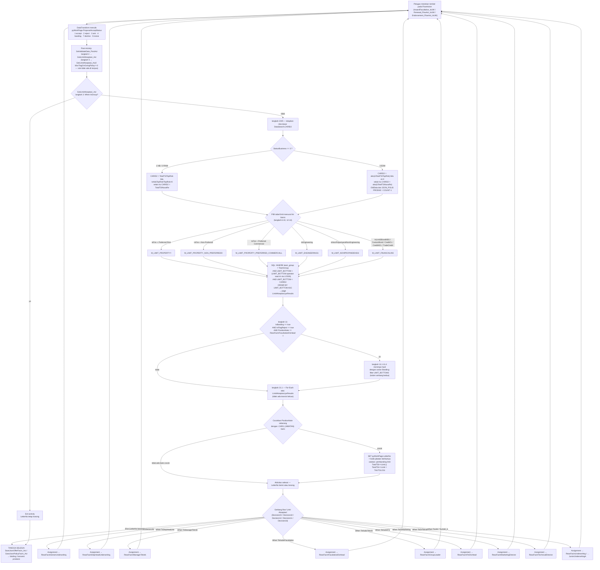
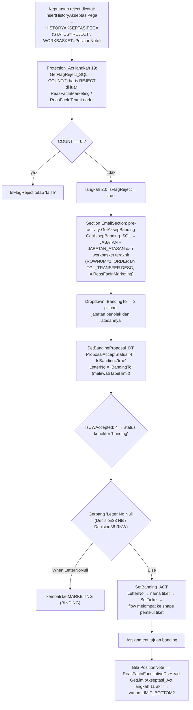

# Mesin Tangga Persetujuan (Akseptasi) — Facultative Inward

> Sumber: korpus ekspor rule Pega di `D:\migrasi\RNM\NB FacIn\`, `D:\migrasi\RNM\RNW Fac In\`,
> `D:\migrasi\RNM\Endorsment Fac In\`. Semua path di dokumen ini relatif terhadap salah satu dari
> ketiga akar itu; akar disebut eksplisit bila relevan.
>
> Label bukti: **[terverifikasi]** = didukung kutipan tag/SQL langsung · **[dugaan]** = dari pola/nama
> · **[pertanyaan terbuka]** = tidak terjawab dari korpus.
>
> Nama orang tidak pernah disalin. Guard berbasis identitas dicatat sebagai jumlah + mekanisme saja.

---

## 0. Ringkasan mekanisme

Tangga persetujuan **bukan** loop yang berjalan sampai selesai dalam satu aktivitas. Ia adalah
**satu langkah per keputusan manusia**:

1. Petugas menekan tombol pada FlowAction → sebuah DataTransform menulis `.ProposalAcceptStatus`.
2. Post-activity FlowAction memanggil **`GetLimitAkseptasi_Act`** (atau variannya). Aktivitas itu
   menjalankan SQL ke tabel limit, lalu menulis **satu** properti kunci: `pyWorkPage.LetterNo`
   (= jabatan tujuan berikutnya).
3. DecisionTable **`IsUWAccepted`** memetakan `.ProposalAcceptStatus` → status konektor flow
   (`confirm` / `reject` / `ask` / `banding` / `revise` / `decline`).
4. Pada cabang `confirm`, flow tiba di gerbang berlabel *"Limit Akseptasi"*. Gerbang itu membaca
   `pyWorkPage.LetterNo` lewat rule `When` bernama `To*` dan mengarahkan case ke Assignment
   (workbasket) yang sesuai.
5. Bila `LetterNo` tidak cocok dengan satu pun `To*`, cabang **`Else`** gerbang diambil — dan cabang
   itulah **akhir tangga**, bukan galat.

Jalur kedua ada untuk banding dan untuk "kembali ke inbox": `SetBanding_ACT` / `SetToInbox_ACT`
memetakan `LetterNo` / `PositionNote` → **nama tiket Pega**, lalu `SetTicket` melompatkan flow ke
shape yang memikul tiket itu.

---

## 1. Query SQL tabel limit

### 1.1 Inventaris berkas

Di `RDBList\` masing-masing korpus terdapat **18 berkas `GetLimit*_SQL.xml`** ditambah
`GetAksepBanding_SQL.xml` (jalur banding) dan `InsertHistoryAkseptasiPega_Sql.xml` (tulis riwayat).

```powershell
# jumlah berkas query limit
(Get-ChildItem "D:\migrasi\RNM\NB FacIn\RDBList" -File -Filter "GetLimit*_SQL.xml").Count
# => 18
```

**[terverifikasi]** Ketiga korpus memuat 18 berkas dengan nama yang identik (perbandingan nama
berkas pada `RDBList\` NB / RNW / EDM).

### 1.2 Tabel limit berbeda: **7**

```powershell
$t=@()
foreach($f in Get-ChildItem "D:\migrasi\RNM\NB FacIn\RDBList" -File -Filter "GetLimit*_SQL.xml"){
  $c=Get-Content $f.FullName -Raw
  $t += ([regex]::Matches($c,'FROM\s+(?:POOLDATA\.)?(M_LIMIT_[A-Z_]+)') | ForEach-Object { $_.Groups[1].Value })
}
$t | Group-Object | Sort-Object Name | Format-Table Name,Count -AutoSize
($t | Sort-Object -Unique).Count   # => 7
```

| Tabel limit | Lini bisnis | Rujukan (jumlah query) |
| --- | --- | --- |
| `M_LIMIT_PROPERTYY` | Property / Fire "Preferred Risk" | 6 |
| `M_LIMIT_PROPERTY_NON_PREFERREDD` | Property "Non-Preferred Risk" | 6 |
| `M_LIMIT_PROPERTY_PREFERRED_COMMERCIALL` | Property "Preferred Risk Commercial" | 4 |
| `M_LIMIT_ENGINEERINGG` | Engineering | 6 |
| `M_LIMIT_NONPROPANDENGG` | Non-Property & Non-Engineering | 6 |
| `M_LIMIT_FINANCIALINS` | Bond / KBG / Kredit CL / Kredit NCL | 3 |
| `M_LIMIT_LIFE` | Life | 1 |

**[terverifikasi]** dari klausa `FROM` yang dikutip di §1.3.
**[dugaan]** Pemetaan "lini bisnis" berasal dari `pyStepsDescription` langkah pemanggil di
`Activity\GetLimitAkseptasi_Act.xml` (lihat §2) — bukan dari metadata tabel.

Skema: sebagian query memakai prefiks `POOLDATA.`, sebagian tidak, untuk tabel yang sama.
Contoh: `GetLimitAccEngineeringJUWA_SQL.xml` → `POOLDATA.M_LIMIT_ENGINEERINGG`;
`GetLimitAccEngineeringUW_SQL.xml` → `M_LIMIT_ENGINEERINGG`. **[terverifikasi]**

### 1.3 Tiga varian per lini bisnis

Untuk lini Property/Engineering/NonFire ada **tiga bentuk query** yang berbeda hanya pada *cara
menentukan baris pemohon* dan *kolom ambang*:

#### Varian A — "UW": batas bawah diambil dari **LOGIN operator**

`NB FacIn/RDBList/GetLimitAkseptasi_SQL.xml`, tag `<pyBrowseSQL>` **[terverifikasi]**:

```sql
SELECT JABATAN AS CARI1, MAX_LIMIT_IDR AS CARI2, MAX_LIMIT_USD AS CARI3,  BATAS_WAKTU AS CARI4, NAMA AS CARI5
    FROM POOLDATA.M_LIMIT_PROPERTYY
   WHERE     team_group = {pyWorkPage.OfferFacIn.QuotationData.TeamGroup}
         AND LIMIT_BOTTOM > (SELECT LIMIT_BOTTOM
                               FROM POOLDATA.M_LIMIT_PROPERTYY
                              WHERE team_group = {pyWorkPage.OfferFacIn.QuotationData.TeamGroup} AND LOGIN ={OperatorID.pyUserIdentifier})
         AND LIMIT_BOTTOM < {DataSearch.CARID2} ORDER BY LIMIT_BOTTOM ASC
```

Bentuk yang sama, tabel berbeda:
`GetLimitAkseptasiNonPrefer_SQL.xml` (`M_LIMIT_PROPERTY_NON_PREFERREDD`),
`GetLimitAkseptasiPreferedComm_SQL.xml` (`M_LIMIT_PROPERTY_PREFERRED_COMMERCIALL`),
`GetLimitAccEngineeringUW_SQL.xml` (`M_LIMIT_ENGINEERINGG`),
`GetLimitAkseptasiNonFire_SQL.xml` (`POOLDATA.M_LIMIT_NONPROPANDENGG`).

#### Varian B — "JUWA": batas bawah diambil dari **JABATAN** yang dipasok pemanggil

`NB FacIn/RDBList/GetLimitAkseptasiJUWA_SQL.xml` **[terverifikasi]**:

```sql
         AND LIMIT_BOTTOM > (SELECT LIMIT_BOTTOM
                               FROM POOLDATA.M_LIMIT_PROPERTYY
                              WHERE team_group = {…TeamGroup} AND JABATAN ={DataSearch.CARI5})
         AND LIMIT_BOTTOM < {DataSearch.CARID2} ORDER BY LIMIT_BOTTOM ASC
```

Sama untuk `GetLimitAkseptasiNonPreferJUWA_SQL.xml`,
`GetLimitAkseptasiPreferedCommJUWA_SQL.xml`, `GetLimitAccEngineeringJUWA_SQL.xml`,
`GetLimitAkseptasiNonFireJUWA_SQL.xml`.

`DataSearch.CARI5` diisi dari `pyWorkPage.PositionNote` di
`Activity\GetLimitAkseptasi_JUW_UW.xml` langkah 4–7 (lihat §2.3).

#### Varian C — "Banding": memakai **kolom ambang kedua `LIMIT_BOTTOM2`**

`NB FacIn/RDBList/GetLimitAkseptasiBanding_SQL.xml` **[terverifikasi]**:

```sql
SELECT JABATAN AS CARI1, MAX_LIMIT_IDR AS CARI2, MAX_LIMIT_USD AS CARI3,  BATAS_WAKTU AS CARI4, NAMA AS CARI5
    FROM POOLDATA.M_LIMIT_PROPERTYY
   WHERE     team_group = {pyWorkPage.OfferFacIn.QuotationData.TeamGroup}
         AND LIMIT_BOTTOM2 > (SELECT LIMIT_BOTTOM2
                               FROM POOLDATA.M_LIMIT_PROPERTYY
                              WHERE team_group = {…TeamGroup} AND LOGIN ={OperatorID.pyUserIdentifier})
         AND LIMIT_BOTTOM2 < {DataSearch.CARID2} ORDER BY LIMIT_BOTTOM ASC
```

Sama untuk `GetLimitAkseptasiNonPreferBanding_SQL.xml`,
`GetLimitAccEngineeringBanding_SQL.xml`, `GetLimitAkseptasiNonFireBanding_SQL.xml`.

> **Anomali [terverifikasi]:** filter memakai `LIMIT_BOTTOM2`, tetapi `ORDER BY` tetap
> `LIMIT_BOTTOM`. Bila kedua kolom tidak monoton searah, urutan hasil tidak sesuai dengan filter.
> Ini **kandidat perbaikan**, bukan sesuatu yang boleh "dibetulkan" diam-diam saat migrasi.

#### Lini finansial & Life — bentuk berbeda (tanpa `team_group`, tanpa sub-query)

`GetLimitAkseptasiBond_SQL.xml` **[terverifikasi]**:

```sql
SELECT JABATAN AS CARI1, LIMITBOND_BOTTOM CARI2, NAMA AS CARI5
FROM M_LIMIT_FINANCIALINS
WHERE LIMITBOND_BOTTOM <= {DataSearch.CARID2}
```

`GetLimitAkseptasiKreditCL_SQL.xml` → kolom `LIMITCREDITCL_BOTTOM`;
`GetLimitAkseptasiKreditNCL_SQL.xml` → kolom `LIMITCREDITNCL_BOTTOM`;
`GetLimitAkseptasiLife_SQL.xml`:

```sql
SELECT JABATAN AS CARI1, NAMA AS CARI5
FROM M_LIMIT_LIFE
WHERE  LIMIT_BOTTOM <= {DataSearch.CARID2} ORDER BY ID ASC
```

Perhatikan: keluarga Property/Engineering memakai `<` (strict) dan menyaring keluar jabatan pemohon;
keluarga Financial/Life memakai `<=` dan **tidak** menyaring pemohon maupun `team_group`.
**[terverifikasi]**

### 1.4 Alias kolom hasil

| Alias | Kolom asal | Dipakai sebagai |
| --- | --- | --- |
| `CARI1` | `JABATAN` | nama jabatan calon approver → dicocokkan di aktivitas |
| `CARI2` | `MAX_LIMIT_IDR` (atau `LIMIT*_BOTTOM` di Financial) | `Local.Limit` |
| `CARI3` | `MAX_LIMIT_USD` | belum terverifikasi dipakai |
| `CARI4` | `BATAS_WAKTU` | belum terverifikasi dipakai |
| `CARI5` | `NAMA` | disisipkan ke teks status (`NBStatus`) |

**[terverifikasi]** dari klausa `SELECT … AS CARIn` di atas dan dari langkah
`SET Local.Limit = .CARI2` (`GetLimitAkseptasi_Act` langkah 21.1.1).

---

## 2. Aktivitas pemanggil — langkah demi langkah

### 2.1 Peta pemanggil

```powershell
foreach ($r in @("NB FacIn","RNW Fac In","Endorsment Fac In")) {
  foreach ($f in Get-ChildItem "D:\migrasi\RNM\$r\Activity" -File) {
    $c = Get-Content $f.FullName -Raw
    $m = [regex]::Matches($c,'<RequestType>(GetLimit[^<]*|GetAksepBanding[^<]*)</RequestType>')
    if ($m.Count) { "$r/$($f.Name) : " + (($m|%{$_.Groups[1].Value}) -join ", ") }
  }
}
```

Hasil **[terverifikasi]**:

| Aktivitas | Ada di | Varian SQL yang dipanggil |
| --- | --- | --- |
| `GetLimitAkseptasi_Act` | NB, RNW, EDM | UW + Banding + Financial (14 pemanggilan) |
| `GetLimitAkseptasi_ActFlow` | **hanya NB** | sama persis dengan `_Act` (14 pemanggilan) |
| `GetLimitAkseptasi_JUW_UW` | NB, RNW, EDM | JUWA (5 pemanggilan) |
| `GetLimitAkseptasiLife_Act` | **hanya NB** | `GetLimitAkseptasiLife_SQL` |
| `GetAksepBanding` | NB, RNW, EDM | `GetAksepBanding_SQL` |

`GetLimitAkseptasi_Act` **identik byte-per-langkah** di ketiga korpus:

```powershell
# dump langkah ke teks lalu bandingkan
Compare-Object (Get-Content A_Act_NB.txt) (Get-Content A_Act_RNW.txt)   # => kosong
Compare-Object (Get-Content A_Act_NB.txt) (Get-Content A_Act_EDM.txt)   # => kosong
```

**[terverifikasi]** Mesin tangga adalah **satu mesin bersama** untuk NB, RNW, dan EDM; pembedaan
siklus terjadi *di dalam* aktivitas itu (langkah 5, lihat §4).

### 2.2 `GetLimitAkseptasi_Act` — 24 langkah puncak, 57 langkah total

Sumber: `NB FacIn/Activity/GetLimitAkseptasi_Act.xml`, node `/pagedata/pySteps`.

| Langkah | Metode | Isi (dikutip dari `pyParamArray` / `pyStepsPreCondParams`) |
| --- | --- | --- |
| 1 | `Call CountTotalTSIPremiNusaRe_Act` | menghitung `TotalTSINusaRe` & `TotalTSITopRisk` |
| 2 | `Property-Set` | `pyWorkPage.LetterNo = ""` · `Local.TotalTSI = pyWorkPage.OfferFacIn.TotalTSINusaRe` · `DataSearch.CARID2 = @Math.divide(pyWorkPage.OfferFacIn.TotalTSINusaRe,1,0)` · `Local.TeamGroup = pyWorkPage.OfferFacIn.QuotationData.TeamGroup` |
| 3 | — | `IF[IsGroup] then=6` → **keluar dari aktivitas** (desc: "exit kalau group") |
| 4 | `Property-Set` | `IF[pyWorkPage.IsAdaTopRisk=="true" \|\| pyWorkPage.OfferFacIn.TotalTSITopRisk>0]` → `DataSearch.CARID2 = @Math.divide(…TotalTSITopRisk,1,0)` |
| 5 | `Property-Set` | `IF[…QuotationData.StatusBusiness=="3"]` → nilai dasar = **selisih** (lihat §4) |
| 6 | `RDB-List` | `IF[IsFire]` + `IF[IsPreferredRisk=="Preferred Risk"]` → `GetLimitAkseptasi_SQL` → page `LimitAkseptasi` |
| 7 | `RDB-List` | `IsFire` + `IsPreferredRisk=="Non-Preferred Risk"` → `GetLimitAkseptasiNonPrefer_SQL` |
| 8 | `RDB-List` | `IsFire` + `IsPreferredRisk=="Preferred Risk Commercial"` → `GetLimitAkseptasiPreferedComm_SQL` |
| 9 | `RDB-List` | `IsEngineering` → `GetLimitAccEngineeringUW_SQL` |
| 10 | `RDB-List` | `IsNonPropertyandNonEngineering` → `GetLimitAkseptasiNonFire_SQL` |
| 11 | — | gerbang banding: `IF[pyWorkPage.OfferFacIn.IsBanding=="true" && pyWorkPage.OfferFacIn.IsFlagReject=="true"]` **DAN** `IF[pyWorkPage.PositionNote=="ReasFacInFacultativeDivHead"]` |
| 11.1–11.4 | `RDB-List` | varian **Banding** (`LIMIT_BOTTOM2`) untuk 4 lini — **menimpa** page `LimitAkseptasi` |
| 12 | `RDB-List` | `IsLimitSBondKBG` **atau** `IsLimitCustomBond` → `GetLimitAkseptasiBond_SQL` |
| 13 | `RDB-List` | `IsLimitCreditCL` **atau** `IsLimitTradeCredit` → `GetLimitAkseptasiKreditCL_SQL` |
| 14 | `RDB-List` | `IsLimitCreditNCL` → `GetLimitAkseptasiKreditNCL_SQL` |
| 15 | `RDB-List` | Special Acceptance untuk SUW → `RequestType=GetLimitAkseptasi1SA_Act` — **rule tidak ada di korpus** |
| 16 | `RDB-List` | Special Acceptance untuk DepHead UW → `RequestType=GetLimitAkseptasi2SA_Act` — **rule tidak ada di korpus** |
| 17–19 | `Property-Set` + `Property-Remove` | membuang baris hasil tertentu (lihat §2.4) |
| 20 | `Property-Set` | `pyWorkPage.LetterNo = LimitAkseptasi.pxResults(1).CARI1` |
| 21 | — (blok) | blok utama tangga: iterasi atas hasil query |
| 21.1 | loop | `pyStepsObjectName = LimitAkseptasi.pxResults`, `pyStepsRepeatDefHasRepeat = EMBEDDED` (For-Each embedded page) |
| 21.1.1 | `Property-Set` | `Local.Limit = .CARI2` |
| 21.1.2–21.1.9 | `Property-Set` | delapan aturan transisi posisi (tabel §3.2) |
| 22 | — (blok) | blok paralel untuk **Special Acceptance + IsFire** (8 aturan transisi) |
| 23 | — (blok) | blok untuk **Bond / KBG / Kredit / Trade** (`Data.LetterNo = pyWorkPage.LetterNo`) |
| 23.2.1 | `Property-Set` | `Local.Limit = .CARID2` |
| 23.2.2–23.2.4 | `Property-Set` | tiga aturan transisi lini finansial |
| 24 | `Property-Set` | `Data.LetterNo = pyWorkPage.LetterNo` |

Perintah audit jumlah langkah:

```powershell
[xml]$x = Get-Content "D:\migrasi\RNM\NB FacIn\Activity\GetLimitAkseptasi_Act.xml" -Raw
$x.SelectSingleNode("/pagedata/pySteps").SelectNodes("rowdata").Count        # => 24 (langkah puncak)
$x.SelectNodes("//pyStepsDescription").Count                                  # => 57 (semua langkah)
```

#### Arti kode pre-condition numerik

`pyStepsPreCondParamsWhenTrue` / `…WhenFalse` berisi angka. Pemetaan berikut **[dugaan kuat]**,
disimpulkan dari deskripsi langkah yang eksplisit:

| Kode | Arti | Bukti |
| --- | --- | --- |
| `2` | Continue whens (lanjut ke kondisi berikutnya) | langkah 6: `IF[IsFire] then=2 else=3` — bila Fire, lanjut mengevaluasi `IsPreferredRisk` |
| `3` | Skip this step | langkah 6 cabang `else` |
| `5` | Jalankan langkah ini (hubung-singkat OR) | langkah 12: `IF[IsLimitSBondKBG] then=5 else=2`, lalu `IF[IsLimitCustomBond] then=2 else=3` ⇒ langkah jalan bila A **atau** B |
| `6` | Exit activity | langkah 3, `pyStepsDescription = "exit kalau group"` |

Satu langkah memiliki `<pyStepsPreCondition>false</pyStepsPreCondition>` (langkah 18).
**[pertanyaan terbuka]** apakah itu menonaktifkan langkah atau hanya menonaktifkan evaluasi
pre-condition-nya.

### 2.3 `GetLimitAkseptasi_JUW_UW` — varian untuk tingkat bawah

Sumber: `NB FacIn/Activity/GetLimitAkseptasi_JUW_UW.xml`. 19 langkah puncak. **[terverifikasi]**

| Langkah | Isi |
| --- | --- |
| 1 | `Call CountTotalTSIPremiNusaRe_Act` |
| 2 | `pyWorkPage.LetterNo=""` · `Local.TotalTSI=@Math.divide(…TotalTSINusaRe,1,0)` · `DataSearch.CARID2` sama · `Local.LimitSASUW = 25000000000.00` · `Local.LimitSAKadiv = 50000000000.00` · `Local.CekReject = 0` |
| 4 | `IF[PositionNote=="ReasFacInJuniorUnderwriting"]` → `DataSearch.CARI5 = "JUW_B"` |
| 5 | `IF[PositionNote=="ReasFacInJuniorUnderwritingA"]` → `DataSearch.CARI5 = "JUW_A"` |
| 6 | `IF[PositionNote=="ReasFacInUnderwriting"]` → `DataSearch.CARI5 = "UNDERWRITER"` |
| 7 | `IF[PositionNote=="ReasFacInTeamLeader"]` → `DataSearch.CARI5 = "LEADER"` |
| 8 | `IF[IsGroup] then=6` → exit |
| 9 | Top-risk override (sama dengan `_Act` langkah 4) |
| 10 | `StatusBusiness=="3"` → nilai dasar = selisih (sama dengan `_Act` langkah 5) |
| 11–15 | `RDB-List` varian **JUWA** untuk 5 lini |
| 16 | `pyWorkPage.LetterNo = LimitAkseptasi.pxResults(1).CARI1` ← **baris pertama** hasil |
| 17 | `IF[StatusBusiness=="3" && PositionNote=="ReasFacInJuniorUnderwriting" \|\| StatusBusiness=="3" && PositionNote=="ReasFacOutAdmin"]` **dan** `IF[Local.TotalTSI==0]` |
| 17.1 | `IF[IsT1T4]` → `LetterNo = "JUW_A"` |
| 17.2 | `IF[IsT2T3]` → `LetterNo = "UNDERWRITER"` |
| 18 | `IF[@LengthOfPageList(LimitAkseptasi.pxResults)>1]` → `Data.LetterNo = pyWorkPage.LetterNo` |
| 19 | `IF[pyWorkPage.IsB2B == "ASM" && …IsSpecialAcceptance == "true"]` → `LetterNo = LetterNo` (tanpa efek) |

> `Local.LimitSASUW` dan `Local.LimitSAKadiv` **ditulis tetapi tidak dibaca** di aktivitas ini
> maupun di `GetLimitAkseptasi_ActFlow` (pencarian `LimitSASUW` hanya menemukan deklarasi parameter
> dan satu `Property-Set` per berkas). **[terverifikasi]** — kandidat dead code.
>
> Langkah 17 **[terverifikasi]**: khusus endorsement dengan selisih TSI **nol**, tujuan dipaksa ke
> JUW_A (tim 1/4) atau UNDERWRITER (tim 2/3), melewati tabel limit sama sekali.

### 2.4 Langkah 17–19: pembuangan baris berbasis data bisnis

| Langkah | Pre-condition | Aksi |
| --- | --- | --- |
| 17 → 17.1 | `OldPolicyNo` sama dengan salah satu dari **4 nomor polis yang dituliskan literal** | `Property-Remove` baris dengan `.CARI1=="DIREKTUR TEKNIK"` |
| 18 → 18.1 | (pre-condition langkah 18 = `false`) + 4 nomor polis literal yang sama | `Property-Remove` baris `.CARI1=="KADIVFACULTATIVE"` bila **bukan** banding-ditolak |
| 18 → 18.2 | idem | `Property-Remove` baris `.CARI1=="MANAGERTEKNIK"` |
| 19 → 19.1 | `StatusBusiness=="3"` **dan** `QuotationData.Type=="12"` | `Property-Remove` baris `.CARI1=="DIREKTURTEKNIK"` |

**[terverifikasi]** Empat nomor polis produksi tertanam sebagai literal di rule. Deskripsi langkah
17 bahkan menyebut satu nomor case (`pyWorkPage.pyID=="NB-118357"`).

> **Anomali ejaan [dugaan]:** langkah 17.1 membandingkan `"DIREKTUR TEKNIK"` (berspasi), sedangkan
> 18.1/18.2/19.1 membandingkan `"KADIVFACULTATIVE"`, `"MANAGERTEKNIK"`, `"DIREKTURTEKNIK"`
> (tanpa spasi). Nilai `JABATAN` yang dipakai tangga di §3.2 semuanya **berspasi**. Bila isi kolom
> `JABATAN` memang berspasi, tiga `Property-Remove` yang tanpa spasi tidak pernah cocok.
> Isi tabel `M_LIMIT_*` tidak ada di korpus → **[pertanyaan terbuka]**.

---

## 3. Bagaimana approver berikutnya ditentukan — dan bagaimana tangga berhenti

### 3.1 Dua cara berbeda memilih baris hasil

| Aktivitas | Cara memilih | Bukti |
| --- | --- | --- |
| `GetLimitAkseptasi_JUW_UW` | **baris pertama** hasil (`ORDER BY LIMIT_BOTTOM ASC`) | langkah 16: `SET pyWorkPage.LetterNo = LimitAkseptasi.pxResults(1).CARI1` |
| `GetLimitAkseptasi_Act` | **iterasi seluruh baris**, mencocokkan `PositionNote` sekarang dengan `.CARI1` baris | langkah 21.1 (`For-Each` atas `LimitAkseptasi.pxResults`) + 21.1.2…21.1.9 |

Langkah 20 `GetLimitAkseptasi_Act` juga menulis `LetterNo = LimitAkseptasi.pxResults(1).CARI1`,
tetapi langkah 21.1 diawali `SET pyWorkPage.LetterNo = ""` sehingga nilai itu dibuang lagi.
**[terverifikasi]**

> **Anomali penting [terverifikasi]:** loop 21.1 **tidak memiliki transisi keluar**.
> ```powershell
> [xml]$x = Get-Content "…\GetLimitAkseptasi_Act.xml" -Raw
> ($x.SelectNodes("//pyStepsTransition") | ? { $_.InnerText -ne '' }).Count   # => 0
> ```
> Akibatnya, bila lebih dari satu baris hasil memenuhi aturan transisi untuk `PositionNote` yang
> sedang berlaku, `LetterNo` ditimpa berulang dan **baris terakhir yang cocok** (LIMIT_BOTTOM
> terbesar) yang menang — bukan baris pertama. Apakah ini disengaja: **[pertanyaan terbuka]**.

### 3.2 Aturan transisi (blok 21.1 — jalur non-Special-Acceptance)

Setiap sub-langkah memikul pre-condition berlapis. Bentuk umumnya:

```
IF[pyWorkPage.PositionNote == <posisi sekarang>]
IF[pyWorkPage.OfferFacIn.IsOccupException=="1" && pyWorkPage.OfferFacIn.IsSpecialAcceptance!="true"]   (di sebagian langkah)
IF[pyWorkPage.IsB2B=="ASM"] then=3  ← lewati langkah bila B2B ASM
IF[Local.TotalTSI>=@toDecimal(Local.Limit) || Local.TotalTSI<=@toDecimal(Local.Limit)]
IF[.CARI1 == <JABATAN baris>]
→ SET pyWorkPage.LetterNo = <kode tujuan>
→ SET pyWorkPage.NBStatus = …
```

| Sub-langkah | `PositionNote` sekarang | `JABATAN` (`.CARI1`) baris | `LetterNo` hasil | Syarat tambahan |
| --- | --- | --- | --- | --- |
| 21.1.2 | `ReasFacInUnderwriting` | `SENIOR UNDERWRITER` | `SENIORUW` | `IsSpecialAcceptance=="true"` → langkah dilewati |
| 21.1.3 | `ReasFacInUnderwriting` atau `ReasFacInSeniorUnderwriting` | `DEP.HEAD UNDERWRITER` | `DEPHEADUNDERWRITER` | bukan B2B ASM |
| 21.1.4 | `ReasFacInSeniorUnderwriting` atau `ReasFacInDepHeadUnderwriting` | `MANAGER TEKNIK` | `MANAGERTEKNIK` | bukan B2B ASM |
| 21.1.5 | `ReasFacInManagerTeknik` | `KADIV FACULTATIVE` | `KADIVFACULTATIVE` | bukan B2B ASM |
| 21.1.6 | `ReasFacInSeniorUnderwriting` atau `ReasFacInDepHeadUnderwriting` | `KADIV TEKNIK` | `KADIVTEKNIK` | **hanya bila `IsBanding=="true"`** |
| 21.1.7 | `ReasFacInManagerTeknik` | `KADIV TEKNIK` | `KADIVTEKNIK` | jalur bukan-banding |
| 21.1.8 | `ReasFacInManagerTeknik` | `DIREKTUR MARKETING` | `DIREKTURMARKETING` | bukan B2B ASM |
| 21.1.9 | `ReasFacInMarketingDirector` | `DIREKTUR TEKNIK` | `DIREKTURTEKNIK` | bukan B2B ASM |

Blok 22 (khusus `IsSpecialAcceptance=="true"` **dan** `IsFire` **dan** bukan `IsB2B=="ASM"`) memuat
8 aturan sejenis dengan titik awal yang digeser satu tingkat (UW→DepHead, DepHead→MTek, …), dan
pada 22.1.7 memakai `PositionNote=="ReasFacInGroupLeader"` sebagai sumber `DIREKTUR MARKETING`.

Blok 23.2 (lini Bond/Kredit/Trade) memakai `Local.Limit = .CARID2` dan perbandingan **satu arah**:

| Sub-langkah | `PositionNote` | `.CARI1` | `LetterNo` |
| --- | --- | --- | --- |
| 23.2.2 | `ReasFacInUnderwritingFinancial` | `KADIV KEUANGAN` | `KADIVFINANCIAL` |
| 23.2.3 | `ReasFacInFinDivHead` | `DIREKTUR MARKETING` | `DIREKTURMARKETING` |
| 23.2.4 | `ReasFacInMarketingDirector` | `DIREKTUR TEKNIK` | `DIREKTURTEKNIK` |

dengan `IF[Local.TotalTSI>=@toDecimal(Local.Limit)]` — perbandingan nyata.

> **Temuan besar [terverifikasi]:** pada blok 21.1 dan 22.1 pembandingnya adalah
> `Local.TotalTSI >= @toDecimal(Local.Limit) || Local.TotalTSI <= @toDecimal(Local.Limit)`
> — sebuah **tautologi**. Untuk dua nilai yang dapat dibandingkan, ekspresi ini selalu benar.
> Artinya **nilai `MAX_LIMIT_IDR` tidak benar-benar menggerbangi apa pun di blok itu**; penyaringan
> nyata seluruhnya terjadi di klausa `WHERE` SQL (`LIMIT_BOTTOM > …` dan `LIMIT_BOTTOM < CARID2`)
> ditambah pencocokan nama `JABATAN`.
> Perintah audit:
> ```powershell
> (Select-String -Path "D:\migrasi\RNM\NB FacIn\Activity\GetLimitAkseptasi_Act.xml" `
>   -Pattern 'Local.TotalTSI&gt;=@toDecimal\(Local.Limit\) \|\| Local.TotalTSI&lt;=@toDecimal\(Local.Limit\)').Count
> ```
> Ini **kandidat perbaikan** — keputusan milik bisnis, bukan milik migrasi.

### 3.3 Gerbang flow: `LetterNo` → workbasket

Gerbang berlabel *"Limit Akseptasi"* di setiap flow memakai konektor bertipe `When` dengan
`pyExpression` = nama rule `When`:

`NB FacIn/Flow/InputInwardFacultativeOffer.xml`, shape `Decision23` **[terverifikasi]**:

```
Decision23 --> Assignment1   [When] expr='ToKadivTeknik'        → workbasket ReasFacInGroupLeader
Decision23 --> Assignment11  [When] expr='ToKadivFin'           → ReasFacInFinDivHead
Decision23 --> Assignment17  [When] expr='ToDepHeadUW'          → ReasFacInDepHeadUnderwriting
Decision23 --> Assignment4   [When] expr='ToDirTeknik'          → ReasFacInTechnicalDirector
Decision23 --> Assignment5   [When] expr='ToManagerTeknik'      → ReasFacInManagerTeknik
Decision23 --> Assignment6   [When] expr='ToDirMarketing'       → ReasFacInMarketingDirector
Decision23 --> Assignment8   [When] expr='ToKadivFacultative'   → ReasFacInFacultativeDivHead
Decision23 --> Utility16     [Else]                             → SaveJsonOfferFacIn_Act
```

Isi rule `When` (dari `<pyConditionValue1String>`), **[terverifikasi]**:

| Rule | Kondisi | Catatan |
| --- | --- | --- |
| `ToUW` | `pyWorkPage.LetterNo = "UNDERWRITER"` | |
| `ToSeniorUW` | `pyWorkPage.LetterNo = "SENIORUW"` | |
| `ToDepHeadUW` | `LetterNo = "DEPHEADUNDERWRITER"` **AND** (`IsB2B != "ASM"` **OR** `IsB2B = ""`) | logika `A AND ( B OR C )` |
| `ToManagerTeknik` | `LetterNo = "MANAGERTEKNIK"` | |
| `ToKadivFacultative` | `LetterNo = "KADIVFACULTATIVE"` | |
| `ToKadivTeknik` | `LetterNo = "KADIVTEKNIK"` | |
| `ToKadivFin` | `LetterNo = "KADIVFINANCIAL"` | |
| `ToDirMarketing` | `LetterNo = "DIREKTURMARKETING"` | |
| `ToDirTeknik` | `LetterNo = "DIREKTURTEKNIK"` | |
| `ToJUW_A` | `LetterNo = "JUW_A"` | |
| `ToDeptHeadUWLife` | `LetterNo = "DEPTHEADUWLIFE"` | |
| `ToTREATYDEPTHEAD` | `LetterNo = "TREATYINDEPTHEAD"` | |
| `LetterNoNull` | `LetterNo = ""` | dipakai di gerbang banding |

> **Koreksi terhadap catatan discovery sebelumnya [terverifikasi]:** `IsPKSASM`, `ToUW`, `ToJUW_A`,
> `LetterNoNull`, dan `IsEdmInternalRetro` **tidak kosong** di korpus ini. Kondisinya tersimpan di
> `<pyConditionValue1String>`, bukan di `<pyConditionString>`; ekstraktor yang hanya membaca
> `<pyConditionString>` akan melihatnya kosong.
> ```powershell
> Select-String -Path "D:\migrasi\RNM\NB FacIn\When\IsPKSASM.xml" -Pattern "pyConditionValue1String"
> # => <pyConditionValue1String>pyWorkPage.OfferFacIn.IsB2B = "ASM" </pyConditionValue1String>
> ```
> Audit menyeluruh: **0 dari 210 (NB) / 189 (RNW) / 202 (EDM)** rule `When` yang tidak punya
> `pyConditionValue1String` berisi.

### 3.4 Kapan tangga BERHENTI — hasil query kosong = **SELESAI**, bukan galat

Bukti berlapis, semuanya **[terverifikasi]**:

1. `GetLimitAkseptasi_Act` langkah 2 menetapkan `pyWorkPage.LetterNo = ""` lebih dahulu, dan
   langkah 21.1 menetapkannya ulang ke `""` sebelum loop. Bila query mengembalikan 0 baris, loop
   tidak berjalan, `LetterNo` tetap `""`.
2. Tidak ada satu pun langkah yang menulis pesan galat (`Page-Set-Messages`) di
   `GetLimitAkseptasi_Act` — audit:
   ```powershell
   [xml]$x = Get-Content "D:\migrasi\RNM\NB FacIn\Activity\GetLimitAkseptasi_Act.xml" -Raw
   ($x.SelectNodes("//pyStepsActivityName") | ? { $_.InnerText -match 'Message' }).Count   # => 0
   ```
3. Di flow, gerbang `Decision23` tidak punya cabang galat: `LetterNo = ""` tidak cocok dengan satu
   pun `To*`, sehingga cabang **`[Else]`** diambil → `Utility16` (`SaveJsonOfferFacIn_Act`) →
   `Decision16` ("It is Group?") → `Utility6` (`SendEmailPolicy`) → `Assignment9`
   **MARKETING (BINDING)**, yaitu langkah berikutnya dalam siklus bisnis.
4. Pola yang sama di gerbang `Decision42` (setelah `GetLimitAkseptasi_JUW_UW`):
   `Decision42 --> Decision24 [Else]` → `Decision24` adalah gerbang "FAC OUT?".
5. Di `InputInwardFacultativeRISlip` (siklus polis): `Decision18 --> Utility1 [Else]` →
   `SaveJsonPolicyFacIn_Act` → `SendEmailPolicy` → `serviceInsertArasapas_act` (konversi produksi).

**Kesimpulan:** *hasil query kosong ⇒ tidak ada approver di atas pemegang case yang limitnya masih
di bawah nilai akseptasi ⇒ tangga selesai ⇒ case lanjut ke tahap berikutnya (binding / simpan JSON /
konversi produksi).* Tidak ada penanganan galat sama sekali untuk kasus itu.

---

## 4. Nilai dasar akseptasi (`DataSearch.CARID2`) — beda NB/RNW vs Endorsement

`DataSearch.CARID2` adalah nilai yang dibandingkan dengan kolom `LIMIT_BOTTOM` di SQL.

### 4.1 Rantai penetapan (`GetLimitAkseptasi_Act`, urutan eksekusi)

| Langkah | Kondisi | `DataSearch.CARID2` |
| --- | --- | --- |
| 2 | selalu | `@Math.divide(pyWorkPage.OfferFacIn.TotalTSINusaRe,1,0)` |
| 4 | `pyWorkPage.IsAdaTopRisk=="true" \|\| …TotalTSITopRisk>0` | `@Math.divide(pyWorkPage.OfferFacIn.TotalTSITopRisk,1,0)` |
| 5 | `…QuotationData.StatusBusiness=="3"` | **selisih** (lihat 4.2) |

Karena langkah 4 dan 5 berurutan dan keduanya tanpa transisi, untuk endorsement langkah 5
**menimpa** hasil langkah 4. **[terverifikasi]**

### 4.2 Endorsement memakai SELISIH terhadap before-image

Kutipan langsung `NB FacIn/Activity/GetLimitAkseptasi_Act.xml` langkah **5**
(`pyStepsDescription` = `pyWorkPage.OfferFacIn.QuotationData.StatusBusiness=="3"`),
`pyParamArray` berurutan **[terverifikasi]**:

```
SET Local.TotalTSI    = @Math.divide(pyWorkPage.OfferFacIn.TotalTSINusaRe,1,0)
                        - @Math.divide(pyWorkPage.OfferFacIn.OldData.TotalTSINusaRe,1,0)
SET Local.TotalTSI    = @if(Local.TotalTSI<0, Local.TotalTSI*-1, Local.TotalTSI)
SET Local.DiffTopRisk = @Math.divide(pyWorkPage.OfferFacIn.TotalTSITopRisk,1,0)
                        - @Math.divide(pyWorkPage.OfferFacIn.OldData.TotalTSITopRisk,1,0)
SET Local.DiffTopRisk = @if(Local.DiffTopRisk<0, Local.DiffTopRisk*-1, Local.DiffTopRisk)
SET DataSearch.CARID2 = @if(Local.DiffTopRisk>0, Local.DiffTopRisk, Local.TotalTSI)
SET DataSearch.CARID2 = @if(DataSearch.CARID2<0, DataSearch.CARID2*-1, DataSearch.CARID2)
```

Jadi untuk **`StatusBusiness == "3"`**:
`CARID2 = |ΔTotalTSITopRisk|` bila selisih top-risk > 0, selain itu `CARID2 = |ΔTotalTSINusaRe|`.
Nilai absolut — **kenaikan dan penurunan diperlakukan sama**.

### 4.3 Enumerasi `StatusBusiness`

| Nilai | Arti | Bukti |
| --- | --- | --- |
| `1` | New Business | `Activity/GetDateValidity_ACT.xml` langkah 2, `pyStepsDescription = "DEFAULT NB"`, pre-condition `StatusBusiness==1` **[terverifikasi]** |
| `2` | Renewal | idem langkah 3, `pyStepsDescription = "DEFAULT RENEWAL"`, pre-condition `StatusBusiness==2` **[terverifikasi]** |
| `3` | Endorsement | `Activity/SetBanding_ACT.xml` langkah 4, `pyStepsDescription = "set tiket UNTUK EDM"`, pre-condition `StatusBusiness=="3"` **[terverifikasi]** |

```powershell
foreach ($r in @("NB FacIn","RNW Fac In","Endorsment Fac In")) {
  $all=@(); foreach($f in Get-ChildItem "D:\migrasi\RNM\$r" -Recurse -File -Filter *.xml){
    $all += ([regex]::Matches((Get-Content $f.FullName -Raw),'StatusBusiness[^0-9A-Za-z<>]{0,12}([0-9])')|%{$_.Groups[1].Value}) }
  "$r"; $all | Group-Object | Sort-Object Name | Format-Table Name,Count -AutoSize
}
# NB: 1=11, 2=13, 3=223 | RNW: 1=11, 2=13, 3=221 | EDM: 1=11, 2=13, 3=232
```

### 4.4 Dari mana `OldData` berasal

`Endorsment Fac In/Activity/SetValueToEDMWork.xml` (class `ASM-SFAGIS-Work-Endorsement`):

- Langkah **14.1** `RDB-List` → `RequestType = GetEDMOldData_SQL`, `BrowsePage = OldData`.
- Langkah **14.2** `Java`: memuat `HASIL1` ke `newWorkPage.OfferFacIn.OldData` melalui
  `tempPage2.adoptJSONObject(IsiDataJson)`.

`Endorsment Fac In/RDBList/GetEDMOldData_SQL.xml` **[terverifikasi]**:

```sql
SELECT a.DATA_JSON AS HASIL1 FROM JSON_POLIS a
 WHERE NOPOLIS={newWorkPage.OfferFacIn.QuotationData.OldPolicyNo}
   and PRODKE=(SELECT COUNT(NOPOLIS)-1 FROM JSON_POLIS a WHERE NOPOLIS={…OldPolicyNo})
```

Jadi **before-image = dokumen JSON polis versi terakhir** (`PRODKE = COUNT-1`, berbasis 0).
Riwayat endorsement adalah baris bertambah di `JSON_POLIS`, bukan update in-place. **[terverifikasi]**

### 4.5 Dari mana `TotalTSINusaRe` berasal

`NB FacIn/Activity/CountTotalTSIPremiNusaRe_Act.xml` langkah **14**
(`pyStepsDescription = "-- Set Share RNM * kurs dan top risk"`) **[terverifikasi]**:

```
SET pyWorkPage.OfferFacIn.TotalTSINusaRe  = @Math.divide((@toDecimal(Local.pct)*Local.totaltsi*Local.TabaruFund),10000,20)
SET pyWorkPage.OfferFacIn.TotalTSITopRisk = @Math.divide((@toDecimal(Local.pct)*Local.RNMShare),100,20)
```

dengan `Local.pct = pyWorkPage.OfferFacIn.PercentShare`, `Local.TabaruFund = 100` secara default dan
diganti `DataSyariah.pxResults(1).PERCENTTABARUFUND` bila `StatusSyariah==1` (langkah 3), dan
`Local.totaltsi` diakumulasi per mata uang setelah dikali kurs (`CARI20`) di langkah 13.1–13.2.
Pembulatan: 20 angka di belakang koma.

### 4.6 Uang — temuan yang mengikat implementasi

| Temuan | Bukti | Label |
| --- | --- | --- |
| Ambang 30 miliar dibandingkan sebagai **string**, tanpa konversi | `NB FacIn/Activity/SetDataScoringRisk_act.xml` langkah 3.1.7/3.1.8: `IF[local.TSIinIDR<="30000000000"]` dan `IF[local.TSIinIDR>"30000000000"]` | **[terverifikasi]** |
| Ambang yang sama dibandingkan sebagai string di matriks scoring | `NB FacIn/Activity/ScoringResult.xml`: `TotalRNMShare.CARI1 > "30000000000"` | **[terverifikasi]** |
| Ambang yang sama dibandingkan setelah `@toDecimal` di tempat lain | `CountTotalTSIPremiNusaRe_Act` langkah 15: `TotalTSITopRisk>@toDecimal("30000000000")`; `ProtectFIREMBUPA_Act`; `CheckSpreadingProtect_ACT` | **[terverifikasi]** |
| Ambang 50 miliar | `CheckSpreadingProtect_ACT`: `RNMShareTopLoc>@toDecimal("50000000000")` | **[terverifikasi]** |

```powershell
foreach($r in @("NB FacIn","RNW Fac In","Endorsment Fac In")){
  $withTo = (Select-String -Path "D:\migrasi\RNM\$r\Activity\*.xml" -Pattern 'toDecimal\("30000000000"\)').Count
  $asStr  = (Select-String -Path "D:\migrasi\RNM\$r\Activity\*.xml" -Pattern '(&gt;|&lt;)=?\s*"30000000000"').Count
  "$r : toDecimal = $withTo ; perbandingan-string = $asStr"
}
# NB FacIn : toDecimal = 9 ; perbandingan-string = 14
# RNW Fac In : toDecimal = 9 ; perbandingan-string = 14
# Endorsment Fac In : toDecimal = 9 ; perbandingan-string = 14
```

**Konsekuensi migrasi:** perbandingan string `"7000000000" > "30000000000"` bernilai TRUE secara
leksikografis (karena `'7' > '3'`) padahal 7 miliar < 30 miliar. Implementasi Go harus memutuskan
secara eksplisit — dan bisnis harus menjawab — apakah perilaku leksikografis itu direplikasi atau
diperbaiki. Jangan diam-diam diperbaiki.

---

## 5. Jalur BANDING (naik banding setelah ditolak)

Korpus memuat **dua mekanisme banding yang berdiri sendiri**.

### 5.1 Mekanisme 1 — kolom ambang kedua `LIMIT_BOTTOM2`

`GetLimitAkseptasi_Act` langkah **11** memikul dua pre-condition **[terverifikasi]**:

```
IF[pyWorkPage.OfferFacIn.IsBanding=="true" && pyWorkPage.OfferFacIn.IsFlagReject=="true"]
IF[pyWorkPage.PositionNote=="ReasFacInFacultativeDivHead"]
```

Bila keduanya benar, sub-langkah 11.1–11.4 menjalankan **varian Banding** yang memfilter dengan
`LIMIT_BOTTOM2` alih-alih `LIMIT_BOTTOM`, dan **menimpa** page `LimitAkseptasi` yang sudah diisi
langkah 6–10. Deskripsi langkah 11: *"UNTUK AMBIL LIMIT KADIV FACULTATIVE KALO BANDING"*.

`IsFlagReject` diisi dari riwayat — lihat §7.

### 5.2 Mekanisme 2 — atasan penolak (`JABATAN_ATASAN`)

`NB FacIn/RDBList/GetAksepBanding_SQL.xml`, `<pyBrowseSQL>` **[terverifikasi]**:

```sql
select JABATAN AS CARI1, JABATAN_ATASAN AS CARI2 from POOLDATA.M_LIMIT_PROPERTYY
 WHERE WORKBASKET IN (SELECT WORKBASKET
   FROM ( SELECT WORKBASKET
            FROM HISTORYAKSEPTASIPEGA
           WHERE ID_PEGA ={pyWorkPage.pzInsKey}
             AND WORKBASKET !='ReasFacInMarketing'
           ORDER BY TGL_TRANSFER DESC )
  WHERE ROWNUM = 1)
 AND TEAM_GROUP = {pyWorkPage.OfferFacIn.QuotationData.TeamGroup}
```

`NB FacIn/Activity/GetAksepBanding.xml` **[terverifikasi]**:

| Langkah | Isi |
| --- | --- |
| 3 | `IF[.EmailType==4 \|\| .EmailTypeBinding==4 \|\| .EmailTypeUWPolicy==4] then=2 else=6` → keluar bila bukan banding |
| 4 | `RDB-List` → `GetAksepBanding_SQL`, page `AksepBanding` |
| 5 | `IF[@LengthOfPageList(AksepBanding.pxResults)>0]` → `ListBanding.pxResults(<APPEND>).CARI1 = AksepBanding.pxResults(1).CARI1` dan baris kedua `= AksepBanding.pxResults(1).CARI2` |

Artinya: daftar tujuan banding = **{jabatan workbasket terakhir yang memegang case (bukan Marketing),
atasan jabatan itu}** — tepat dua pilihan.

`ListBanding.pxResults` dipakai sebagai sumber `pxDropdown` untuk properti `.BandingTo` di
`NB FacIn/Section/EmailSection.xml` (`<pySourceName>ListBanding.pxResults</pySourceName>`,
`<pyValue>.CARI1</pyValue>`, `<pyFormat>pxDropdown</pyFormat>`) dan di `EmailSectionCeding.xml`.
Pre-activity section: `<pyActivity>GetAksepBanding</pyActivity>`. **[terverifikasi]**

### 5.3 Apa yang terjadi saat banding dipilih

`NB FacIn/DataTransform/SetBandingProposal_DT.xml` **[terverifikasi]**:

```
SET .ProposalAcceptStatus = 4
SET .OfferFacIn.IsBanding = "true"
SET .LetterNo             = .BandingTo
SET FlagBanding.CARI11    = .BandingTo
```

`LetterNo` **langsung diisi dari pilihan pengguna**, melewati tabel limit sepenuhnya.

Lalu `IsUWAccepted` memetakan `4 → banding`, dan di flow:

```
Decision13 --> Decision33  [Status] expr='banding'                 (NB Offer, dari MARKETING BINDING)
Decision33 --> Assignment9 [When]   expr='LetterNoNull'            → kembali ke MARKETING (BINDING)
Decision33 --> Utility10   [Else]                                  → SetBanding_ACT
```

`NB FacIn/Activity/SetBanding_ACT.xml` **[terverifikasi]**:

| Langkah | Isi |
| --- | --- |
| 1 | `IF[pyWorkPage.ProposalAcceptStatus=="4"] then=2 else=6` → keluar bila bukan banding |
| 2 | `Local.TicketNext = ""` |
| 3 (+3.1…3.11) | dijalankan bila `StatusBusiness != "3"` — peta `LetterNo` → tiket `*Offer` |
| 4 (+4.1…4.11) | dijalankan bila `StatusBusiness == "3"` — peta `LetterNo` → tiket `*Policy` |
| 5 | `Call Setticket` bila `Local.TicketNext != ""` |

Peta `LetterNo` → (tiket, `PositionNote`), jalur "Offer":

| `LetterNo` | tiket | `PositionNote` | `FlagOnGoingPolicy` / `IsCedingConfirm` |
| --- | --- | --- | --- |
| `JUW_A` | `JUW_AOffer` | `ReasFacInJuniorUnderwritingA` | `0` / `Offer` |
| `JUW_B` | `JUW_BOffer` | `ReasFacInJuniorUnderwriting` | `0` / `Offer` |
| `UNDERWRITER` | `UWOffer` | `ReasFacInUnderwriting` | `0` / `Offer` |
| `SENIORUW` | `SUWOffer` | `ReasFacInSeniorUnderwriting` | `0` / `Offer` |
| `DEPHEADUNDERWRITER` | `DepHeadUWOffer` | `ReasFacInDepHeadUnderwriting` | `0` / `Offer` |
| (via `PositionNote`) | `SUWPolicyFinancial` | `ReasFacInUnderwritingFinancial` | — |
| `MANAGERTEKNIK` | `DivHeadUWOffer` | `ReasFacInManagerTeknik` | — |
| `KADIVFACULTATIVE` | `DivHeadFacOffer` | `ReasFacInFacultativeDivHead` | `0` / `Offer` |
| `KADIVTEKNIK` | `DivHeadOffer` | `ReasFacInGroupLeader` | `0` / `Offer` |
| `DIREKTURMARKETING` | `DirectorOPOffer` | `ReasFacInMarketingDirector` | `0` / `Offer` |
| `DIREKTURTEKNIK` | `DirectorOffer` | `ReasFacInTechnicalDirector` | `0` / `Offer` |

Jalur "Policy" (`StatusBusiness=="3"`) memakai tiket `UWPolicy`, `SUWPolicy`, `DepHeadUWPolicy`,
`DivHeadFacPolicy`, `DivHeadPolicy`, `DirectorOPPolicy`, `DirectorPolicy`, `JUW_APolicy`,
`JUW_BPolicy`, dengan `FlagOnGoingPolicy = "1"` dan `IsCedingConfirm = "Policy"`.
**Kejanggalan [terverifikasi]:** langkah 4.7 (`MANAGERTEKNIK`, jalur Policy) tetap memakai tiket
`DivHeadUWOffer` — bukan `DivHeadUWPolicy` seperti pola sekitarnya.

Tiket dipasang pada shape Assignment lewat `<pyTicketShapes>`. Peta tiket→shape di
`InputInwardFacultativeOffer.xml` **[terverifikasi]**:

| Tiket | Shape | Workbasket |
| --- | --- | --- |
| `AdminOffer` | `Assignment12` | `ReasFacInMarketing` |
| `AdminBinding` | `Assignment9` | `ReasFacInMarketing` |
| `UWOffer` | `Assignment3` | `ReasFacInUnderwriting` |
| `SUWOffer` | `Assignment7` | `ReasFacInSeniorUnderwriting` |
| `DepHeadUWOffer` | `Assignment17` | `ReasFacInDepHeadUnderwriting` |
| `DivHeadUWOffer` | `Assignment5` | `ReasFacInManagerTeknik` |
| `DivHeadFacOffer` | `Assignment8` | `ReasFacInFacultativeDivHead` |
| `DivHeadOffer` | `Assignment1` | `ReasFacInGroupLeader` |
| `DivHeadFinOffer` | `Assignment11` | `ReasFacInFinDivHead` |
| `DirectorOPOffer` | `Assignment6` | `ReasFacInMarketingDirector` |
| `DirectorOffer` | `Assignment4` | `ReasFacInTechnicalDirector` |
| `TLOffer` | `Assignment14` | `ReasFacInTeamLeader` |
| `JUW_AOffer` / `JUW_BOffer` | `Assignment21` / `Assignment13` | `ReasFacInJuniorUnderwritingA` / `ReasFacInJuniorUnderwriting` |
| `UWOfferLife` | `Assignment16` | `ReasFacInUnderwritingLife` |
| `SaveJsonOffer` | `Utility16`, `Utility9` | — |
| `EndOffer` | `End2`, `End3`, `End4`, `End5`, `End6` | — |

> **Anomali [terverifikasi]:** `pyMOId` tiket bertabrakan — `Ticket13` dipakai dua kali
> (`DirectorOPOffer` pada `Assignment6` dan `TLOffer` pada `Assignment14`), begitu pula `Ticket15`
> (`UWOffer` pada `Assignment3` dan `UWOfferLife` pada `Assignment16`).

`SetTicket` (`@baseclass`, `pyActivityType = UTILITY`) memasang tiket lalu **menghapusnya kembali**
(langkah 2 `Obj-Set-Tickets` "set the ticket", langkah 3 `Obj-Set-Tickets` "now remove the ticket",
langkah 4 `Obj-Save`). **[terverifikasi]**

---

## 6. Field state yang menggerakkan alur

Semua nama di bawah dikutip apa adanya dari korpus.

| Properti | Peran | Rule yang menulis | Rule yang membaca |
| --- | --- | --- | --- |
| `pyWorkPage.LetterNo` | **tujuan berikutnya** (kode jabatan) | `GetLimitAkseptasi_Act` 20/21.1.2-9/22.1.x/23.2.x · `GetLimitAkseptasi_JUW_UW` 16/17.x · `GetLimitAkseptasiLife_Act` 4.1/4.2 · `SetBandingProposal_DT` · `SetToInbox_ACT` 3.x/4.x | 13 rule `When` `To*` + `LetterNoNull` · `SetBanding_ACT` 3.x/4.x |
| `pyWorkPage.PositionNote` | **antrean yang sedang memegang case** | konektor flow (`SET pyWorkPage.PositionNote = "ReasFacIn…"`) · `SetBanding_ACT` · `SetToInbox_ACT` · `InsertHistoryAkseptasiPega` (ke kolom `WORKBASKET`) | `GetLimitAkseptasi_Act` (9 nilai dibandingkan) · `GetLimitAkseptasi_JUW_UW` 4–7 · `SetToInbox_ACT` |
| `pyWorkPage.ProposalAcceptStatus` | **hasil keputusan terakhir** | 8 DataTransform (§6.1) | DecisionTable `IsUWAccepted` · `SetBanding_ACT` langkah 1 |
| `pyWorkPage.OfferFacIn.IsBanding` | penanda case sedang banding | `SetBandingProposal_DT` | `GetLimitAkseptasi_Act` 11, 18.1, 21.1.6, 22.1.5 |
| `pyWorkPage.OfferFacIn.IsFlagReject` | pernah ditolak di atas Marketing/TeamLeader | `Protection_Act` 4 (`"false"`) dan 20 (`"true"`) | `GetLimitAkseptasi_Act` 11, 18.1 |
| `pyWorkPage.FlagOnGoingPolicy` | fase siklus: `0`=Offer, `1`=Policy, `2`=Binding | konektor flow · `SetBanding_ACT` · `SetToInbox_ACT` | `SetValidateDate_PostAct` 3.3/3.4/3.5, 4, 5 |
| `pyWorkPage.IsCedingConfirm` | `"Offer"` / `"Binding"` / `"Policy"` / `"Retrocession"` / `"notconfirmed"` | konektor flow · `SetBanding_ACT` | `SetValidateDate_PostAct` 3.2 |
| `pyWorkPage.Position` | kode posisi numerik (paralel `PositionNote`) | konektor flow (`"1"`,`"2"`,`"3"`,`"7"`,`"8"`) | belum terverifikasi ada pembaca |
| `pyWorkPage.NBStatus` / `NBStatusNew` | teks status untuk daftar kerja | konektor flow · `GetLimitAkseptasi_Act` · `SetBanding_ACT` · `SetToInbox_ACT` | UI |
| `pyWorkPage.IsB2B` / `OfferFacIn.IsB2B` | penanda kanal B2B (`"ASM"`) | belum terverifikasi | `IsPKSASM`, `ToDepHeadUW`, `GetLimitAkseptasi_Act` (banyak langkah) |
| `pyWorkPage.OfferFacIn.QuotationData.TeamGroup` | **partisi tangga** (kunci `team_group` di semua SQL limit) | `GetTeamGroup_Act` 5 | semua `GetLimit*_SQL` |
| `pyWorkPage.OfferFacIn.IsSpecialAcceptance` | mengaktifkan blok tangga alternatif | belum terverifikasi | `GetLimitAkseptasi_Act` 15,16,21.1.2,21.1.3,22,… |
| `pyWorkPage.OfferFacIn.IsOccupException` | pengecualian okupasi (`"1"`) | belum terverifikasi | `GetLimitAkseptasi_Act` 21.1.x, 22.1.x |
| `pyWorkPage.StatusService.StsKonversiFacIn` / `StsKonversiFacOut` | hasil konversi produksi | `serviceInsertArasapas*_act` (isi belum terbaca) | `When IsSuccessHitService` |
| `DataSearch.CARID2` | **nilai dasar akseptasi** (parameter SQL) | `GetLimitAkseptasi_Act` 2/4/5 | semua `GetLimit*_SQL` |
| `DataSearch.CARI5` | jabatan pemohon untuk varian JUWA | `GetLimitAkseptasi_JUW_UW` 4–7 | `GetLimit*JUWA_SQL` |

### 6.1 Enumerasi `ProposalAcceptStatus`

| Nilai | Ditulis oleh (DataTransform) | `IsUWAccepted` → status konektor |
| --- | --- | --- |
| `1` | `SetAkseptasiProposal`, `SetAkseptasiProposal_DT` (`.EmailType==1`) | `confirm` |
| `2` | `SetRejectProposal`, `SetAkseptasiProposal_DT` (`.EmailType==2`) | `reject` |
| `3` | `SetAskProposal_DT`, `SetAkseptasiCeding_DT`, `SetAkseptasiProposal_DT` (`.EmailType==3`) | `ask` |
| `4` | `SetBandingProposal_DT`, `SetAkseptasiProposal_DT` (`.EmailType==4 \|\| .EmailTypeBinding==4 \|\| .EmailTypeUWPolicy==4`) | `banding` |
| `7` | `SetDeclineProposal_DT` | `decline` (lewat default) |
| `9` | `SetReviseProposal`, `SetAkseptasiProposal_DT` (`.EmailType==9`) | `revise` |

`NB FacIn/DecisionTable/IsUWAccepted.xml` **[terverifikasi]** — kutipan langsung:

```xml
<pyProperty>.ProposalAcceptStatus</pyProperty>
<pyPropertyLabel>Status Akseptasi Proposal</pyPropertyLabel>
<pyDefaultOperator>=</pyDefaultOperator>
<pyCondition REPEATINGTYPE="PropertyList">
  <rowdata REPEATINGINDEX="1">1</rowdata> <rowdata REPEATINGINDEX="2">2</rowdata>
  <rowdata REPEATINGINDEX="3">3</rowdata> <rowdata REPEATINGINDEX="4">4</rowdata>
  <rowdata REPEATINGINDEX="5">9</rowdata>
</pyCondition>
<pyResults REPEATINGTYPE="PropertyList">
  <rowdata REPEATINGINDEX="1">confirm</rowdata> <rowdata REPEATINGINDEX="2">reject</rowdata>
  <rowdata REPEATINGINDEX="3">ask</rowdata>    <rowdata REPEATINGINDEX="4">banding</rowdata>
  <rowdata REPEATINGINDEX="5">revise</rowdata>
</pyResults>
<pyDefaultResult>decline</pyDefaultResult>
```

Identik di ketiga korpus:

```powershell
foreach ($r in @("NB FacIn","RNW Fac In","Endorsment Fac In")) {
  $c = Get-Content "D:\migrasi\RNM\$r\DecisionTable\IsUWAccepted.xml" -Raw
  "$r : prop=" + ([regex]::Match($c,'<pyProperty>(.*?)</pyProperty>')).Groups[1].Value +
  " default=" + ([regex]::Match($c,'<pyDefaultResult>(.*?)</pyDefaultResult>')).Groups[1].Value
}
# ketiganya: prop=.ProposalAcceptStatus default=decline
```

### 6.2 Daftar workbasket (partisi antrean)

```powershell
Get-ChildItem "D:\migrasi\RNM" -Recurse -File -Filter *.xml |
  Where-Object { $_.Directory.Name -eq 'Flow' } |
  ForEach-Object { [regex]::Matches((Get-Content $_.FullName -Raw),'<Workbasket>([^<]+)</Workbasket>') | % { $_.Groups[1].Value } } |
  Group-Object | Sort-Object Name
```

**27 workbasket unik** di seluruh 12 flow: 18 `ReasFacIn*`, 4 `ReasFacOut*`, 5 `ReasTreatyIn*`.
**[terverifikasi]**

---

## 7. Peran tabel riwayat akseptasi — DIBACA untuk mengambil keputusan

`HISTORYAKSEPTASIPEGA` dirujuk oleh **tiga** rule `RDBList` di setiap korpus:

```powershell
foreach($r in @("NB FacIn","RNW Fac In","Endorsment Fac In")){
  "$r:"; Get-ChildItem "D:\migrasi\RNM\$r\RDBList" -File |
    Where-Object { (Get-Content $_.FullName -Raw) -match 'HISTORYAKSEPTASIPEGA' } | % { "  " + $_.Name }
}
# GetAksepBanding_SQL.xml, GetFlagReject_SQL.xml, InsertHistoryAkseptasiPega_Sql.xml
```

### 7.1 Tulis

`InsertHistoryAkseptasiPega_Sql.xml` **[terverifikasi]**:

```sql
BEGIN
INSERT INTO HISTORYAKSEPTASIPEGA
(ID_PEGA, Tgl_Transfer, Status, Username, Workbasket, ID_KOMITE)
VALUES ( {InsertHistory.CARI1}, sysdate, {InsertHistory.CARI5}, {InsertHistory.CARI4},
         {InsertHistory.CARI2}, {InsertHistory.CARI6} );
COMMIT;
END;
```

Pengisi: `NB FacIn/Activity/InsertHistoryAkseptasiPega.xml` **[terverifikasi]**

| Langkah | Isi |
| --- | --- |
| 1 | `CARI1 = pyWorkPage.pzInsKey` · `CARI2 = pyWorkPage.PositionNote` · `CARI3 = @CurrentDateTime()` · `CARI4 = OperatorID.pyUserName` |
| 2 | `CARI5 = "ACCEPT"` bila `PolicyTreatyIn.IsApproved=="1"` atau salah satu dari 8 properti `EmailType*` bernilai `1` |
| 3 | `CARI5 = "REJECT"` bila `IsApproved=="0"` atau `EmailType*` = `2` |
| 4 | `CARI5 = "ASK"` bila `EmailType*` = `3` |
| 5 | `CARI5 = "REVISE"` bila `EmailTypeBinding==9` |
| 6 | `CARI5 = "DECLINE"` bila `EmailTypeQuotation=="2"` atau `EmailType*` = `7` |
| 7 | `CARI5 = "BANDING"` bila `EmailType==4 \|\| EmailTypeBinding==4` |
| 8 | bila `Param.Status=="InboxAdmin"`: `CARI5="INPUT"`, `CARI2="ReasFacInAdmin"`, `CARI1="ASM-FW-GISFW-WORK "+Param.idpega` |
| 9 | `RDB-List` → `InsertHistoryAkseptasiPega_Sql` |

Perhatikan: `CARI3` (tanggal) dihitung tetapi **tidak dipakai** — SQL memakai `sysdate`.
`CARI6` (`ID_KOMITE`) tidak pernah diisi di aktivitas ini. **[terverifikasi]**

Dipanggil dari 6 aktivitas: `SetValidateDate_PostAct` (langkah 9), `SetValidateDateUW_PostAct`,
`OfferFacOut_PostAct`, `PrintRISlilpPost_Act`, `InputPolicyTreatyInPost_Act`, dan FlowAction
`DeptHeadTreatyIn_UW`. **[terverifikasi]**

### 7.2 Baca #1 — menentukan `IsFlagReject`

`NB FacIn/RDBList/GetFlagReject_SQL.xml` **[terverifikasi]**:

```sql
SELECT COUNT(*) AS CARI1 FROM HISTORYAKSEPTASIPEGA
 WHERE ID_PEGA = {DataSearch.CARI20}
   AND WORKBASKET != 'ReasFacInMarketing'
   AND WORKBASKET != 'ReasFacInTeamLeader'
   AND STATUS ='REJECT'
 ORDER BY TGL_TRANSFER DESC
```

`NB FacIn/Activity/Protection_Act.xml` **[terverifikasi]**:

| Langkah | Isi |
| --- | --- |
| 4 | `DataSearch.CARI20 = pyWorkPage.pzInsKey` · `pyWorkPage.OfferFacIn.IsFlagReject = "false"` |
| 19 | `RDB-List` → `RequestType=GetFlagReject_SQL`, `BrowsePage=CekReject` (desc: *"Cek Untuk history reject"*) |
| 20 | `IF[CekReject.pxResults(1).CARI1==0] then=3 else=2` → `SET .OfferFacIn.IsFlagReject = "true"` |

`IsFlagReject` kemudian **menggerbangi jalur banding** di `GetLimitAkseptasi_Act` langkah 11
(yang memilih varian query `LIMIT_BOTTOM2`) dan langkah 18.1.

### 7.3 Baca #2 — menentukan daftar tujuan banding

`GetAksepBanding_SQL` (§5.2) memakai sub-query `ROWNUM = 1` atas `HISTORYAKSEPTASIPEGA`
`ORDER BY TGL_TRANSFER DESC` untuk menemukan **workbasket terakhir yang memegang case**, lalu
mencari `JABATAN` dan `JABATAN_ATASAN`-nya di `M_LIMIT_PROPERTYY`.

> **Kesimpulan:** `HISTORYAKSEPTASIPEGA` **bukan tabel audit murni**. Ia dibaca untuk dua keputusan
> operasional: (a) apakah case pernah ditolak di atas Marketing/TeamLeader, (b) siapa saja tujuan
> banding yang boleh dipilih. Bentuk tabel harus dipertahankan. **[terverifikasi]**
>
> Catatan: `GetAksepBanding_SQL` mencari `JABATAN` selalu di `M_LIMIT_PROPERTYY` — tabel Property —
> bahkan untuk case Engineering, Non-Fire, Financial, atau Life. **[terverifikasi]**, kandidat bug.

### 7.4 Tabel riwayat kedua — internal Pega

`GetHistoryAccPega_SQL.xml` membaca `DATAPEGA.pc_History_ASM_FW_GISFW_Work`:

```sql
select PXSAVEDATETIME AS TGL_TRANSFER from DATAPEGA.pc_History_ASM_FW_GISFW_Work
 where PXHISTORYFORREFERENCE ={pyWorkPage.pzInsKey} and PYASSIGNEDTO is not null and pylabel is not null
   and (PXADDEDBYID not in (<1 identitas operator literal>,'System') or PXADDEDBYID is null)
 order by PXSAVEDATETIME
```

**[terverifikasi]** Tabel `DATAPEGA.pc_*` adalah tabel internal Pega — hilang bersama Pega.
Query memuat **1 identitas operator sebagai literal** yang dikecualikan.
Dipakai oleh `GetHistoryAkseptasiPega_Act` (ada di ketiga korpus).

---

## 8. Guard berbasis identitas di jalur akseptasi

Dicatat **hanya sebagai jumlah + mekanisme**, sesuai aturan anti-halusinasi.

| Rule / lokasi | Mekanisme | Jumlah identitas |
| --- | --- | --- |
| `When IsGroup` | `.OfferFacIn.QuotationData.IsGroup = "Group"` **OR** `OperatorID.pyUserIdentifier` = salah satu identitas operator **OR** `…MarketingCode` = satu kode kontak literal | 3 identitas operator + 1 kode kontak |
| `When IsGroupCreate` | `pyWorkPage.pxCreateOperator` = salah satu identitas | 2 identitas operator |
| `When IsTBonding` | `TeamGroup = 5` **OR** `…MarketingName` = salah satu nama | 3 nama marketing |
| `Activity GetTeamGroup_Act` langkah 6 | `@equalsIgnoreCase(pyWorkPage.pxCreateOperator, …)` menentukan `IsGroup = "Group"/"NonGroup"` | 3 identitas operator |
| `RDBList GetHistoryAccPega_SQL` | `PXADDEDBYID not in (…)` | 1 identitas operator |
| Flow `InputInwardFacultativeRISlip`, konektor `Decision11→Assignment3` dll. | `@if(pyWorkPage.pxCreateOperator = …, teks-A, teks-B)` pada `NBStatusNew` | 1 identitas operator |
| Shape `Decision30` / `Decision25` / `Decision29` (label memuat 1 nama operator) | menggerbangi `When IsGroupCreate` | — |
| `Activity GetLimitAkseptasi_Act` langkah 17/18 | `QuotationData.OldPolicyNo` = salah satu dari 4 nomor polis literal | 4 nomor polis |
| Konektor flow `SET pyWorkPage.NBStatus = "… IS IN <NAMA>'S INBOX"` | teks status memuat nama orang literal | ≥ 10 nama berbeda di NB Offer + RI Slip + RNW + EDM |

`IsGroup` penting bagi tangga: `GetLimitAkseptasi_Act` langkah 3 dan `GetLimitAkseptasi_JUW_UW`
langkah 8 **keluar dari aktivitas** bila `IsGroup` benar — sehingga `LetterNo` tetap `""` dan tangga
langsung selesai. **[terverifikasi]**

---

## 9. Diagram mesin tangga akseptasi



### 9.1 Jalur banding (terpisah)



---

## 10. Rule yang dirujuk tetapi TIDAK ADA di korpus

| Nama dirujuk | Dirujuk oleh | Jenis |
| --- | --- | --- |
| `GetLimitAkseptasi1SA_Act` | `GetLimitAkseptasi_Act` langkah 15, `RequestType` | Connect-SQL |
| `GetLimitAkseptasi2SA_Act` | `GetLimitAkseptasi_Act` langkah 16, `RequestType` | Connect-SQL |
| `GetLimitAkseptasi_Act2` | `SetValidateDate_PostAct` langkah 5 | Activity |
| `serviceInsertArasapas_act` (class `ASM-FW-GISFW-Work`) | `SaveToProduction_ACT` 1.2, flow `InputInwardFacultativeRISlip` Utility2 | Activity — berkas yang ada di korpus adalah versi class `ASM-FW-GISFW-Data-PolicyTreatyIn` yang hanya memanggil versi Work |

```powershell
Get-ChildItem "D:\migrasi\RNM" -Recurse -File -Filter "*SA_Act*"          # => kosong
Get-ChildItem "D:\migrasi\RNM" -Recurse -File -Filter "GetLimitAkseptasi_Act2.xml"  # => kosong
```

---

## 11. Pertanyaan terbuka

1. **Isi tabel `M_LIMIT_*` tidak ada di korpus.** Tidak dapat diketahui: nilai `LIMIT_BOTTOM`,
   `LIMIT_BOTTOM2`, `MAX_LIMIT_IDR`, `MAX_LIMIT_USD`, `BATAS_WAKTU`, ejaan pasti kolom `JABATAN`,
   dan apakah `LOGIN` berisi `pyUserIdentifier` Pega. Tanpa itu, tangga tidak dapat direkonsiliasi.
2. **Apa arti `LIMIT_BOTTOM2`?** Apakah benar "ambang banding" atau sesuatu yang lain? Dan mengapa
   query Banding memfilter `LIMIT_BOTTOM2` tetapi `ORDER BY LIMIT_BOTTOM`?
3. **Tautologi pembanding limit** (`TotalTSI>=Limit || TotalTSI<=Limit`) di blok 21.1 dan 22.1:
   disengaja (penyaringan memang diserahkan ke SQL) atau bug yang menonaktifkan pemeriksaan
   `MAX_LIMIT_IDR`? Apakah `MAX_LIMIT_IDR`/`MAX_LIMIT_USD` seharusnya membatasi sesuatu?
4. **Loop tanpa transisi keluar** di langkah 21.1: bila beberapa baris cocok, yang menang adalah
   baris terakhir. Apakah itu perilaku yang diinginkan?
5. **Mengapa `GetLimitAkseptasi_ActFlow` ada?** Isinya sama dengan `GetLimitAkseptasi_Act` kecuali
   langkah 17–19 (pembuangan baris) dan `Local.TotalTSI` yang di `_ActFlow` dibagi 1 lebih dulu.
   Hanya ada di korpus NB. Mana yang dipakai kapan?
6. **`GetLimitAkseptasi1SA_Act` / `2SA_Act` / `GetLimitAkseptasi_Act2`** hilang dari ekspor. Apa SQL
   dan langkahnya? Tanpa itu jalur Special Acceptance dan "limit putaran 2" tidak dapat dimigrasikan.
7. **`Local.LimitSASUW = 25000000000.00` dan `Local.LimitSAKadiv = 50000000000.00`** ditulis tetapi
   tidak dibaca. Apakah ambang Special Acceptance itu sekarang dipindah ke rule yang hilang (no. 6),
   atau memang dead code?
8. **Perbandingan uang sebagai string** (`local.TSIinIDR<="30000000000"`, `CARI1 > "30000000000"`).
   Apakah hasil leksikografisnya direplikasi atau diperbaiki? Keputusan bisnis.
9. **Ejaan `JABATAN` di `Property-Remove`** (`"KADIVFACULTATIVE"` vs `"KADIV FACULTATIVE"`).
   Apakah tiga langkah pembuangan itu memang tidak pernah aktif?
10. **Empat nomor polis literal** di langkah 17/18 dan satu `pyID` case di deskripsi: perbaikan
    sementara yang tidak pernah dicabut? Boleh dihapus saat migrasi?
11. **`pyStepsPreCondition = false` pada langkah 18** — menonaktifkan langkah atau hanya
    pre-condition-nya?
12. **Nilai `team_group`**: `IsT1T4` menyebut 1 dan 4, `IsT2T3` menyebut 2 dan 3, `IsTBonding`
    menyebut 5. Apakah hanya ada 5 team group? Dari mana daftar lengkapnya?
13. **`ID_KOMITE`** di `HISTORYAKSEPTASIPEGA` tidak pernah diisi oleh `InsertHistoryAkseptasiPega`.
    Siapa yang mengisinya?
14. **`GetAksepBanding_SQL` selalu memakai `M_LIMIT_PROPERTYY`** untuk mencari `JABATAN_ATASAN`,
    apa pun lini bisnisnya. Bug atau memang hierarki jabatan hanya ada di tabel Property?
15. **`pyWorkPage.Position`** (numerik `"1"`,`"2"`,`"3"`,`"7"`,`"8"`) ditulis di konektor flow tetapi
    tidak ditemukan pembacanya. Masih dipakai?
16. **Siapa yang menulis `IsB2B`, `IsSpecialAcceptance`, `IsOccupException`, `IsAdaTopRisk`?**
    Hanya `IsAdaTopRisk` yang terverifikasi (di `CountTotalTSIPremiNusaRe_Act`). Tiga sisanya hanya
    terlihat dibaca.
17. **Tabrakan `pyMOId` tiket** (`Ticket13`, `Ticket15` dipakai dua shape berbeda): apakah Pega
    menyelesaikannya berdasarkan nama tiket (`pyMOName`) sehingga tidak berdampak?
