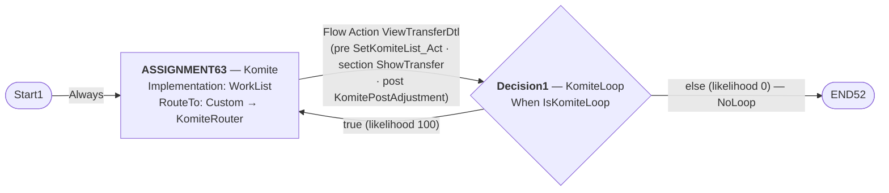
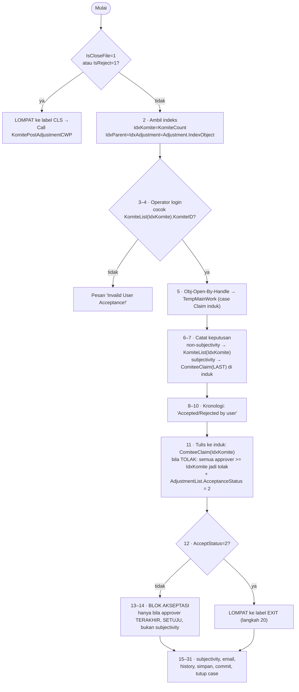

# PENGETAHUAN — Komite Claim Non Prop

<!-- STEMPEL ASAL -->
> **Dasar bukti**: ekspor XML `D:\XML_NURE\Komite Claim Non Prop`, **59 berkas XML** (seluruhnya bertanggal berkas 2026-09-09) ditambah `Struktur_KomiteTreaty_Flow.xlsx` — indeks pohon panggilan flow, bukan rule.
> Rule tertua di dalamnya `pxUpdateDateTime = 2016-04-27` (`BrowseBankGroup`), termutakhir **2026-08-13** (`HitServiceToKasirKMT_Act`).
> Disusun 19 September 2026 dengan membedah seluruh 59 berkas. Dokumen ini **melengkapi** `MEMORI_PEMAHAMAN.MD` (blueprint AS-IS dua modul) dan menutup lubang yang ditandai `_migration-docs/claim-non-prop/SPEC-MODEL-DATA.md` bagian 9: *"Folder Komite Claim Non Prop tidak pernah dibuka. Tidak ada tabel Komite di spec ini."*
> Berlaku hanya untuk keadaan sistem pada ekspor di atas.

**Ditulis untuk:** tim yang akan menulis ulang modul ini — backend **Golang**, frontend **ReactJS**, basis data **Oracle**.

---

## 0. Cara membaca, dan batas dokumen ini

| Bagian | Isi |
|---|---|
| §1 | Modul ini dalam satu halaman |
| §2 | Inventaris 59 berkas + pohon panggilan |
| §3–§6 | Sistem lama: flow, routing, dua jalur pasca-persetujuan |
| §7 | Model data yang disentuh |
| §8 | **Aturan & rumus yang wajib pindah** |
| §9 | Integrasi keluar: REST + Oracle |
| §10 | Inventaris UI → layar React |
| §11 | **Temuan K-01…K-12** — yang harus diputuskan sebelum ditulis ulang |
| §12 | Rancangan target (Oracle / Go / React) — **USULAN** |
| §13 | Peta rule lama → komponen baru |
| §14 | Yang belum terjawab |

**Tanda**: `EVIDENCED` = terbaca langsung di XML, disertai berkas & langkah. `TAFSIR` = kesimpulan dari bukti, bisa salah. `USULAN` = rancangan sistem baru, belum diputuskan siapa pun.

**Yang TIDAK ada di berkas ini**: data produksi (nol baris), DDL tabel lama (tidak ikut diekspor), dan rule milik modul Claim yang memanggil modul ini (`CreateChildKomiteCNP_Act`, `ProteksiSendKomiteCNP_Act`, `FilterEmailKomiteWithLimit`) — ketiganya ada di folder `Claim Non Prop` dan sudah dibedah di `MEMORI_PEMAHAMAN.MD` §5.3.

### 0.1 Sandi kode langkah Pega yang dipakai di seluruh dokumen

Ekspor menyimpan aksi pra-syarat/transisi sebagai angka. Pemetaan berikut `EVIDENCED`, disahkan oleh memo rule `InsertXOLKlaimCNP` yang berbunyi persis *"Exit Activity If IsSubjectivity==true"* pada langkah bernilai `6`:

| Kode | Arti |
|---:|---|
| `1` | **Lompat** ke label (nama label ada di `…WhenTruePrms`, mis. `CLS`, `EXIT`, `END`, `B`) |
| `2` | Lanjut ke langkah berikutnya |
| `3` | **Lewati** langkah ini |
| `6` | **Keluar dari activity** (pada blok berulang: keluar dari iterasi) |

Dan: `pyStepsPreCondition=false` berarti **pra-syarat dimatikan** — kondisinya tertulis tapi tidak dipakai, sehingga langkah **selalu** jalan. Ini bukan detail sepele; dua temuan (§11 K-02, K-05) bergantung padanya.

---

## 1. Modul ini dalam satu halaman

**Komite Claim Non Prop** adalah **case anak** dari Claim Non Prop. Satu case = **satu sirkulasi persetujuan berjenjang** atas **satu Adjustment** (satu unit pembayaran klaim XOL). Work class: `ASM-FW-GCNMFW-Work-KomiteTreatyNonProp`. Ruleset `GCNMFW` + `GISFW`.

Ia melakukan tiga hal, dan tidak lebih:

1. **Mengantar keputusan** — menugaskan Adjustment ke anggota komite satu per satu, berurutan, sampai semua jenjang setuju atau ada yang menolak.
2. **Menulis balik ke induk** — membuka case Claim dengan kunci (`Obj-Open-By-Handle` atas `pxCoverInsKey`), menaruh keputusan, nomor akseptasi, tanggal akseptasi, lalu `Obj-Save` + `Commit`.
3. **Memicu hilir** — pada persetujuan terakhir: menerbitkan **nomor akseptasi**, menulis ke tabel OS akseptasi Oracle, menembak **service Kasir** (pembayaran), **service Konversi** (Arasapas), mencetak **PDF** ke Google Storage, dan mengirim **email**.

Poin (3) adalah alasan modul ini tidak boleh diperlakukan sebagai "layar approval biasa": **titik commit keuangan sistem ini ada di sini**, bukan di modul Claim.

Ada **dua jalur** yang berbagi satu flow:

| Jalur | Dipicu oleh | Activity pasca | Yang dihasilkan |
|---|---|---|---|
| **A — Akseptasi Adjustment** | `IsCloseFile≠1` dan `IsReject≠1` | `KomitePostAdjustment` (31 langkah) | Nomor akseptasi, OS akseptasi, kirim kasir, PDF Acceptance Note |
| **B — Tutup / Tolak Klaim** | `IsCloseFile="1"` atau `IsReject="1"` | `KomitePostAdjustmentCWP` (34 langkah) | PDF Close/Reject Claim, OS akseptasi **negatif** (pembalik), REST reject/closed |

Jalur B dipanggil dari jalur A: langkah 1 `KomitePostAdjustment` melompat ke label `CLS` (langkah 31) yang isinya `Call KomitePostAdjustmentCWP`. `EVIDENCED` — `Activity/KomitePostAdjustment.xml` langkah 1 & 31.

---

## 2. Inventaris — 59 berkas

### 2.1 Cacah per jenis rule

| Jenis | Jumlah | Berkas |
|---|---:|---|
| Activity | 20 | 19 di `Activity/` + `GetBase64Attachment` di `excludeXML/` |
| RDB List (SQL) | 16 | seluruh SQL yang disentuh modul ini |
| When | 6 | `IsCLM`, `IsCLMNP`, `IsCLMP`, `IsKomiteLoop`, `IsPEGAPROD`, `IsPEGASyariah` |
| Connect REST | 5 | Kasir, Konversi, Google Storage, reject, closed |
| Report Definition | 3 | `BrowseBankGroup`, `BrowseCurrency_RD`, `GetEmailUser_RD` |
| Section | 2 | `ShowTransfer` (1,9 MB), `ReinstatementPremiumDetails` |
| Flow Action | 2 | `ViewTransferDtl`, `ShowDetailXOL` |
| Flow | 1 | `KomiteTreaty_Flow` |
| Data Transform | 1 | `InsertChronology_DT` |
| Decision Table | 1 | `GetMimeType` |
| System Settings | 1 | `LinkService` |

### 2.2 Siapa pemilik rule-nya — ini penting untuk batas modul baru

Hanya **12 dari 59** rule benar-benar milik class Komite. Sisanya **dipinjam** dari class lain dan **dipakai bersama** modul Claim serta Proportional/Facultative:

| Class pemilik | Jml | Arti untuk migrasi |
|---|---:|---|
| `…Work-KomiteTreatyNonProp` | 12 | **Milik modul ini.** Inti yang harus ditulis ulang |
| `…Int-T_STORAGE_IMAGE` | 7 | Layanan dokumen bersama → **service tersendiri** |
| `…Data-Adjustment` | 6 | Milik entitas Adjustment, dipanggil dari sini |
| `…Work` (induk) | 6 | Utilitas lintas klaim |
| `…Int-V_POLIS` | 6 | **Pintu tulis ke Oracle** (prosedur OS akseptasi) |
| `…Work-ClaimTreatyNonProp` | 5 | **Milik modul Claim, dipanggil dari Komite** — kopling terkuat |
| `@baseclass` | 5 | When lingkungan/jenis klaim |
| lain-lain | 12 | referensi (mata uang, bank, operator), policyjson, dokumen |

`EVIDENCED` — `pyClassName` tiap berkas.

**Konsekuensi**: modul Komite baru **tidak bisa** dibuat berdiri sendiri tanpa menyepakati siapa pemilik `GenerateAccCNP_act`, `SaveRejectOSKomiteCNP`, dan `InsertChronology_DT` — ketiganya milik class Claim tetapi hanya dipanggil dari sini.

### 2.3 Pohon panggilan — dari `Struktur_KomiteTreaty_Flow.xlsx`

Berkas Excel itu bukan rule; ia **daftar penelusuran** yang dibuat tim, bernomor hierarkis, dan cocok persis dengan isi folder. Bentuk ringkasnya:

```
1      KomiteTreaty_Flow                       (Flow)
1.1    └─ ViewTransferDtl                      (Flow Action, shape ASSIGNMENT63)
1.1.1     ├─ SetKomiteList_Act                 (pra-proses)
1.1.2     ├─ ShowTransfer                      (Section — layar approval)
1.1.2.1   │   ├─ ShowDetailXOL → ReinstatementPremiumDetails
1.1.2.2   │   ├─ ResetSubjectivityNote
1.1.2.3   │   ├─ BrowseBankGroup
1.1.2.4   │   └─ BrowseCurrency_RD
1.1.3     └─ KomitePostAdjustment              (pasca-proses — inti)
1.1.3.1       ├─ GetKodeProdNonLife_SQL
1.1.3.2       ├─ InsertHistoryAkseptasiPega_Sql
1.1.3.3       ├─ HitServiceToKasirKMT_Act ─┬─ InsertLOGDirectKasir_SQL
1.1.3.3.7     │                            ├─ getStatusKonversi_Act → getStatusKonversi_SQL
1.1.3.3.9     │                            ├─ SendAcceptationToKasir (REST) → LinkService
1.1.3.3.11    │                            └─ SendErrorDirectKasir
1.1.3.4       ├─ GetSequenceNumber_SQL
1.1.3.5       ├─ InsertOSKlaimCNP ─────────┬─ InsertXOLKlaimCNP → SaveXOLClaim_SQL
              │                            ├─ InsertJsonClaimTreatyNonProp_act → InsertClaimPNC
              │                            ├─ SaveOSClaim_SQL
              │                            └─ GenerateAccCNP_act → InsertDocument_Act
              │                                                    └─ InsertGoogleStorage_Act (7 rule)
1.1.3.6       ├─ KonversiKlaim_Act → KonversiKlaimNonLife (REST)
1.1.3.7       ├─ SendEmailKlaim_KMT
1.1.3.8       ├─ InsertJsonClaimTreatyNonProp_act
1.1.3.10      ├─ InsertChronology_DT
1.1.3.11      ├─ KomitePostAdjustmentCWP ──┬─ SaveRejectOSKomiteCNP → GetDataCNPOS, SaveDataToOsAkseptasiNP
              │                            ├─ insertClaimReject_NP (REST)
              │                            ├─ insertClaimFinalOrClosed_NP (REST)
              │                            ├─ SendEmailKlaimRejectClose_KMT → GetEmailUser_RD
              │                            └─ InsertDocument_Act → InsertGoogleStorage_Act
1.1.3.12      └─ InsertOSSubjectivityCNP → SaveOSSubjectivity_SQL, InsertXOLKlaimCNP
1.2    KomiteRouter                             (router kustom assignment)
1.3    IsKomiteLoop                             (Decision1 / KomiteLoop)
```

`GetBase64Attachment` diletakkan di `excludeXML/` — dipanggil `KomitePostAdjustment` langkah 14.20 tetapi sengaja dikeluarkan dari pohon. `TAFSIR`: rule bawaan/umum, bukan kandidat penulisan ulang.

---

## 3. Flow dan mesin keadaan

`Flow/KomiteTreaty_Flow.xml`, class `…Work-KomiteTreatyNonProp`, versi `01-01-07`, terakhir diubah **2020-02-27**. Hanya **empat shape**:



`EVIDENCED` — shape `ASSIGNMENT63` (`pyRouteTo=Custom`, `pyImplementation=WorkList`), `Decision1` (`Data-MO-Gateway-DataXOR`), transisi `TRANSITION54`/`Transition2`/`Transition3`. Ada satu ticket `komiteAccept_ticket` (shape `Ticket1`) yang **tidak dirujuk transisi mana pun di flow ini** — pemicunya ada di luar folder.

**When `IsKomiteLoop`** (`…Work-KomiteTreatyNonProp`, logika `A AND B`):

```
A: .AcceptStatus = "1"          (approver terakhir menyetujui)
B: .KomiteCount <= .KomiteLoop  (masih ada jenjang tersisa)
```

`EVIDENCED` — `When/IsKomiteLoop.xml`. Label kondisi A tertulis *"Status Penerimaan = 1"*.

**Mesin keadaannya, dalam bahasa biasa:**

| Keadaan | Ditandai oleh | Keluar bila |
|---|---|---|
| Menunggu jenjang ke-N | assignment hidup, `KomiteCount = N` | approver mengirim `ViewTransferDtl` |
| Lanjut jenjang berikut | `AcceptStatus="1"` dan `KomiteCount ≤ KomiteLoop` | otomatis, kembali ke assignment |
| Selesai — disetujui | `KomiteCount > KomiteLoop` | case ditutup `ASMForceCaseClose` |
| Selesai — ditolak | `AcceptStatus="2"` → `KomiteCount` dipaksa `= KomiteLoop` | case ditutup, induk jadi `CLAIM REJECTED` |

`AcceptStatus` hanya punya dua nilai bermakna: `"1"` setuju, `"2"` tolak. Ia **dikosongkan** (`=""`) di langkah 5 `KomiteRouter` setiap kali assignment dibuat ulang. `EVIDENCED`.

---

## 4. Routing — `KomiteRouter`

`Activity/KomiteRouter.xml`, 7 langkah, terakhir diubah 2020-06-15, memo rule: *"remark step assign work"*.

| # | Pra-syarat | Aksi |
|---:|---|---|
| 1 | `.KomiteCount==1` | `param.AssignTo = "komitepnc"` |
| 2 | `.KomiteCount==2` | `param.AssignTo = "komitepnc2"` |
| 3 | `.KomiteCount==3` | `param.AssignTo = "komitepnc3"` |
| 4 | `.KomiteCount==4` | `param.AssignTo = "komitepnc4"` |
| 5 | — | `.AcceptStatus = ""` |
| 6 | `Primary.TransferType=='2'` — **pra-syarat DIMATIKAN** | ulang `.KomiteList`: baris pertama dengan `.KomiteAproval==0` → `param.AssignTo = .KomiteID`, lalu **keluar** |
| 7 | `Primary.TransferType!='2'` | `param.AssignTo = .Komite.KomiteID` |

`EVIDENCED` — seluruhnya dari XML.

**Yang sebenarnya terjadi** (`TAFSIR`, dasar EVIDENCED §0.1): karena pra-syarat langkah 6 dimatikan, **langkah 6 selalu jalan**. Selama ada satu baris `KomiteList` dengan `KomiteAproval==0`, nilai dari langkah 1–4 **selalu tertimpa**, dan langkah 7 **tidak pernah tercapai**. Jadi aturan routing yang berlaku hari ini hanyalah:

> **Tugaskan ke anggota komite pertama yang belum memutuskan.**

Empat nama workbasket `komitepnc…` dan cabang `TransferType` adalah **peninggalan**. Langkah 5 dinamai *"KomiteCount Increment & AcceptStatus Reset"* tetapi **tidak ada increment di dalamnya** — hanya reset; increment sesungguhnya ada di `KomitePostAdjustment` langkah 29.

---

## 5. Jalur A — `KomitePostAdjustment` (31 langkah)

`Activity/KomitePostAdjustment.xml`, versi `01-01-24`, terakhir diubah **2025-12-06**, memo *"AMBIL KODE PRODUKSI"*. Ini **berkas terpenting di seluruh folder**.

### 5.1 Alur garis besar



### 5.2 Langkah demi langkah — yang berarti untuk sistem baru

| # | Isi | Catatan migrasi |
|---:|---|---|
| 1 | Lompat `CLS` bila `IsCloseFile="1"` atau `IsReject="1"` | dua jalur, satu pintu masuk |
| 2 | `IdxKomite=KomiteCount`; `IdxInterim=Adjustment.CNPIndexInterim`; `XOLID`; `PaymentType`; `IdxParent=IdxAdjustment=Adjustment.IndexObject` | **indeks array** — di sistem baru jadi kunci asing, bukan posisi larik |
| 3–4 | `@contains(@toUpperCase(KomiteList(IdxKomite).KomiteID), @toUpperCase(OperatorID.pyUserIdentifier))`; bila tidak cocok → `Page-Set-Messages "Invalid User Acceptance!"` | **satu-satunya kontrol wewenang di modul ini** — lihat K-01 |
| 5 | `Obj-Open-By-Handle` → page `TempMainWork` = case Claim induk | tulis lintas agregat |
| 6 | **bila bukan subjectivity**: `KomiteList(IdxKomite).{KomiteAproval, KomiteComment, DateApproval, DateApprove}` | dua kolom tanggal, nilai sama |
| 7 | **bila subjectivity**: tulis ke `TempMainWork…AdjustmentList(IdxAdjustment).ComiteeClaim(<LAST>)` | `<LAST>`, bukan indeks approver — lihat K-07 |
| 8–10 | `DataChronology.CARI1 = "Accepted by "/"Rejected by " + OperatorID.pyUserName`; `Apply-DataTransform InsertChronology_DT` | jejak audit berupa **kalimat**, bukan data |
| 11 | tulis `ComiteeClaim(IdxKomite)` di induk; bila **tolak**: seluruh `ComiteeClaim` dengan `pxListSubscript >= IdxKomite` di-set tolak + komentar + waktu yang sama, lalu `AdjustmentList(IdxParent).AcceptanceStatus = 2` | lihat K-04 |
| 12 | bila tolak → lompat `EXIT` | |
| 13 | Ambil tanggal: `currentDate`, `CurrentMonth`, `NextMonth` (+1, putar ke "1" bila >12, pad "0"), `Year`; nolkan 4 flag | zona `Asia/Jakarta` |
| **14** | **Blok akseptasi**, 22 sub-langkah — hanya bila `IsSubjectivity=false` **dan** `KomiteCount==KomiteLoop` **dan** `AcceptStatus="1"` | isi §8 |
| 15–16 | bila subjectivity: `AdjustmentList(IdxAdjustment).IsKomite = 0` | melepas penanda "sedang di komite" |
| 17–18 | `InsertOSSubjectivityCNP`; salin `IsSubjectivity` + `SubjectivityNote` ke induk (Adjustment **dan** ClaimData) | |
| 19 | bila `IsPEGAPROD`: `PostEmailKomiteCNP` → `SendEmailKlaim_KMT` → `HitServiceToKasirKMT_Act` (yang terakhir hanya pada approver terakhir, setuju, non-subjectivity) | **pembayaran** |
| 20 | label `EXIT` — bila tolak: `KomiteCount = KomiteLoop`; `TempMainWork.CNPStatusCase = "CLAIM REJECTED"` | |
| 21 | `Obj-Refresh-And-Lock` atas `TempMainWork` | lihat K-11 |
| 22–23 | `InsertHistory.CARI{1,2,4,5,6}` → `INSERT INTO HISTORYAKSEPTASIPEGA` | satu-satunya jejak persetujuan **di tabel**, bukan di blob |
| 24 | `InsertJsonClaimTreatyNonProp_act` — memperbarui JSON klaim di Oracle | |
| 25–27 | `UpdateWorkObject` → `Obj-Save TempMainWork` → **`Commit`** | satu-satunya commit jalur A |
| 28 | bila `KomiteCount >= KomiteLoop`: `ASMForceCaseClose` case Komite | |
| 29 | `KomiteCount = KomiteCount + 1` | dinaikkan **setelah** commit |
| 30 | Isi `InputParam.CARI*` untuk tampilan/cetak (nomor akseptasi, 4 flag, nama tertanggung, komentar, "Accepted"/"Rejected") | |
| 31 | label `CLS` — `Call KomitePostAdjustmentCWP` | |

`EVIDENCED` — seluruh baris tabel di atas terbaca dari `Activity/KomitePostAdjustment.xml`.

---

## 6. Jalur B — `KomitePostAdjustmentCWP` (34 langkah)

`Activity/KomitePostAdjustmentCWP.xml`, versi `01-01-26`, terakhir diubah 2025-08-28. CWP = **C**lose/**W**ork **P**rocess (`TAFSIR`; nama stream PDF-nya `CWPCaseClaim`).

Perbedaan pokok dari jalur A:

| # | Isi |
|---:|---|
| 1–5 | sama: indeks, cek operator, buka induk, catat keputusan di `KomiteList(IdxKomite)` — **tanpa cabang subjectivity** |
| 6 | tulis keputusan ke **`TempMainWork.ClaimData.ClaimComitee`** (komite tingkat **klaim**, bukan tingkat adjustment) — **seluruh baris**, tanpa penyaring indeks |
| 7 | Siapkan data cetak: periode polis, tanggal kerugian, tanggal lapor, deductible, TPL, `ShareCedant`, penanda `CARI20 = (ShareCedant≠100)`, judul `CARI38 = IsReject ? "REJECT CLAIM" : "CLOSE CLAIM"` |
| 8–10 | kronologi, sama seperti jalur A |
| 11 | bila tolak → lompat `EXIT` (langkah 24) |
| 12 | **Rekap per mata uang**: jumlahkan `ListClaimAmount` (AdjusterFee, ClaimAmount, CNPDeductible, CNPOthersFee, Salvage, TPL) ke `TempRejCNP`, satu baris per mata uang; baris baru diberi catatan `"(ROE 1 <CUR> = IDR <kurs>)"` |
| 13–17 | Susun HTML → `HTMLToPDF`; nama berkas `"Close Claim <pyID>.pdf"` / `"Reject Claim <pyID>.pdf"`, kategori lampiran `CloseClaim`/`RejectClaim`, A4 portrait, kop `webwb/RNMLogo_CNP.PNG` |
| 18 | Java: `Base64Util.encodeToString(byteArray)`; gagal → `PRRuntimeException("Can't attach the file to the Work Object")` |
| 19 | `InsertDocument_Act` — simpan dokumen |
| 20 | bila **setuju**: `SaveRejectOSKomiteCNP` — menulis **OS akseptasi pembalik** (§8.6) |
| 21–22 | `Connect-REST` `insertClaimReject_NP` / `insertClaimFinalOrClosed_NP` — hanya bila `IsPEGAPROD` **dan** setuju |
| 24 | label `EXIT` — bila tolak: `KomiteCount = KomiteLoop`, induk `CLAIM REJECTED` |
| 25 | `SendEmailKlaimRejectClose_KMT` |
| 26–29 | refresh-lock, perbarui JSON klaim, `Obj-Save`, **`Commit`** |
| 30–32 | `ASMForceCaseClose`: case Komite (bila `KomiteCount>=KomiteLoop`); **case Claim induk** bila setuju & reject; **case Claim induk** bila setuju & close |
| 33–34 | `KomiteCount++`, isi `InputParam.CARI*` |

`EVIDENCED`.

**Perhatikan pembalikan makna**: di jalur B, `AcceptStatus="1"` (komite **setuju**) berarti klaim **ditolak/ditutup** — karena yang disetujui adalah *usulan penolakan/penutupan*. Salah membaca ini akan membalik seluruh logika di sistem baru.

---

## 7. Model data yang disentuh

### 7.1 Properti case Komite (`pyWorkPage`)

| Properti | Jenis | Peran |
|---|---|---|
| `KomiteList[]` | Page List | Daftar jenjang. Anggota: `KomiteID`, `KomiteAproval` (0/1/2), `KomiteComment`, `KomiteEmail`, `IDKomite`, `KomitePost`, `Initial`, `DateApproval`, `DateApprove` |
| `KomiteCount` | Integer | Jenjang yang sedang berjalan (mulai dari 1) |
| `KomiteLoop` | Integer | Jumlah total jenjang = jumlah approver hasil query |
| `AcceptStatus` | String | `"1"` setuju · `"2"` tolak · `""` belum |
| `Comment` | String | Komentar approver aktif |
| `IsSubjectivity` / `SubjectivityNote` | Boolean / String | Persetujuan bersyarat |
| `IsCloseFile` / `IsReject` | String `"1"` | Penentu jalur B |
| `IsPrevious` | Integer | `1` bila `Adjustment.AlokasiXOLPaid` tidak kosong |
| `Adjustment.*` | Page | Salinan Adjustment dari induk: `IndexObject`, `CNPIndexInterim`, `XOLID`, `PaymentType`, `AcceptedNo`, `CNPLayerList[]`, `SpreadingRisk[]`, `SpreadingAdjustment[]`, `CNPAccNo{AdjustF,OtherF,Salvage,Reinstate}`, `CNPFlagReinstate`, `IsProposeClose`, data rekening |
| `Komite.{CircumtansesCouseOfLoss, Remarks, Occupation}` | Page | Konteks kerugian untuk layar |
| `QuotationData.*`, `ClaimData.*` | Page | Salinan identitas polis/klaim |
| `pxCoverInsKey` | String | **Kunci case induk** — satu-satunya tali ke Claim |

`EVIDENCED` — dari `Activity/*.xml` dan `Section/ShowTransfer.xml`.

### 7.2 Yang ditulis balik ke induk (`TempMainWork`)

| Sasaran di induk | Ditulis oleh |
|---|---|
| `ClaimData.AdjustmentList(i).ComiteeClaim[]` | KomitePostAdjustment 7, 11 |
| `ClaimData.AdjustmentList(i).AcceptanceStatus` | 11 (tolak), 14.13 (setuju) |
| `ClaimData.AdjustmentList(i).AcceptedNo` / `AcceptedDate` | 14.13, 14.14 |
| `ClaimData.AdjustmentList(i).{IsKomite, IsSubjectivity, SubjectivityNote}` | 16, 18 |
| `ClaimData.{IsSubjectivity, IsFInalAccXOL}` | 18, 14.17 |
| `ClaimData.ClaimComitee[]` | CWP 6 |
| `ClaimData.SuggestList[]` (kronologi) | `InsertChronology_DT` |
| `CNPStatusCase` | `"CLAIM ACCEPTED"` (14.17) / `"CLAIM REJECTED"` (20) |
| `IsCloseFile` | 14.12 ← `Adjustment.IsProposeClose` |
| `stsReject` | 14.19 ← `InputData.CARI10` |

`EVIDENCED`. Inilah **kontrak tulis** yang harus dipertahankan sistem baru — atau digantikan satu transaksi tunggal.

---

## 8. Aturan & rumus yang wajib pindah

### 8.1 Penerbitan nomor akseptasi

Syarat — ketiganya harus benar (`KomitePostAdjustment` 14.7, 14.9–14.11):

```
KomiteCount == KomiteLoop    (approver terakhir)
AcceptStatus == "1"          (setuju)
Adjustment.AcceptedNo == ""  (belum pernah terbit)  <- penjaga idempotensi
```

Susunannya:

```
ParamSeq.CARI1 = TempMainWork.pxObjClass
ParamSeq.CARI2 = ParamSeq.HASIL3 + "A"      -- HASIL3 = KODE_PRODUKSI (TYPE='NONLIFE')
PROC_GENERATE_SEQUENCE_NUMBER(CARI1, CARI2, TO_DATE(CARI3,'DD/MM/YYYY'), HASIL1 out, HASIL2 out)

AcceptedNo = CARI2 + BusinessOldId + "." + HASIL1 + ".TX" + HASIL2
           = <kodeproduksi>A<BusinessOldId>.<MM.YYYY>.TX<sequence>
```

Lalu **disunting ulang** bila tanggal hari ini melewati tanggal produksi (14.14):

```
AcceptedNo = @replaceAll(AcceptedNo, "." + CurrentMonth + ".", "." + NextMonth + ".")
```

`EVIDENCED`. Panjang hasilnya **23 atau 24 karakter** — dan `HitServiceToKasirKMT_Act` langkah 9/10 memakai `@length(AcceptedNo)=="23" || =="24"` sebagai **syarat mengirim pembayaran**. Format dan pembayaran terikat mati.

### 8.2 Batas tanggal produksi — dua rumus yang berbeda

Rumus A (14.5) memakai **tanggal produksi dari basis data** (`TglProd.pxResults(1).TANGGAL`):

```
CARI33 = hari ini (dd)
CARI33 = (CARI33 <= TglProd) ? bulan ini : bulan ini + 1
CARI33 = (CARI33 < 13) ? CARI33 : "1"       -- putar tahun
CARI34 = tahun; bila CARI33=01 dan bulan sekarang=12 -> tahun + 1
```

Rumus B (14.6 dan 14.14) memakai **angka 25 yang ditulis langsung**:

```
bila @toDecimal(currentDate) > 25 -> NextMonth = CurrentMonth + 1
```

Keduanya jalan di satu eksekusi yang sama. `EVIDENCED` — lihat K-06.

### 8.3 Empat penanda nomor akseptasi per komponen

`KomitePostAdjustment` 14.1, diulang atas `Adjustment.CNPLayerList[].CNPCurrencyList[]`:

```
FlagAdjusterFee = (AdjusterFeeRNM   != 0) ? 1 : nilai sebelumnya
FlagSalvage     = (SalvageRNM       != 0) ? 1 : nilai sebelumnya
FlagOthersFee   = (CNPOthersFeeRNM  != 0) ? 1 : nilai sebelumnya
FlagClaim       = (GrossAdjustment  != 0) ? 1 : nilai sebelumnya

CNPAccNoAdjustF   = FlagAdjusterFee == 0 ? "" : "1"
CNPAccNoOtherF    = FlagOthersFee   == 0 ? "" : "1"
CNPAccNoReinstate = FlagClaim       == 0 ? "" : "1"    <- dari FlagClaim, bukan FlagReinstate
CNPAccNoSalvage   = FlagSalvage     == 0 ? "" : "1"
FlagReinstate     = (Adjustment.CNPFlagReinstate == 1) ? 0 : 1     (14.2, dibalik)
```

`EVIDENCED`. Perhatikan `CNPAccNoReinstate` diturunkan dari `FlagClaim`, sementara `FlagReinstate` yang dihitung terpisah **tidak dipakai di mana pun setelahnya** di activity ini.

### 8.4 Muatan ke Kasir — `HitServiceToKasirKMT_Act`

Gerbang masuk (langkah 1–3):

```
keluar bila  (prefix CLMNP- dan PaymentType=3)          -- salvage tidak dikirim
lanjut bila  DirectToKasir=="true" dan StatusKasir==""
dan          getStatusKonversi_Act mengembalikan StatusKonversi=="1"
```

Untuk Non-Prop (langkah 9–10), `SpreadingAdjustment` **direkap per `CurrencyID`** ke `TempSpreadingRisk`, baris `TreatyName=="UR"` dilewati, lalu per baris hasil:

```
Nett (CARI9) = TotalClaim - PremiumSpreaded
AccountNo    = regex hapus non-digit dari NoAccount;
               bila kosong -> NoAccount Adjustment tanpa tanda "-"
TglAksep     = AcceptedDate disusun ulang dd-MM-yyyy dari substring(6,8)/(4,6)/(0,4)
Email        = gl.f_get_email(<CedingID>)
UserInput    = pxCreateOperator, bila kosong -> pxRequestor.pxUserIdentifier
```

**Tanggal boleh bayar** (langkah 10.5):

```
hari = day(AcceptedDate) ; bulan = month(AcceptedDate) + 1 ; tahun = year(AcceptedDate)
bila hari > 25   -> bulan = bulan + 1 ; hari = "01"
bila bulan > 12  -> bulan = "1"
bila bulan = 01 dan bulan-sekarang = 12 -> tahun = tahun + 1
TglBolehBayar = dd-MM-yyyy
```

**Nilai tetap yang ditulis langsung di rule**:

| Field | Nilai | Arti |
|---|---|---|
| `CompanyName` | `"NUSARE"` | |
| `LjtdId` | `"D0031"` | kode jurnal |
| `LdcId` | `"100081"`, atau **`"100115"` bila `IsPEGASyariah`** | kode perkiraan |
| `StsAp` | `"0"` | |
| `Deductible`, `KaliDeduct`, `StsSyariah` | `0`, `0`, `0` untuk jalur Non-Prop | |

JSON disusun dengan **perangkaian string di kode Java** (`"{\"TAllPaymentData\":[{" + …`), bukan pustaka JSON — tidak ada escaping.

Setelah kirim: `StatusKasir = (ReponseCode==1) ? "Akseptasi Sudah Masuk ke Kasir" : ResponseMsg`, lalu `INSERT INTO POOLDATA.DIRECTTOKASIR_LOG`. Bila langkah gagal → lompat label `END` → `SendErrorDirectKasir` (email). `EVIDENCED`.

### 8.5 Reinstatement — empat tata letak

`Section/ReinstatementPremiumDetails.xml` (class `…Data-SpreadingRisk`) menampilkan perhitungan premi pemulihan dengan **empat varian** yang dipilih `FlagProrate ∈ {0,1,2,3}` (`pyContainerVisibleWhen`). Field yang tampil: `CNPLimit`, `CNPMDP`, `CNPPctReinstate`, `CNPReinstatement`, `CNPReinstatementRNM`, `ClaimPercentage`, `OldGross`, `SisaLimitLayer`, `TotalClaim`. Label: *Claim Layer · Limit Layer · Premium Layer · Reinstatement (%) · Reinstatement Calculation · Reinstatement For RNM · Reinstatement Premium · Reinstatement Premium RNM · Remaining Limit Layer · Share RNM*.

**Rumusnya tidak dihitung di modul ini** — section hanya menampilkan; perhitungannya milik modul Claim (lihat `FINDING-007-dua-rumus-reinstatement.md`). Yang modul ini tambahkan: **`FlagProrate` punya 4 nilai**, sementara temuan di sisi Claim baru mencatat dua rumus. `TAFSIR`: perlu dicocokkan sebelum salah satu dianggap lengkap.

### 8.6 OS akseptasi — tiga pintu tulis, satu pembalik

| Activity | Prosedur Oracle | Kapan |
|---|---|---|
| `InsertOSKlaimCNP` | `PEGA_JSON_OS_AKSEP_KLAIM` | akseptasi normal (bukan subjectivity) |
| `InsertOSSubjectivityCNP` | `PEGA_JSON_OS_AKSEP_SUBJECTIVITY` | akseptasi bersyarat |
| `SaveRejectOSKomiteCNP` | `GetDataCNPOS` lalu `PEGA_JSON_OS_AKSEP_KLAIMTNP` | tutup/tolak klaim — **nilai dibalik** |
| `InsertXOLKlaimCNP` | `XOL2_AKSEP_KLAIM` | rincian per layer, dipanggil dua yang pertama |

Muatan utamanya satu **string JSON** (`@ASM.GetPageJSONString()`) berisi `CauseOfLoss`, `NoClaim`, `PersenRNM`, `AcceptedNo`, `Type`, dan `CNPLayerList` penuh — lalu disimpan ke kolom `DATA_JSON`.

Pembalikannya (`SaveRejectOSKomiteCNP` 1.2.2–1.2.3): baca yang sudah masuk lewat `GetDataCNPOS`, lalu kalikan **−1**:

```
CNPOthersFee = OutOSAcc.CNPOthersFee * -1
Adjusterfee  = OutOSAcc.Adjusterfee  * -1
Value        = OutOSAcc.Value        * -1
Salvage      = OutOSAcc.Salvage      * -1
GrossValue   = OutOSAcc.GrossValue   * -1
Type         = 2          (vs Type = 1 pada akseptasi normal)
bila Value == 0 -> lompat label B (lewati baris ini)
```

Baris `TreatyName=="UR"` (Retensi Cedant) **selalu dilewati** di seluruh jalur tulis OS. `EVIDENCED`.

### 8.7 Kronologi — `InsertChronology_DT`

```
WHEN OperatorID.pyPosition != "IT Developer"
  APPEND ClaimData.SuggestList:
    CommentSuggest  = DataChronology.CARI1      ("Accepted by <nama>" / "Rejected by <nama>")
    PICSuggest      = OperatorID.pyUserName
    DateSuggest     = @DateTime.CurrentDateTime()
    IsCedingConfirm = "Claim Admin"
      WHEN PICSuggest=="CHRISTINEANGELINA" -> "Claim Dept. Head"
      WHEN PICSuggest=="Himawan"           -> "Operational Director"
      WHEN PICSuggest=="NANDINA"           -> "Technical Director"
```

`EVIDENCED`. Jabatan ditentukan dari **nama orang**, dan aksi pengguna ber-posisi "IT Developer" **tidak tercatat sama sekali**.

---

## 9. Integrasi keluar

### 9.1 REST — 5 sambungan

| Rule | Sasaran | Otentikasi | Timeout | Dipicu |
|---|---|---|---|---|
| `SendAcceptationToKasir` | URL dari Setting `LinkService!LinkService` | profil **`DirectKasir`** | 30 s | akseptasi final |
| `KonversiKlaimNonLife` | Setting `LinkService` | tidak ada | 300 s | akseptasi final (Arasapas) |
| `ServiceGoogle` | Setting `LinkService` | tidak ada | 300 s | unggah dokumen |
| `insertClaimReject_NP` | **`http://10.100.10.75:7315/Nusare-Integration-WS/resources1/restws/NusareClaim/insertClaimReject`** | tidak ada | 30 s | tolak klaim |
| `insertClaimFinalOrClosed_NP` | **`…/insertClaimFinalOrClosed`** | tidak ada | 30 s | tutup klaim |

Dua yang terakhir menyimpan **alamat IP dan porta di dalam rule**; tiga yang pertama membacanya dari tabel `M_LINK_SERVICE` lewat `GetLinkService` (`Obj-Browse` dengan `KATEGORI_1`/`KATEGORI_2`). `EVIDENCED`.

### 9.2 Oracle — apa yang benar-benar disentuh

**Prosedur & fungsi**

| Objek | Dipakai oleh | Peran |
|---|---|---|
| `POOLDATA.PROC_GENERATE_SEQUENCE_NUMBER(c1,c2,tgl, h1 out, h2 out)` | `GetSequenceNumber_SQL` | nomor urut akseptasi + `MM.YYYY` |
| `POOLDATA.PEGA_JSON_OS_AKSEP_KLAIM(9 arg, 2 out)` | `SaveOSClaim_SQL` | OS akseptasi normal |
| `POOLDATA.PEGA_JSON_OS_AKSEP_SUBJECTIVITY(8 arg, 2 out)` | `SaveOSSubjectivity_SQL` | OS akseptasi bersyarat |
| `POOLDATA.PEGA_JSON_OS_AKSEP_KLAIMTNP(9 arg, 2 out)` | `SaveDataToOsAkseptasiNP` | OS pembalik (tolak/tutup) |
| `POOLDATA.XOL2_AKSEP_KLAIM(6 arg + sysdate, 2 out)` | `SaveXOLClaim_SQL` | rincian layer |
| `POOLDATA.PEGA_JSON_KLAIM_PNC(4 arg, 2 out)` | `InsertClaimPNC` | sinkron JSON klaim |
| `pooldata.GET_TOKEN_STORAGE(2 arg, 2 out)` | `GetTokenStorage_SQL` | token unggah dokumen |
| `gl.f_get_email(<ceding>)` | `GetEmailCeding_SQL` | email cedant |

**Tabel & view**

| Objek | Operasi | Rule |
|---|---|---|
| `OS_AKSEPTASI_KLAIM` | SELECT agregat atas `DATA_JSON` (`Adjusterfee`, `GrossValue`, `CNPOthersFee`, `Salvage`, `Value`), saring `CASEID`, `data_json.TypeLoss`, `data_json.Currency`, `STS_REJECT=0` | `GetDataCNPOS` |
| `HISTORYAKSEPTASIPEGA` | INSERT (`ID_PEGA`, `Tgl_Transfer=sysdate`, `Status`, `Username`, `Workbasket`, `ID_KOMITE`) | `InsertHistoryAkseptasiPega_Sql` |
| `POOLDATA.DIRECTTOKASIR_LOG` | INSERT (`DATA_JSON`, `IDPEGA`, `NOAKSEPTASI`, `KET`) | `InsertLOGDirectKasir_SQL` |
| `t_storage_image` | INSERT (`IMAGEID`, `URLPUBLIC`, `APPFOLDER`, `EXPDATE`, `FILENAME`, `APPNAME`, `STORAGE='standard'`) | `Insert_T_Storage_SQL` |
| `POOLDATA.T_FOLDER_IMAGE` | SELECT `APPNAME` | `GetAppName_SQL` |
| `POOLDATA.KODE_PRODUKSI` | SELECT `KODE` WHERE `TYPE='NONLIFE'` | `GetKodeProdNonLife_SQL` |
| `reinsurance.trloss_detail_t` | `COUNT(1)` WHERE `NO_AKSEP=<AcceptedNo tanpa titik>` | `getStatusKonversi_SQL` |
| `DUAL` | `STANDARD_HASH('ASMPP'‖timestamp,'MD5')` sebagai ID gambar | `GenerateImageID_SQL` |

`EVIDENCED` — seluruh SQL terbaca utuh di `RDBList/*.xml`.

**Tiga skema berbeda disentuh dalam satu alur**: `POOLDATA`, `reinsurance`, `gl` — plus tabel tanpa prefiks (`OS_AKSEPTASI_KLAIM`, `HISTORYAKSEPTASIPEGA`, `t_storage_image`). Ini bersinggungan dengan ADR-0016 (*tanpa database link ke sistem lain*) yang sudah diputuskan di sisi Claim; keputusan untuk modul ini belum ada.

---

## 10. Inventaris UI → layar React

### 10.1 `ShowTransfer` — layar persetujuan komite

Class `…Work-KomiteTreatyNonProp`, versi `01-01-24`, terakhir diubah **2025-12-30** (section paling aktif di folder ini). 1,9 MB.

**Tujuh daftar berulang** (`pyPageListProperty`) — inilah tabel di layar:

| Sumber | Isi |
|---|---|
| `pyWorkPage.KomiteList` | jenjang komite: `KomitePost`, `Initial`, `KomiteAproval`, `KomiteComment`, `DateApprove` |
| `.Adjustment.SpreadingRisk` | alokasi per layer/treaty: `TreatyName`, `Currency`, `TotalClaim`, `CNPReinstatementRNM`, `ClaimPercentage` |
| `.Adjustment.SpreadingAdjustment` | penyebaran keluar: `SharePercentage`, `ClaimSpreaded`, `PremiumSpreaded` |
| `.Adjustment.SpreadingQuotaShare` | penyebaran quota share |
| `.Adjustment.CNPSpreadLoss` | pembagian kerugian |
| `.Adjustment.ListClaimAcceptation` | nilai klaim per mata uang: `AdjusterFee`, `Salvage`, `CNPOthersFee`, `TPL`, `AltValue` (kurs) |
| `.Adjustment.AlokasiXOLPaid` | alokasi yang **sudah pernah dibayar** — tampil hanya bila `IsPrevious==1` |

**Kolom kunci yang dapat disunting**: `.AcceptStatus`, `.Comment`, `.IsSubjectivity`, `.SubjectivityNote`, rekening penerima (`PayableTo`, `NameOfBank`, `BranchOfBank`, `NoAccount`, `SwiftCode`, `Currency` — masing-masing punya pasangan bersufiks `2`).

**Aturan tampil/aktif yang harus ditiru React** (`EVIDENCED`):

| Kondisi | Akibat |
|---|---|
| `pyWorkPage.IsCloseFile!=1 && IsReject!=1` | blok akseptasi Adjustment tampil |
| `pyWorkPage.IsCloseFile==1` / `IsReject==1` | blok tutup / tolak tampil |
| `.KomiteCount != 1` | **rekening & nilai dikunci** — hanya approver pertama boleh menyunting |
| `pyWorkCover.IsOutstanding==1`, `.CNPFlagOuts==1` | kunci |
| `.IsSubjectivity = true` | `SubjectivityNote` **wajib** |
| `.AcceptStatus=1 && IsCloseFile!=1 && IsReject!=1` | tombol lanjut |
| `.Adjustment.SwiftCode != ''` | baris Swift tampil |
| `.Adjustment.FlagCurrency==1` | blok mata uang kedua tampil |
| `pyWorkPage.IsPrevious==1` | blok "Previously Calculated" tampil |
| `1=2`, `1=3`, `NEVER` | **blok mati** — jangan ikut dipindahkan |

Label yang sudah baku: *Committe Accept Status · Loss Allocation · XOL Allocation · Spreading In · Spreading Out · Previously Calculated · Subjectivity Note · Payable To · Name of Bank · Branch of Bank · Account No · Swift Code · Policy No Ceding · Insured Name · Date of Loss · Report Date · Received Date · RNM Share (%) · Rate of Exchange · Claim Amount in IDR*.

### 10.2 `ShowDetailXOL` → `ReinstatementPremiumDetails`

Modal rincian per baris `SpreadingRisk`. Isi di §8.5.

### 10.3 Daftar referensi

`BrowseCurrency_RD` (param `ID`, `CurrencyName`; kolom `ID`, `CountryID`, `Currency`, `CurrencySymbol`, `CountryName`, `ISOSymbol`, `Note`, `OLDID`; urut `Currency` ASC) · `BrowseBankGroup` (`LBG_ID`, `BANK_GROUP`) · `GetEmailUser_RD` (class `Data-Admin-Operator-ID`; param `UserName` dicocokkan ke `pyUserName` **atau** `pyUserIdentifier`).

---

## 11. Temuan — yang harus diputuskan sebelum ditulis ulang

Nomor `K-` dipakai agar tidak bentrok dengan `FINDING-00x` milik modul Claim.

### K-01 · Kontrol wewenang memakai pencocokan **sub-string**
`KomitePostAdjustment` 3–4 dan `…CWP` 2–3:
```
@contains(@toUpperCase(KomiteList(IdxKomite).KomiteID), @toUpperCase(OperatorID.pyUserIdentifier))
```
`@contains`, bukan `==`. Operator ber-ID `DARTO` akan lolos sebagai approver ber-`KomiteID` `DARTO2` atau `BUDIDARTO`. Ini satu-satunya pemeriksaan wewenang di modul, dan akibatnya hanya `Page-Set-Messages` — bukan `Exit-Activity`. **Sistem baru harus memakai kesetaraan identitas dan penolakan tegas di backend.** `EVIDENCED`.

### K-02 · Routing bercabang yang cabangnya mati
Pra-syarat langkah 6 `KomiteRouter` **dimatikan**, sehingga langkah 1–4 (`komitepnc…`) dan langkah 7 (`TransferType`) tidak pernah menentukan hasil selama masih ada approver `KomiteAproval==0` (§4). Memindahkan keempat cabang itu apa adanya berarti **memindahkan kode mati** dan membekukan salah paham. `TAFSIR`, dasar `EVIDENCED`.

### K-03 · Jabatan dan wewenang melekat pada **nama orang**
`SetKomiteList_Act` memetakan `DARTO`→Division Head, `CHRISTINEANGELINA`→Claim Dept. Head, `CHRISTOPMARHASAK`→Technic Div. Head, `Himawan`→Operational Director, `NANDINA`→Technical Director, lengkap dengan inisial paraf (`D`, `CA`, `CM`, `HY`, `NC`). `InsertChronology_DT` mengulang pemetaan yang sama untuk tiga nama. Satu orang pindah jabatan = ubah rule + deploy. **Sistem baru: tabel pengguna–peran, inisial sebagai atribut pengguna.** `EVIDENCED`.

### K-04 · Keputusan orang lain **dibuatkan** saat penolakan
`KomitePostAdjustment` 11.3: saat approver ke-N menolak, seluruh `ComiteeClaim` dengan `pxListSubscript >= N` di-set `KomiteAproval=2`, dengan `KomiteComment` dan `DateApproval`/`DateApprove` **milik penolak**. Riwayat lalu memperlihatkan orang-orang yang tidak pernah membuka layar "menolak pada jam sekian dengan komentar sekian". **Sistem baru: jenjang yang tidak sempat memutuskan berkeadaan `TIDAK_SAMPAI`, bukan `TOLAK`.** `EVIDENCED`.

### K-05 · Langkah pengambil `KODE_PRODUKSI` bergantung pra-syarat yang dimatikan
`KomitePostAdjustment` 14.8 (`GetKodeProdNonLife_SQL`) adalah **satu-satunya langkah di berkas ini** dengan `pyStepsPreCondition=false`; kondisinya `pyWorkPage.ClaimData.NoClaim==""` tidak dipakai, jadi langkah selalu jalan dan `ParamSeq.HASIL3` selalu terisi. Nomor akseptasi di 14.9 memakai `HASIL3`. Bila pra-syarat itu pernah dinyalakan kembali, **nomor akseptasi kehilangan awalannya** tanpa satu pun pesan galat. `EVIDENCED`.

### K-06 · Batas tanggal produksi dihitung dua kali dengan sumber berbeda — dan satu salah tulis
§8.2: satu rumus membaca `TglProd` dari basis data, satu lagi memakai angka `25` yang ditulis di rule. Keduanya jalan berurutan. Di 14.6 terdapat:
```
set Local.Year = @if(@length(Local.NextMonth)>1, Local.NextMonth, ("0"+Local.NextMonth))
```
— variabel **tahun** diisi nilai **bulan**. `Local.Year` tidak dipakai setelahnya di jalur ini, sehingga akibatnya nol hari ini; ia tetap ranjau bagi siapa pun yang memakai variabel itu nanti. `EVIDENCED`.

### K-07 · Pada akseptasi bersyarat, keputusan mendarat di baris yang salah
`KomitePostAdjustment` 6 vs 7: bila `IsSubjectivity=true`, keputusan **tidak** ditulis ke `KomiteList(IdxKomite)` melainkan ke `…AdjustmentList(IdxAdjustment).ComiteeClaim(<LAST>)` — **baris terakhir**, siapa pun approver yang sedang bertugas. Pada sirkulasi berjenjang lebih dari satu, keputusan approver ke-1 dan ke-2 menimpa baris yang sama. `EVIDENCED`.

### K-08 · Satu fakta ditulis ke dua kolom tanggal
`KomiteAproval` selalu disertai `DateApproval` **dan** `DateApprove`, keduanya `@CurrentDateTime()` yang sama, di empat tempat berbeda. **Sistem baru: satu kolom.** `EVIDENCED`.

### K-09 · Lingkungan, kode akuntansi, dan alamat email ditulis di dalam rule
- `IsPEGAPROD` = `pxProcess.pzProductionLevel = "5"`
- `IsPEGASyariah` = `pxProcess.pxSystemNodeID = "jboss1074"` — **identitas node** sebagai penentu entitas bisnis
- `LjtdId="D0031"`, `LdcId="100081"`/`"100115"`, `CompanyName="NUSARE"`
- endpoint `10.100.10.75:7315` (dua REST)
- email: `claim@nusantarare.com` (CC), `klaim4@/klaim5@/klaim6@/christine_angelina@nusantarare.com`, BCC `ade_saragih@` + `jefri_manurung@nusantarare.com`
- cabang per orang: `pxCreateOperator=="VINCENTVERNANDO_1"` (3 tempat), dan `pxRequestor.pxReqContextURI=="http://192.168.105.116:80/prweb"`

Seluruhnya **konfigurasi**, bukan logika. `EVIDENCED`.

### K-10 · Enam efek luar di dalam satu langkah commit, tanpa kompensasi
Jalur A memanggil, sebelum `Commit` langkah 27: prosedur OS akseptasi, prosedur XOL, JSON klaim, REST Kasir, REST Konversi, unggah Google Storage, dan email. Kegagalan di tengah jalur (`StepStatusFail`) hanya melompat ke label `END` dan mengirim **email galat** — tidak ada pembatalan, tidak ada antrean ulang, tidak ada penanda "sudah terkirim" selain `StatusKasir` yang ditulis **setelah** panggilan. Menjalankan ulang tidak aman kecuali untuk nomor akseptasi (dijaga `AcceptedNo==""`). **Sistem baru wajib memisahkan transaksi basis data dari efek luar (outbox), dan memberi kunci idempotensi per efek.** `EVIDENCED`.

### K-11 · `Obj-Refresh-And-Lock` dijalankan setelah halaman disunting
`KomitePostAdjustment` 21 me-refresh-and-lock `TempMainWork` **sesudah** langkah 6–20 menyuntingnya, dan sebelum `Obj-Save` di langkah 26. Pola yang sama muncul di 14.15 atas `pyWorkPage` dan di CWP 26. Apakah suntingan sebelum refresh bertahan bergantung pada perilaku Pega dan urutan kunci. **Perlu dipastikan pada sistem berjalan sebelum paritas hasil diklaim** — jangan dianggap benar maupun salah dari dokumen ini saja. `TAFSIR`.

### K-12 · JSON dirangkai dengan penyambungan string di Java
`HitServiceToKasirKMT_Act` menyusun muatan pembayaran dengan `"…\"Kepada\":\""+Kepada+"\"…"`. Nilai `PayableTo` berasal dari isian pengguna. Satu tanda kutip ganda pada nama penerima merusak muatan, dan `catch(Exception e)` hanya menulis `oLog.error` lalu **melanjutkan** dengan `ParamKasir.CARI1` kosong. `EVIDENCED`.

---

## 12. Rancangan target — **USULAN**

Seluruh §12 belum diputuskan siapa pun. Ia disusun agar diperdebatkan, bukan dijalankan.

### 12.1 Oracle — mengisi lubang bagian 9 SPEC

Penamaan mengikuti aturan yang sudah final di `_migration-docs/claim-non-prop/SPEC-MODEL-DATA.md` bagian 16: skema **`KLAIMNP`**, bahasa Indonesia, `UPPER_SNAKE_CASE`, **≤ 30 byte**, constraint `<peran>_<tabel>[_n]` tanpa mengeja kolom.

```
SIRKULASI_KOMITE          satu sirkulasi persetujuan
  ID_SIRKULASI            NUMBER(19)      PK
  ID_ADJUSTMENT           NUMBER(19)      FK -> ADJUSTMENT   (NULL bila jenis = klaim)
  ID_KLAIM                NUMBER(19)      FK -> KLAIM
  JENIS_SIRKULASI         VARCHAR2(16)    'ADJUSTMENT' | 'TUTUP_KLAIM' | 'TOLAK_KLAIM'
  KEADAAN                 VARCHAR2(16)    'BERJALAN' | 'DISETUJUI' | 'DITOLAK'
  JENJANG_AKTIF           NUMBER(3)       <- KomiteCount
  JUMLAH_JENJANG          NUMBER(3)       <- KomiteLoop
  BERSYARAT               NUMBER(1)       <- IsSubjectivity
  CATATAN_BERSYARAT       VARCHAR2(2000)
  + kolom pelaku/waktu baku (DIBUAT_OLEH … DIUBAH_PADA)

JENJANG_KOMITE            satu baris per approver per sirkulasi
  ID_JENJANG              NUMBER(19)      PK
  ID_SIRKULASI            NUMBER(19)      FK
  URUTAN                  NUMBER(3)       1..n
  ID_PENGGUNA             VARCHAR2(128)
  JABATAN                 VARCHAR2(64)    <- KomitePost (dari tabel peran, bukan nama orang)
  INISIAL                 VARCHAR2(8)
  KEPUTUSAN               VARCHAR2(16)    'MENUNGGU' | 'SETUJU' | 'TOLAK' | 'TIDAK_SAMPAI'
  KOMENTAR                VARCHAR2(2000)
  DIPUTUS_PADA            TIMESTAMP(6)    <- satu kolom, bukan dua (K-08)
  UQ_JENJANG_KOMITE_1     (ID_SIRKULASI, URUTAN)

RIWAYAT_PERSETUJUAN       pengganti HISTORYAKSEPTASIPEGA
LOG_KIRIM_KASIR           pengganti DIRECTTOKASIR_LOG, + KUNCI_IDEMPOTENSI
```

Kolom pendaratan yang **sudah** ada di sisi Claim dipakai apa adanya: `ADJUSTMENT.KEPUTUSAN_KOMITE`, `NOMOR_AKSEPTASI`, `TANGGAL_AKSEPTASI`, `PENANDA_BERSYARAT`, `CATATAN_BERSYARAT`, `USUL_TUTUP`, `LANGSUNG_KE_KASIR` — cocok satu-satu dengan yang ditulis modul ini (§7.2). **Artinya bagian 9 SPEC tidak perlu diubah, hanya dilengkapi dua tabel di atas.**

Yang **tidak** dimigrasikan sebagai tabel: `KomiteList` sebagai salinan (ia turunan dari `JENJANG_KOMITE`), empat penanda `CNPAccNo*` (turunan, §8.3 — hitung saat dibaca), `ComiteeClaim` di sisi induk (ganda terhadap `JENJANG_KOMITE`).

### 12.2 Golang — batas modul

```
internal/komite/
  domain/        Sirkulasi, Jenjang, Keputusan — mesin keadaan murni, tanpa I/O
                 Putuskan(pengguna, keputusan, komentar) (Peristiwa, error)
                 aturan: hanya jenjang aktif boleh memutuskan (K-01, kesetaraan penuh)
                         tolak -> sirkulasi DITOLAK, jenjang sisanya TIDAK_SAMPAI (K-04)
                         setuju di jenjang terakhir -> DISETUJUI
  app/           UseCase: satu transaksi Oracle
                   1. kunci sirkulasi + klaim (SELECT FOR UPDATE)
                   2. domain.Putuskan
                   3. simpan jenjang, sirkulasi, adjustment induk
                   4. bila DISETUJUI final: NomorAkseptasi.Terbitkan (idempoten)
                   5. tulis OUTBOX: kasir, konversi, dokumen, surat
                   6. commit — satu-satunya titik commit
  port/          KasirClient · KonversiClient · PenyimpanDokumen · PengirimSurat
                 (seluruhnya antarmuka; tak satu pun dipanggil di dalam transaksi)
  adapter/oracle Repository + penomoran
  adapter/rest   klien HTTP; alamat dari konfigurasi, bukan kode (K-09)
  worker/outbox  pengirim efek luar, retry bersandar KUNCI_IDEMPOTENSI (K-10)
```

**Nilai uang**: tipe desimal (mis. `shopspring/decimal`) dipetakan ke `NUMBER(38,20)` — **tidak pernah `float64`**, sejalan ADR-0003 di sisi Claim.

**Penomoran akseptasi**: pertahankan bentuk `<kodeproduksi>A<BusinessOldId>.<MM.YYYY>.TX<seq>` (§8.1) karena hilir memeriksa panjangnya; **tetapi hasilkan sekali, simpan, dan jangan pernah disunting ulang dengan `replaceAll`** — bulan cutoff dihitung **sebelum** nomor dibentuk.

**API yang dibutuhkan frontend** (`USULAN`):

| Metode & jalur | Guna |
|---|---|
| `GET /api/komite/tugas` | daftar tugas milik pengguna login |
| `GET /api/komite/sirkulasi/{id}` | seluruh muatan layar §10.1 dalam satu tanggapan |
| `POST /api/komite/sirkulasi/{id}/keputusan` | `{keputusan, komentar, bersyarat, catatan_bersyarat, rekening?}` — idempoten lewat `Idempotency-Key` |
| `GET /api/komite/sirkulasi/{id}/layer/{n}` | rincian XOL & reinstatement (§8.5) |
| `GET /api/referensi/mata-uang`, `/grup-bank` | pengganti dua Report Definition |

### 12.3 ReactJS — layar

| Layar | Asal | Isi |
|---|---|---|
| **Tugas Saya** | `KomiteRouter` + worklist | daftar sirkulasi menunggu keputusan pengguna |
| **Persetujuan Komite** | `ShowTransfer` | ringkasan klaim · 7 tabel §10.1 · panel keputusan (Setuju/Tolak, komentar, bersyarat + catatan wajib) · panel rekening (aktif hanya bila `JENJANG_AKTIF == 1`) |
| **Rincian XOL** (modal) | `ShowDetailXOL` + `ReinstatementPremiumDetails` | 4 varian tata letak `FlagProrate` |
| **Tutup / Tolak Klaim** | jalur B | rekap per mata uang + pratinjau PDF |

Aturan tampil/kunci di §10.1 dipindahkan sebagai **fungsi murni** di frontend **dan** ditegakkan ulang di backend — kunci yang hanya ada di UI bukan kunci. Blok bertanda `1=2`, `1=3`, `NEVER` **tidak dipindahkan**.

---

## 13. Peta rule lama → komponen baru

| Rule lama | Jenis | Nasib yang diusulkan |
|---|---|---|
| `KomiteTreaty_Flow` | Flow | mesin keadaan `domain.Sirkulasi` |
| `IsKomiteLoop` | When | invarian `masihAdaJenjang()` |
| `KomiteRouter` | Activity | `domain.JenjangAktif()` — empat cabang mati dibuang (K-02) |
| `SetKomiteList_Act` | Activity | tabel peran + atribut pengguna (K-03) |
| `ViewTransferDtl` + `ShowTransfer` | FA + Section | layar **Persetujuan Komite** |
| `ShowDetailXOL` + `ReinstatementPremiumDetails` | FA + Section | modal **Rincian XOL** |
| `ResetSubjectivityNote` | Activity | aturan formulir di React + validasi backend |
| `KomitePostAdjustment` | Activity | `app.PutuskanAdjustment` + outbox |
| `KomitePostAdjustmentCWP` | Activity | `app.PutuskanTutupKlaim` / `PutuskanTolakKlaim` |
| `InsertOSKlaimCNP` / `InsertOSSubjectivityCNP` / `InsertXOLKlaimCNP` | Activity | `adapter/oracle` — **satu** pintu tulis akseptasi berkeadaan |
| `SaveRejectOSKomiteCNP` | Activity | pembalikan bernilai tercatat, bukan `× −1` di kode |
| `GenerateAccCNP_act` | Activity | layanan cetak (HTML→PDF) |
| `InsertDocument_Act` + `InsertGoogleStorage_Act` + 7 rule storage | Activity/RDB/REST | **service dokumen tersendiri**, dipakai bersama modul lain |
| `HitServiceToKasirKMT_Act` + `SendAcceptationToKasir` + `SendErrorDirectKasir` | Activity/REST | `KasirClient` + pekerja outbox + JSON ber-*marshal* (K-12) |
| `KonversiKlaim_Act` + `KonversiKlaimNonLife` + `getStatusKonversi_Act` | Activity/REST | `KonversiClient` |
| `SendEmailKlaim_KMT` / `SendEmailKlaimRejectClose_KMT` | Activity | templat surat + daftar penerima dari konfigurasi (K-09) |
| `InsertChronology_DT` | DT | tabel `KRONOLOGI_KLAIM` (sudah ada di `ddl-usulan/13`) — **tanpa pengecualian "IT Developer"** |
| `InsertJsonClaimTreatyNonProp_act` + `InsertClaimPNC` | Activity/RDB | **tidak dipindahkan** bila JSON klaim adalah artefak Pega; perlu keputusan |
| `IsPEGAPROD` / `IsPEGASyariah` | When | konfigurasi lingkungan & entitas |
| `IsCLM` / `IsCLMP` / `IsCLMNP` | When | jenis klaim sebagai data, bukan prefiks ID |
| `GetLinkService` + `LinkService` | Activity/Setting | konfigurasi klien HTTP |
| `BrowseCurrency_RD` / `BrowseBankGroup` / `GetEmailUser_RD` | RD | endpoint referensi |
| `GetMimeType` | DT | deteksi MIME di service dokumen |
| `GetBase64Attachment` | Activity | rule bawaan — tidak dipindahkan |

---

## 14. Yang belum terjawab

Daftar ini **bukan** penghalang (sejalan keputusan ruang lingkup 17 September 2026: gap ditangguhkan sampai aplikasi jadi). Ia dicatat agar tidak hilang.

| # | Pertanyaan | Kenapa penting |
|---:|---|---|
| Q-1 | Siapa mengisi `KomiteList` dan berdasarkan ambang apa? | `CreateChildKomiteCNP_Act` + `FilterEmailKomiteWithLimit` ada di folder Claim; jumlah jenjang lahir dari sana |
| Q-2 | `TransferType` bernilai apa saja, dan apakah masih dipakai? | menentukan apakah K-02 sekadar kode mati atau cabang yang pernah hidup |
| Q-3 | Apa arti keempat nilai `FlagProrate`? | §8.5 — dua rumus tercatat di sisi Claim, empat tata letak di sini |
| Q-4 | Sumber `TglProd` (`RDB-List` langkah 14.3) — tabel/prosedur mana? | rule-nya tidak ikut diekspor ke folder ini |
| Q-5 | Struktur `OS_AKSEPTASI_KLAIM.DATA_JSON` dan kelima prosedur `PEGA_JSON_*` | seluruh nilai keuangan melewatinya; sumbernya belum pernah dilihat |
| Q-6 | Apakah `KomitePostAdjustmentCWP` pernah dipanggil selain lewat langkah 31? | menentukan apakah jalur B punya pintu masuk sendiri |
| Q-7 | `komiteAccept_ticket` dipicu dari mana? | satu-satunya ticket di flow, tak dirujuk di dalamnya |
| Q-8 | Apakah suntingan sebelum `Obj-Refresh-And-Lock` bertahan? (K-11) | menentukan apa yang harus ditiru saat shadow-run |

---

*Berkas ini adalah pengetahuan, bukan keputusan. Setiap baris ber-`USULAN` menunggu putusan pemilik proyek; setiap baris ber-`EVIDENCED` dapat diperiksa ulang ke XML yang disebut di sebelahnya.*
