# ERD — Treaty In ⟷ Treaty In Adjustment

**Tanggal:** 23 September 2026 · **Diperbarui:** 25 September 2026 · **Skema:** `TREATY_MASUK`

> **§2 (teks) MENGIKAT. §6 (gambar) alat bantu baca.** Bila berbeda, teks yang menang.
> **Atribut: kunci saja.** Pengecualian tunggal di §3.

> ### MANA YANG DITULIS TANGAN, MANA YANG DIBANGKITKAN — 25 September 2026
>
> | Bagian | Sifat |
> |---|---|
> | **§1, §2, §3, §4, §5** | **ditulis tangan, dan §2 MENGIKAT.** §2 memuat **keputusan perilaku hapus** untuk tiap relasi — keputusan yang **tidak ada di DDL** |
> | **§2z** | **DIBANGKITKAN** `alat/tulis-blok-erd-md.py` dari `2-to-spec/ddl-usulan/`. Jangan disunting tangan |
> | **§6** | gambar. Yang mutakhir **`ERD-SKEMA-BARU.xlsx`**, dibangkitkan dari DDL |
>
> **§2 sengaja TIDAK dibangkitkan.** Membangkitkannya dari DDL akan **menghapus ketiga puluh enam
> keputusan perilaku hapus** tanpa satu galat pun — sebab DDL **tidak membawa satu pun** dari
> keputusan itu. Itu temuan ronde ini, bukan andaian: lihat **§2z.2**.

---

## 1. Cara membaca setiap relasi

Setiap relasi menyatakan **empat hal, tidak boleh kurang**:

```
INDUK  ‹kardinalitas induk›──‹kardinalitas anak›  ANAK   [hapus: …]   ⟦SEKAT⟧
```

| Lambang | Artinya |
|---|---|
| `1` | tepat satu, **wajib** |
| `o` | boleh kosong |
| `<` | banyak |
| `[hapus: X]` | yang terjadi pada anak bila induknya hilang |
| **⟦SEKAT⟧** | **relasi ini melintasi sekat Treaty In ⟷ Adjustment** |

**Perilaku hapus ditetapkan sadar, tidak dibiarkan bawaan.** Tiga nilai dipakai:

| Nilai | Artinya |
|---|---|
| `ikut hapus` | anak tidak punya arti tanpa induknya |
| `tolak` | penghapusan induk **ditolak** selama anaknya ada |
| `putus` | rujukan dikosongkan, anaknya bertahan |

---

## 2. Relasi — MENGIKAT

### 2.1 Tulang punggung — 2 relasi

```
KONTRAK        1──<   VERSI_KONTRAK           [hapus: tolak]
KONTRAK        1──o<  KONTRAK                 [hapus: putus]     DISALIN_DARI
```

`tolak` pada yang pertama disengaja: kontrak yang punya versi **tidak boleh** hilang, karena
versinya memuat angka yang pernah dibukukan.

### 2.2 Versi menunjuk versi — 1 relasi, dan ia inti sambungan Adjustment

```
VERSI_KONTRAK  1──o<  VERSI_KONTRAK           [hapus: tolak]     ID_VERSI_KONTRAK_DASAR
```

Versi yang lahir dari sebuah penyesuaian menunjuk **versi yang menjadi dasarnya**. Terisinya
penunjuk ini adalah **satu-satunya pembeda** antara versi biasa dan versi hasil penyesuaian —
tidak ada kolom jenis, dan tidak ada entitas terpisah.

`tolak`, karena menghapus versi dasar akan membuat seluruh baris selisih kehilangan artinya.

### 2.3 Anak langsung versi — 12 relasi

```
VERSI_KONTRAK  1──<   MATA_UANG_KONTRAK       [hapus: ikut hapus]
VERSI_KONTRAK  1──o<  RETENSI_CEDANT          [hapus: ikut hapus]
VERSI_KONTRAK  1──o<  EGNPI                   [hapus: ikut hapus]
VERSI_KONTRAK  1──o<  PORTOFOLIO              [hapus: ikut hapus]
VERSI_KONTRAK  1──o<  PERIODE_PELAPORAN       [hapus: ikut hapus]
VERSI_KONTRAK  1──o<  PERIODE_AKUMULASI       [hapus: ikut hapus]
VERSI_KONTRAK  1──o<  TERMIN                  [hapus: ikut hapus]
VERSI_KONTRAK  1──o<  SKALA_KOASURANSI        [hapus: ikut hapus]
VERSI_KONTRAK  1──o<  BATAS_PER_BAHAYA        [hapus: ikut hapus]
VERSI_KONTRAK  1──<   CATATAN_PERSETUJUAN     [hapus: tolak]
VERSI_KONTRAK  1──o<  DOKUMEN_KONTRAK         [hapus: ikut hapus]
VERSI_KONTRAK  1──<   JEJAK_PERUBAHAN         [hapus: tolak]
```

Dua `tolak` di antaranya disengaja: `CATATAN_PERSETUJUAN` dan `JEJAK_PERUBAHAN` memuat **siapa
melakukan apa dan kapan**. Menghapusnya bersama induknya akan menghapus jejak, dan jejak yang dapat
dihapus bersama bendanya bukan jejak.

### 2.4 Cabang — 3 relasi

```
VERSI_KONTRAK  1──<   LAYER                   [hapus: ikut hapus]
LAYER          1──<   DETAIL_PROPORSIONAL     [hapus: ikut hapus]   hanya cabang PROPORSIONAL
LAYER          1──o1  BAGIAN                  [hapus: ikut hapus]   hanya cabang NON_PROPORSIONAL
```

`BAGIAN` berkardinalitas **paling banyak satu** per layer, bukan banyak.

Syarat cabang **tidak dapat dinyatakan diagram**; ia INV-32 dan INV-33, dan pembedanya
`KONTRAK.SIFAT_PROPORSI` — lihat §3.

### 2.5 Potongan dan penyebaran — 6 relasi, dua di antaranya berinduk pilihan

```
BAGIAN               1──o<  POTONGAN          [hapus: ikut hapus]  ⎫ satu konsep,
DETAIL_PROPORSIONAL  1──o<  POTONGAN          [hapus: ikut hapus]  ⎭ dua pelekatan
BAGIAN               1──o<  PENYEBARAN        [hapus: ikut hapus]  ⎫
DETAIL_PROPORSIONAL  1──o<  PENYEBARAN        [hapus: ikut hapus]  ⎭
PENYEBARAN           1──<   RINCIAN_PENYEBARAN [hapus: ikut hapus]
RINCIAN_PENYEBARAN   1──<   NILAI_PENYEBARAN  [hapus: ikut hapus]
```

**Tepat satu** dari kedua induk terisi pada setiap baris — invarian, bukan pilihan bebas. Bentuk
fisiknya milik sesi DDL, dengan syarat aturannya tidak tertulis dua kali (INV-63).

### 2.6 Sisi Adjustment — 2 relasi, dan KEDUANYA melintasi sekat

```
VERSI_KONTRAK             1──o<  NILAI_SELISIH   [hapus: ikut hapus]   ⟦SEKAT⟧
BESARAN_DAPAT_DISESUAIKAN 1──<   NILAI_SELISIH   [hapus: tolak]        ⟦SEKAT⟧
```

**Inilah seluruh sambungan antarmodul.** Dua relasi, dan tidak lebih.

`tolak` pada yang kedua: sebuah besaran yang sudah dipakai di baris selisih mana pun **tidak boleh**
dihapus dari tabel acuan — menghapusnya akan membuat selisih historis kehilangan artinya.

**Perhatikan apa yang TIDAK ada di sini:** tidak ada relasi dari `NILAI_SELISIH` ke "versi lama".
Sisi lama dibaca lewat `VERSI_KONTRAK.ID_VERSI_KONTRAK_DASAR` pada induknya sendiri — §2.2.

### 2.7 Tabel acuan — 10 relasi

```
MATA_UANG_KONTRAK         >o──1  MATA_UANG            [hapus: tolak]
NILAI_PENYEBARAN          >o──1  MATA_UANG            [hapus: tolak]
POTONGAN                  >o──1  JENIS_POTONGAN       [hapus: tolak]
PENYEBARAN                >o──1  JENIS_REASURANSI     [hapus: tolak]
BATAS_PER_BAHAYA          >o──1  BAHAYA               [hapus: tolak]
DETAIL_PROPORSIONAL       >o──1  KELOMPOK_TREATY      [hapus: tolak]
RETENSI_CEDANT            >o──1  KELOMPOK_TREATY      [hapus: tolak]
EGNPI                     >o──1  KELOMPOK_TREATY      [hapus: tolak]
LAYER                     >o──1  KELAS_BISNIS         [hapus: tolak]
VERSI_KONTRAK             >o──1  KELAS_BISNIS         [hapus: tolak]
```

Seluruhnya `tolak`. Baris acuan yang sudah dipakai tidak dapat hilang.

### 2.8 Ke luar skema — 4 relasi

```
KONTRAK         >──1   CEDANT       [luar]  [hapus: tolak]
KONTRAK         >──1   ASAL_BISNIS  [luar]  [hapus: tolak]
VERSI_KONTRAK   >o──1  REASURADUR   [luar]  [hapus: tolak]
DOKUMEN_KONTRAK >──1   DOKUMEN      [luar]  [hapus: tolak]
```

### 2.9 Di luar gelombang ini — 2 relasi

```
VERSI_KONTRAK  1──o<  RETRO_KELUAR  [G2]  [hapus: ikut hapus]
KONTRAK        1──o<  PENCAPAIAN    [G3]  [hapus: tolak]
```

### 2.3b Dua relasi yang tertinggal — DITAMBAHKAN 24 September 2026

Dua entitas diterima **sesudah** berkas ini ditulis, dan relasinya tidak pernah menyusul masuk:
`PEMULIHAN_LIMIT` (§10.23c butir 1) dan `PERISTIWA_KONTRAK` (§10.21a). Keduanya sudah punya tabel
di `2-to-spec/ddl-usulan/` dan baris di `KAMUS-KOLOM.md`.

```
LAYER          1──<   PEMULIHAN_LIMIT         [hapus: ikut hapus]
VERSI_KONTRAK  1──<   PERISTIWA_KONTRAK       [hapus: ikut hapus]
```

`PEMULIHAN_LIMIT` menggantung pada **`LAYER`**, bukan pada versi: pemulihan limit adalah ketentuan
sebuah layer, dan §10.3b menerimanya sebagai daftar justru supaya *"syarat berbeda tiap pemulihan"*
dapat dinyatakan — kemampuan **BARU** (P-59), sebab sistem lama menulis kedua persentasenya tetap
`"100"` di dalam kode.

`PERISTIWA_KONTRAK` menggantung pada **`VERSI_KONTRAK`**, dan **tidak punya kunci alami** — peristiwa
yang sama dapat terjadi dua kali pada versi yang sama (§10.21a, `SPEC-INVARIAN.md` §7.4).

### 2.3c Delapan relasi yang lahir SESUDAH §2 ditulis — DITAMBAHKAN 25 September 2026

Cocok-silang mekanis terhadap `2-to-spec/ddl-usulan/` (**§2z**, dibangkitkan) menemukan **delapan
kunci asing yang benar-benar ada di DDL dan tidak pernah masuk ke §2**. Seluruhnya lahir dari
keputusan yang diambil sesudah berkas ini ditulis.

**Perilaku hapus ketujuh yang pertama TIDAK dikarang** — ia diambil dari **aturan yang kelompoknya
sendiri sudah nyatakan**, dan sumbernya disebut per baris.

```
LAYER                1──<   NILAI_MDP                   [hapus: ikut hapus]
LAYER                1──<   NILAI_MDP_MINIMUM           [hapus: ikut hapus]
BAGIAN               1──<   NILAI_PREMI_BRUTO           [hapus: ikut hapus]
BAGIAN               1──<   NILAI_PREMI_BRUTO_MINIMUM   [hapus: ikut hapus]
DETAIL_PROPORSIONAL  1──<   NILAI_CADANGAN_PREMI        [hapus: ikut hapus]
```

Kelimanya **tabel anak paket uang golongan A** (`P-8`), bentuknya **sama persis** dengan
`NILAI_PENYEBARAN` yang §2.5 sudah putuskan `ikut hapus`. Sebuah nilai per mata uang **tidak punya
arti tanpa induknya** — itu tepat definisi `ikut hapus` di §1.

```
EGNPI                >o──1  KELAS_BISNIS                [hapus: tolak]
JENIS_REASURANSI     >o──1  RINCIAN_PENYEBARAN          [hapus: tolak]
```

Keduanya rujukan ke **tabel acuan**, dan §2.7 sudah menyatakannya dalam satu kalimat: *"Seluruhnya
`tolak`. Baris acuan yang sudah dipakai tidak dapat hilang."*

#### Yang kedelapan BELUM DIPUTUSKAN, dan tidak saya putuskan

```
DOKUMEN_ADDENDUM     1──o<  VERSI_KONTRAK               [hapus: ???]
```

| | |
|---|---|
| **Kenapa tidak ada aturan kelompok yang menutupinya** | ia bukan anak paket uang dan bukan tabel acuan. Ia **benda yang berdiri sendiri di atas versi** (`GRL-19`), dan arah relasinya **terbalik** dari seluruh §2.3: kolomnya ada di `VERSI_KONTRAK`, bukan di anaknya |
| **Pilihannya, dan akibat masing-masing** | `putus` — dokumen hilang, versinya tetap ada tanpa payung. `tolak` — dokumen yang sudah dipakai tidak dapat hilang, sejalan dengan `INV-71` yang membuat nomornya beredar di luar sistem |
| **Yang condong, dan sebabnya disebut supaya dapat dibantah** | **`tolak`** — nomor dokumen **beredar di luar sistem**, ditulis di kertas dan disebut orang (tiket `04`). Menghapus dokumen yang nomornya sudah dikutip membuat kutipan itu menunjuk ke ketiadaan |
| **Siapa memutuskan** | pemilik proses |
| **Yang menagih** | baris ini, dan `§2z.1` yang mencetak kolom `ON DELETE`-nya kosong |

**Tidak ditulis ke §2 sebagai keputusan** sampai ia diputuskan. Menuliskan `tolak` sekarang berarti
memutuskan atas nama orang lain di dalam berkas yang **mengikat**.

### Hitungan relasi

| Kelompok | Jumlah |
|---|---|
| tulang punggung | 2 |
| versi → versi | 1 |
| anak langsung versi | 12 **+1 = 13** — `PERISTIWA_KONTRAK` (§2.3b) |
| cabang | 3 |
| **anak layer, ditambahkan 24 Sep** | **1** — `PEMULIHAN_LIMIT` (§2.3b) |
| potongan & penyebaran | 6 |
| **melintasi sekat** | **2** |
| tabel acuan | 10 |
| ke luar skema | 4 |
| di luar gelombang | 2 |
| **anak paket uang + dua acuan, §2.3c** | **7** — ditambahkan 25 Sep 2026 |
| **dokumen addendum, §2.3c** | **1** — perilaku hapusnya **BELUM DIPUTUSKAN** |
| **Total** | ~~42~~ ~~44~~ **52** |

> **Dikoreksi 24 September 2026.** Angka 42 dihitung sebelum kedua entitas §2.3b diterima.
> **Dikoreksi lagi 25 September 2026** menjadi **52**, sesudah cocok-silang mekanis terhadap
> `ddl-usulan/` menemukan **delapan** relasi yang tidak pernah masuk (§2.3c). **Angka lama
> dipertahankan sebagai jejak, bukan dihapus.**
>
> **Dan 52 bukan 38.** Perbedaannya bukan kekeliruan: §2 memuat **empat** relasi ke luar skema,
> **dua** di luar gelombang, dan **dua** lintas sekat — delapan yang memang **tidak punya kunci
> asing** dan tidak seharusnya punya. 52 − 8 = **44 relasi dalam skema**, sementara DDL memuat
> **38**. Selisih **enam** itu tercetak per nama di **§2z.2**.

**Relasi lintas-sekat: dua.** Keduanya bermuara di `NILAI_SELISIH`, dan keduanya mengikat dua sesi
sekaligus — tidak boleh diubah sepihak.

---

<!-- DIBANGKITKAN:cocok-silang-ddl -->

## 2z. Cocok-silang terhadap `2-to-spec/ddl-usulan/` — **DIBANGKITKAN**

> **Blok ini dibangkitkan `alat/tulis-blok-erd-md.py`, 25 September 2026. Jangan disunting dengan tangan.**
> Sumbernya `2-to-spec/ddl-usulan/` — berkas yang akan dibangun. **§2 di atas TIDAK**
> **dibangkitkan**, dan itu disengaja: ia memuat **keputusan perilaku hapus** yang tidak ada di
> DDL, dan membangkitkannya ulang akan menghapus keputusan itu tanpa satu galat pun.

### 2z.1 Kunci asing yang benar-benar ada di DDL — 38

| # | Induk | Anak | Kolom | Kard. | ON DELETE di DDL |
|---:|---|---|---|---|---|
| 1 | `LAYER` | `BAGIAN` | `ID_LAYER` | 1:1 | **(tidak dinyatakan)** |
| 2 | `VERSI_KONTRAK` | `BATAS_PER_BAHAYA` | `ID_VERSI_KONTRAK` | 1:N | **(tidak dinyatakan)** |
| 3 | `BAHAYA` | `BATAS_PER_BAHAYA` | `ID_BAHAYA` | 1:N | **(tidak dinyatakan)** |
| 4 | `VERSI_KONTRAK` | `CATATAN_PERSETUJUAN` | `ID_VERSI_KONTRAK` | 1:N | **(tidak dinyatakan)** |
| 5 | `LAYER` | `DETAIL_PROPORSIONAL` | `ID_LAYER` | 1:N | **(tidak dinyatakan)** |
| 6 | `KELOMPOK_TREATY` | `DETAIL_PROPORSIONAL` | `ID_KELOMPOK_TREATY` | 1:N | **(tidak dinyatakan)** |
| 7 | `VERSI_KONTRAK` | `DOKUMEN_KONTRAK` | `ID_VERSI_KONTRAK` | 1:N | **(tidak dinyatakan)** |
| 8 | `VERSI_KONTRAK` | `EGNPI` | `ID_VERSI_KONTRAK` | 1:N | **(tidak dinyatakan)** |
| 9 | `KELOMPOK_TREATY` | `EGNPI` | `ID_KELOMPOK_TREATY` | 1:N | **(tidak dinyatakan)** |
| 10 | `KELAS_BISNIS` | `EGNPI` | `ID_KELAS_BISNIS` | 1:N | **(tidak dinyatakan)** |
| 11 | `VERSI_KONTRAK` | `JEJAK_PERUBAHAN` | `ID_VERSI_KONTRAK` | 1:N | **(tidak dinyatakan)** |
| 12 | `VERSI_KONTRAK` | `LAYER` | `ID_VERSI_KONTRAK` | 1:N | **(tidak dinyatakan)** |
| 13 | `VERSI_KONTRAK` | `MATA_UANG_KONTRAK` | `ID_VERSI_KONTRAK` | 1:N | **(tidak dinyatakan)** |
| 14 | `DETAIL_PROPORSIONAL` | `NILAI_CADANGAN_PREMI` | `ID_DETAIL_PROPORSIONAL` | 1:N | **(tidak dinyatakan)** |
| 15 | `LAYER` | `NILAI_MDP` | `ID_LAYER` | 1:N | **(tidak dinyatakan)** |
| 16 | `LAYER` | `NILAI_MDP_MINIMUM` | `ID_LAYER` | 1:N | **(tidak dinyatakan)** |
| 17 | `RINCIAN_PENYEBARAN` | `NILAI_PENYEBARAN` | `ID_RINCIAN_PENYEBARAN` | 1:N | **(tidak dinyatakan)** |
| 18 | `BAGIAN` | `NILAI_PREMI_BRUTO` | `ID_BAGIAN` | 1:N | **(tidak dinyatakan)** |
| 19 | `BAGIAN` | `NILAI_PREMI_BRUTO_MINIMUM` | `ID_BAGIAN` | 1:N | **(tidak dinyatakan)** |
| 20 | `LAYER` | `PEMULIHAN_LIMIT` | `ID_LAYER` | 1:N | **(tidak dinyatakan)** |
| 21 | `BAGIAN` | `PENYEBARAN` | `ID_BAGIAN` | 1:N | **(tidak dinyatakan)** |
| 22 | `DETAIL_PROPORSIONAL` | `PENYEBARAN` | `ID_DETAIL_PROPORSIONAL` | 1:N | **(tidak dinyatakan)** |
| 23 | `JENIS_REASURANSI` | `PENYEBARAN` | `ID_JENIS_REASURANSI` | 1:N | **(tidak dinyatakan)** |
| 24 | `VERSI_KONTRAK` | `PERIODE_AKUMULASI` | `ID_VERSI_KONTRAK` | 1:N | **(tidak dinyatakan)** |
| 25 | `VERSI_KONTRAK` | `PERIODE_PELAPORAN` | `ID_VERSI_KONTRAK` | 1:N | **(tidak dinyatakan)** |
| 26 | `VERSI_KONTRAK` | `PERISTIWA_KONTRAK` | `ID_VERSI_KONTRAK` | 1:N | **(tidak dinyatakan)** |
| 27 | `VERSI_KONTRAK` | `PORTOFOLIO` | `ID_VERSI_KONTRAK` | 1:N | **(tidak dinyatakan)** |
| 28 | `BAGIAN` | `POTONGAN` | `ID_BAGIAN` | 1:N | **(tidak dinyatakan)** |
| 29 | `DETAIL_PROPORSIONAL` | `POTONGAN` | `ID_DETAIL_PROPORSIONAL` | 1:N | **(tidak dinyatakan)** |
| 30 | `JENIS_POTONGAN` | `POTONGAN` | `ID_JENIS_POTONGAN` | 1:N | **(tidak dinyatakan)** |
| 31 | `VERSI_KONTRAK` | `RETENSI_CEDANT` | `ID_VERSI_KONTRAK` | 1:N | **(tidak dinyatakan)** |
| 32 | `KELOMPOK_TREATY` | `RETENSI_CEDANT` | `ID_KELOMPOK_TREATY` | 1:N | **(tidak dinyatakan)** |
| 33 | `PENYEBARAN` | `RINCIAN_PENYEBARAN` | `ID_PENYEBARAN` | 1:N | **(tidak dinyatakan)** |
| 34 | `JENIS_REASURANSI` | `RINCIAN_PENYEBARAN` | `ID_JENIS_REASURANSI` | 1:N | **(tidak dinyatakan)** |
| 35 | `VERSI_KONTRAK` | `SKALA_KOASURANSI` | `ID_VERSI_KONTRAK` | 1:N | **(tidak dinyatakan)** |
| 36 | `VERSI_KONTRAK` | `TERMIN` | `ID_VERSI_KONTRAK` | 1:N | **(tidak dinyatakan)** |
| 37 | `KONTRAK` | `VERSI_KONTRAK` | `ID_KONTRAK` | 1:N | **(tidak dinyatakan)** |
| 38 | `DOKUMEN_ADDENDUM` | `VERSI_KONTRAK` | `ID_DOKUMEN_ADDENDUM` | 1:N | **(tidak dinyatakan)** |

### 2z.2 Selisih dua arah terhadap §2

| Arah | Berapa |
|---|---:|
| relasi di §2 (dalam skema) yang **tidak punya `FOREIGN KEY`** | **6** |
| `FOREIGN KEY` di DDL yang **tidak ada di §2** | **8** |
| kolom yang §2 sebut dan **tidak ada di `KAMUS-KOLOM.md`** | **1** |
| kunci asing yang **membawa `ON DELETE`** di DDL | **0 dari 38** |

**Relasi di §2 tanpa kunci asing — 6:**

| Induk | Anak | `[hapus: …]` yang §2 putuskan | Catatan §2 |
|---|---|---|---|
| `KONTRAK` | `KONTRAK` | `putus` | DISALIN_DARI |
| `VERSI_KONTRAK` | `VERSI_KONTRAK` | `tolak` | ID_VERSI_KONTRAK_DASAR |
| `MATA_UANG` | `MATA_UANG_KONTRAK` | `tolak` | — |
| `MATA_UANG` | `NILAI_PENYEBARAN` | `tolak` | — |
| `KELAS_BISNIS` | `LAYER` | `tolak` | — |
| `KELAS_BISNIS` | `VERSI_KONTRAK` | `tolak` | — |

**Kunci asing di DDL yang tidak ada di §2 — 8:**

| Induk | Anak | Kolom |
|---|---|---|
| `DOKUMEN_ADDENDUM` | `VERSI_KONTRAK` | `ID_DOKUMEN_ADDENDUM` |
| `KELAS_BISNIS` | `EGNPI` | `ID_KELAS_BISNIS` |
| `LAYER` | `NILAI_MDP` | `ID_LAYER` |
| `LAYER` | `NILAI_MDP_MINIMUM` | `ID_LAYER` |
| `DETAIL_PROPORSIONAL` | `NILAI_CADANGAN_PREMI` | `ID_DETAIL_PROPORSIONAL` |
| `BAGIAN` | `NILAI_PREMI_BRUTO` | `ID_BAGIAN` |
| `BAGIAN` | `NILAI_PREMI_BRUTO_MINIMUM` | `ID_BAGIAN` |
| `JENIS_REASURANSI` | `RINCIAN_PENYEBARAN` | `ID_JENIS_REASURANSI` |

### 2z.3 Kolom rujukan tanpa kunci asing — 30, di antaranya **22 seharusnya ada**

Pembangkit DDL menurunkan kunci asing dari **pola nama `ID_<ENTITAS>`**. Setiap kolom rujukan
yang dinamai lain karena itu **tidak memperoleh kunci asing**, dan ketiadaannya **tidak berbunyi**
di mana pun — tabelnya tetap berdiri dan DDL-nya tetap sah.

| Tabel | Kolom | Kedudukan | Sasaran yang dimaksud |
|---|---|---|---|
| `BAGIAN` | `ID_SUSUNAN_RETRO` | DI LUAR SKEMA | susunan retro -- acuan kapasitas, pemiliknya belum ditetapkan |
| `BATAS_PER_BAHAYA` | `KODE_MATA_UANG` | **SEHARUSNYA ADA** | MATA_UANG.KODE -- INV-44 menuntutnya |
| `DETAIL_PROPORSIONAL` | `ID_SUSUNAN_RETRO` | DI LUAR SKEMA | susunan retro -- acuan kapasitas, pemiliknya belum ditetapkan |
| `DOKUMEN_KONTRAK` | `ID_DOKUMEN` | DI LUAR SKEMA | DOKUMEN -- penyimpanan berkas DI LUAR basis data (sec 2.8) |
| `EGNPI` | `KODE_MATA_UANG` | **SEHARUSNYA ADA** | MATA_UANG.KODE -- INV-44 menuntutnya |
| `JENIS_REASURANSI` | `ID_INDUK` | **SEHARUSNYA ADA** | JENIS_REASURANSI -- jenis bersusun, rujukan ke tabelnya sendiri |
| `KONTRAK` | `ID_KONTRAK_DISALIN_DARI` | **SEHARUSNYA ADA** | KONTRAK -- rujukan ke tabelnya sendiri, ERD.md sec 2.1 |
| `KONTRAK` | `ID_CEDANT` | DI LUAR SKEMA | CEDANT -- master, DI LUAR skema (ERD.md sec 2.8) |
| `KONTRAK` | `ID_ASAL_BISNIS` | DI LUAR SKEMA | ASAL_BISNIS -- master, DI LUAR skema (sec 2.8) |
| `LAYER` | `KODE_MATA_UANG` | **SEHARUSNYA ADA** | MATA_UANG.KODE -- INV-44 menuntutnya |
| `LAYER` | `MATA_UANG_DEDUCTIBLE` | **SEHARUSNYA ADA** | MATA_UANG.KODE -- INV-44 menuntutnya |
| `LAYER` | `MATA_UANG_LIMIT_AGREGAT` | **SEHARUSNYA ADA** | MATA_UANG.KODE -- INV-44 menuntutnya |
| `MATA_UANG_KONTRAK` | `KODE_MATA_UANG` | **SEHARUSNYA ADA** | MATA_UANG.KODE -- INV-44 menuntutnya |
| `NILAI_CADANGAN_PREMI` | `KODE_MATA_UANG` | **SEHARUSNYA ADA** | MATA_UANG.KODE -- INV-44 menuntutnya |
| `NILAI_MDP` | `KODE_MATA_UANG` | **SEHARUSNYA ADA** | MATA_UANG.KODE -- INV-44 menuntutnya |
| `NILAI_MDP_MINIMUM` | `KODE_MATA_UANG` | **SEHARUSNYA ADA** | MATA_UANG.KODE -- INV-44 menuntutnya |
| `NILAI_PENYEBARAN` | `KODE_MATA_UANG` | **SEHARUSNYA ADA** | MATA_UANG.KODE -- INV-44 menuntutnya |
| `NILAI_PREMI_BRUTO` | `KODE_MATA_UANG` | **SEHARUSNYA ADA** | MATA_UANG.KODE -- INV-44 menuntutnya |
| `NILAI_PREMI_BRUTO_MINIMUM` | `KODE_MATA_UANG` | **SEHARUSNYA ADA** | MATA_UANG.KODE -- INV-44 menuntutnya |
| `PENYEBARAN` | `ID_JENIS_REASURANSI_INDUK` | **SEHARUSNYA ADA** | JENIS_REASURANSI.ID_JENIS_REASURANSI |
| `RETENSI_CEDANT` | `KODE_MATA_UANG` | **SEHARUSNYA ADA** | MATA_UANG.KODE -- INV-44 menuntutnya |
| `TERMIN` | `KODE_MATA_UANG` | **SEHARUSNYA ADA** | MATA_UANG.KODE -- INV-44 menuntutnya |
| `VERSI_KONTRAK` | `KELAS_BISNIS_KONTRAK` | **SEHARUSNYA ADA** | KELAS_BISNIS.ID_KELAS_BISNIS |
| `VERSI_KONTRAK` | `KODE_MATA_UANG_KONTRAK` | **SEHARUSNYA ADA** | MATA_UANG.KODE -- INV-44 menuntutnya |
| `VERSI_KONTRAK` | `ID_REASURADUR_PEMIMPIN` | DI LUAR SKEMA | REASURADUR -- master, DI LUAR skema (sec 2.8) |
| `VERSI_KONTRAK` | `ID_KETUA_TREATY` | DI LUAR SKEMA | REASURADUR -- master, DI LUAR skema |
| `VERSI_KONTRAK` | `MATA_UANG_BATAS_KELOMPOK` | **SEHARUSNYA ADA** | MATA_UANG.KODE -- INV-44 menuntutnya |
| `VERSI_KONTRAK` | `MATA_UANG_BATAS_NON_KELOMPOK` | **SEHARUSNYA ADA** | MATA_UANG.KODE -- INV-44 menuntutnya |
| `VERSI_KONTRAK` | `MATA_UANG_BATAS_PILIHAN` | **SEHARUSNYA ADA** | MATA_UANG.KODE -- INV-44 menuntutnya |
| `VERSI_KONTRAK` | `ID_DAFTAR_RETRO` | DI LUAR SKEMA | acuan kapasitas -- PEMILIKNYA BELUM DITETAPKAN (eskalasi butir 7) |

### 2z.4 Batas blok ini

Ia mencocokkan **relasi**, bukan kolom bukan-kunci, dan **tidak** memeriksa kardinalitas yang §2
tulis (`1` / `o` / `<`) terhadap `UNIQUE` di DDL — itu pemeriksaan **ketiga**, dan ia **belum ada**.

Dan seperti setiap pemeriksaan di modul ini: **"cocok" bukan "lengkap"**. Semesta §10 masih
kurang **340 properti titik buta** (`L-8`, ditagih `M-4`).

<!-- /DIBANGKITKAN:cocok-silang-ddl -->

---

## 3. Atribut bukan-kunci yang tetap ditampilkan — pengecualian tunggal

Satu, dan hanya satu, karena tanpanya relasi §2.4 tidak dapat dibaca:

| Entitas | Atribut | Kenapa ia sambungannya |
|---|---|---|
| `KONTRAK` | `SIFAT_PROPORSI` | ia **pembeda cabang**: ia yang menentukan apakah `LAYER` bercabang ke `DETAIL_PROPORSIONAL` atau ke `BAGIAN`. Tanpa ditampilkan, kedua relasi di §2.4 tampak dapat berlaku bersamaan — dan itu justru yang dilarang INV-32 dan INV-33. |

Atribut lain — termasuk `ID_VERSI_KONTRAK_DASAR`, yang **kunci asing**, bukan atribut biasa —
tidak ditulis di sini. Selengkapnya di `SPEC-MODEL-DATA.md` §10.

---

## 4. Batas penerbitan yang belum diketahui — digambar sebagai lubang

```
                    ┌─────────────────────────────┐
   VERSI_KONTRAK ──?│  BATAS PENERBITAN KE LUAR   │?── akuntansi · retro · pihak lawan
     (disetujui)    │      BELUM DIKETAHUI        │
                    └─────────────────────────────┘
```

**Ini bukan entitas dan tidak akan menjadi tabel.** Ia ditandai karena `TREATYINOFFER` — yang
selama ini dianggap jalur penerbitan Treaty In — **tidak punya satu pun penulis yang terjangkau**
di sistem berjalan.

Maka jalur yang sebenarnya menyuapi hilir **belum diketahui**, dan sistem baru harus menggantikan
jalur yang sungguh dipakai, bukan yang dikira dipakai.

| Yang menutupnya | Bentuknya |
|---|---|
| **Uji AB** | kapan `TREATYINOFFER` membeku, dan berapa kontrak tidak pernah terbit |
| **pertanyaan bisnis** | angka kontrak yang keluar ke akuntansi, retro, dan pihak lawan — datangnya dari mana, siapa mengerjakannya |

Lubang yang tergambar lebih baik daripada lubang yang tidak terlihat.

---

## 5. Bacaan dalam kalimat

Sebuah **kontrak** berdiri di atas lapisan yang tidak pernah berubah — cedant, asal bisnis, periode,
dan sifat proporsinya — dan ia boleh menyatakan bahwa dirinya **disalin dari** kontrak lain.

Setiap kontrak punya satu atau lebih **versi**. Versi memikul seluruh isinya: nilai, ketentuan,
anak-anaknya, dan keadaan persetujuannya sendiri. Sebuah versi boleh menunjuk **versi lain sebagai
dasarnya** — dan versi yang menunjuk itulah yang di sistem lama disebut *adjustment*. Tidak ada
dokumen penyesuaian tersendiri; penyesuaian **adalah** versi.

Di bawah versi bergantung dua belas jenis anak yang dipakai kedua cabang, dan satu **layer**. Layer
bercabang menurut sifat proporsi kontraknya: ke **detail proporsional** bila proporsional, ke
**bagian** bila tidak. Keduanya tidak pernah ada bersamaan.

Baik bagian maupun detail proporsional boleh memikul **potongan** dan **penyebaran** — satu konsep
yang menempel di dua tempat, dengan aturan yang ditulis sekali. Penyebaran merinci per pihak, dan
tiap pihak bernilai per mata uang.

Modul **Adjustment** menyumbang satu entitas: **nilai selisih**, satu baris untuk setiap besaran
yang berubah pada sebuah versi terhadap versi dasarnya. Ia menggantung pada versinya sendiri dan
merujuk tabel acuan besaran. **Sisi "lama" tidak disimpan** — ia dibaca lewat penunjuk dasar pada
versi itu, dan karena versi yang disetujui tidak pernah berubah, selisihnya dapat dihitung ulang
bertahun-tahun kemudian.

Dan satu hal yang belum dapat digambar sebagai relasi: **ke mana angka kontrak ini sebenarnya
keluar**. Jalur yang selama ini dikira melakukannya ternyata tidak berjalan.

---

## 6. Gambar — alat bantu baca, TIDAK mengikat

<!-- DIBANGKITKAN:gambar-mermaid -->

> **Dibangkitkan dari `2-to-spec/ddl-usulan/`, 25 September 2026.** Ia memuat **tepat** kunci asing
> yang ada di DDL — 38 — dan karena itu **tidak dapat basi**. Relasi yang §2
> putuskan tetapi **belum punya kunci asing** (§2z.2) **tidak muncul di sini**, dan
> ketidakmunculannya itulah yang membuat gambar ini berguna sebagai pemeriksa.

```mermaid
erDiagram
    LAYER ||--|| BAGIAN : "ID_LAYER"
    VERSI_KONTRAK ||--o{ BATAS_PER_BAHAYA : "ID_VERSI_KONTRAK"
    BAHAYA ||--o{ BATAS_PER_BAHAYA : "ID_BAHAYA"
    VERSI_KONTRAK ||--o{ CATATAN_PERSETUJUAN : "ID_VERSI_KONTRAK"
    LAYER ||--o{ DETAIL_PROPORSIONAL : "ID_LAYER"
    KELOMPOK_TREATY ||--o{ DETAIL_PROPORSIONAL : "ID_KELOMPOK_TREATY"
    VERSI_KONTRAK ||--o{ DOKUMEN_KONTRAK : "ID_VERSI_KONTRAK"
    VERSI_KONTRAK ||--o{ EGNPI : "ID_VERSI_KONTRAK"
    KELOMPOK_TREATY ||--o{ EGNPI : "ID_KELOMPOK_TREATY"
    KELAS_BISNIS ||--o{ EGNPI : "ID_KELAS_BISNIS"
    VERSI_KONTRAK ||--o{ JEJAK_PERUBAHAN : "ID_VERSI_KONTRAK"
    VERSI_KONTRAK ||--o{ LAYER : "ID_VERSI_KONTRAK"
    VERSI_KONTRAK ||--o{ MATA_UANG_KONTRAK : "ID_VERSI_KONTRAK"
    DETAIL_PROPORSIONAL ||--o{ NILAI_CADANGAN_PREMI : "ID_DETAIL_PROPORSIONAL"
    LAYER ||--o{ NILAI_MDP : "ID_LAYER"
    LAYER ||--o{ NILAI_MDP_MINIMUM : "ID_LAYER"
    RINCIAN_PENYEBARAN ||--o{ NILAI_PENYEBARAN : "ID_RINCIAN_PENYEBARAN"
    BAGIAN ||--o{ NILAI_PREMI_BRUTO : "ID_BAGIAN"
    BAGIAN ||--o{ NILAI_PREMI_BRUTO_MINIMUM : "ID_BAGIAN"
    LAYER ||--o{ PEMULIHAN_LIMIT : "ID_LAYER"
    BAGIAN ||--o{ PENYEBARAN : "ID_BAGIAN"
    DETAIL_PROPORSIONAL ||--o{ PENYEBARAN : "ID_DETAIL_PROPORSIONAL"
    JENIS_REASURANSI ||--o{ PENYEBARAN : "ID_JENIS_REASURANSI"
    VERSI_KONTRAK ||--o{ PERIODE_AKUMULASI : "ID_VERSI_KONTRAK"
    VERSI_KONTRAK ||--o{ PERIODE_PELAPORAN : "ID_VERSI_KONTRAK"
    VERSI_KONTRAK ||--o{ PERISTIWA_KONTRAK : "ID_VERSI_KONTRAK"
    VERSI_KONTRAK ||--o{ PORTOFOLIO : "ID_VERSI_KONTRAK"
    BAGIAN ||--o{ POTONGAN : "ID_BAGIAN"
    DETAIL_PROPORSIONAL ||--o{ POTONGAN : "ID_DETAIL_PROPORSIONAL"
    JENIS_POTONGAN ||--o{ POTONGAN : "ID_JENIS_POTONGAN"
    VERSI_KONTRAK ||--o{ RETENSI_CEDANT : "ID_VERSI_KONTRAK"
    KELOMPOK_TREATY ||--o{ RETENSI_CEDANT : "ID_KELOMPOK_TREATY"
    PENYEBARAN ||--o{ RINCIAN_PENYEBARAN : "ID_PENYEBARAN"
    JENIS_REASURANSI ||--o{ RINCIAN_PENYEBARAN : "ID_JENIS_REASURANSI"
    VERSI_KONTRAK ||--o{ SKALA_KOASURANSI : "ID_VERSI_KONTRAK"
    VERSI_KONTRAK ||--o{ TERMIN : "ID_VERSI_KONTRAK"
    KONTRAK ||--o{ VERSI_KONTRAK : "ID_KONTRAK"
    DOKUMEN_ADDENDUM ||--o{ VERSI_KONTRAK : "ID_DOKUMEN_ADDENDUM"
```



<!-- /DIBANGKITKAN:gambar-mermaid -->

**Empat hal yang gambar ini TIDAK dapat sampaikan**, dan karena itu §2 yang mengikat:

1. **Perilaku hapus** — `ikut hapus` / `tolak` / `putus` tidak punya lambang di ERD.
2. **Syarat cabang** — bahwa `DETAIL_PROPORSIONAL` dan `BAGIAN` saling meniadakan menurut
   `SIFAT_PROPORSI`.
3. **Sekat antarmodul** — hanya tertulis sebagai teks pada label relasi, tidak sebagai bentuk.
4. **Batas penerbitan §4** — ia bukan entitas, jadi ia tidak punya kotak.
