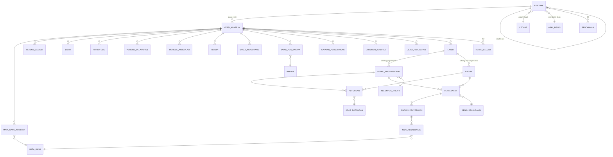

# ERD — skema `TREATY_MASUK`

**Tanggal:** 23 September 2026
**Keadaan:** hasil langkah 10.

> **Bagian §2 (teks) MENGIKAT. Bagian §5 (gambar) alat bantu baca.**
> Bila keduanya berbeda, teks yang menang, dan gambarnya yang salah.

---

## 1. Cara membacanya

```
A  1──<  B        satu A punya banyak B; B wajib punya A
A  1──o<  B       satu A punya banyak B; B boleh tidak punya A
A  >o──1  R       A merujuk tabel acuan R; rujukannya boleh kosong
[luar]            entitas di luar skema TREATY_MASUK
[G2] [G3]         gelombang berikutnya — dimodelkan, tidak dibangun sekarang
```

Setiap entitas punya kunci utama buatan sistem. Kunci alami disebut terpisah karena ia yang
dipakai memadankan baris antar versi (`SEAM-ADJUSTMENT.md` §3).

---

## 2. Relasi — MENGIKAT

### 2.1 Tulang punggung

```
KONTRAK  1──<  VERSI_KONTRAK
KONTRAK  1──o<  KONTRAK                      (DISALIN_DARI — rujukan ke dirinya sendiri)
```

`KONTRAK` memuat **hanya** lapisan beku: identitas, cedant, asal bisnis, sifat proporsi, dan
periode. Seluruh nilai lain — dan **seluruh entitas anak di bawah** — menggantung pada
`VERSI_KONTRAK`.

Bentuk inilah yang membuat `OLDDATA` menjadi SELECT atas versi sebelumnya, bukan salinan.

### 2.2 Anak langsung versi — dipakai kedua cabang

```
VERSI_KONTRAK  1──<   MATA_UANG_KONTRAK
VERSI_KONTRAK  1──o<  RETENSI_CEDANT
VERSI_KONTRAK  1──o<  EGNPI
VERSI_KONTRAK  1──o<  PORTOFOLIO
VERSI_KONTRAK  1──o<  PERIODE_PELAPORAN
VERSI_KONTRAK  1──o<  PERIODE_AKUMULASI
VERSI_KONTRAK  1──o<  TERMIN
VERSI_KONTRAK  1──o<  SKALA_KOASURANSI
VERSI_KONTRAK  1──o<  BATAS_PER_BAHAYA
VERSI_KONTRAK  1──<   CATATAN_PERSETUJUAN
VERSI_KONTRAK  1──o<  DOKUMEN_KONTRAK
VERSI_KONTRAK  1──<   JEJAK_PERUBAHAN
VERSI_KONTRAK  1──<   LAYER
```

`CATATAN_PERSETUJUAN` menggantung pada **versi**, bukan pada kontrak — setiap versi menempuh
persetujuannya sendiri (ADR-0052).

### 2.3 Cabang — satu-satunya tempat kedua sisi berpisah

```
LAYER  1──<   DETAIL_PROPORSIONAL      hanya bila KONTRAK.SIFAT_PROPORSI = PROPORSIONAL
LAYER  1──o<  BAGIAN                   hanya bila KONTRAK.SIFAT_PROPORSI = NON_PROPORSIONAL
```

`LAYER` ada di **kedua** cabang — di non-proporsional ia sebuah layer, di proporsional ia sebuah
kelompok limit. `DETAIL_PROPORSIONAL` dan `BAGIAN` **nol tumpang tindih atribut**, dan keduanya
saling meniadakan menurut sifat proporsi kontraknya (INV-32, INV-33).

**Bagian NuRe pada cabang proporsional bukan entitas** — ia atribut `PERSEN_BAGIAN_NURE` pada
`DETAIL_PROPORSIONAL`. Itu sebabnya `BAGIAN` hanya ada di satu sisi.

### 2.4 Potongan dan penyebaran — satu konsep, dua pelekatan

```
BAGIAN               1──o<  POTONGAN
DETAIL_PROPORSIONAL  1──o<  POTONGAN
BAGIAN               1──o<  PENYEBARAN
DETAIL_PROPORSIONAL  1──o<  PENYEBARAN
PENYEBARAN           1──<   RINCIAN_PENYEBARAN
RINCIAN_PENYEBARAN   1──<   NILAI_PENYEBARAN
```

`POTONGAN` dan `PENYEBARAN` masing-masing **satu konsep dengan dua pelekatan**. Bentuk fisiknya —
dua kunci asing yang saling meniadakan, dua tabel sejenis, atau bentuk lain — ditetapkan sesi DDL,
**dengan syarat mengikat: aturannya tidak boleh tertulis dua kali** (INV-63).

`NILAI_PENYEBARAN` berbaris **per mata uang**. Ia yang menggantikan pasangan kolom kembar `Rp`/`Usd`
di sistem lama.

### 2.5 Tabel acuan

```
MATA_UANG_KONTRAK    >o──1  MATA_UANG
NILAI_PENYEBARAN     >o──1  MATA_UANG
POTONGAN             >o──1  JENIS_POTONGAN
PENYEBARAN           >o──1  JENIS_REASURANSI
BATAS_PER_BAHAYA     >o──1  BAHAYA
DETAIL_PROPORSIONAL  >o──1  KELOMPOK_TREATY
RETENSI_CEDANT       >o──1  KELOMPOK_TREATY
EGNPI                >o──1  KELOMPOK_TREATY
LAYER                >o──1  KELAS_BISNIS
VERSI_KONTRAK        >o──1  KELAS_BISNIS
```

Kelima tabel acuan ini **wajib tabel, bukan `CHECK`**: himpunannya bertambah tanpa mengubah arti apa
pun (ADR-0038, INV-62).

### 2.6 Rujukan ke luar skema

```
KONTRAK        >o──1  CEDANT        [luar]
KONTRAK        >o──1  ASAL_BISNIS   [luar]
VERSI_KONTRAK  >o──1  REASURADUR    [luar]   (reasuradur pemimpin, ketua treaty)
DOKUMEN_KONTRAK >o──1 DOKUMEN       [luar]   (dirujuk, tidak dimiliki — ADR-0027)
```

**Namanya tidak disalin**, hanya pengenalnya. Apakah rujukannya kunci asing lintas skema ke
`POOLDATA` atau nilai yang divalidasi aplikasi adalah **keputusan sesi DDL**.

### 2.7 Di luar batas gelombang ini

```
VERSI_KONTRAK  1──o<  RETRO_KELUAR   [G2]   arah KELUAR — bukan fac IN
KONTRAK        1──o<  PENCAPAIAN     [G3]   dimodelkan sekarang, dibangun nanti
```

### 2.8 Bentuk baca

```
NILAI_VERSI_KONTRAK     bentuk baca, diturunkan, BUKAN kanonik
                        satu baris per (versi kontrak x besaran uang)
                        dipakai seam Adjustment — SEAM-ADJUSTMENT.md §3
```

Ia **tidak punya relasi keluar** dan tidak ditulis siapa pun. Ia dibangun ulang dari entitas di
belakangnya kapan saja.

---

## 3. Kunci alami per entitas — yang membuat pemadanan antar versi mungkin

| Entitas | Kunci alami di dalam versinya | Invarian |
|---|---|---|
| `KONTRAK` | cedant + asal bisnis + periode + sifat proporsi | ADR-0040 §2 — **memperingatkan, tidak melarang** |
| `VERSI_KONTRAK` | nomor urut versi | INV-04 |
| `LAYER` | nomor layer + bagian layer | INV-05 |
| `DETAIL_PROPORSIONAL` | kelompok treaty | INV-06 |
| `MATA_UANG_KONTRAK` | kode mata uang | INV-07 |
| `RETENSI_CEDANT` | kelompok treaty + mata uang | INV-08 |
| `EGNPI` | kelompok treaty + mata uang | INV-09 |
| `PERIODE_PELAPORAN` | periode | INV-10 |
| `PERIODE_AKUMULASI` | periode | INV-11 |
| `TERMIN` | nomor termin | INV-12 |
| `SKALA_KOASURANSI` | persen limit | INV-13 |
| `BATAS_PER_BAHAYA` | bahaya | INV-14 |
| `POTONGAN` | jenis potongan | INV-15 |
| `PENYEBARAN` | jenis reasuransi | INV-16 |

**Tanpa tabel ini seam Adjustment tidak berfungsi**: selisih hanya dapat dihitung atas total, dan
baris yang hilang atau muncul antar versi tidak terlihat sama sekali.

---

## 4. Yang TIDAK ada di skema ini, dan itu disengaja

| Yang tidak ada | Sebab |
|---|---|
| Tabel bayangan `OLDDATA` | nilai lama adalah versi sebelumnya — SELECT, bukan salinan |
| Kolom `ViewState`, `IsEditData`, `RevisionState`, `Position`, `StatusAkseptasi` | dilebur menjadi satu keadaan siklus hidup (ADR-0046) |
| Entitas `BAGIAN` di cabang proporsional | bagian NuRe di sana atribut, bukan baris (§2.3) |
| Pasangan kolom kembar dua mata uang | paket uang menggantikannya, seluruhnya |
| Kolom agregat `Total*` | dihitung saat dibaca (ADR-0037) |
| Nama cedant, asal bisnis, reasuradur | dirujuk dari master (ADR-0023) |
| Nama orang pemegang kontrak | turunan yang akan usang (CONTEXT.md §2.9) |

---

## 5. Gambar — alat bantu baca, TIDAK mengikat



**Gambar ini menyederhanakan tiga hal**, dan penyederhanaannya disebut supaya tidak dibaca sebagai
model:

1. Rujukan ke luar skema hanya sebagian yang digambar.
2. `NILAI_VERSI_KONTRAK` tidak digambar — ia bentuk baca, bukan entitas.
3. Syarat cabang pada `DETAIL_PROPORSIONAL` dan `BAGIAN` tidak dapat dinyatakan diagram ERD; ia ada
   di INV-32 dan INV-33.
